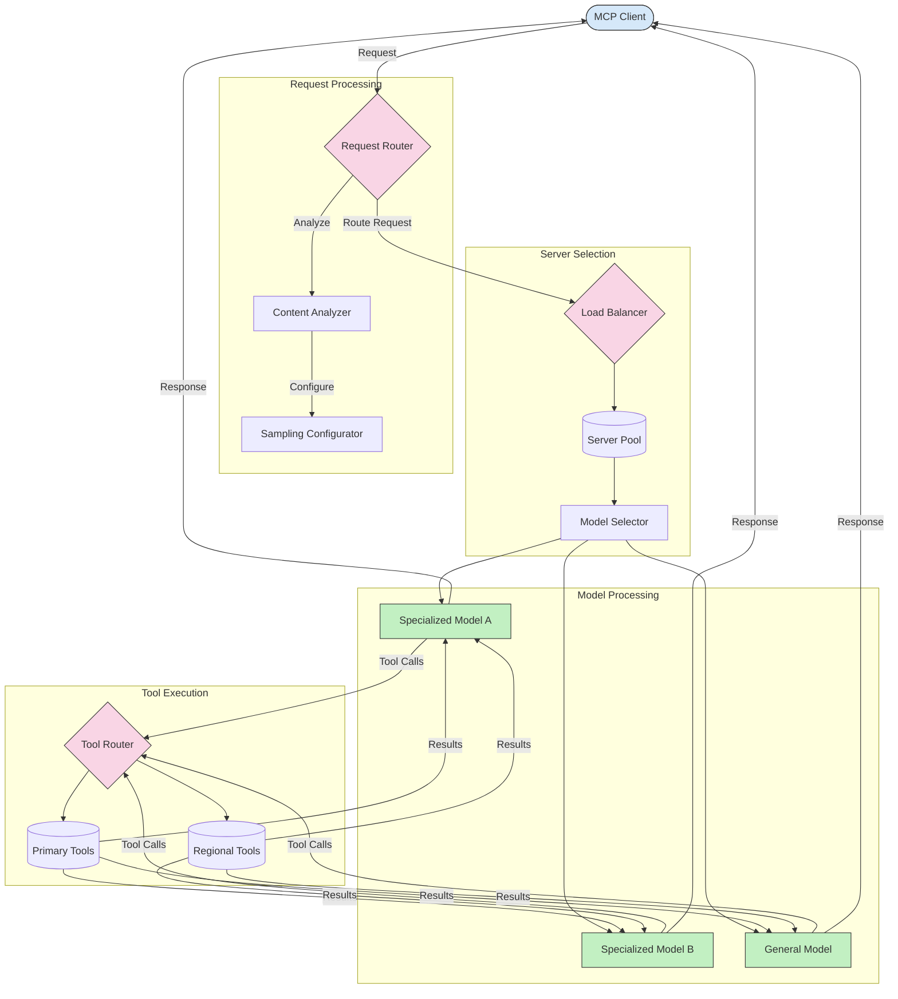

<!--
CO_OP_TRANSLATOR_METADATA:
{
  "original_hash": "2f1b473818b5a6cc9a9bbf777fffa6d4",
  "translation_date": "2025-07-14T21:46:53+00:00",
  "source_file": "05-AdvancedTopics/mcp-routing/README.md",
  "language_code": "pt"
}
-->
## Arquitetura de Amostragem e Roteamento no MCP

A amostragem é um componente crítico do Model Context Protocol (MCP) que permite um processamento e roteamento eficientes dos pedidos. Envolve a análise dos pedidos recebidos para determinar o modelo ou serviço mais adequado para os tratar, com base em vários critérios, como o tipo de conteúdo, o contexto do utilizador e a carga do sistema.

A amostragem e o roteamento podem ser combinados para criar uma arquitetura robusta que otimiza a utilização dos recursos e garante alta disponibilidade. O processo de amostragem pode ser usado para classificar os pedidos, enquanto o roteamento os direciona para os modelos ou serviços apropriados.

O diagrama abaixo ilustra como a amostragem e o roteamento funcionam em conjunto numa arquitetura abrangente do MCP:

## O que vem a seguir

- [5.6 Amostragem](../mcp-sampling/README.md)

**Aviso Legal**:  
Este documento foi traduzido utilizando o serviço de tradução automática [Co-op Translator](https://github.com/Azure/co-op-translator). Embora nos esforcemos pela precisão, por favor tenha em conta que traduções automáticas podem conter erros ou imprecisões. O documento original na sua língua nativa deve ser considerado a fonte autorizada. Para informações críticas, recomenda-se tradução profissional humana. Não nos responsabilizamos por quaisquer mal-entendidos ou interpretações incorretas decorrentes da utilização desta tradução.