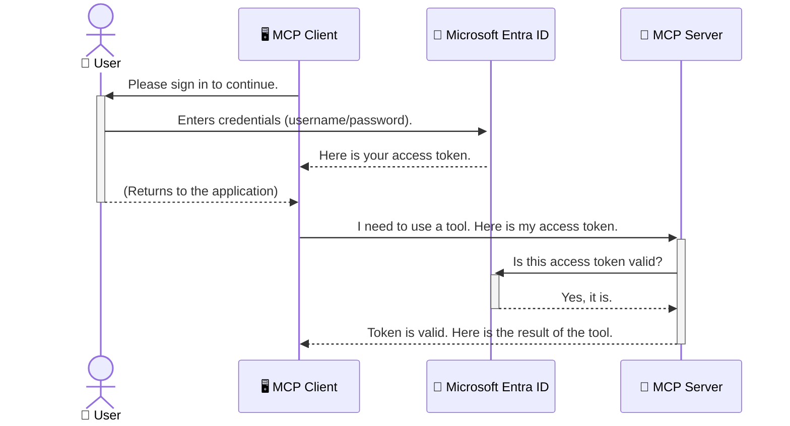

<!--
CO_OP_TRANSLATOR_METADATA:
{
  "original_hash": "6e562d7e5a77c8982da4aa8f762ad1d8",
  "translation_date": "2025-07-14T03:00:03+00:00",
  "source_file": "05-AdvancedTopics/mcp-security-entra/README.md",
  "language_code": "pt"
}
-->
# Proteção de Workflows de IA: Autenticação Entra ID para Servidores Model Context Protocol

## Introdução
Proteger o seu servidor Model Context Protocol (MCP) é tão importante como trancar a porta de casa. Deixar o seu servidor MCP aberto expõe as suas ferramentas e dados a acessos não autorizados, o que pode levar a falhas de segurança. O Microsoft Entra ID oferece uma solução robusta de gestão de identidade e acesso baseada na cloud, ajudando a garantir que apenas utilizadores e aplicações autorizados podem interagir com o seu servidor MCP. Nesta secção, vai aprender como proteger os seus workflows de IA usando autenticação Entra ID.

## Objetivos de Aprendizagem
No final desta secção, será capaz de:

- Compreender a importância de proteger servidores MCP.
- Explicar os conceitos básicos do Microsoft Entra ID e da autenticação OAuth 2.0.
- Reconhecer a diferença entre clientes públicos e confidenciais.
- Implementar autenticação Entra ID em cenários de servidores MCP locais (cliente público) e remotos (cliente confidencial).
- Aplicar as melhores práticas de segurança no desenvolvimento de workflows de IA.

## Segurança e MCP

Assim como não deixaria a porta de casa destrancada, não deve deixar o seu servidor MCP acessível a qualquer pessoa. Proteger os seus workflows de IA é essencial para construir aplicações robustas, confiáveis e seguras. Este capítulo vai apresentar-lhe como usar o Microsoft Entra ID para proteger os seus servidores MCP, garantindo que apenas utilizadores e aplicações autorizados podem interagir com as suas ferramentas e dados.

## Porquê a Segurança é Importante para Servidores MCP

Imagine que o seu servidor MCP tem uma ferramenta que pode enviar emails ou aceder a uma base de dados de clientes. Um servidor sem segurança permitiria que qualquer pessoa usasse essa ferramenta, levando a acessos não autorizados a dados, spam ou outras atividades maliciosas.

Ao implementar autenticação, garante que cada pedido ao seu servidor é verificado, confirmando a identidade do utilizador ou aplicação que faz o pedido. Este é o primeiro e mais importante passo para proteger os seus workflows de IA.

## Introdução ao Microsoft Entra ID

[**Microsoft Entra ID**](https://adoption.microsoft.com/microsoft-security/entra/) é um serviço de gestão de identidade e acesso baseado na cloud. Pense nele como um segurança universal para as suas aplicações. Ele trata do processo complexo de verificar identidades de utilizadores (autenticação) e determinar o que eles podem fazer (autorização).

Ao usar o Entra ID, pode:

- Permitir um início de sessão seguro para os utilizadores.
- Proteger APIs e serviços.
- Gerir políticas de acesso a partir de um local central.

Para servidores MCP, o Entra ID oferece uma solução robusta e amplamente confiável para gerir quem pode aceder às capacidades do seu servidor.

---

## Compreender a Magia: Como Funciona a Autenticação Entra ID

O Entra ID usa padrões abertos como o **OAuth 2.0** para gerir a autenticação. Embora os detalhes possam ser complexos, o conceito principal é simples e pode ser entendido através de uma analogia.

### Uma Introdução Simples ao OAuth 2.0: A Chave do Estacionamento

Pense no OAuth 2.0 como um serviço de valet para o seu carro. Quando chega a um restaurante, não entrega ao valet a chave mestra do carro. Em vez disso, dá uma **chave de valet** que tem permissões limitadas — pode ligar o carro e trancar as portas, mas não pode abrir o porta-bagagens ou a caixa da luva.

Nesta analogia:

- **Você** é o **Utilizador**.
- **O seu carro** é o **Servidor MCP** com as suas ferramentas e dados valiosos.
- O **Valet** é o **Microsoft Entra ID**.
- O **Estacionador** é o **Cliente MCP** (a aplicação que tenta aceder ao servidor).
- A **Chave de Valet** é o **Token de Acesso**.

O token de acesso é uma cadeia segura de texto que o cliente MCP recebe do Entra ID depois de iniciar sessão. O cliente apresenta este token ao servidor MCP em cada pedido. O servidor pode verificar o token para garantir que o pedido é legítimo e que o cliente tem as permissões necessárias, tudo isto sem nunca precisar de lidar com as suas credenciais reais (como a sua palavra-passe).

### O Fluxo de Autenticação

Aqui está como o processo funciona na prática:



### Apresentação da Microsoft Authentication Library (MSAL)

Antes de entrarmos no código, é importante apresentar um componente chave que verá nos exemplos: a **Microsoft Authentication Library (MSAL)**.

A MSAL é uma biblioteca desenvolvida pela Microsoft que facilita muito a vida dos programadores na gestão da autenticação. Em vez de ter de escrever todo o código complexo para gerir tokens de segurança, iniciar sessões e renovar sessões, a MSAL trata de todo o trabalho pesado.

Usar uma biblioteca como a MSAL é altamente recomendado porque:

- **É segura:** Implementa protocolos padrão da indústria e as melhores práticas de segurança, reduzindo o risco de vulnerabilidades no seu código.
- **Simplifica o desenvolvimento:** Abstrai a complexidade dos protocolos OAuth 2.0 e OpenID Connect, permitindo adicionar autenticação robusta à sua aplicação com apenas algumas linhas de código.
- **É mantida:** A Microsoft mantém e atualiza ativamente a MSAL para responder a novas ameaças de segurança e alterações nas plataformas.

A MSAL suporta uma grande variedade de linguagens e frameworks de aplicação, incluindo .NET, JavaScript/TypeScript, Python, Java, Go e plataformas móveis como iOS e Android. Isto significa que pode usar os mesmos padrões consistentes de autenticação em toda a sua stack tecnológica.

Para saber mais sobre a MSAL, pode consultar a documentação oficial [MSAL overview](https://learn.microsoft.com/entra/identity-platform/msal-overview).

---

## Proteger o Seu Servidor MCP com Entra ID: Guia Passo a Passo

Agora, vamos ver como proteger um servidor MCP local (que comunica via `stdio`) usando Entra ID. Este exemplo usa um **cliente público**, adequado para aplicações que correm na máquina do utilizador, como uma app de ambiente de trabalho ou um servidor local de desenvolvimento.

### Cenário 1: Proteger um Servidor MCP Local (com Cliente Público)

Neste cenário, vamos analisar um servidor MCP que corre localmente, comunica via `stdio` e usa Entra ID para autenticar o utilizador antes de permitir o acesso às suas ferramentas. O servidor terá uma única ferramenta que obtém a informação do perfil do utilizador a partir da Microsoft Graph API.

#### 1. Configurar a Aplicação no Entra ID

Antes de escrever código, precisa de registar a sua aplicação no Microsoft Entra ID. Isto informa o Entra ID sobre a sua aplicação e concede-lhe permissão para usar o serviço de autenticação.

1. Aceda ao **[portal Microsoft Entra](https://entra.microsoft.com/)**.
2. Vá a **App registrations** e clique em **New registration**.
3. Dê um nome à sua aplicação (ex.: "My Local MCP Server").
4. Em **Supported account types**, selecione **Accounts in this organizational directory only**.
5. Pode deixar o **Redirect URI** em branco para este exemplo.
6. Clique em **Register**.

Depois de registada, anote o **Application (client) ID** e o **Directory (tenant) ID**. Vai precisar destes no seu código.

#### 2. O Código: Uma Análise

Vamos ver as partes principais do código que tratam da autenticação. O código completo deste exemplo está disponível na pasta [Entra ID - Local - WAM](https://github.com/Azure-Samples/mcp-auth-servers/tree/main/src/entra-id-local-wam) do repositório [mcp-auth-servers GitHub](https://github.com/Azure-Samples/mcp-auth-servers).

**`AuthenticationService.cs`**

Esta classe é responsável por gerir a interação com o Entra ID.

- **`CreateAsync`**: Este método inicializa o `PublicClientApplication` da MSAL (Microsoft Authentication Library). Está configurado com o `clientId` e `tenantId` da sua aplicação.
- **`WithBroker`**: Isto permite o uso de um broker (como o Windows Web Account Manager), que oferece uma experiência de single sign-on mais segura e fluida.
- **`AcquireTokenAsync`**: Este é o método principal. Primeiro tenta obter um token silenciosamente (ou seja, o utilizador não precisa de iniciar sessão novamente se já tiver uma sessão válida). Se não conseguir obter um token silencioso, irá pedir ao utilizador para iniciar sessão de forma interativa.

```csharp
// Simplified for clarity
public static async Task<AuthenticationService> CreateAsync(ILogger<AuthenticationService> logger)
{
    var msalClient = PublicClientApplicationBuilder
        .Create(_clientId) // Your Application (client) ID
        .WithAuthority(AadAuthorityAudience.AzureAdMyOrg)
        .WithTenantId(_tenantId) // Your Directory (tenant) ID
        .WithBroker(new BrokerOptions(BrokerOptions.OperatingSystems.Windows))
        .Build();

    // ... cache registration ...

    return new AuthenticationService(logger, msalClient);
}

public async Task<string> AcquireTokenAsync()
{
    try
    {
        // Try silent authentication first
        var accounts = await _msalClient.GetAccountsAsync();
        var account = accounts.FirstOrDefault();

        AuthenticationResult? result = null;

        if (account != null)
        {
            result = await _msalClient.AcquireTokenSilent(_scopes, account).ExecuteAsync();
        }
        else
        {
            // If no account, or silent fails, go interactive
            result = await _msalClient.AcquireTokenInteractive(_scopes).ExecuteAsync();
        }

        return result.AccessToken;
    }
    catch (Exception ex)
    {
        _logger.LogError(ex, "An error occurred while acquiring the token.");
        throw; // Optionally rethrow the exception for higher-level handling
    }
}
```

**`Program.cs`**

Aqui é onde o servidor MCP é configurado e o serviço de autenticação é integrado.

- **`AddSingleton<AuthenticationService>`**: Regista o `AuthenticationService` no contentor de injeção de dependências, para que possa ser usado noutras partes da aplicação (como na nossa ferramenta).
- **Ferramenta `GetUserDetailsFromGraph`**: Esta ferramenta requer uma instância de `AuthenticationService`. Antes de fazer qualquer coisa, chama `authService.AcquireTokenAsync()` para obter um token de acesso válido. Se a autenticação for bem-sucedida, usa o token para chamar a Microsoft Graph API e obter os detalhes do utilizador.

```csharp
// Simplified for clarity
[McpServerTool(Name = "GetUserDetailsFromGraph")]
public static async Task<string> GetUserDetailsFromGraph(
    AuthenticationService authService)
{
    try
    {
        // This will trigger the authentication flow
        var accessToken = await authService.AcquireTokenAsync();

        // Use the token to create a GraphServiceClient
        var graphClient = new GraphServiceClient(
            new BaseBearerTokenAuthenticationProvider(new TokenProvider(authService)));

        var user = await graphClient.Me.GetAsync();

        return System.Text.Json.JsonSerializer.Serialize(user);
    }
    catch (Exception ex)
    {
        return $"Error: {ex.Message}";
    }
}
```

#### 3. Como Tudo Funciona em Conjunto

1. Quando o cliente MCP tenta usar a ferramenta `GetUserDetailsFromGraph`, a ferramenta chama primeiro `AcquireTokenAsync`.
2. `AcquireTokenAsync` faz com que a biblioteca MSAL verifique se existe um token válido.
3. Se não for encontrado nenhum token, a MSAL, através do broker, pede ao utilizador para iniciar sessão com a sua conta Entra ID.
4. Depois de o utilizador iniciar sessão, o Entra ID emite um token de acesso.
5. A ferramenta recebe o token e usa-o para fazer uma chamada segura à Microsoft Graph API.
6. Os detalhes do utilizador são devolvidos ao cliente MCP.

Este processo garante que apenas utilizadores autenticados podem usar a ferramenta, protegendo eficazmente o seu servidor MCP local.

### Cenário 2: Proteger um Servidor MCP Remoto (com Cliente Confidencial)

Quando o seu servidor MCP está a correr numa máquina remota (como um servidor na cloud) e comunica através de um protocolo como HTTP Streaming, os requisitos de segurança são diferentes. Neste caso, deve usar um **cliente confidencial** e o **Authorization Code Flow**. Este é um método mais seguro porque os segredos da aplicação nunca são expostos ao browser.

Este exemplo usa um servidor MCP baseado em TypeScript que utiliza o Express.js para tratar pedidos HTTP.

#### 1. Configurar a Aplicação no Entra ID

A configuração no Entra ID é semelhante à do cliente público, mas com uma diferença importante: precisa de criar um **client secret**.

1. Aceda ao **[portal Microsoft Entra](https://entra.microsoft.com/)**.
2. Na sua app registada, vá ao separador **Certificates & secrets**.
3. Clique em **New client secret**, dê uma descrição e clique em **Add**.
4. **Importante:** Copie imediatamente o valor do segredo. Não poderá vê-lo novamente.
5. Também precisa de configurar um **Redirect URI**. Vá ao separador **Authentication**, clique em **Add a platform**, selecione **Web** e introduza o URI de redirecionamento para a sua aplicação (ex.: `http://localhost:3001/auth/callback`).

> **⚠️ Nota Importante de Segurança:** Para aplicações em produção, a Microsoft recomenda fortemente o uso de métodos de autenticação sem segredos, como **Managed Identity** ou **Workload Identity Federation**, em vez de client secrets. Os client secrets apresentam riscos de segurança, pois podem ser expostos ou comprometidos. As identidades geridas oferecem uma abordagem mais segura ao eliminar a necessidade de armazenar credenciais no seu código ou configuração.
>
> Para mais informações sobre identidades geridas e como implementá-las, consulte a [Visão geral das identidades geridas para recursos Azure](https://learn.microsoft.com/entra/identity/managed-identities-azure-resources/overview).

#### 2. O Código: Uma Análise

Este exemplo usa uma abordagem baseada em sessões. Quando o utilizador se autentica, o servidor armazena o token de acesso e o token de atualização numa sessão e entrega ao utilizador um token de sessão. Este token de sessão é então usado para pedidos subsequentes. O código completo deste exemplo está disponível na pasta [Entra ID - Confidential client](https://github.com/Azure-Samples/mcp-auth-servers/tree/main/src/entra-id-cca-session) do repositório [mcp-auth-servers GitHub](https://github.com/Azure-Samples/mcp-auth-servers).

**`Server.ts`**

Este ficheiro configura o servidor Express e a camada de transporte MCP.

- **`requireBearerAuth`**: Middleware que protege os endpoints `/sse` e `/message`. Verifica se existe um token bearer válido no cabeçalho `Authorization` do pedido.
- **`EntraIdServerAuthProvider`**: Classe personalizada que implementa a interface `McpServerAuthorizationProvider`. É responsável por gerir o fluxo OAuth 2.0.
- **`/auth/callback`**: Endpoint que trata o redirecionamento do Entra ID depois do utilizador se autenticar. Troca o código de autorização por um token de acesso e um token de atualização.

```typescript
// Simplified for clarity
const app = express();
const { server } = createServer();
const provider = new EntraIdServerAuthProvider();

// Protect the SSE endpoint
app.get("/sse", requireBearerAuth({
  provider,
  requiredScopes: ["User.Read"]
}), async (req, res) => {
  // ... connect to the transport ...
});

// Protect the message endpoint
app.post("/message", requireBearerAuth({
  provider,
  requiredScopes: ["User.Read"]
}), async (req, res) => {
  // ... handle the message ...
});

// Handle the OAuth 2.0 callback
app.get("/auth/callback", (req, res) => {
  provider.handleCallback(req.query.code, req.query.state)
    .then(result => {
      // ... handle success or failure ...
    });
});
```

**`Tools.ts`**

Este ficheiro define as ferramentas que o servidor MCP disponibiliza. A ferramenta `getUserDetails` é semelhante à do exemplo anterior, mas obtém o token de acesso da sessão.

```typescript
// Simplified for clarity
server.setRequestHandler(CallToolRequestSchema, async (request) => {
  const { name } = request.params;
  const context = request.params?.context as { token?: string } | undefined;
  const sessionToken = context?.token;

  if (name === ToolName.GET_USER_DETAILS) {
    if (!sessionToken) {
      throw new AuthenticationError("Authentication token is missing or invalid. Ensure the token is provided in the request context.");
    }

    // Get the Entra ID token from the session store
    const tokenData = tokenStore.getToken(sessionToken);
    const entraIdToken = tokenData.accessToken;

    const graphClient = Client.init({
      authProvider: (done) => {
        done(null, entraIdToken);
      }
    });

    const user = await graphClient.api('/me').get();

    // ... return user details ...
  }
});
```

**`auth/EntraIdServerAuthProvider.ts`**

Esta classe gere a lógica para:

- Redirecionar o utilizador para a página de início de sessão do Entra ID.
- Trocar o código de autorização por um token de acesso.
- Armazenar os tokens no `tokenStore`.
- Renovar o token de acesso quando expirar.

#### 3. Como Tudo Funciona em Conjunto

1. Quando um utilizador tenta ligar-se ao servidor MCP pela primeira vez, o middleware `requireBearerAuth` verifica que não tem uma sessão válida e redireciona-o para a página de início de sessão do Entra ID.
2. O utilizador inicia sessão com a sua conta Entra ID.
3. O Entra ID redireciona o utilizador de volta para o endpoint `/auth/callback` com um código de autorização.
4. O servidor troca o código por um token de acesso e um token de atualização, armazena-os e cria um token de sessão que é enviado ao cliente.  
5. O cliente pode agora usar este token de sessão no cabeçalho `Authorization` para todas as futuras requisições ao servidor MCP.  
6. Quando a ferramenta `getUserDetails` é chamada, utiliza o token de sessão para obter o token de acesso do Entra ID e depois usa esse token para chamar a Microsoft Graph API.

Este fluxo é mais complexo do que o fluxo de cliente público, mas é necessário para endpoints expostos à internet. Como os servidores MCP remotos são acessíveis pela internet pública, precisam de medidas de segurança mais rigorosas para proteger contra acessos não autorizados e potenciais ataques.

## Boas Práticas de Segurança

- **Use sempre HTTPS**: Encripte a comunicação entre o cliente e o servidor para proteger os tokens contra interceptação.  
- **Implemente Controlo de Acesso Baseado em Funções (RBAC)**: Não verifique apenas *se* um utilizador está autenticado; verifique *o que* está autorizado a fazer. Pode definir funções no Entra ID e verificá-las no seu servidor MCP.  
- **Monitorize e audite**: Registe todos os eventos de autenticação para poder detetar e responder a atividades suspeitas.  
- **Gerencie limites de taxa e throttling**: A Microsoft Graph e outras APIs implementam limites de taxa para prevenir abusos. Implemente backoff exponencial e lógica de retry no seu servidor MCP para lidar de forma elegante com respostas HTTP 429 (Too Many Requests). Considere armazenar em cache dados frequentemente acedidos para reduzir chamadas à API.  
- **Armazenamento seguro de tokens**: Guarde os tokens de acesso e de atualização de forma segura. Para aplicações locais, use os mecanismos de armazenamento seguro do sistema. Para aplicações servidor, considere usar armazenamento encriptado ou serviços de gestão de chaves seguros como o Azure Key Vault.  
- **Gestão da expiração dos tokens**: Os tokens de acesso têm uma duração limitada. Implemente a atualização automática dos tokens usando os tokens de atualização para manter uma experiência de utilizador contínua sem necessidade de reautenticação.  
- **Considere usar o Azure API Management**: Embora implementar segurança diretamente no seu servidor MCP lhe dê controlo detalhado, gateways de API como o Azure API Management podem tratar automaticamente muitas destas preocupações de segurança, incluindo autenticação, autorização, limitação de taxa e monitorização. Eles fornecem uma camada de segurança centralizada entre os seus clientes e os seus servidores MCP. Para mais detalhes sobre o uso de gateways de API com MCP, consulte o nosso [Azure API Management Your Auth Gateway For MCP Servers](https://techcommunity.microsoft.com/blog/integrationsonazureblog/azure-api-management-your-auth-gateway-for-mcp-servers/4402690).

## Principais Conclusões

- Proteger o seu servidor MCP é fundamental para salvaguardar os seus dados e ferramentas.  
- O Microsoft Entra ID oferece uma solução robusta e escalável para autenticação e autorização.  
- Use um **cliente público** para aplicações locais e um **cliente confidencial** para servidores remotos.  
- O **Authorization Code Flow** é a opção mais segura para aplicações web.

## Exercício

1. Pense num servidor MCP que possa construir. Seria um servidor local ou remoto?  
2. Com base na sua resposta, usaria um cliente público ou confidencial?  
3. Que permissões o seu servidor MCP pediria para executar ações contra a Microsoft Graph?

## Exercícios Práticos

### Exercício 1: Registar uma Aplicação no Entra ID  
Navegue até ao portal Microsoft Entra.  
Registe uma nova aplicação para o seu servidor MCP.  
Anote o Application (client) ID e o Directory (tenant) ID.

### Exercício 2: Proteger um Servidor MCP Local (Cliente Público)  
- Siga o exemplo de código para integrar o MSAL (Microsoft Authentication Library) para autenticação do utilizador.  
- Teste o fluxo de autenticação chamando a ferramenta MCP que obtém detalhes do utilizador da Microsoft Graph.

### Exercício 3: Proteger um Servidor MCP Remoto (Cliente Confidencial)  
- Registe um cliente confidencial no Entra ID e crie um segredo de cliente.  
- Configure o seu servidor MCP Express.js para usar o Authorization Code Flow.  
- Teste os endpoints protegidos e confirme o acesso baseado em tokens.

### Exercício 4: Aplicar Boas Práticas de Segurança  
- Ative HTTPS para o seu servidor local ou remoto.  
- Implemente controlo de acesso baseado em funções (RBAC) na lógica do seu servidor.  
- Adicione gestão da expiração dos tokens e armazenamento seguro dos mesmos.

## Recursos

1. **Documentação de Visão Geral do MSAL**  
   Saiba como a Microsoft Authentication Library (MSAL) permite a aquisição segura de tokens em várias plataformas:  
   [MSAL Overview on Microsoft Learn](https://learn.microsoft.com/en-gb/entra/msal/overview)

2. **Repositório GitHub Azure-Samples/mcp-auth-servers**  
   Implementações de referência de servidores MCP que demonstram fluxos de autenticação:  
   [Azure-Samples/mcp-auth-servers on GitHub](https://github.com/Azure-Samples/mcp-auth-servers)

3. **Visão Geral das Identidades Geridas para Recursos Azure**  
   Entenda como eliminar segredos usando identidades geridas atribuídas pelo sistema ou pelo utilizador:  
   [Managed Identities Overview on Microsoft Learn](https://learn.microsoft.com/en-us/entra/identity/managed-identities-azure-resources/)

4. **Azure API Management: Your Auth Gateway for MCP Servers**  
   Uma análise detalhada sobre o uso do APIM como gateway OAuth2 seguro para servidores MCP:  
   [Azure API Management Your Auth Gateway For MCP Servers](https://techcommunity.microsoft.com/blog/integrationsonazureblog/azure-api-management-your-auth-gateway-for-mcp-servers/4402690)

5. **Referência de Permissões Microsoft Graph**  
   Lista completa de permissões delegadas e de aplicação para a Microsoft Graph:  
   [Microsoft Graph Permissions Reference](https://learn.microsoft.com/zh-tw/graph/permissions-reference)

## Resultados de Aprendizagem  
Após completar esta secção, será capaz de:

- Explicar por que a autenticação é crítica para servidores MCP e fluxos de trabalho de IA.  
- Configurar e configurar a autenticação Entra ID para cenários de servidores MCP locais e remotos.  
- Escolher o tipo de cliente adequado (público ou confidencial) com base na implementação do seu servidor.  
- Implementar práticas de codificação segura, incluindo armazenamento de tokens e autorização baseada em funções.  
- Proteger com confiança o seu servidor MCP e as suas ferramentas contra acessos não autorizados.

## O que vem a seguir

- [5.13 Model Context Protocol (MCP) Integration with Azure AI Foundry](../mcp-foundry-agent-integration/README.md)

**Aviso Legal**:  
Este documento foi traduzido utilizando o serviço de tradução automática [Co-op Translator](https://github.com/Azure/co-op-translator). Embora nos esforcemos pela precisão, por favor tenha em conta que traduções automáticas podem conter erros ou imprecisões. O documento original na sua língua nativa deve ser considerado a fonte autorizada. Para informações críticas, recomenda-se tradução profissional humana. Não nos responsabilizamos por quaisquer mal-entendidos ou interpretações erradas decorrentes da utilização desta tradução.