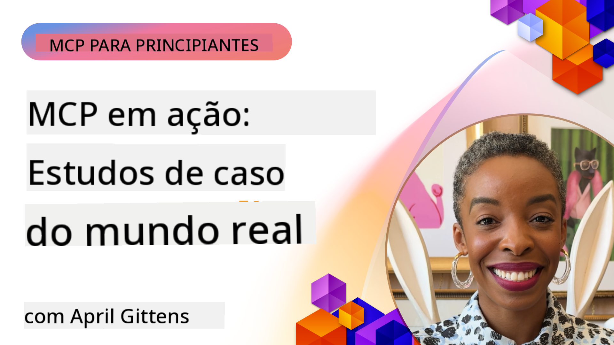

<!--
CO_OP_TRANSLATOR_METADATA:
{
  "original_hash": "1611dc5f6a2a35a789fc4c95fc5bfbe8",
  "translation_date": "2025-09-26T18:15:25+00:00",
  "source_file": "09-CaseStudy/README.md",
  "language_code": "pt"
}
-->
# MCP em Ação: Estudos de Caso do Mundo Real

_(Clique na imagem acima para ver o vídeo desta lição)_

O Model Context Protocol (MCP) está a transformar a forma como as aplicações de IA interagem com dados, ferramentas e serviços. Esta secção apresenta estudos de caso do mundo real que demonstram aplicações práticas do MCP em diversos cenários empresariais.

## Visão Geral

Esta secção destaca exemplos concretos de implementações do MCP, mostrando como as organizações estão a utilizar este protocolo para resolver desafios empresariais complexos. Ao analisar estes estudos de caso, obterá insights sobre a versatilidade, escalabilidade e benefícios práticos do MCP em cenários reais.

## Objetivos de Aprendizagem

Ao explorar estes estudos de caso, irá:

- Compreender como o MCP pode ser aplicado para resolver problemas empresariais específicos
- Aprender sobre diferentes padrões de integração e abordagens arquiteturais
- Reconhecer as melhores práticas para implementar o MCP em ambientes empresariais
- Obter insights sobre os desafios e soluções encontrados em implementações reais
- Identificar oportunidades para aplicar padrões semelhantes nos seus próprios projetos

## Estudos de Caso em Destaque

### 1. [Agentes de Viagem Azure AI – Implementação de Referência](./travelagentsample.md)

Este estudo de caso analisa a solução de referência abrangente da Microsoft que demonstra como construir uma aplicação de planeamento de viagens com múltiplos agentes, alimentada por IA, utilizando MCP, Azure OpenAI e Azure AI Search. O projeto destaca:

- Orquestração de múltiplos agentes através do MCP
- Integração de dados empresariais com Azure AI Search
- Arquitetura segura e escalável utilizando serviços Azure
- Ferramentas extensíveis com componentes MCP reutilizáveis
- Experiência de utilizador conversacional alimentada por Azure OpenAI

Os detalhes da arquitetura e implementação fornecem insights valiosos sobre como construir sistemas complexos de múltiplos agentes com o MCP como camada de coordenação.

### 2. [Atualização de Itens do Azure DevOps com Dados do YouTube](./UpdateADOItemsFromYT.md)

Este estudo de caso demonstra uma aplicação prática do MCP para automatizar processos de fluxo de trabalho. Mostra como as ferramentas MCP podem ser usadas para:

- Extrair dados de plataformas online (YouTube)
- Atualizar itens de trabalho em sistemas Azure DevOps
- Criar fluxos de trabalho de automação repetíveis
- Integrar dados entre sistemas distintos

Este exemplo ilustra como até mesmo implementações relativamente simples do MCP podem proporcionar ganhos significativos de eficiência ao automatizar tarefas rotineiras e melhorar a consistência de dados entre sistemas.

### 3. [Recuperação de Documentação em Tempo Real com MCP](./docs-mcp/README.md)

Este estudo de caso orienta-o na ligação de um cliente de consola Python a um servidor Model Context Protocol (MCP) para recuperar e registar documentação da Microsoft em tempo real e com contexto. Aprenderá como:

- Ligar-se a um servidor MCP utilizando um cliente Python e o SDK oficial do MCP
- Utilizar clientes HTTP em streaming para recuperação eficiente de dados em tempo real
- Chamar ferramentas de documentação no servidor e registar respostas diretamente na consola
- Integrar documentação atualizada da Microsoft no seu fluxo de trabalho sem sair do terminal

O capítulo inclui uma tarefa prática, um exemplo de código funcional mínimo e links para recursos adicionais para aprendizagem aprofundada. Veja o tutorial completo e o código no capítulo ligado para entender como o MCP pode transformar o acesso à documentação e a produtividade dos desenvolvedores em ambientes baseados em consola.

### 4. [Aplicação Web Interativa de Gerador de Planos de Estudo com MCP](./docs-mcp/README.md)

Este estudo de caso demonstra como construir uma aplicação web interativa utilizando Chainlit e o Model Context Protocol (MCP) para gerar planos de estudo personalizados para qualquer tópico. Os utilizadores podem especificar um assunto (como "certificação AI-900") e uma duração de estudo (por exemplo, 8 semanas), e a aplicação fornecerá uma divisão semanal de conteúdos recomendados. Chainlit permite uma interface de chat conversacional, tornando a experiência envolvente e adaptativa.

- Aplicação web conversacional alimentada por Chainlit
- Prompts orientados pelo utilizador para tópico e duração
- Recomendações de conteúdo semana a semana utilizando MCP
- Respostas adaptativas em tempo real numa interface de chat

O projeto ilustra como IA conversacional e MCP podem ser combinados para criar ferramentas educacionais dinâmicas e orientadas pelo utilizador num ambiente web moderno.

### 5. [Documentação no Editor com Servidor MCP no VS Code](./docs-mcp/README.md)

Este estudo de caso demonstra como pode trazer os Microsoft Learn Docs diretamente para o seu ambiente VS Code utilizando o servidor MCP—sem necessidade de alternar entre abas do navegador! Verá como:

- Pesquisar e ler documentos instantaneamente dentro do VS Code utilizando o painel MCP ou o comando palette
- Referenciar documentação e inserir links diretamente nos seus ficheiros README ou markdown de cursos
- Utilizar GitHub Copilot e MCP juntos para fluxos de trabalho de documentação e código alimentados por IA
- Validar e melhorar a sua documentação com feedback em tempo real e precisão baseada em fontes da Microsoft
- Integrar MCP com fluxos de trabalho GitHub para validação contínua de documentação

A implementação inclui:

- Exemplo de configuração `.vscode/mcp.json` para configuração fácil
- Tutoriais baseados em capturas de ecrã da experiência no editor
- Dicas para combinar Copilot e MCP para máxima produtividade

Este cenário é ideal para autores de cursos, escritores de documentação e desenvolvedores que desejam manter o foco no editor enquanto trabalham com documentos, Copilot e ferramentas de validação—tudo alimentado por MCP.

### 6. [Criação de Servidor MCP com APIM](./apimsample.md)

Este estudo de caso fornece um guia passo a passo sobre como criar um servidor MCP utilizando Azure API Management (APIM). Abrange:

- Configuração de um servidor MCP no Azure API Management
- Exposição de operações de API como ferramentas MCP
- Configuração de políticas para limitação de taxa e segurança
- Teste do servidor MCP utilizando Visual Studio Code e GitHub Copilot

Este exemplo ilustra como aproveitar as capacidades do Azure para criar um servidor MCP robusto que pode ser usado em diversas aplicações, melhorando a integração de sistemas de IA com APIs empresariais.

### 7. [Registo MCP no GitHub — Acelerando a Integração Agente](https://github.com/mcp)

Este estudo de caso analisa como o Registo MCP do GitHub, lançado em setembro de 2025, aborda um desafio crítico no ecossistema de IA: a descoberta e implementação fragmentada de servidores Model Context Protocol (MCP).

#### Visão Geral
O **Registo MCP** resolve o problema crescente de servidores MCP dispersos por repositórios e registos, que anteriormente tornava a integração lenta e propensa a erros. Estes servidores permitem que agentes de IA interajam com sistemas externos como APIs, bases de dados e fontes de documentação.

#### Declaração do Problema
Os desenvolvedores que constroem fluxos de trabalho agentes enfrentavam vários desafios:
- **Baixa descobribilidade** de servidores MCP em diferentes plataformas
- **Perguntas redundantes de configuração** espalhadas por fóruns e documentação
- **Riscos de segurança** provenientes de fontes não verificadas e não confiáveis
- **Falta de padronização** na qualidade e compatibilidade dos servidores

#### Arquitetura da Solução
O Registo MCP do GitHub centraliza servidores MCP confiáveis com recursos-chave:
- **Instalação com um clique** via VS Code para configuração simplificada
- **Classificação por relevância** com base em estrelas, atividade e validação da comunidade
- **Integração direta** com GitHub Copilot e outras ferramentas compatíveis com MCP
- **Modelo de contribuição aberta** permitindo que parceiros comunitários e empresariais contribuam

#### Impacto Empresarial
O registo trouxe melhorias mensuráveis:
- **Onboarding mais rápido** para desenvolvedores utilizando ferramentas como o Microsoft Learn MCP Server, que transmite documentação oficial diretamente para agentes
- **Produtividade melhorada** através de servidores especializados como `github-mcp-server`, permitindo automação natural de GitHub (criação de PR, reexecução de CI, análise de código)
- **Maior confiança no ecossistema** através de listagens curadas e padrões de configuração transparentes

#### Valor Estratégico
Para profissionais especializados em gestão de ciclo de vida de agentes e fluxos de trabalho reprodutíveis, o Registo MCP oferece:
- **Capacidades de implantação modular de agentes** com componentes padronizados
- **Pipelines de avaliação baseados no registo** para testes e validação consistentes
- **Interoperabilidade entre ferramentas** permitindo integração perfeita entre diferentes plataformas de IA

Este estudo de caso demonstra que o Registo MCP é mais do que apenas um diretório—é uma plataforma fundamental para integração escalável de modelos e implantação de sistemas agentes.

## Conclusão

Estes sete estudos de caso abrangentes demonstram a notável versatilidade e aplicações práticas do Model Context Protocol em diversos cenários reais. Desde sistemas complexos de planeamento de viagens com múltiplos agentes e gestão de APIs empresariais até fluxos de trabalho de documentação simplificados e o revolucionário Registo MCP do GitHub, estes exemplos mostram como o MCP fornece uma forma padronizada e escalável de conectar sistemas de IA às ferramentas, dados e serviços necessários para oferecer valor excecional.

Os estudos de caso abrangem múltiplas dimensões de implementação do MCP:
- **Integração Empresarial**: Automação do Azure DevOps e gestão de APIs com Azure
- **Orquestração de Múltiplos Agentes**: Planeamento de viagens com agentes coordenados
- **Produtividade do Desenvolvedor**: Integração no VS Code e acesso à documentação em tempo real
- **Desenvolvimento de Ecossistema**: Registo MCP do GitHub como plataforma fundamental
- **Aplicações Educacionais**: Geradores de planos de estudo interativos e interfaces conversacionais

Ao estudar estas implementações, obtém insights críticos sobre:
- **Padrões arquiteturais** para diferentes escalas e casos de uso
- **Estratégias de implementação** que equilibram funcionalidade e manutenção
- **Considerações de segurança e escalabilidade** para implementações em produção
- **Melhores práticas** para desenvolvimento de servidores MCP e integração de clientes
- **Pensamento de ecossistema** para construir soluções interconectadas alimentadas por IA

Estes exemplos demonstram coletivamente que o MCP não é apenas um framework teórico, mas um protocolo maduro e pronto para produção que permite soluções práticas para desafios empresariais complexos. Quer esteja a construir ferramentas de automação simples ou sistemas sofisticados de múltiplos agentes, os padrões e abordagens ilustrados aqui fornecem uma base sólida para os seus próprios projetos MCP.

## Recursos Adicionais

- [Repositório GitHub de Agentes de Viagem Azure AI](https://github.com/Azure-Samples/azure-ai-travel-agents)
- [Ferramenta MCP do Azure DevOps](https://github.com/microsoft/azure-devops-mcp)
- [Ferramenta MCP do Playwright](https://github.com/microsoft/playwright-mcp)
- [Servidor MCP de Documentação Microsoft](https://github.com/MicrosoftDocs/mcp)
- [Registo MCP no GitHub — Acelerando a Integração Agente](https://github.com/mcp)
- [Exemplos da Comunidade MCP](https://github.com/microsoft/mcp)

Próximo: Laboratório Prático [Simplificando Fluxos de Trabalho de IA: Construindo um Servidor MCP com AI Toolkit](../10-StreamliningAIWorkflowsBuildingAnMCPServerWithAIToolkit/README.md)

---

