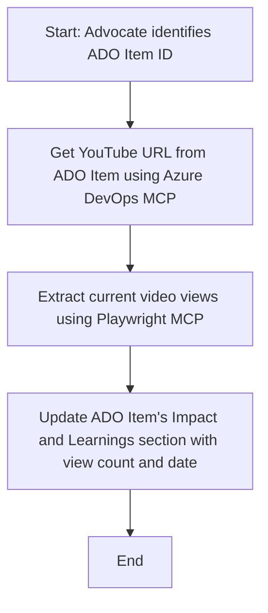

<!--
CO_OP_TRANSLATOR_METADATA:
{
  "original_hash": "14a2dfbea55ef735660a06bd6bdfe5f3",
  "translation_date": "2025-07-14T06:11:29+00:00",
  "source_file": "09-CaseStudy/UpdateADOItemsFromYT.md",
  "language_code": "pt"
}
-->
# Estudo de Caso: Atualização de Itens do Azure DevOps com Dados do YouTube usando MCP

> **Disclaimer:** Existem ferramentas e relatórios online que podem automatizar o processo de atualização de itens do Azure DevOps com dados de plataformas como o YouTube. O cenário seguinte é apresentado apenas como um exemplo para ilustrar como as ferramentas MCP podem ser aplicadas em tarefas de automação e integração.

## Visão Geral

Este estudo de caso demonstra um exemplo de como o Model Context Protocol (MCP) e as suas ferramentas podem ser usados para automatizar o processo de atualização de work items do Azure DevOps (ADO) com informações obtidas de plataformas online, como o YouTube. O cenário descrito é apenas uma ilustração das capacidades mais amplas destas ferramentas, que podem ser adaptadas a muitas necessidades semelhantes de automação.

Neste exemplo, um Advocate acompanha sessões online usando itens ADO, onde cada item inclui uma URL de vídeo do YouTube. Ao utilizar as ferramentas MCP, o Advocate pode manter os itens ADO atualizados com as métricas mais recentes dos vídeos, como o número de visualizações, de forma repetível e automatizada. Esta abordagem pode ser generalizada para outros casos em que informações de fontes online precisam ser integradas no ADO ou noutros sistemas.

## Cenário

Um Advocate é responsável por acompanhar o impacto das sessões online e o envolvimento da comunidade. Cada sessão é registada como um work item ADO no projeto 'DevRel', e o work item contém um campo para a URL do vídeo do YouTube. Para reportar com precisão o alcance da sessão, o Advocate precisa atualizar o item ADO com o número atual de visualizações do vídeo e a data em que esta informação foi obtida.

## Ferramentas Utilizadas

- [Azure DevOps MCP](https://github.com/microsoft/azure-devops-mcp): Permite o acesso programático e a atualização dos work items ADO via MCP.
- [Playwright MCP](https://github.com/microsoft/playwright-mcp): Automatiza ações no navegador para extrair dados em tempo real de páginas web, como as estatísticas de vídeos do YouTube.

## Fluxo de Trabalho Passo a Passo

1. **Identificar o Item ADO**: Começar com o ID do work item ADO (ex.: 1234) no projeto 'DevRel'.
2. **Obter a URL do YouTube**: Usar a ferramenta Azure DevOps MCP para obter a URL do YouTube a partir do work item.
3. **Extrair Visualizações do Vídeo**: Usar a ferramenta Playwright MCP para navegar até à URL do YouTube e extrair o número atual de visualizações.
4. **Atualizar o Item ADO**: Escrever o número mais recente de visualizações e a data da obtenção na secção 'Impact and Learnings' do work item ADO usando a ferramenta Azure DevOps MCP.

## Exemplo de Prompt

```bash
- Work with the ADO Item ID: 1234
- The project is '2025-Awesome'
- Get the YouTube URL for the ADO item
- Use Playwright to get the current views from the YouTube video
- Update the ADO item with the current video views and the updated date of the information
```

## Diagrama Mermaid



## Implementação Técnica

- **Orquestração MCP**: O fluxo de trabalho é orquestrado por um servidor MCP, que coordena a utilização das ferramentas Azure DevOps MCP e Playwright MCP.
- **Automação**: O processo pode ser acionado manualmente ou programado para correr em intervalos regulares, mantendo os itens ADO atualizados.
- **Extensibilidade**: O mesmo padrão pode ser estendido para atualizar itens ADO com outras métricas online (ex.: likes, comentários) ou de outras plataformas.

## Resultados e Impacto

- **Eficiência**: Reduz o esforço manual dos Advocates ao automatizar a obtenção e atualização das métricas dos vídeos.
- **Precisão**: Garante que os itens ADO refletem os dados mais atuais disponíveis nas fontes online.
- **Repetibilidade**: Fornece um fluxo de trabalho reutilizável para cenários semelhantes envolvendo outras fontes de dados ou métricas.

## Referências

- [Azure DevOps MCP](https://github.com/microsoft/azure-devops-mcp)
- [Playwright MCP](https://github.com/microsoft/playwright-mcp)
- [Model Context Protocol (MCP)](https://modelcontextprotocol.io/)

**Aviso Legal**:  
Este documento foi traduzido utilizando o serviço de tradução automática [Co-op Translator](https://github.com/Azure/co-op-translator). Embora nos esforcemos pela precisão, por favor tenha em conta que traduções automáticas podem conter erros ou imprecisões. O documento original na sua língua nativa deve ser considerado a fonte autorizada. Para informações críticas, recomenda-se tradução profissional humana. Não nos responsabilizamos por quaisquer mal-entendidos ou interpretações incorretas decorrentes da utilização desta tradução.