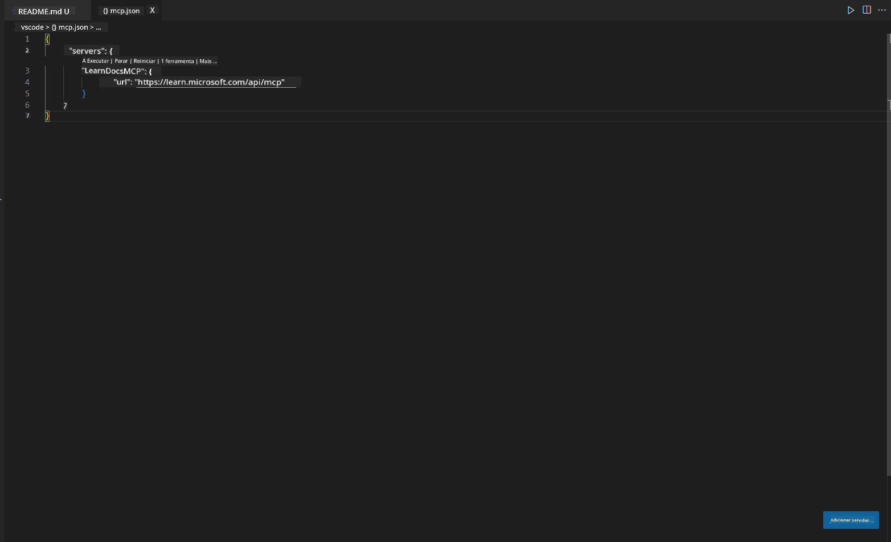
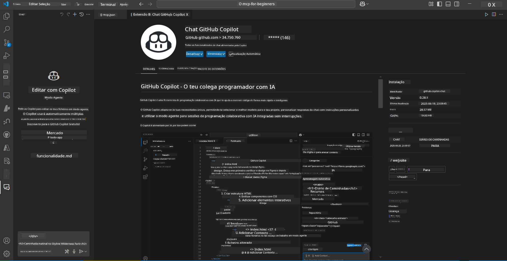
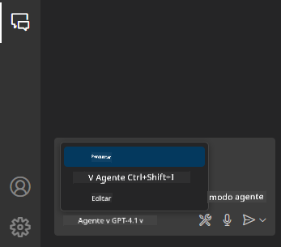
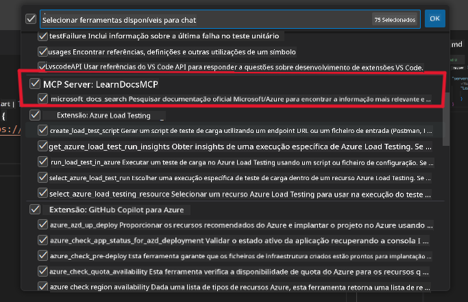
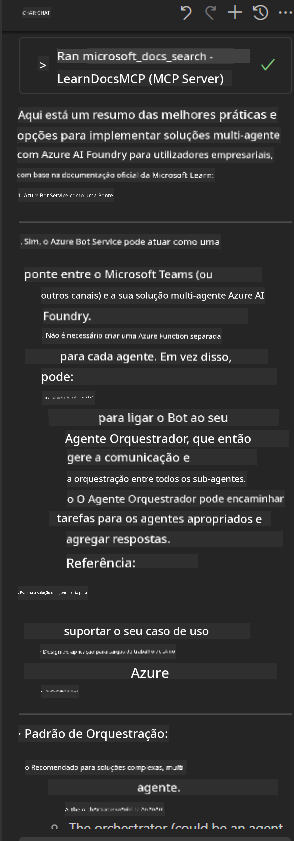

<!--
CO_OP_TRANSLATOR_METADATA:
{
  "original_hash": "db532b1ec386c9ce38c791653dc3c881",
  "translation_date": "2025-06-21T14:38:37+00:00",
  "source_file": "09-CaseStudy/docs-mcp/solution/scenario3/README.md",
  "language_code": "pt"
}
-->
# Cenário 3: Documentação no Editor com o Servidor MCP no VS Code

## Visão Geral

Neste cenário, vai aprender como trazer a documentação Microsoft Learn diretamente para o seu ambiente Visual Studio Code usando o servidor MCP. Em vez de estar sempre a mudar de separadores no navegador para procurar documentação, pode aceder, pesquisar e consultar documentação oficial diretamente no seu editor. Esta abordagem simplifica o seu fluxo de trabalho, mantém-no focado e permite uma integração fluida com ferramentas como o GitHub Copilot.

- Pesquise e leia documentação dentro do VS Code sem sair do ambiente de programação.
- Consulte documentação e insira links diretamente nos seus ficheiros README ou de curso.
- Use o GitHub Copilot e o MCP em conjunto para um fluxo de trabalho de documentação assistido por IA, sem interrupções.

## Objetivos de Aprendizagem

No final deste capítulo, irá saber como configurar e usar o servidor MCP dentro do VS Code para melhorar o seu fluxo de trabalho de documentação e desenvolvimento. Será capaz de:

- Configurar o seu ambiente para usar o servidor MCP na pesquisa de documentação.
- Pesquisar e inserir documentação diretamente a partir do VS Code.
- Combinar o poder do GitHub Copilot e MCP para um fluxo de trabalho mais produtivo e potenciado por IA.

Estas competências irão ajudá-lo a manter o foco, melhorar a qualidade da documentação e aumentar a sua produtividade como programador ou redator técnico.

## Solução

Para obter acesso à documentação dentro do editor, vai seguir uma série de passos que integram o servidor MCP com o VS Code e o GitHub Copilot. Esta solução é ideal para autores de cursos, redatores de documentação e programadores que querem manter o foco no editor enquanto trabalham com documentação e Copilot.

- Adicione rapidamente links de referência a um README enquanto escreve documentação de curso ou projeto.
- Use o Copilot para gerar código e o MCP para encontrar e citar documentos relevantes instantaneamente.
- Mantenha o foco no editor e aumente a produtividade.

### Guia Passo a Passo

Para começar, siga estes passos. Para cada passo, pode adicionar uma captura de ecrã da pasta de assets para ilustrar visualmente o processo.

1. **Adicione a configuração MCP:**
   Na raiz do seu projeto, crie um ficheiro `.vscode/mcp.json` e adicione a seguinte configuração:
   ```json
   {
     "servers": {
       "LearnDocsMCP": {
         "url": "https://learn.microsoft.com/api/mcp"
       }
     }
   }
   ```
   Esta configuração indica ao VS Code como se ligar ao [`Microsoft Learn Docs MCP server`](https://github.com/MicrosoftDocs/mcp).
   
   
    
2. **Abra o painel GitHub Copilot Chat:**
   Se ainda não tiver a extensão GitHub Copilot instalada, vá ao painel de Extensões no VS Code e instale-a. Pode descarregá-la diretamente do [Visual Studio Code Marketplace](https://marketplace.visualstudio.com/items?itemName=GitHub.copilot-chat). Depois, abra o painel Copilot Chat na barra lateral.

   

3. **Ative o modo agente e verifique as ferramentas:**
   No painel Copilot Chat, ative o modo agente.

   

   Depois de ativar o modo agente, verifique se o servidor MCP está listado como uma das ferramentas disponíveis. Isto garante que o agente Copilot pode aceder ao servidor de documentação para obter informação relevante.
   
   
4. **Inicie uma nova conversa e faça perguntas ao agente:**
   Abra uma nova conversa no painel Copilot Chat. Agora pode fazer perguntas ao agente sobre documentação. O agente usará o servidor MCP para obter e mostrar documentação relevante do Microsoft Learn diretamente no seu editor.

   - *"Estou a tentar escrever um plano de estudo para o tema X. Vou estudar durante 8 semanas, para cada semana sugere o conteúdo que devo abordar."*

   

5. **Consulta em tempo real:**

   > Vamos analisar uma consulta em tempo real da secção [#get-help](https://discord.gg/D6cRhjHWSC) no Discord Azure AI Foundry ([ver mensagem original](https://discord.com/channels/1113626258182504448/1385498306720829572)):
   
   *"Procuro respostas sobre como implementar uma solução multi-agente com agentes de IA desenvolvidos no Azure AI Foundry. Vejo que não há um método de implantação direto, como os canais Copilot Studio. Quais são as diferentes formas de fazer esta implantação para que utilizadores empresariais possam interagir e realizar o trabalho?
Existem vários artigos/blogs que dizem que podemos usar o serviço Azure Bot para fazer este trabalho, que pode atuar como ponte entre o MS Teams e os Agentes do Azure AI Foundry. Será que isto funciona se configurar um bot Azure que se ligue ao Orchestrator Agent no Azure AI Foundry via Azure Function para realizar a orquestração, ou preciso criar uma Azure Function para cada agente IA da solução multi-agente para fazer a orquestração no Bot Framework? Qualquer outra sugestão é bem-vinda."*

   

   O agente responderá com links e resumos de documentação relevantes, que pode inserir diretamente nos seus ficheiros markdown ou usar como referência no seu código.
   
### Exemplos de Consultas

Aqui ficam alguns exemplos de consultas que pode experimentar. Estas consultas demonstram como o servidor MCP e o Copilot funcionam juntos para fornecer documentação instantânea, contextualizada e referências sem sair do VS Code:

- "Mostra-me como usar triggers em Azure Functions."
- "Insere um link para a documentação oficial do Azure Key Vault."
- "Quais são as melhores práticas para garantir a segurança dos recursos Azure?"
- "Encontra um quickstart para serviços Azure AI."

Estas consultas demonstram como o servidor MCP e o Copilot podem trabalhar em conjunto para fornecer documentação instantânea, contextualizada e referências sem sair do VS Code.

---

**Aviso Legal**:  
Este documento foi traduzido utilizando o serviço de tradução automática [Co-op Translator](https://github.com/Azure/co-op-translator). Embora nos esforcemos pela precisão, por favor tenha em atenção que traduções automáticas podem conter erros ou imprecisões. O documento original na sua língua nativa deve ser considerado a fonte autorizada. Para informações críticas, recomenda-se tradução profissional humana. Não nos responsabilizamos por quaisquer mal-entendidos ou interpretações incorretas decorrentes do uso desta tradução.