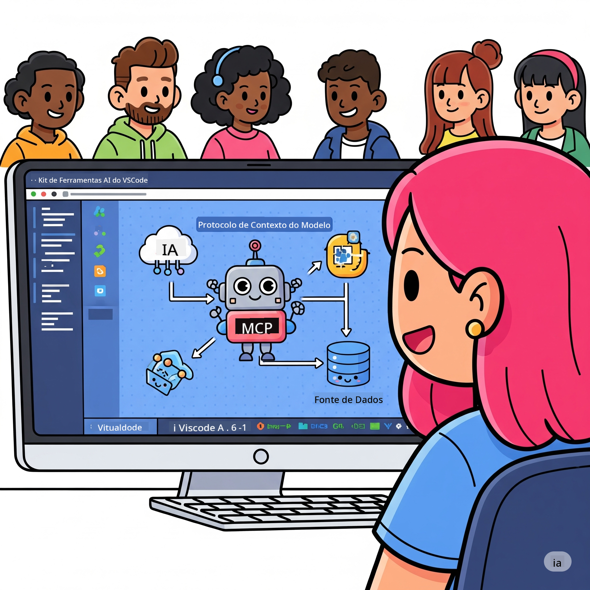

<!--
CO_OP_TRANSLATOR_METADATA:
{
  "original_hash": "787440926586cd064b0899fd1c514f52",
  "translation_date": "2025-07-14T07:05:35+00:00",
  "source_file": "10-StreamliningAIWorkflowsBuildingAnMCPServerWithAIToolkit/README.md",
  "language_code": "pt"
}
-->
# Otimizando Fluxos de Trabalho de IA: Construindo um Servidor MCP com AI Toolkit

## 🎯 Visão Geral

Bem-vindo ao **Workshop do Model Context Protocol (MCP)**! Este workshop prático e completo combina duas tecnologias inovadoras para revolucionar o desenvolvimento de aplicações de IA:

- **🔗 Model Context Protocol (MCP)**: Um padrão aberto para integração fluida de ferramentas de IA
- **🛠️ AI Toolkit para Visual Studio Code (AITK)**: A poderosa extensão de desenvolvimento de IA da Microsoft

### 🎓 O que Vai Aprender

No final deste workshop, dominará a arte de construir aplicações inteligentes que ligam modelos de IA a ferramentas e serviços do mundo real. Desde testes automatizados até integrações personalizadas de API, adquirirá competências práticas para resolver desafios empresariais complexos.

## 🏗️ Stack Tecnológico

### 🔌 Model Context Protocol (MCP)

O MCP é o **"USB-C para IA"** – um padrão universal que conecta modelos de IA a ferramentas externas e fontes de dados.

**✨ Principais Características:**
- 🔄 **Integração Padronizada**: Interface universal para conexões entre IA e ferramentas
- 🏛️ **Arquitetura Flexível**: Servidores locais e remotos via transporte stdio/SSE
- 🧰 **Ecossistema Rico**: Ferramentas, prompts e recursos num único protocolo
- 🔒 **Pronto para Empresas**: Segurança e fiabilidade incorporadas

**🎯 Por que o MCP é Importante:**
Tal como o USB-C eliminou o caos dos cabos, o MCP elimina a complexidade das integrações de IA. Um protocolo, possibilidades infinitas.

### 🤖 AI Toolkit para Visual Studio Code (AITK)

A extensão principal da Microsoft para desenvolvimento de IA que transforma o VS Code numa potência de IA.

**🚀 Capacidades Principais:**
- 📦 **Catálogo de Modelos**: Acesso a modelos do Azure AI, GitHub, Hugging Face, Ollama
- ⚡ **Inferência Local**: Execução otimizada ONNX em CPU/GPU/NPU
- 🏗️ **Agent Builder**: Desenvolvimento visual de agentes de IA com integração MCP
- 🎭 **Multi-Modal**: Suporte a texto, visão e saída estruturada

**💡 Benefícios para o Desenvolvimento:**
- Deploy de modelos sem configuração
- Engenharia visual de prompts
- Ambiente de testes em tempo real
- Integração fluida com servidores MCP

## 📚 Jornada de Aprendizagem

### [🚀 Módulo 1: Fundamentos do AI Toolkit](./lab1/README.md)
**Duração**: 15 minutos
- 🛠️ Instalar e configurar o AI Toolkit para VS Code
- 🗂️ Explorar o Catálogo de Modelos (mais de 100 modelos do GitHub, ONNX, OpenAI, Anthropic, Google)
- 🎮 Dominar o Playground Interativo para testes em tempo real
- 🤖 Construir o seu primeiro agente de IA com o Agent Builder
- 📊 Avaliar o desempenho dos modelos com métricas integradas (F1, relevância, similaridade, coerência)
- ⚡ Aprender processamento em lote e suporte multimodal

**🎯 Resultado de Aprendizagem**: Criar um agente de IA funcional com compreensão abrangente das capacidades do AITK

### [🌐 Módulo 2: MCP com Fundamentos do AI Toolkit](./lab2/README.md)
**Duração**: 20 minutos
- 🧠 Dominar a arquitetura e conceitos do Model Context Protocol (MCP)
- 🌐 Explorar o ecossistema de servidores MCP da Microsoft
- 🤖 Construir um agente de automação de browser usando o servidor MCP Playwright
- 🔧 Integrar servidores MCP com o Agent Builder do AI Toolkit
- 📊 Configurar e testar ferramentas MCP dentro dos seus agentes
- 🚀 Exportar e implementar agentes potenciados por MCP para produção

**🎯 Resultado de Aprendizagem**: Implementar um agente de IA reforçado com ferramentas externas via MCP

### [🔧 Módulo 3: Desenvolvimento Avançado MCP com AI Toolkit](./lab3/README.md)
**Duração**: 20 minutos
- 💻 Criar servidores MCP personalizados usando o AI Toolkit
- 🐍 Configurar e usar o SDK Python MCP mais recente (v1.9.3)
- 🔍 Configurar e utilizar o MCP Inspector para depuração
- 🛠️ Construir um Servidor MCP de Meteorologia com fluxos profissionais de depuração
- 🧪 Depurar servidores MCP tanto no Agent Builder como no Inspector

**🎯 Resultado de Aprendizagem**: Desenvolver e depurar servidores MCP personalizados com ferramentas modernas

### [🐙 Módulo 4: Desenvolvimento Prático MCP - Servidor Customizado de Clone GitHub](./lab4/README.md)
**Duração**: 30 minutos
- 🏗️ Construir um servidor MCP real de Clone GitHub para fluxos de desenvolvimento
- 🔄 Implementar clonagem inteligente de repositórios com validação e tratamento de erros
- 📁 Criar gestão inteligente de diretórios e integração com VS Code
- 🤖 Usar o Modo Agente GitHub Copilot com ferramentas MCP personalizadas
- 🛡️ Aplicar fiabilidade pronta para produção e compatibilidade multiplataforma

**🎯 Resultado de Aprendizagem**: Implementar um servidor MCP pronto para produção que otimiza fluxos reais de desenvolvimento

## 💡 Aplicações e Impacto no Mundo Real

### 🏢 Casos de Uso Empresariais

#### 🔄 Automação DevOps
Transforme o seu fluxo de desenvolvimento com automação inteligente:
- **Gestão Inteligente de Repositórios**: Revisão de código e decisões de merge conduzidas por IA
- **CI/CD Inteligente**: Otimização automática de pipelines baseada em alterações de código
- **Triagem de Issues**: Classificação e atribuição automática de bugs

#### 🧪 Revolução na Garantia de Qualidade
Eleve os testes com automação alimentada por IA:
- **Geração Inteligente de Testes**: Criação automática de suites de testes abrangentes
- **Testes de Regressão Visuais**: Detecção de alterações na UI com IA
- **Monitorização de Performance**: Identificação e resolução proativa de problemas

#### 📊 Inteligência em Pipelines de Dados
Construa fluxos de processamento de dados mais inteligentes:
- **Processos ETL Adaptativos**: Transformações de dados auto-otimizáveis
- **Deteção de Anomalias**: Monitorização em tempo real da qualidade dos dados
- **Roteamento Inteligente**: Gestão inteligente do fluxo de dados

#### 🎧 Melhoria da Experiência do Cliente
Crie interações excecionais com clientes:
- **Suporte Contextualizado**: Agentes de IA com acesso ao histórico do cliente
- **Resolução Proativa de Problemas**: Serviço ao cliente preditivo
- **Integração Multicanal**: Experiência unificada de IA em várias plataformas

## 🛠️ Pré-requisitos e Configuração

### 💻 Requisitos do Sistema

| Componente | Requisito | Notas |
|------------|-----------|-------|
| **Sistema Operativo** | Windows 10+, macOS 10.15+, Linux | Qualquer SO moderno |
| **Visual Studio Code** | Versão estável mais recente | Necessário para AITK |
| **Node.js** | v18.0+ e npm | Para desenvolvimento de servidores MCP |
| **Python** | 3.10+ | Opcional para servidores MCP em Python |
| **Memória** | Mínimo 8GB RAM | 16GB recomendado para modelos locais |

### 🔧 Ambiente de Desenvolvimento

#### Extensões Recomendadas para VS Code
- **AI Toolkit** (ms-windows-ai-studio.windows-ai-studio)
- **Python** (ms-python.python)
- **Python Debugger** (ms-python.debugpy)
- **GitHub Copilot** (GitHub.copilot) - Opcional mas útil

#### Ferramentas Opcionais
- **uv**: Gestor moderno de pacotes Python
- **MCP Inspector**: Ferramenta visual de depuração para servidores MCP
- **Playwright**: Para exemplos de automação web

## 🎖️ Resultados de Aprendizagem e Caminho para Certificação

### 🏆 Lista de Competências a Dominar

Ao concluir este workshop, alcançará domínio em:

#### 🎯 Competências Centrais
- [ ] **Domínio do Protocolo MCP**: Compreensão profunda da arquitetura e padrões de implementação
- [ ] **Proficiência em AITK**: Uso avançado do AI Toolkit para desenvolvimento rápido
- [ ] **Desenvolvimento de Servidores Personalizados**: Construir, implementar e manter servidores MCP em produção
- [ ] **Excelência em Integração de Ferramentas**: Conectar IA sem falhas a fluxos de trabalho existentes
- [ ] **Aplicação na Resolução de Problemas**: Aplicar competências adquiridas a desafios empresariais reais

#### 🔧 Competências Técnicas
- [ ] Configurar e usar o AI Toolkit no VS Code
- [ ] Projetar e implementar servidores MCP personalizados
- [ ] Integrar modelos GitHub com arquitetura MCP
- [ ] Construir fluxos de testes automatizados com Playwright
- [ ] Implementar agentes de IA para uso em produção
- [ ] Depurar e otimizar desempenho de servidores MCP

#### 🚀 Capacidades Avançadas
- [ ] Arquitetar integrações de IA em escala empresarial
- [ ] Implementar melhores práticas de segurança para aplicações de IA
- [ ] Projetar arquiteturas escaláveis para servidores MCP
- [ ] Criar cadeias de ferramentas personalizadas para domínios específicos
- [ ] Orientar outros no desenvolvimento nativo de IA

## 📖 Recursos Adicionais
- [Especificação MCP](https://modelcontextprotocol.io/docs)
- [Repositório AI Toolkit no GitHub](https://github.com/microsoft/vscode-ai-toolkit)
- [Coleção de Servidores MCP de Exemplo](https://github.com/modelcontextprotocol/servers)
- [Guia de Boas Práticas](https://modelcontextprotocol.io/docs/best-practices)

---

**🚀 Pronto para revolucionar o seu fluxo de desenvolvimento de IA?**

Vamos construir juntos o futuro das aplicações inteligentes com MCP e AI Toolkit!

**Aviso Legal**:  
Este documento foi traduzido utilizando o serviço de tradução por IA [Co-op Translator](https://github.com/Azure/co-op-translator). Embora nos esforcemos pela precisão, por favor tenha em conta que traduções automáticas podem conter erros ou imprecisões. O documento original na sua língua nativa deve ser considerado a fonte autorizada. Para informações críticas, recomenda-se tradução profissional humana. Não nos responsabilizamos por quaisquer mal-entendidos ou interpretações incorretas decorrentes da utilização desta tradução.