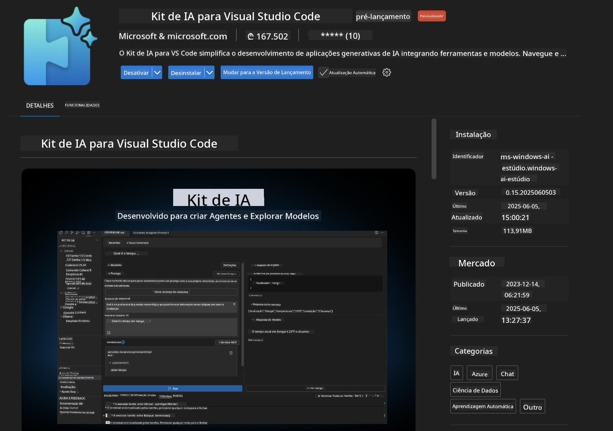
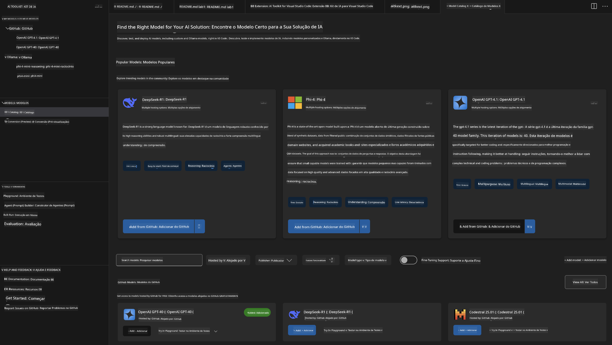
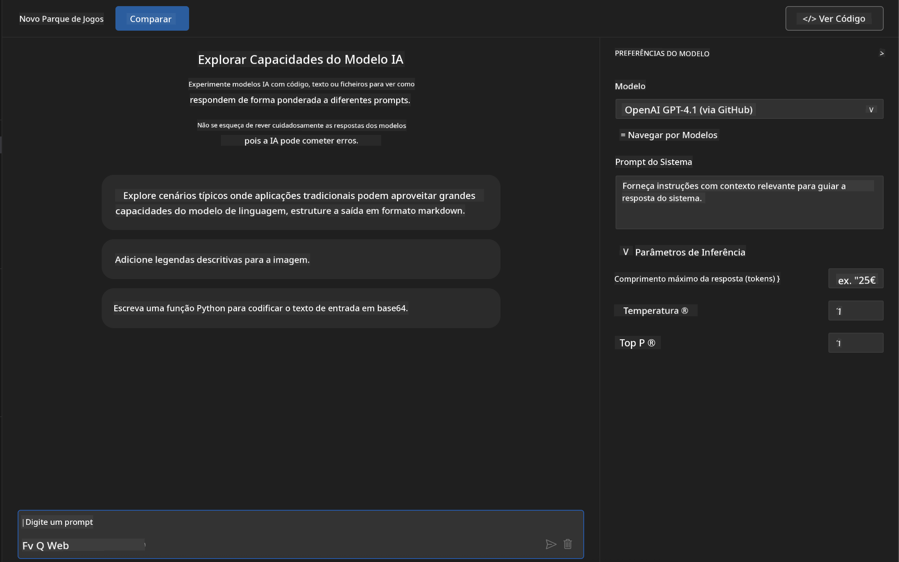
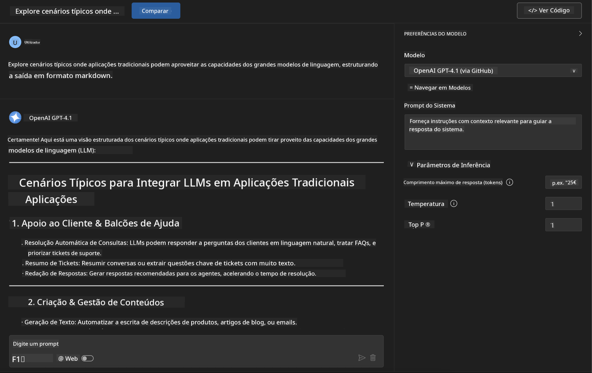
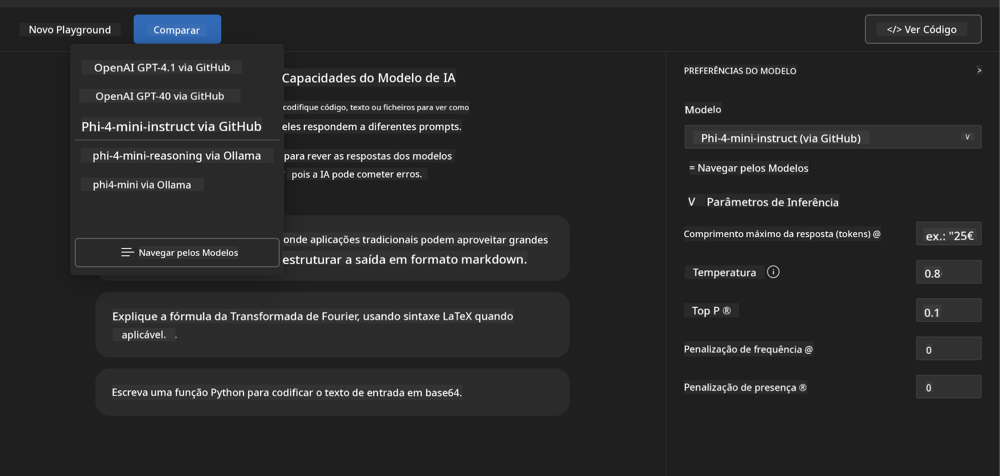
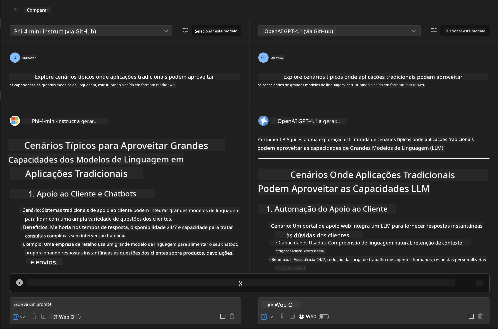
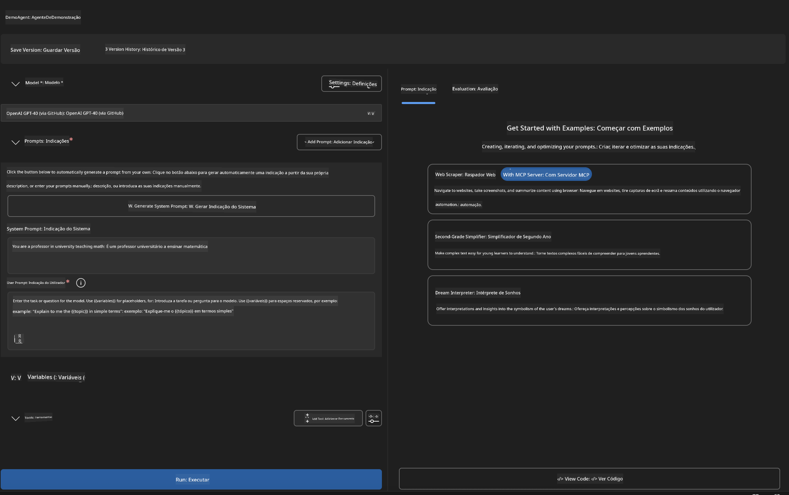
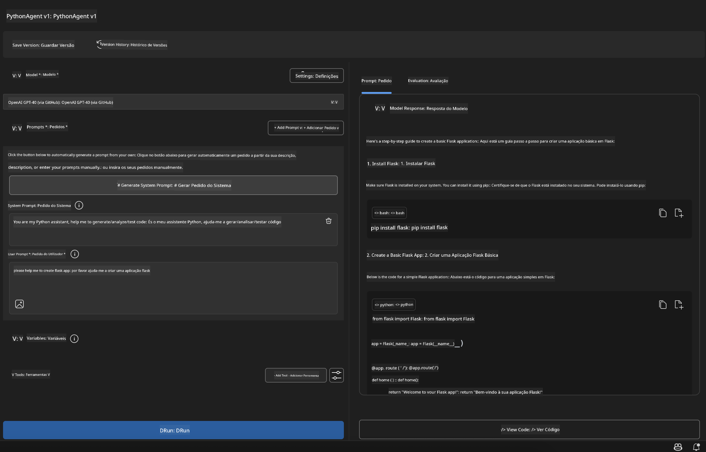

<!--
CO_OP_TRANSLATOR_METADATA:
{
  "original_hash": "2aa9dbc165e104764fa57e8a0d3f1c73",
  "translation_date": "2025-07-14T07:25:04+00:00",
  "source_file": "10-StreamliningAIWorkflowsBuildingAnMCPServerWithAIToolkit/lab1/README.md",
  "language_code": "pt"
}
-->
# 🚀 Módulo 1: Fundamentos do AI Toolkit

[]()
[]()
[]()

## 📋 Objetivos de Aprendizagem

No final deste módulo, serás capaz de:
- ✅ Instalar e configurar o AI Toolkit para Visual Studio Code
- ✅ Navegar pelo Catálogo de Modelos e compreender as diferentes fontes de modelos
- ✅ Usar o Playground para testar e experimentar modelos
- ✅ Criar agentes de IA personalizados usando o Agent Builder
- ✅ Comparar o desempenho dos modelos entre diferentes fornecedores
- ✅ Aplicar as melhores práticas em engenharia de prompts

## 🧠 Introdução ao AI Toolkit (AITK)

O **AI Toolkit para Visual Studio Code** é a extensão principal da Microsoft que transforma o VS Code num ambiente completo de desenvolvimento de IA. Faz a ponte entre a investigação em IA e o desenvolvimento prático, tornando a IA generativa acessível a programadores de todos os níveis.

### 🌟 Capacidades Principais

| Funcionalidade | Descrição | Caso de Uso |
|----------------|-----------|-------------|
| **🗂️ Catálogo de Modelos** | Acesso a mais de 100 modelos do GitHub, ONNX, OpenAI, Anthropic, Google | Descoberta e seleção de modelos |
| **🔌 Suporte BYOM** | Integração dos teus próprios modelos (locais/remotos) | Implementação personalizada de modelos |
| **🎮 Playground Interativo** | Testes em tempo real com interface de chat | Prototipagem rápida e testes |
| **📎 Suporte Multi-Modal** | Suporte a texto, imagens e anexos | Aplicações de IA complexas |
| **⚡ Processamento em Lote** | Execução simultânea de múltiplos prompts | Fluxos de trabalho eficientes |
| **📊 Avaliação de Modelos** | Métricas integradas (F1, relevância, similaridade, coerência) | Avaliação de desempenho |

### 🎯 Porquê o AI Toolkit é Importante

- **🚀 Desenvolvimento Acelerado**: Da ideia ao protótipo em minutos
- **🔄 Fluxo de Trabalho Unificado**: Uma interface para múltiplos fornecedores de IA
- **🧪 Experimentação Fácil**: Compara modelos sem configurações complexas
- **📈 Pronto para Produção**: Transição fluida do protótipo para o deployment

## 🛠️ Pré-requisitos & Configuração

### 📦 Instalar a Extensão AI Toolkit

**Passo 1: Aceder ao Marketplace de Extensões**
1. Abre o Visual Studio Code
2. Navega para a vista de Extensões (`Ctrl+Shift+X` ou `Cmd+Shift+X`)
3. Pesquisa por "AI Toolkit"

**Passo 2: Escolher a Versão**
- **🟢 Release**: Recomendado para uso em produção
- **🔶 Pré-lançamento**: Acesso antecipado a funcionalidades inovadoras

**Passo 3: Instalar e Ativar**



### ✅ Lista de Verificação para Verificação
- [ ] Ícone do AI Toolkit aparece na barra lateral do VS Code
- [ ] Extensão está ativada e em funcionamento
- [ ] Sem erros de instalação no painel de output

## 🧪 Exercício Prático 1: Explorar Modelos do GitHub

**🎯 Objetivo**: Dominar o Catálogo de Modelos e testar o teu primeiro modelo de IA

### 📊 Passo 1: Navegar pelo Catálogo de Modelos

O Catálogo de Modelos é a tua porta de entrada para o ecossistema de IA. Agrega modelos de vários fornecedores, facilitando a descoberta e comparação.

**🔍 Guia de Navegação:**

Clica em **MODELS - Catalog** na barra lateral do AI Toolkit



**💡 Dica Profissional**: Procura modelos com capacidades específicas que se adequem ao teu caso de uso (ex.: geração de código, escrita criativa, análise).

**⚠️ Nota**: Os modelos alojados no GitHub (ou seja, GitHub Models) são gratuitos, mas sujeitos a limites de taxa em pedidos e tokens. Para aceder a modelos externos (hospedados via Azure AI ou outros endpoints), precisarás de fornecer a chave API ou autenticação adequada.

### 🚀 Passo 2: Adicionar e Configurar o Teu Primeiro Modelo

**Estratégia de Seleção de Modelo:**
- **GPT-4.1**: Ideal para raciocínio complexo e análise
- **Phi-4-mini**: Leve, respostas rápidas para tarefas simples

**🔧 Processo de Configuração:**
1. Seleciona **OpenAI GPT-4.1** no catálogo
2. Clica em **Add to My Models** - isto regista o modelo para uso
3. Escolhe **Try in Playground** para abrir o ambiente de testes
4. Aguarda pela inicialização do modelo (a primeira vez pode demorar um pouco)



**⚙️ Compreender os Parâmetros do Modelo:**
- **Temperature**: Controla a criatividade (0 = determinístico, 1 = criativo)
- **Max Tokens**: Comprimento máximo da resposta
- **Top-p**: Amostragem núcleo para diversidade da resposta

### 🎯 Passo 3: Dominar a Interface do Playground

O Playground é o teu laboratório de experimentação em IA. Eis como tirar o máximo partido:

**🎨 Melhores Práticas em Engenharia de Prompts:**
1. **Seja Específico**: Instruções claras e detalhadas produzem melhores resultados
2. **Fornece Contexto**: Inclui informação relevante de fundo
3. **Usa Exemplos**: Mostra ao modelo o que pretendes com exemplos
4. **Itera**: Refina os prompts com base nos resultados iniciais

**🧪 Cenários de Teste:**
```markdown
# Example 1: Code Generation
"Write a Python function that calculates the factorial of a number using recursion. Include error handling and docstrings."

# Example 2: Creative Writing
"Write a professional email to a client explaining a project delay, maintaining a positive tone while being transparent about challenges."

# Example 3: Data Analysis
"Analyze this sales data and provide insights: [paste your data]. Focus on trends, anomalies, and actionable recommendations."
```



### 🏆 Exercício Desafio: Comparação de Desempenho de Modelos

**🎯 Objetivo**: Comparar diferentes modelos usando prompts idênticos para perceber as suas forças

**📋 Instruções:**
1. Adiciona **Phi-4-mini** ao teu espaço de trabalho
2. Usa o mesmo prompt para GPT-4.1 e Phi-4-mini



3. Compara qualidade, velocidade e precisão das respostas
4. Documenta as tuas conclusões na secção de resultados



**💡 Insights Importantes a Descobrir:**
- Quando usar LLM vs SLM
- Compromissos entre custo e desempenho
- Capacidades especializadas de diferentes modelos

## 🤖 Exercício Prático 2: Construir Agentes Personalizados com Agent Builder

**🎯 Objetivo**: Criar agentes de IA especializados para tarefas e fluxos de trabalho específicos

### 🏗️ Passo 1: Compreender o Agent Builder

O Agent Builder é onde o AI Toolkit realmente se destaca. Permite criar assistentes de IA feitos à medida que combinam o poder dos grandes modelos de linguagem com instruções personalizadas, parâmetros específicos e conhecimento especializado.

**🧠 Componentes da Arquitetura do Agente:**
- **Modelo Base**: O LLM fundamental (GPT-4, Groks, Phi, etc.)
- **System Prompt**: Define a personalidade e comportamento do agente
- **Parâmetros**: Configurações ajustadas para desempenho ideal
- **Integração de Ferramentas**: Ligação a APIs externas e serviços MCP
- **Memória**: Contexto da conversa e persistência da sessão



### ⚙️ Passo 2: Mergulho na Configuração do Agente

**🎨 Criar System Prompts Eficazes:**
```markdown
# Template Structure:
## Role Definition
You are a [specific role] with expertise in [domain].

## Capabilities
- List specific abilities
- Define scope of knowledge
- Clarify limitations

## Behavior Guidelines
- Response style (formal, casual, technical)
- Output format preferences
- Error handling approach

## Examples
Provide 2-3 examples of ideal interactions
```

*Claro que também podes usar Generate System Prompt para que a IA te ajude a gerar e otimizar prompts*

**🔧 Otimização de Parâmetros:**
| Parâmetro | Intervalo Recomendado | Caso de Uso |
|-----------|----------------------|-------------|
| **Temperature** | 0.1-0.3 | Respostas técnicas/factuais |
| **Temperature** | 0.7-0.9 | Tarefas criativas/de brainstorming |
| **Max Tokens** | 500-1000 | Respostas concisas |
| **Max Tokens** | 2000-4000 | Explicações detalhadas |

### 🐍 Passo 3: Exercício Prático - Agente de Programação em Python

**🎯 Missão**: Criar um assistente especializado em programação Python

**📋 Passos de Configuração:**

1. **Seleção do Modelo**: Escolhe **Claude 3.5 Sonnet** (excelente para código)

2. **Design do System Prompt**:
```markdown
# Python Programming Expert Agent

## Role
You are a senior Python developer with 10+ years of experience. You excel at writing clean, efficient, and well-documented Python code.

## Capabilities
- Write production-ready Python code
- Debug complex issues
- Explain code concepts clearly
- Suggest best practices and optimizations
- Provide complete working examples

## Response Format
- Always include docstrings
- Add inline comments for complex logic
- Suggest testing approaches
- Mention relevant libraries when applicable

## Code Quality Standards
- Follow PEP 8 style guidelines
- Use type hints where appropriate
- Handle exceptions gracefully
- Write readable, maintainable code
```

3. **Configuração dos Parâmetros**:
   - Temperature: 0.2 (para código consistente e fiável)
   - Max Tokens: 2000 (explicações detalhadas)
   - Top-p: 0.9 (criatividade equilibrada)



### 🧪 Passo 4: Testar o Teu Agente Python

**Cenários de Teste:**
1. **Função Básica**: "Cria uma função para encontrar números primos"
2. **Algoritmo Complexo**: "Implementa uma árvore de pesquisa binária com métodos de inserção, remoção e pesquisa"
3. **Problema Real**: "Constrói um web scraper que lide com limitação de taxa e tentativas de repetição"
4. **Depuração**: "Corrige este código [cola código com erros]"

**🏆 Critérios de Sucesso:**
- ✅ Código executa sem erros
- ✅ Inclui documentação adequada
- ✅ Segue as melhores práticas de Python
- ✅ Fornece explicações claras
- ✅ Sugere melhorias

## 🎓 Conclusão do Módulo 1 & Próximos Passos

### 📊 Verificação de Conhecimentos

Testa a tua compreensão:
- [ ] Consegues explicar a diferença entre os modelos do catálogo?
- [ ] Criaste e testaste com sucesso um agente personalizado?
- [ ] Entendes como otimizar parâmetros para diferentes casos de uso?
- [ ] Sabes desenhar system prompts eficazes?

### 📚 Recursos Adicionais

- **Documentação do AI Toolkit**: [Documentação Oficial Microsoft](https://github.com/microsoft/vscode-ai-toolkit)
- **Guia de Engenharia de Prompts**: [Melhores Práticas](https://platform.openai.com/docs/guides/prompt-engineering)
- **Modelos no AI Toolkit**: [Modelos em Desenvolvimento](https://github.com/microsoft/vscode-ai-toolkit/blob/main/doc/models.md)

**🎉 Parabéns!** Dominaste os fundamentos do AI Toolkit e estás pronto para criar aplicações de IA mais avançadas!

### 🔜 Continua para o Próximo Módulo

Preparado para capacidades mais avançadas? Continua para **[Módulo 2: Fundamentos MCP com AI Toolkit](../lab2/README.md)** onde vais aprender a:
- Ligar os teus agentes a ferramentas externas usando o Model Context Protocol (MCP)
- Construir agentes de automação de browser com Playwright
- Integrar servidores MCP com os teus agentes AI Toolkit
- Potenciar os teus agentes com dados e capacidades externas

**Aviso Legal**:  
Este documento foi traduzido utilizando o serviço de tradução automática [Co-op Translator](https://github.com/Azure/co-op-translator). Embora nos esforcemos para garantir a precisão, por favor tenha em conta que traduções automáticas podem conter erros ou imprecisões. O documento original na sua língua nativa deve ser considerado a fonte autorizada. Para informações críticas, recomenda-se tradução profissional humana. Não nos responsabilizamos por quaisquer mal-entendidos ou interpretações incorretas decorrentes da utilização desta tradução.