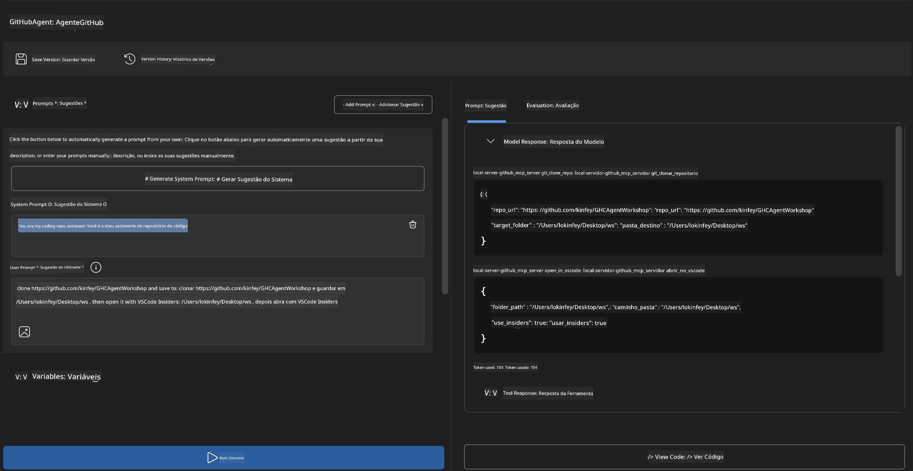
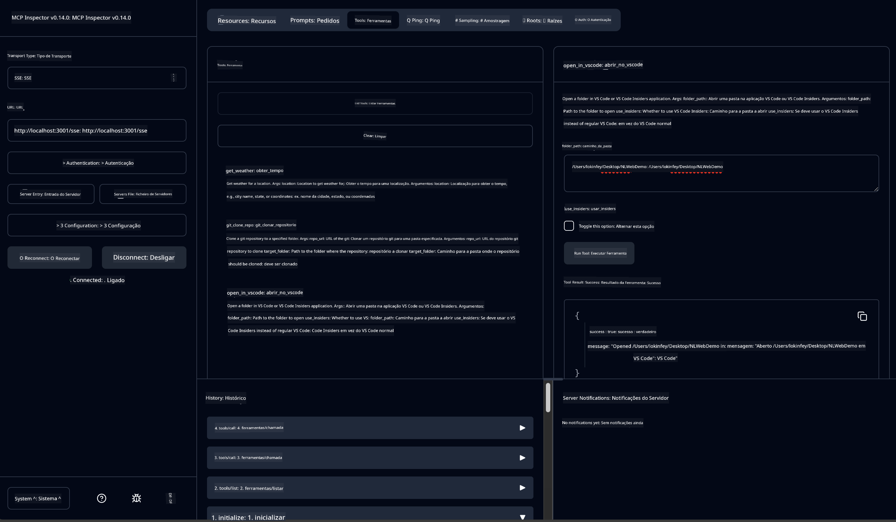

<!--
CO_OP_TRANSLATOR_METADATA:
{
  "original_hash": "f83bc722dc758efffd68667d6a1db470",
  "translation_date": "2025-07-14T08:40:40+00:00",
  "source_file": "10-StreamliningAIWorkflowsBuildingAnMCPServerWithAIToolkit/lab4/README.md",
  "language_code": "pt"
}
-->
# 🐙 Módulo 4: Desenvolvimento Prático MCP - Servidor Personalizado de Clonagem GitHub


> **⚡ Início Rápido:** Construa um servidor MCP pronto para produção que automatiza a clonagem de repositórios GitHub e a integração com o VS Code em apenas 30 minutos!

## 🎯 Objetivos de Aprendizagem

No final deste laboratório, serás capaz de:

- ✅ Criar um servidor MCP personalizado para fluxos de trabalho de desenvolvimento reais
- ✅ Implementar funcionalidade de clonagem de repositórios GitHub via MCP
- ✅ Integrar servidores MCP personalizados com VS Code e Agent Builder
- ✅ Usar o modo Agent do GitHub Copilot com ferramentas MCP personalizadas
- ✅ Testar e implementar servidores MCP personalizados em ambientes de produção

## 📋 Pré-requisitos

- Conclusão dos Laboratórios 1-3 (fundamentos MCP e desenvolvimento avançado)
- Subscrição GitHub Copilot ([registo gratuito disponível](https://github.com/github-copilot/signup))
- VS Code com as extensões AI Toolkit e GitHub Copilot instaladas
- Git CLI instalado e configurado

## 🏗️ Visão Geral do Projeto

### **Desafio de Desenvolvimento Real**
Como programadores, usamos frequentemente o GitHub para clonar repositórios e abri-los no VS Code ou VS Code Insiders. Este processo manual envolve:
1. Abrir o terminal/prompt de comando
2. Navegar até ao diretório desejado
3. Executar o comando `git clone`
4. Abrir o VS Code no diretório clonado

**A nossa solução MCP simplifica tudo isto numa única linha de comando inteligente!**

### **O Que Vais Construir**
Um **Servidor MCP de Clonagem GitHub** (`git_mcp_server`) que oferece:

| Funcionalidade | Descrição | Benefício |
|----------------|-----------|-----------|
| 🔄 **Clonagem Inteligente de Repositórios** | Clona repositórios GitHub com validação | Verificação automática de erros |
| 📁 **Gestão Inteligente de Diretórios** | Verifica e cria diretórios de forma segura | Evita sobreposição de ficheiros |
| 🚀 **Integração Multiplataforma com VS Code** | Abre projetos no VS Code/Insiders | Transição fluida no fluxo de trabalho |
| 🛡️ **Gestão Robusta de Erros** | Trata problemas de rede, permissões e caminhos | Fiabilidade pronta para produção |

---

## 📖 Implementação Passo a Passo

### Passo 1: Criar Agente GitHub no Agent Builder

1. **Abre o Agent Builder** através da extensão AI Toolkit
2. **Cria um novo agente** com a seguinte configuração:
   ```
   Agent Name: GitHubAgent
   ```

3. **Inicializa o servidor MCP personalizado:**
   - Navega para **Tools** → **Add Tool** → **MCP Server**
   - Seleciona **"Create A new MCP Server"**
   - Escolhe o **template Python** para máxima flexibilidade
   - **Nome do Servidor:** `git_mcp_server`

### Passo 2: Configurar o Modo Agent do GitHub Copilot

1. **Abre o GitHub Copilot** no VS Code (Ctrl/Cmd + Shift + P → "GitHub Copilot: Open")
2. **Seleciona o Modelo Agent** na interface do Copilot
3. **Escolhe o modelo Claude 3.7** para capacidades avançadas de raciocínio
4. **Ativa a integração MCP** para acesso às ferramentas

> **💡 Dica Profissional:** O Claude 3.7 oferece uma compreensão superior dos fluxos de trabalho de desenvolvimento e padrões de tratamento de erros.

### Passo 3: Implementar a Funcionalidade Principal do Servidor MCP

**Usa o seguinte prompt detalhado com o modo Agent do GitHub Copilot:**

```
Create two MCP tools with the following comprehensive requirements:

🔧 TOOL A: clone_repository
Requirements:
- Clone any GitHub repository to a specified local folder
- Return the absolute path of the successfully cloned project
- Implement comprehensive validation:
  ✓ Check if target directory already exists (return error if exists)
  ✓ Validate GitHub URL format (https://github.com/user/repo)
  ✓ Verify git command availability (prompt installation if missing)
  ✓ Handle network connectivity issues
  ✓ Provide clear error messages for all failure scenarios

🚀 TOOL B: open_in_vscode
Requirements:
- Open specified folder in VS Code or VS Code Insiders
- Cross-platform compatibility (Windows/Linux/macOS)
- Use direct application launch (not terminal commands)
- Auto-detect available VS Code installations
- Handle cases where VS Code is not installed
- Provide user-friendly error messages

Additional Requirements:
- Follow MCP 1.9.3 best practices
- Include proper type hints and documentation
- Implement logging for debugging purposes
- Add input validation for all parameters
- Include comprehensive error handling
```

### Passo 4: Testar o Teu Servidor MCP

#### 4a. Testar no Agent Builder

1. **Inicia a configuração de debug** no Agent Builder
2. **Configura o teu agente com este prompt de sistema:**

```
SYSTEM_PROMPT:
You are my intelligent coding repository assistant. You help developers efficiently clone GitHub repositories and set up their development environment. Always provide clear feedback about operations and handle errors gracefully.
```

3. **Testa com cenários realistas de utilizador:**

```
USER_PROMPT EXAMPLES:

Scenario : Basic Clone and Open
"Clone {Your GitHub Repo link such as https://github.com/kinfey/GHCAgentWorkshop
 } and save to {The global path you specify}, then open it with VS Code Insiders"
```



**Resultados Esperados:**
- ✅ Clonagem bem-sucedida com confirmação do caminho
- ✅ Lançamento automático do VS Code
- ✅ Mensagens de erro claras para cenários inválidos
- ✅ Tratamento adequado de casos limite

#### 4b. Testar no MCP Inspector



---

**🎉 Parabéns!** Criaste com sucesso um servidor MCP prático e pronto para produção que resolve desafios reais de fluxos de trabalho de desenvolvimento. O teu servidor personalizado de clonagem GitHub demonstra o poder do MCP para automatizar e aumentar a produtividade dos programadores.

### 🏆 Conquistas Desbloqueadas:
- ✅ **Desenvolvedor MCP** - Criou servidor MCP personalizado
- ✅ **Automatizador de Fluxos** - Simplificou processos de desenvolvimento  
- ✅ **Especialista em Integração** - Ligou múltiplas ferramentas de desenvolvimento
- ✅ **Pronto para Produção** - Criou soluções implementáveis

---

## 🎓 Conclusão do Workshop: A Tua Jornada com o Model Context Protocol

**Caro Participante do Workshop,**

Parabéns por completares os quatro módulos do workshop Model Context Protocol! Fizeste um grande percurso, desde compreender os conceitos básicos do AI Toolkit até construir servidores MCP prontos para produção que resolvem desafios reais de desenvolvimento.

### 🚀 Recapitulação do Teu Percurso de Aprendizagem:

**[Módulo 1](../lab1/README.md)**: Começaste por explorar os fundamentos do AI Toolkit, testes de modelos e criação do teu primeiro agente AI.

**[Módulo 2](../lab2/README.md)**: Aprendeste a arquitetura MCP, integraste o Playwright MCP e construíste o teu primeiro agente de automação de browser.

**[Módulo 3](../lab3/README.md)**: Avançaste para o desenvolvimento de servidores MCP personalizados com o servidor Weather MCP e dominaste ferramentas de debug.

**[Módulo 4](../lab4/README.md)**: Aplicaste tudo para criar uma ferramenta prática de automação de fluxos de trabalho com repositórios GitHub.

### 🌟 O Que Dominaste:

- ✅ **Ecossistema AI Toolkit**: Modelos, agentes e padrões de integração
- ✅ **Arquitetura MCP**: Design cliente-servidor, protocolos de transporte e segurança
- ✅ **Ferramentas para Desenvolvedores**: Do Playground ao Inspector até à implementação em produção
- ✅ **Desenvolvimento Personalizado**: Construção, teste e implementação dos teus próprios servidores MCP
- ✅ **Aplicações Práticas**: Resolução de desafios reais de fluxos de trabalho com IA

### 🔮 Próximos Passos:

1. **Constrói o Teu Próprio Servidor MCP**: Aplica estas competências para automatizar os teus fluxos de trabalho únicos
2. **Junta-te à Comunidade MCP**: Partilha as tuas criações e aprende com outros
3. **Explora Integrações Avançadas**: Liga servidores MCP a sistemas empresariais
4. **Contribui para Open Source**: Ajuda a melhorar as ferramentas e documentação MCP

Lembra-te, este workshop é apenas o começo. O ecossistema Model Context Protocol está a evoluir rapidamente, e agora estás preparado para estar na vanguarda das ferramentas de desenvolvimento potenciadas por IA.

**Obrigado pela tua participação e dedicação ao aprendizado!**

Esperamos que este workshop tenha inspirado ideias que transformarão a forma como constróis e interages com ferramentas de IA na tua jornada de desenvolvimento.

**Boa programação!**

---

**Aviso Legal**:  
Este documento foi traduzido utilizando o serviço de tradução automática [Co-op Translator](https://github.com/Azure/co-op-translator). Embora nos esforcemos pela precisão, por favor tenha em atenção que traduções automáticas podem conter erros ou imprecisões. O documento original na sua língua nativa deve ser considerado a fonte autorizada. Para informações críticas, recomenda-se tradução profissional humana. Não nos responsabilizamos por quaisquer mal-entendidos ou interpretações erradas decorrentes da utilização desta tradução.