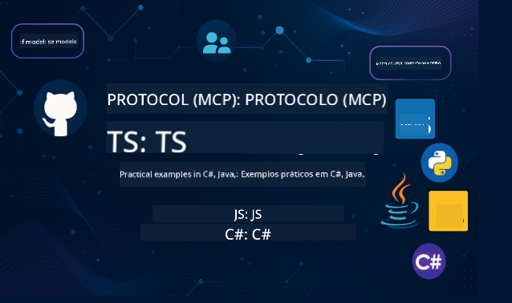

<!--
CO_OP_TRANSLATOR_METADATA:
{
  "original_hash": "b7cce20db5b5b3e9daa5db2e162aa3cf",
  "translation_date": "2025-08-12T20:20:39+00:00",
  "source_file": "README.md",
  "language_code": "pt"
}
-->
 

Siga estes passos para começar a usar estes recursos:
1. **Faça um Fork do Repositório**: Clique 
2. **Clone o Repositório**:   `git clone https://github.com/microsoft/mcp-for-beginners.git`
3. [**Junte-se ao Discord do Azure AI Foundry e conecte-se com especialistas e outros desenvolvedores**](https://discord.com/invite/ByRwuEEgH4)

### 🌐 Suporte Multilíngue

#### Suporte via GitHub Action (Automatizado e Sempre Atualizado)

 [Árabe](../ar/README.md) | [Bengali](../bn/README.md) | [Búlgaro](../bg/README.md) | [Birmanês (Myanmar)](../my/README.md) | [Chinês (Simplificado)](../zh/README.md) | [Chinês (Tradicional, Hong Kong)](../hk/README.md) | [Chinês (Tradicional, Macau)](../mo/README.md) | [Chinês (Tradicional, Taiwan)](../tw/README.md) | [Croata](../hr/README.md) | [Checo](../cs/README.md) | [Dinamarquês](../da/README.md) | [Holandês](../nl/README.md) | [Finlandês](../fi/README.md) | [Francês](../fr/README.md) | [Alemão](../de/README.md) | [Grego](../el/README.md) | [Hebraico](../he/README.md) | [Hindi](../hi/README.md) | [Húngaro](../hu/README.md) | [Indonésio](../id/README.md) | [Italiano](../it/README.md) | [Japonês](../ja/README.md) | [Coreano](../ko/README.md) | [Malaio](../ms/README.md) | [Marathi](../mr/README.md) | [Nepalês](../ne/README.md) | [Norueguês](../no/README.md) | [Persa (Farsi)](../fa/README.md) | [Polaco](../pl/README.md) | [Português (Brasil)](../br/README.md) | [Português (Portugal)](./README.md) | [Punjabi (Gurmukhi)](../pa/README.md) | [Romeno](../ro/README.md) | [Russo](../ru/README.md) | [Sérvio (Cirílico)](../sr/README.md) | [Eslovaco](../sk/README.md) | [Esloveno](../sl/README.md) | [Espanhol](../es/README.md) | [Swahili](../sw/README.md) | [Sueco](../sv/README.md) | [Tagalog (Filipino)](../tl/README.md) | [Tailandês](../th/README.md) | [Turco](../tr/README.md) | [Ucraniano](../uk/README.md) | [Urdu](../ur/README.md) | [Vietnamita](../vi/README.md)

# 🚀 Currículo do Model Context Protocol (MCP) para Iniciantes

## **Aprenda MCP com Exemplos Práticos de Código em C#, Java, JavaScript, Rust, Python e TypeScript**

## 🧠 Visão Geral do Currículo do Model Context Protocol

O **Model Context Protocol (MCP)** é uma estrutura inovadora projetada para padronizar interações entre modelos de IA e aplicações cliente. Este currículo de código aberto oferece um caminho de aprendizagem estruturado, completo com exemplos práticos de programação e casos de uso reais, em linguagens populares como C#, Java, JavaScript, TypeScript e Python.

Seja você um desenvolvedor de IA, arquiteto de sistemas ou engenheiro de software, este guia é um recurso abrangente para dominar os fundamentos e estratégias de implementação do MCP.

## 🔗 Recursos Oficiais do MCP

- 📘 [Documentação do MCP](https://modelcontextprotocol.io/) – Tutoriais detalhados e guias de usuário  
- 📜 [Especificação do MCP](https://modelcontextprotocol.io/docs/) – Arquitetura do protocolo e referências técnicas  
- 📜 [Especificação Original do MCP](https://spec.modelcontextprotocol.io/) – Referências técnicas legadas (podem conter detalhes adicionais)  
- 🧑‍💻 [Repositório GitHub do MCP](https://github.com/modelcontextprotocol) – SDKs de código aberto, ferramentas e exemplos de código
- 🌐 [Comunidade MCP](https://github.com/orgs/modelcontextprotocol/discussions) – Participe de discussões e contribua para a comunidade

### ➡️Assista Sob Demanda - MCP Dev Days
Prepare-se para dois dias de insights técnicos profundos, conexão com a comunidade e aprendizagem prática no MCP Dev Days, um evento virtual dedicado ao Model Context Protocol (MCP) — o padrão emergente que conecta modelos de IA e as ferramentas que eles utilizam.
Você pode assistir ao MCP Dev Days registrando-se na nossa página de eventos: https://aka.ms/mcpdevdays. 

#### Dia 1: Produtividade, Ferramentas de Desenvolvimento e Comunidade MCP:

É dedicado a capacitar os desenvolvedores a usar o MCP no seu fluxo de trabalho e celebrar a incrível comunidade MCP. Estaremos acompanhados por membros da comunidade e parceiros como Arcade, Block, Okta e Neon para ver como estão colaborando com a Microsoft para moldar um ecossistema MCP aberto e extensível. 
Demonstrações reais com VS Code, Visual Studio, GitHub Copilot e ferramentas populares da comunidade  
Fluxos de trabalho práticos e orientados por contexto  
Sessões lideradas pela comunidade e insights  
Seja você iniciante no MCP ou já desenvolvendo com ele, o Dia 1 será repleto de inspiração e dicas práticas.

#### Dia 2: Construa Servidores MCP com Confiança

É voltado para criadores de MCP. Vamos nos aprofundar em estratégias de implementação e melhores práticas para criar servidores MCP e integrá-los aos seus fluxos de trabalho de IA.

### Tópicos incluem:

- Construção de Servidores MCP e integração em experiências de agentes
- Desenvolvimento orientado por prompts
- Melhores práticas de segurança
- Uso de blocos de construção como Functions, ACA e API Management
- Alinhamento de registro e ferramentas (1P + 3P)

Se você é desenvolvedor, criador de ferramentas ou estrategista de produtos de IA, este dia está repleto de insights para construir soluções MCP escaláveis, seguras e preparadas para o futuro.

## 🧭 Visão Geral do Currículo MCP

### 📚 Estrutura Completa do Currículo

| Módulo | Tópico | Descrição | Link |
|--------|-------|-------------|------|
| **Módulo 1-3: Fundamentos** | | | |
| 00 | Introdução ao MCP | Visão geral do Model Context Protocol e sua importância em pipelines de IA | [Leia mais](./00-Introduction/README.md) |
| 01 | Conceitos Centrais Explicados | Exploração detalhada dos conceitos centrais do MCP | [Leia mais](./01-CoreConcepts/README.md) |
| 02 | Segurança no MCP | Ameaças de segurança e melhores práticas | [Leia mais](./02-Security/README.md) |
| 03 | Primeiros Passos com MCP | Configuração do ambiente, servidores/clientes básicos, integração | [Leia mais](./03-GettingStarted/README.md) |
| **Módulo 3: Construindo Seu Primeiro Servidor e Cliente** | | | |
| 3.1 | Primeiro Servidor | Crie seu primeiro servidor MCP | [Guia](./03-GettingStarted/01-first-server/README.md) |
| 3.2 | Primeiro Cliente | Desenvolva um cliente MCP básico | [Guia](./03-GettingStarted/02-client/README.md) |
| 3.3 | Cliente com LLM | Integre modelos de linguagem grandes | [Guia](./03-GettingStarted/03-llm-client/README.md) |
| 3.4 | Integração com VS Code | Consuma servidores MCP no VS Code | [Guia](./03-GettingStarted/04-vscode/README.md) |
| 3.5 | Servidor SSE | Crie servidores usando Server-Sent Events | [Guia](./03-GettingStarted/05-sse-server/README.md) |
| 3.6 | Streaming HTTP | Implemente streaming HTTP no MCP | [Guia](./03-GettingStarted/06-http-streaming/README.md) |
| 3.7 | Toolkit de IA | Use o Toolkit de IA com MCP | [Guia](./03-GettingStarted/07-aitk/README.md) |
| 3.8 | Testes | Teste sua implementação de servidor MCP | [Guia](./03-GettingStarted/08-testing/README.md) |
| 3.9 | Implantação | Implemente servidores MCP em produção | [Guia](./03-GettingStarted/09-deployment/README.md) |
| **Módulo 4-5: Prático e Avançado** | | | |
| 04 | Implementação Prática | SDKs, depuração, testes, templates de prompts reutilizáveis | [Leia mais](./04-PracticalImplementation/README.md) |
| 05 | Tópicos Avançados no MCP | IA multimodal, escalabilidade, uso empresarial | [Leia mais](./05-AdvancedTopics/README.md) |
| 5.1 | Integração com Azure | Integração do MCP com Azure | [Guia](./05-AdvancedTopics/mcp-integration/README.md) |
| 5.2 | Multimodalidade | Trabalhando com múltiplas modalidades | [Guia](./05-AdvancedTopics/mcp-multi-modality/README.md) |
| 5.3 | Demonstração OAuth2 | Implemente autenticação OAuth2 | [Guia](./05-AdvancedTopics/mcp-oauth2-demo/README.md) |
| 5.4 | Contextos Raiz | Entenda e implemente contextos raiz | [Guia](./05-AdvancedTopics/mcp-root-contexts/README.md) |
| 5.5 | Roteamento | Estratégias de roteamento no MCP | [Guia](./05-AdvancedTopics/mcp-routing/README.md) |
| 5.6 | Amostragem | Técnicas de amostragem no MCP | [Guia](./05-AdvancedTopics/mcp-sampling/README.md) |
| 5.7 | Escalabilidade | Escale implementações MCP | [Guia](./05-AdvancedTopics/mcp-scaling/README.md) |
| 5.8 | Segurança | Considerações avançadas de segurança | [Guia](./05-AdvancedTopics/mcp-security/README.md) |
| 5.9 | Pesquisa na Web | Implemente capacidades de pesquisa na web | [Guia](./05-AdvancedTopics/web-search-mcp/README.md) |
| 5.10 | Streaming em Tempo Real | Construa funcionalidades de streaming em tempo real | [Guia](./05-AdvancedTopics/mcp-realtimestreaming/README.md) |
| 5.11 | Pesquisa em Tempo Real | Implemente pesquisa em tempo real | [Guia](./05-AdvancedTopics/mcp-realtimesearch/README.md) |
| 5.12 | Autenticação Entra ID | Autenticação com Microsoft Entra ID | [Guia](./05-AdvancedTopics/mcp-security-entra/README.md) |
| 5.13 | Integração com Foundry | Integre com Azure AI Foundry | [Guia](./05-AdvancedTopics/mcp-foundry-agent-integration/README.md) |
| 5.14 | Engenharia de Contexto | Técnicas para engenharia de contexto eficaz | [Guia](./05-AdvancedTopics/mcp-contextengineering/README.md) |
| **Módulo 6-10: Comunidade e Melhores Práticas** | | | |
| 06 | Contribuições da Comunidade | Como contribuir para o ecossistema MCP | [Guia](./06-CommunityContributions/README.md) |
| 07 | Lições da Adoção Inicial | Histórias de implementação no mundo real | [Guia](./07-LessonsFromEarlyAdoption/README.md) |
| 08 | Melhores Práticas para MCP | Desempenho, tolerância a falhas, resiliência | [Guia](./08-BestPractices/README.md) |
| 09 | Estudos de Caso MCP | Exemplos práticos de implementação | [Guia](./09-CaseStudy/README.md) |
| 10 | Workshop Prático | Construindo um Servidor MCP com AI Toolkit | [Laboratório](./10-StreamliningAIWorkflowsBuildingAnMCPServerWithAIToolkit/README.md) |

### 💻 Projetos de Código de Exemplo

#### Exemplos Básicos de Calculadora MCP

| Linguagem | Descrição | Link |
|-----------|-----------|------|
| C# | Exemplo de Servidor MCP | [Ver Código](./03-GettingStarted/samples/csharp/README.md) |
| Java | Calculadora MCP | [Ver Código](./03-GettingStarted/samples/java/calculator/README.md) |
| JavaScript | Demonstração MCP | [Ver Código](./03-GettingStarted/samples/javascript/README.md) |
| Python | Servidor MCP | [Ver Código](../../03-GettingStarted/samples/python/mcp_calculator_server.py) |
| TypeScript | Exemplo MCP | [Ver Código](./03-GettingStarted/samples/typescript/README.md) |

#### Implementações Avançadas de MCP

| Linguagem | Descrição | Link |
|-----------|-----------|------|
| C# | Exemplo Avançado | [Ver Código](./04-PracticalImplementation/samples/csharp/README.md) |
| Java com Spring | Exemplo de Aplicação em Contêiner | [Ver Código](./04-PracticalImplementation/samples/java/containerapp/README.md) |
| JavaScript | Exemplo Avançado | [Ver Código](./04-PracticalImplementation/samples/javascript/README.md) |
| Python | Implementação Complexa | [Ver Código](../../04-PracticalImplementation/samples/python/mcp_sample.py) |
| TypeScript | Exemplo de Contêiner | [Ver Código](./04-PracticalImplementation/samples/typescript/README.md) |

## 🎯 Pré-requisitos para Aprender MCP

Para aproveitar ao máximo este currículo, é recomendável que você tenha:

- Conhecimento básico de programação em pelo menos uma das seguintes linguagens: C#, Java, JavaScript, Python ou TypeScript
- Compreensão do modelo cliente-servidor e APIs
- Familiaridade com conceitos de REST e HTTP
- (Opcional) Conhecimento prévio em conceitos de IA/ML

- Participação nas discussões da nossa comunidade para suporte

## 📚 Guia de Estudo e Recursos

Este repositório inclui diversos recursos para ajudá-lo a navegar e aprender de forma eficaz:

### Guia de Estudo

Um [Guia de Estudo](./study_guide.md) abrangente está disponível para ajudá-lo a explorar este repositório de forma eficiente. O guia inclui:

- Um mapa visual do currículo mostrando todos os tópicos abordados
- Descrição detalhada de cada seção do repositório
- Orientações sobre como usar os projetos de exemplo
- Caminhos de aprendizagem recomendados para diferentes níveis de habilidade
- Recursos adicionais para complementar sua jornada de aprendizado

### Changelog

Mantemos um [Changelog](./changelog.md) detalhado que registra todas as atualizações significativas nos materiais do currículo, incluindo:

- Adições de novos conteúdos
- Alterações estruturais
- Melhorias de funcionalidades
- Atualizações na documentação

## 🛠️ Como Usar Este Currículo de Forma Eficaz

Cada lição neste guia inclui:

1. Explicações claras sobre os conceitos de MCP  
2. Exemplos de código ao vivo em várias linguagens  
3. Exercícios para construir aplicações MCP reais  
4. Recursos extras para alunos avançados  

## 🌟 Agradecimentos à Comunidade

Agradecimentos ao Microsoft Valued Professional [Shivam Goyal](https://www.linkedin.com/in/shivam2003/) por contribuir com importantes exemplos de código.

## 📜 Informações de Licença

Este conteúdo está licenciado sob a **Licença MIT**. Para termos e condições, veja o [LICENSE](../../LICENSE).

## 🤝 Diretrizes de Contribuição

Este projeto aceita contribuições e sugestões. A maioria das contribuições exige que você concorde com um
Contrato de Licença de Contribuidor (CLA), declarando que você tem o direito de, e realmente concede, os direitos para usarmos sua contribuição. Para mais detalhes, visite 
<https://cla.opensource.microsoft.com>.

Ao enviar um pull request, um bot CLA determinará automaticamente se você precisa fornecer
um CLA e decorará o PR apropriadamente (ex.: verificação de status, comentário). Basta seguir as instruções
fornecidas pelo bot. Você só precisará fazer isso uma vez em todos os repositórios que utilizam nosso CLA.

Este projeto adotou o [Código de Conduta de Código Aberto da Microsoft](https://opensource.microsoft.com/codeofconduct/).
Para mais informações, veja as [Perguntas Frequentes sobre o Código de Conduta](https://opensource.microsoft.com/codeofconduct/faq/) ou
entre em contato com [opencode@microsoft.com](mailto:opencode@microsoft.com) para quaisquer dúvidas ou comentários adicionais.

## 📂 Estrutura do Repositório

O repositório está organizado da seguinte forma:

- **Currículo Principal (00-10)**: O conteúdo principal organizado em dez módulos sequenciais
- **images/**: Diagramas e ilustrações usados ao longo do currículo
- **translations/**: Suporte multilíngue com traduções automáticas
- **translated_images/**: Versões localizadas de diagramas e ilustrações
- **study_guide.md**: Guia abrangente para navegar no repositório
- **changelog.md**: Registro de todas as alterações significativas nos materiais do currículo
- **mcp.json**: Arquivo de configuração para especificação MCP
- **CODE_OF_CONDUCT.md, LICENSE, SECURITY.md, SUPPORT.md**: Documentos de governança do projeto

## 🎒 Outros Cursos
Nossa equipe produz outros cursos! Confira:

- [AI Agents For Beginners](https://github.com/microsoft/ai-agents-for-beginners?WT.mc_id=academic-105485-koreyst)
- [Generative AI for Beginners using .NET](https://github.com/microsoft/Generative-AI-for-beginners-dotnet?WT.mc_id=academic-105485-koreyst)
- [Generative AI for Beginners using JavaScript](https://github.com/microsoft/generative-ai-with-javascript?WT.mc_id=academic-105485-koreyst)
- [Generative AI for Beginners](https://github.com/microsoft/generative-ai-for-beginners?WT.mc_id=academic-105485-koreyst)
- [Generative AI for Beginners using Java](https://github.com/microsoft/generative-ai-for-beginners-java?WT.mc_id=academic-105485-koreyst)
- [ML for Beginners](https://aka.ms/ml-beginners?WT.mc_id=academic-105485-koreyst)
- [Data Science for Beginners](https://aka.ms/datascience-beginners?WT.mc_id=academic-105485-koreyst)
- [AI for Beginners](https://aka.ms/ai-beginners?WT.mc_id=academic-105485-koreyst)
- [Cybersecurity for Beginners](https://github.com/microsoft/Security-101?WT.mc_id=academic-96948-sayoung)
- [Web Dev for Beginners](https://aka.ms/webdev-beginners?WT.mc_id=academic-105485-koreyst)
- [IoT for Beginners](https://aka.ms/iot-beginners?WT.mc_id=academic-105485-koreyst)
- [XR Development for Beginners](https://github.com/microsoft/xr-development-for-beginners?WT.mc_id=academic-105485-koreyst)
- [Mastering GitHub Copilot for AI Paired Programming](https://aka.ms/GitHubCopilotAI?WT.mc_id=academic-105485-koreyst)
- [Mastering GitHub Copilot for C#/.NET Developers](https://github.com/microsoft/mastering-github-copilot-for-dotnet-csharp-developers?WT.mc_id=academic-105485-koreyst)
- [Choose Your Own Copilot Adventure](https://github.com/microsoft/CopilotAdventures?WT.mc_id=academic-105485-koreyst)

## ™️ Aviso de Marca Registrada

Este projeto pode conter marcas registradas ou logotipos de projetos, produtos ou serviços. O uso autorizado de marcas registradas ou logotipos da Microsoft está sujeito e deve seguir as
[Diretrizes de Marca e Logotipo da Microsoft](https://www.microsoft.com/legal/intellectualproperty/trademarks/usage/general).
O uso de marcas registradas ou logotipos da Microsoft em versões modificadas deste projeto não deve causar confusão ou implicar patrocínio da Microsoft.
Qualquer uso de marcas registradas ou logotipos de terceiros está sujeito às políticas desses terceiros.

**Aviso Legal**:  
Este documento foi traduzido utilizando o serviço de tradução por IA [Co-op Translator](https://github.com/Azure/co-op-translator). Embora nos esforcemos para garantir a precisão, é importante notar que traduções automáticas podem conter erros ou imprecisões. O documento original na sua língua nativa deve ser considerado a fonte autoritária. Para informações críticas, recomenda-se uma tradução profissional realizada por humanos. Não nos responsabilizamos por quaisquer mal-entendidos ou interpretações incorretas decorrentes do uso desta tradução.