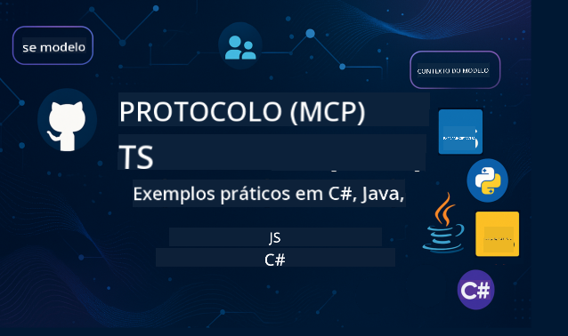

<!--
CO_OP_TRANSLATOR_METADATA:
{
  "original_hash": "2a21391378c12ecfef50f866329dfde0",
  "translation_date": "2025-05-17T05:23:30+00:00",
  "source_file": "README.md",
  "language_code": "pt"
}
-->

Siga estas etapas para começar a usar esses recursos:
1. **Faça um Fork do Repositório**: Clique 
2. **Clone o Repositório**: `git clone https://github.com/microsoft/mcp-for-beginners.git`
3. [**Entre no Discord do Microsoft Azure AI Foundry e conheça especialistas e outros desenvolvedores**](https://discord.com/invite/ByRwuEEgH4)

### 🌐 Suporte Multilíngue

#### Suportado via GitHub Action (Automatizado e Sempre Atualizado)
[Francês](../fr/README.md) | [Espanhol](../es/README.md) | [Alemão](../de/README.md) | [Russo](../ru/README.md) | [Árabe](../ar/README.md) | [Persa (Farsi)](../fa/README.md) | [Urdu](../ur/README.md) | [Chinês (Simplificado)](../zh/README.md) | [Chinês (Tradicional, Macau)](../mo/README.md) | [Chinês (Tradicional, Hong Kong)](../hk/README.md) | [Chinês (Tradicional, Taiwan)](../tw/README.md) | [Japonês](../ja/README.md) | [Coreano](../ko/README.md) | [Hindi](../hi/README.md) | [Bengali](../bn/README.md) | [Marathi](../mr/README.md) | [Nepali](../ne/README.md) | [Punjabi (Gurmukhi)](../pa/README.md) | [Português (Portugal)](./README.md) | [Português (Brasil)](../br/README.md) | [Italiano](../it/README.md) | [Polonês](../pl/README.md) | [Turco](../tr/README.md) | [Grego](../el/README.md) | [Tailandês](../th/README.md) | [Sueco](../sv/README.md) | [Dinamarquês](../da/README.md) | [Norueguês](../no/README.md) | [Finlandês](../fi/README.md) | [Holandês](../nl/README.md) | [Hebraico](../he/README.md) | [Vietnamita](../vi/README.md) | [Indonésio](../id/README.md) | [Malaio](../ms/README.md) | [Tagalo (Filipino)](../tl/README.md) | [Suaíli](../sw/README.md) | [Húngaro](../hu/README.md) | [Tcheco](../cs/README.md) | [Eslovaco](../sk/README.md) | [Romeno](../ro/README.md) | [Búlgaro](../bg/README.md) | [Sérvio (Cirílico)](../sr/README.md) | [Croata](../hr/README.md) | [Esloveno](../sl/README.md)
# 🚀 Guia Definitivo do Currículo do Protocolo de Contexto de Modelo (MCP) para Iniciantes

## **Aprenda MCP com Exemplos de Código Práticos em C#, Java, JavaScript, Python e TypeScript**

## 🧠 Visão Geral do Currículo do Protocolo de Contexto de Modelo

O **Protocolo de Contexto de Modelo (MCP)** é uma estrutura inovadora projetada para padronizar interações entre modelos de IA e aplicações cliente. Este currículo de código aberto oferece um caminho de aprendizado estruturado, completo com exemplos práticos de codificação e casos de uso do mundo real, em linguagens de programação populares, incluindo C#, Java, JavaScript, TypeScript e Python.

Seja você um desenvolvedor de IA, arquiteto de sistemas ou engenheiro de software, este guia é seu recurso abrangente para dominar os fundamentos do MCP e estratégias de implementação.

## 🔗 Recursos Oficiais do MCP

- 📘 [Documentação do MCP](https://modelcontextprotocol.io/) – Tutoriais detalhados e guias do usuário  
- 📜 [Especificação do MCP](https://spec.modelcontextprotocol.io/) – Arquitetura do protocolo e referências técnicas  
- 🧑‍💻 [Repositório GitHub do MCP](https://github.com/modelcontextprotocol) – SDKs de código aberto, ferramentas e exemplos de código  

## 🧭 Estrutura Completa do Currículo MCP

### 📌 [Introdução ao MCP](./00-Introduction/README.md)

- O que é o Protocolo de Contexto de Modelo?
- Por que a padronização é importante em pipelines de IA
- Casos de uso práticos e benefícios do MCP

### 🧩 [Conceitos Fundamentais Explicados](./01-CoreConcepts/README.md)

- Compreendendo a arquitetura cliente-servidor no MCP
- Componentes principais do protocolo: requisições, respostas e esquemas
- Padrões de troca de mensagens e dados no MCP

### 🔐 [Segurança no MCP](./02-Security/readme.md)

- Identificando ameaças de segurança em sistemas baseados em MCP
- Técnicas e melhores práticas para proteger implementações

### 🚀 [Começando com MCP](./03-GettingStarted/README.md)

- Configuração do ambiente e configuração
- Criando servidores e clientes MCP básicos
- Integrando MCP com aplicações existentes

#### 🧮 Projetos de Exemplo de Calculadora MCP:

  
<strong>Explore Implementações de Código por Linguagem</strong>

  - [Exemplo de Servidor MCP em C#](./03-GettingStarted/samples/csharp/README.md)
  - [Calculadora MCP em Java](./03-GettingStarted/samples/java/calculator/README.md)
  - [Demo MCP em JavaScript](./03-GettingStarted/samples/javascript/README.md)
  - [Servidor MCP em Python](../../03-GettingStarted/samples/python/mcp_calculator_server.py)
  - [Exemplo MCP em TypeScript](./03-GettingStarted/samples/typescript/README.md)

### 🛠️ [Implementação Prática](./04-PracticalImplementation/README.md)

- Usando SDKs em diferentes linguagens
- Depuração, teste e validação
- Criando templates de prompts e fluxos de trabalho reutilizáveis

#### 💡 Projetos Avançados de Calculadora MCP:

  
<strong>Explore Exemplos Avançados</strong>

  - [Exemplo Avançado em C#](./04-PracticalImplementation/samples/csharp/README.md)
  - [Exemplo de Aplicativo de Container em Java](./04-PracticalImplementation/samples/java/containerapp/README.md)
  - [Exemplo Avançado em JavaScript](./04-PracticalImplementation/samples/javascript/README.md)
  - [Implementação Complexa em Python](../../04-PracticalImplementation/samples/python/mcp_sample.py)
  - [Exemplo de Container em TypeScript](./04-PracticalImplementation/samples/typescript/README.md)

### 🎓 [Tópicos Avançados em MCP](./05-AdvancedTopics/README.md)

- Fluxos de trabalho de IA multimodal e extensibilidade
- Estratégias de escalonamento seguro
- MCP em ecossistemas empresariais

### 🌍 [Contribuições da Comunidade](./06-CommunityContributions/README.md)

- Como contribuir com código e documentação
- Colaboração via GitHub
- Melhorias e feedback impulsionados pela comunidade

### 📈 [Insights da Adoção Inicial](./07-CaseStudies/README.md)

- Implementações do mundo real e o que funcionou
- Construindo e implantando soluções baseadas em MCP
- Tendências e roteiro futuro

### 📏 [Melhores Práticas para MCP](./08-BestPractices/README.md)

- Ajuste de desempenho e otimização
- Projetando sistemas MCP tolerantes a falhas
- Estratégias de teste e resiliência

### 📊 [Estudos de Caso MCP](./09-CaseStudy/Readme.md)

- Mergulhos profundos em arquiteturas de solução MCP
- Modelos de implantação e dicas de integração
- Diagramas anotados e walkthroughs de projetos

## 🎯 Pré-requisitos para Aprender MCP

Para aproveitar ao máximo este currículo, você deve ter:

- Conhecimento básico de C#, Java ou Python
- Compreensão do modelo cliente-servidor e APIs
- (Opcional) Familiaridade com conceitos de aprendizado de máquina

## 🛠️ Como Usar Este Currículo de Forma Eficaz

Cada lição neste guia inclui:

1. Explicações claras dos conceitos do MCP  
2. Exemplos de código ao vivo em várias linguagens  
3. Exercícios para construir aplicações reais de MCP  
4. Recursos extras para alunos avançados  

## 📜 Informações de Licença

Este conteúdo é licenciado sob a **Licença MIT**. Para termos e condições, veja o [LICENSE](../../LICENSE).

## 🤝 Diretrizes de Contribuição

Este projeto acolhe contribuições e sugestões. A maioria das contribuições requer que você concorde com um
Acordo de Licença de Contribuidor (CLA) declarando que você tem o direito de, e realmente concede a nós
os direitos de usar sua contribuição. Para detalhes, visite <https://cla.opensource.microsoft.com>.

Quando você enviar uma pull request, um bot de CLA determinará automaticamente se você precisa fornecer
um CLA e decorará o PR apropriadamente (por exemplo, verificação de status, comentário). Basta seguir as instruções
fornecidas pelo bot. Você só precisará fazer isso uma vez em todos os repositórios que usam nosso CLA.

Este projeto adotou o [Código de Conduta de Código Aberto da Microsoft](https://opensource.microsoft.com/codeofconduct/).
Para mais informações, veja o [FAQ do Código de Conduta](https://opensource.microsoft.com/codeofconduct/faq/) ou
entre em contato com [opencode@microsoft.com](mailto:opencode@microsoft.com) com quaisquer perguntas ou comentários adicionais.

## ™️ Aviso de Marca Registrada

Este projeto pode conter marcas registradas ou logotipos de projetos, produtos ou serviços. O uso autorizado de marcas registradas ou logotipos da Microsoft está sujeito e deve seguir
as [Diretrizes de Marca & Branding da Microsoft](https://www.microsoft.com/legal/intellectualproperty/trademarks/usage/general).
O uso de marcas registradas ou logotipos da Microsoft em versões modificadas deste projeto não deve causar confusão ou implicar patrocínio da Microsoft.
Qualquer uso de marcas registradas ou logotipos de terceiros está sujeito às políticas desses terceiros.

**Aviso Legal**:
Este documento foi traduzido usando o serviço de tradução por IA [Co-op Translator](https://github.com/Azure/co-op-translator). Embora nos esforcemos para garantir a precisão, esteja ciente de que traduções automatizadas podem conter erros ou imprecisões. O documento original em seu idioma nativo deve ser considerado a fonte autoritária. Para informações críticas, recomenda-se a tradução profissional humana. Não nos responsabilizamos por quaisquer mal-entendidos ou interpretações errôneas decorrentes do uso desta tradução.