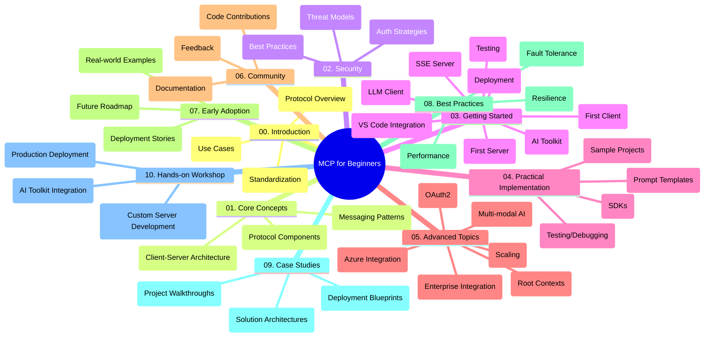

<!--
CO_OP_TRANSLATOR_METADATA:
{
  "original_hash": "a607d4febc94caee9a12b77795f7fc9a",
  "translation_date": "2025-06-11T16:42:19+00:00",
  "source_file": "study_guide.md",
  "language_code": "pt"
}
-->
# Model Context Protocol (MCP) para Iniciantes - Guia de Estudo

Este guia de estudo oferece uma visão geral da estrutura e do conteúdo do repositório para o currículo "Model Context Protocol (MCP) para Iniciantes". Use este guia para navegar no repositório de forma eficiente e aproveitar ao máximo os recursos disponíveis.

## Visão Geral do Repositório

O Model Context Protocol (MCP) é um framework padronizado para interações entre modelos de IA e aplicações clientes. Este repositório oferece um currículo completo com exemplos práticos em C#, Java, JavaScript, Python e TypeScript, voltado para desenvolvedores de IA, arquitetos de sistemas e engenheiros de software.

## Mapa Visual do Currículo

## Estrutura do Repositório

O repositório está organizado em dez seções principais, cada uma focada em diferentes aspectos do MCP:

1. **Introdução (00-Introduction/)**
   - Visão geral do Model Context Protocol
   - Por que a padronização é importante em pipelines de IA
   - Casos práticos e benefícios

2. **Conceitos Básicos (01-CoreConcepts/)**
   - Arquitetura cliente-servidor
   - Componentes principais do protocolo
   - Padrões de mensagens no MCP

3. **Segurança (02-Security/)**
   - Ameaças de segurança em sistemas baseados em MCP
   - Melhores práticas para proteger implementações
   - Estratégias de autenticação e autorização

4. **Primeiros Passos (03-GettingStarted/)**
   - Configuração do ambiente
   - Criando servidores e clientes MCP básicos
   - Integração com aplicações existentes
   - Subseções para primeiro servidor, primeiro cliente, cliente LLM, integração com VS Code, servidor SSE, AI Toolkit, testes e deploy

5. **Implementação Prática (04-PracticalImplementation/)**
   - Uso de SDKs em diferentes linguagens de programação
   - Técnicas de depuração, testes e validação
   - Criação de templates de prompt e fluxos reutilizáveis
   - Projetos de exemplo com casos de implementação

6. **Tópicos Avançados (05-AdvancedTopics/)**
   - Fluxos multimodais de IA e extensibilidade
   - Estratégias seguras de escalabilidade
   - MCP em ecossistemas corporativos
   - Tópicos especializados incluindo integração com Azure, multimodalidade, OAuth2, contextos raiz, roteamento, amostragem, escalabilidade, segurança, integração com buscas na web e streaming.

7. **Contribuições da Comunidade (06-CommunityContributions/)**
   - Como contribuir com código e documentação
   - Colaboração via GitHub
   - Melhorias e feedback orientados pela comunidade

8. **Lições da Adoção Inicial (07-LessonsfromEarlyAdoption/)**
   - Implementações reais e histórias de sucesso
   - Construção e deploy de soluções baseadas em MCP
   - Tendências e roadmap futuro

9. **Boas Práticas (08-BestPractices/)**
   - Ajuste de desempenho e otimização
   - Design de sistemas MCP tolerantes a falhas
   - Estratégias de teste e resiliência

10. **Estudos de Caso (09-CaseStudy/)**
    - Análises aprofundadas de arquiteturas MCP
    - Modelos de deploy e dicas de integração
    - Diagramas anotados e walkthroughs de projetos

11. **Workshop Prático (10-StreamliningAIWorkflowsBuildingAnMCPServerWithAIToolkit/)**
    - Workshop prático completo combinando MCP com o AI Toolkit da Microsoft para VS Code
    - Construção de aplicações inteligentes que conectam modelos de IA com ferramentas do mundo real
    - Módulos práticos cobrindo fundamentos, desenvolvimento de servidores customizados e estratégias de deploy em produção

## Projetos de Exemplo

O repositório inclui vários projetos de exemplo que demonstram a implementação do MCP em diferentes linguagens:

### Exemplos Básicos de Calculadora MCP
- Exemplo de servidor MCP em C#
- Calculadora MCP em Java
- Demo MCP em JavaScript
- Servidor MCP em Python
- Exemplo MCP em TypeScript

### Projetos Avançados de Calculadora MCP
- Exemplo avançado em C#
- Aplicação containerizada em Java
- Exemplo avançado em JavaScript
- Implementação complexa em Python
- Exemplo containerizado em TypeScript

## Recursos Adicionais

O repositório inclui recursos complementares:

- **Pasta de imagens**: Contém diagramas e ilustrações usadas ao longo do currículo
- **Traduções**: Suporte multilíngue com traduções automáticas da documentação
- **Recursos oficiais do MCP**:
  - [MCP Documentation](https://modelcontextprotocol.io/)
  - [MCP Specification](https://spec.modelcontextprotocol.io/)
  - [MCP GitHub Repository](https://github.com/modelcontextprotocol)

## Como Usar Este Repositório

1. **Aprendizado Sequencial**: Siga os capítulos na ordem (00 a 10) para uma experiência estruturada.
2. **Foco em Linguagem Específica**: Se preferir uma linguagem de programação, explore os diretórios de exemplos na sua linguagem favorita.
3. **Implementação Prática**: Comece pela seção "Primeiros Passos" para configurar o ambiente e criar seu primeiro servidor e cliente MCP.
4. **Exploração Avançada**: Depois de dominar o básico, aprofunde-se nos tópicos avançados para expandir seu conhecimento.
5. **Engajamento Comunitário**: Participe do [Azure AI Foundry Discord](https://discord.com/invite/ByRwuEEgH4) para se conectar com especialistas e outros desenvolvedores.

## Contribuindo

Este repositório está aberto a contribuições da comunidade. Consulte a seção Contribuições da Comunidade para orientações sobre como colaborar.

---

*Este guia de estudo foi criado em 11 de junho de 2025 e oferece uma visão geral do repositório até essa data. O conteúdo do repositório pode ter sido atualizado desde então.*

**Aviso Legal**:  
Este documento foi traduzido utilizando o serviço de tradução por IA [Co-op Translator](https://github.com/Azure/co-op-translator). Embora nos esforcemos para garantir a precisão, esteja ciente de que traduções automáticas podem conter erros ou imprecisões. O documento original em seu idioma nativo deve ser considerado a fonte autorizada. Para informações críticas, recomenda-se a tradução profissional humana. Não nos responsabilizamos por quaisquer mal-entendidos ou interpretações equivocadas decorrentes do uso desta tradução.