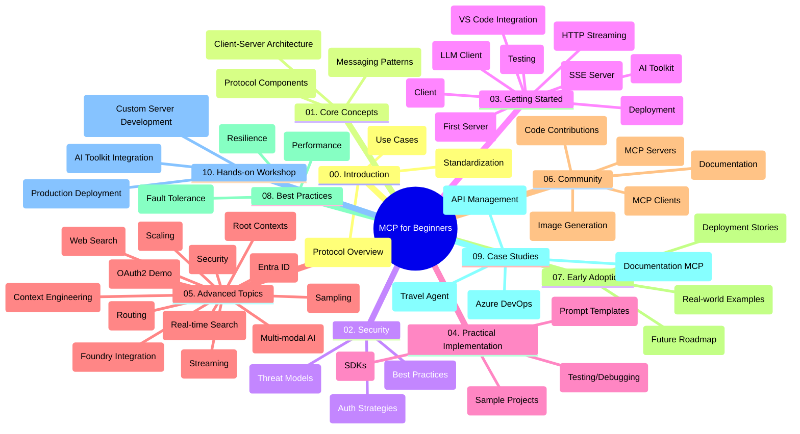

<!--
CO_OP_TRANSLATOR_METADATA:
{
  "original_hash": "77bfab7090f987a5b9fe078f50dbda13",
  "translation_date": "2025-07-16T21:52:03+00:00",
  "source_file": "study_guide.md",
  "language_code": "pt"
}
-->
# Model Context Protocol (MCP) para Iniciantes - Guia de Estudo

Este guia de estudo oferece uma visão geral da estrutura e conteúdo do repositório para o currículo "Model Context Protocol (MCP) para Iniciantes". Utilize este guia para navegar pelo repositório de forma eficiente e tirar o máximo proveito dos recursos disponíveis.

## Visão Geral do Repositório

O Model Context Protocol (MCP) é um framework padronizado para interações entre modelos de IA e aplicações cliente. Inicialmente criado pela Anthropic, o MCP é agora mantido pela comunidade mais ampla do MCP através da organização oficial no GitHub. Este repositório oferece um currículo abrangente com exemplos práticos de código em C#, Java, JavaScript, Python e TypeScript, destinado a desenvolvedores de IA, arquitetos de sistemas e engenheiros de software.

## Mapa Visual do Currículo

## Estrutura do Repositório

O repositório está organizado em dez secções principais, cada uma focada em diferentes aspetos do MCP:

1. **Introdução (00-Introduction/)**
   - Visão geral do Model Context Protocol
   - Por que a padronização é importante em pipelines de IA
   - Casos práticos e benefícios

2. **Conceitos Fundamentais (01-CoreConcepts/)**
   - Arquitetura cliente-servidor
   - Componentes chave do protocolo
   - Padrões de mensagens no MCP

3. **Segurança (02-Security/)**
   - Ameaças de segurança em sistemas baseados em MCP
   - Melhores práticas para garantir a segurança das implementações
   - Estratégias de autenticação e autorização

4. **Primeiros Passos (03-GettingStarted/)**
   - Configuração e preparação do ambiente
   - Criação de servidores e clientes MCP básicos
   - Integração com aplicações existentes
   - Inclui secções para:
     - Primeira implementação de servidor
     - Desenvolvimento de cliente
     - Integração de cliente LLM
     - Integração com VS Code
     - Servidor Server-Sent Events (SSE)
     - Streaming HTTP
     - Integração com AI Toolkit
     - Estratégias de testes
     - Diretrizes de deployment

5. **Implementação Prática (04-PracticalImplementation/)**
   - Utilização de SDKs em várias linguagens de programação
   - Técnicas de debugging, testes e validação
   - Criação de templates reutilizáveis de prompts e workflows
   - Projetos de exemplo com casos de implementação

6. **Tópicos Avançados (05-AdvancedTopics/)**
   - Técnicas de engenharia de contexto
   - Integração com agentes Foundry
   - Workflows multimodais de IA
   - Demonstrações de autenticação OAuth2
   - Capacidades de pesquisa em tempo real
   - Streaming em tempo real
   - Implementação de contextos raiz
   - Estratégias de routing
   - Técnicas de sampling
   - Abordagens de escalabilidade
   - Considerações de segurança
   - Integração de segurança Entra ID
   - Integração de pesquisa web

7. **Contribuições da Comunidade (06-CommunityContributions/)**
   - Como contribuir com código e documentação
   - Colaboração via GitHub
   - Melhorias e feedback impulsionados pela comunidade
   - Utilização de vários clientes MCP (Claude Desktop, Cline, VSCode)
   - Trabalho com servidores MCP populares, incluindo geração de imagens

8. **Lições da Adoção Inicial (07-LessonsfromEarlyAdoption/)**
   - Implementações reais e histórias de sucesso
   - Construção e deployment de soluções baseadas em MCP
   - Tendências e roadmap futuro

9. **Boas Práticas (08-BestPractices/)**
   - Otimização e tuning de performance
   - Design de sistemas MCP tolerantes a falhas
   - Estratégias de testes e resiliência

10. **Estudos de Caso (09-CaseStudy/)**
    - Estudo de caso: integração com Azure API Management
    - Estudo de caso: implementação de agente de viagens
    - Estudo de caso: integração Azure DevOps com YouTube
    - Exemplos de implementação com documentação detalhada

11. **Workshop Prático (10-StreamliningAIWorkflowsBuildingAnMCPServerWithAIToolkit/)**
    - Workshop prático abrangente combinando MCP com AI Toolkit
    - Construção de aplicações inteligentes que ligam modelos de IA a ferramentas do mundo real
    - Módulos práticos cobrindo fundamentos, desenvolvimento de servidores personalizados e estratégias de deployment em produção
    - Abordagem de aprendizagem baseada em laboratórios com instruções passo a passo

## Recursos Adicionais

O repositório inclui recursos de apoio:

- **Pasta de imagens**: Contém diagramas e ilustrações usados ao longo do currículo
- **Traduções**: Suporte multilíngue com traduções automáticas da documentação
- **Recursos Oficiais MCP**:
  - [MCP Documentation](https://modelcontextprotocol.io/)
  - [MCP Specification](https://spec.modelcontextprotocol.io/)
  - [MCP GitHub Repository](https://github.com/modelcontextprotocol)

## Como Usar Este Repositório

1. **Aprendizagem Sequencial**: Siga os capítulos por ordem (00 a 10) para uma experiência de aprendizagem estruturada.
2. **Foco em Linguagem Específica**: Se estiver interessado numa linguagem de programação específica, explore as pastas de exemplos para implementações na sua linguagem preferida.
3. **Implementação Prática**: Comece pela secção "Primeiros Passos" para configurar o ambiente e criar o seu primeiro servidor e cliente MCP.
4. **Exploração Avançada**: Quando estiver confortável com o básico, aprofunde-se nos tópicos avançados para expandir o seu conhecimento.
5. **Envolvimento Comunitário**: Junte-se à comunidade MCP através das discussões no GitHub e canais Discord para conectar-se com especialistas e outros desenvolvedores.

## Clientes e Ferramentas MCP

O currículo cobre vários clientes e ferramentas MCP:

1. **Clientes Oficiais**:
   - Claude Desktop
   - Claude no VSCode
   - Claude API

2. **Clientes da Comunidade**:
   - Cline (baseado em terminal)
   - Cursor (editor de código)
   - ChatMCP
   - Windsurf

3. **Ferramentas de Gestão MCP**:
   - MCP CLI
   - MCP Manager
   - MCP Linker
   - MCP Router

## Servidores MCP Populares

O repositório apresenta vários servidores MCP, incluindo:

1. **Servidores de Referência Oficiais**:
   - Filesystem
   - Fetch
   - Memory
   - Sequential Thinking

2. **Geração de Imagens**:
   - Azure OpenAI DALL-E 3
   - Stable Diffusion WebUI
   - Replicate

3. **Ferramentas de Desenvolvimento**:
   - Git MCP
   - Terminal Control
   - Code Assistant

4. **Servidores Especializados**:
   - Salesforce
   - Microsoft Teams
   - Jira & Confluence

## Contribuir

Este repositório acolhe contribuições da comunidade. Consulte a secção Contribuições da Comunidade para orientações sobre como contribuir eficazmente para o ecossistema MCP.

## Registo de Alterações

| Data | Alterações |
|------|------------|
| 16 de julho de 2025 | - Atualizada a estrutura do repositório para refletir o conteúdo atual - Adicionada secção Clientes e Ferramentas MCP - Adicionada secção Servidores MCP Populares - Atualizado o Mapa Visual do Currículo com todos os tópicos atuais - Reforçada a secção Tópicos Avançados com todas as áreas especializadas - Atualizados os Estudos de Caso para refletir exemplos reais - Clarificada a origem do MCP como criado pela Anthropic |
| 11 de junho de 2025 | - Criação inicial do guia de estudo - Adicionado Mapa Visual do Currículo - Estrutura do repositório delineada - Incluídos projetos de exemplo e recursos adicionais |

---

*Este guia de estudo foi atualizado a 16 de julho de 2025 e oferece uma visão geral do repositório até essa data. O conteúdo do repositório pode ser atualizado após esta data.*

**Aviso Legal**:  
Este documento foi traduzido utilizando o serviço de tradução automática [Co-op Translator](https://github.com/Azure/co-op-translator). Embora nos esforcemos pela precisão, por favor tenha em conta que traduções automáticas podem conter erros ou imprecisões. O documento original na sua língua nativa deve ser considerado a fonte autorizada. Para informações críticas, recomenda-se tradução profissional humana. Não nos responsabilizamos por quaisquer mal-entendidos ou interpretações incorretas decorrentes da utilização desta tradução.