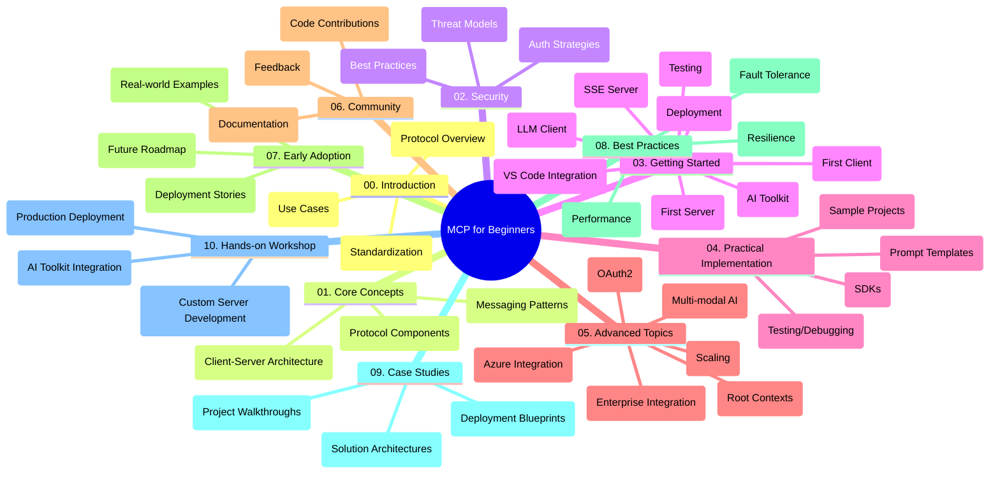

<!--
CO_OP_TRANSLATOR_METADATA:
{
  "original_hash": "a607d4febc94caee9a12b77795f7fc9a",
  "translation_date": "2025-07-13T15:13:22+00:00",
  "source_file": "study_guide.md",
  "language_code": "pt"
}
-->
# Model Context Protocol (MCP) para Iniciantes - Guia de Estudo

Este guia de estudo oferece uma visão geral da estrutura e conteúdo do repositório para o currículo "Model Context Protocol (MCP) para Iniciantes". Utilize este guia para navegar pelo repositório de forma eficiente e tirar o máximo proveito dos recursos disponíveis.

## Visão Geral do Repositório

O Model Context Protocol (MCP) é um framework padronizado para interações entre modelos de IA e aplicações cliente. Este repositório fornece um currículo abrangente com exemplos práticos de código em C#, Java, JavaScript, Python e TypeScript, destinado a desenvolvedores de IA, arquitetos de sistemas e engenheiros de software.

## Mapa Visual do Currículo

## Estrutura do Repositório

O repositório está organizado em dez secções principais, cada uma focada em diferentes aspetos do MCP:

1. **Introdução (00-Introduction/)**
   - Visão geral do Model Context Protocol
   - Por que a padronização é importante em pipelines de IA
   - Casos de uso práticos e benefícios

2. **Conceitos Fundamentais (01-CoreConcepts/)**
   - Arquitetura cliente-servidor
   - Componentes chave do protocolo
   - Padrões de mensagens no MCP

3. **Segurança (02-Security/)**
   - Ameaças de segurança em sistemas baseados em MCP
   - Melhores práticas para garantir implementações seguras
   - Estratégias de autenticação e autorização

4. **Primeiros Passos (03-GettingStarted/)**
   - Configuração e preparação do ambiente
   - Criação de servidores e clientes MCP básicos
   - Integração com aplicações existentes
   - Subsecções para primeiro servidor, primeiro cliente, cliente LLM, integração com VS Code, servidor SSE, AI Toolkit, testes e deployment

5. **Implementação Prática (04-PracticalImplementation/)**
   - Utilização de SDKs em várias linguagens de programação
   - Técnicas de debugging, testes e validação
   - Criação de templates reutilizáveis de prompts e workflows
   - Projetos de exemplo com casos de implementação

6. **Tópicos Avançados (05-AdvancedTopics/)**
   - Workflows multimodais de IA e extensibilidade
   - Estratégias seguras de escalabilidade
   - MCP em ecossistemas empresariais
   - Tópicos especializados incluindo integração com Azure, multimodalidade, OAuth2, contextos raiz, routing, sampling, escalabilidade, segurança, integração com pesquisa web e streaming.

7. **Contribuições da Comunidade (06-CommunityContributions/)**
   - Como contribuir com código e documentação
   - Colaboração via GitHub
   - Melhorias e feedback impulsionados pela comunidade

8. **Lições da Adoção Inicial (07-LessonsfromEarlyAdoption/)**
   - Implementações reais e histórias de sucesso
   - Construção e deployment de soluções baseadas em MCP
   - Tendências e roadmap futuro

9. **Boas Práticas (08-BestPractices/)**
   - Otimização e tuning de performance
   - Design de sistemas MCP tolerantes a falhas
   - Estratégias de testes e resiliência

10. **Estudos de Caso (09-CaseStudy/)**
    - Análises detalhadas de arquiteturas de soluções MCP
    - Planos de deployment e dicas de integração
    - Diagramas anotados e walkthroughs de projetos

11. **Workshop Prático (10-StreamliningAIWorkflowsBuildingAnMCPServerWithAIToolkit/)**
    - Workshop prático abrangente combinando MCP com o AI Toolkit da Microsoft para VS Code
    - Construção de aplicações inteligentes que ligam modelos de IA a ferramentas do mundo real
    - Módulos práticos cobrindo fundamentos, desenvolvimento de servidores personalizados e estratégias de deployment em produção

## Projetos de Exemplo

O repositório inclui vários projetos de exemplo que demonstram a implementação do MCP em diferentes linguagens de programação:

### Exemplos Básicos de Calculadora MCP
- Exemplo de Servidor MCP em C#
- Calculadora MCP em Java
- Demo MCP em JavaScript
- Servidor MCP em Python
- Exemplo MCP em TypeScript

### Projetos Avançados de Calculadora MCP
- Exemplo Avançado em C#
- Aplicação Container Java
- Exemplo Avançado em JavaScript
- Implementação Complexa em Python
- Exemplo Container em TypeScript

## Recursos Adicionais

O repositório inclui recursos de apoio:

- **Pasta de Imagens**: Contém diagramas e ilustrações usados ao longo do currículo
- **Traduções**: Suporte multilíngue com traduções automáticas da documentação
- **Recursos Oficiais MCP**:
  - [MCP Documentation](https://modelcontextprotocol.io/)
  - [MCP Specification](https://spec.modelcontextprotocol.io/)
  - [MCP GitHub Repository](https://github.com/modelcontextprotocol)

## Como Usar Este Repositório

1. **Aprendizagem Sequencial**: Siga os capítulos por ordem (00 a 10) para uma experiência de aprendizagem estruturada.
2. **Foco em Linguagem Específica**: Se estiver interessado numa linguagem de programação específica, explore as pastas de exemplos para implementações na sua linguagem preferida.
3. **Implementação Prática**: Comece pela secção "Primeiros Passos" para configurar o ambiente e criar o seu primeiro servidor e cliente MCP.
4. **Exploração Avançada**: Quando estiver confortável com o básico, aprofunde-se nos tópicos avançados para expandir o seu conhecimento.
5. **Envolvimento com a Comunidade**: Junte-se ao [Azure AI Foundry Discord](https://discord.com/invite/ByRwuEEgH4) para conectar-se com especialistas e outros desenvolvedores.

## Contribuir

Este repositório aceita contribuições da comunidade. Consulte a secção Contribuições da Comunidade para orientações sobre como contribuir.

---

*Este guia de estudo foi criado a 11 de junho de 2025 e oferece uma visão geral do repositório até essa data. O conteúdo do repositório pode ter sido atualizado desde então.*

**Aviso Legal**:  
Este documento foi traduzido utilizando o serviço de tradução por IA [Co-op Translator](https://github.com/Azure/co-op-translator). Embora nos esforcemos pela precisão, por favor tenha em conta que traduções automáticas podem conter erros ou imprecisões. O documento original na sua língua nativa deve ser considerado a fonte autorizada. Para informações críticas, recomenda-se tradução profissional humana. Não nos responsabilizamos por quaisquer mal-entendidos ou interpretações erradas decorrentes da utilização desta tradução.