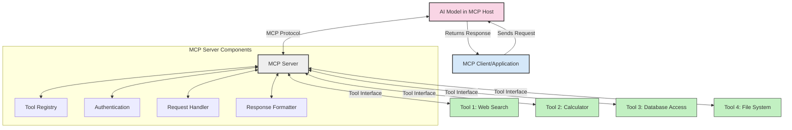
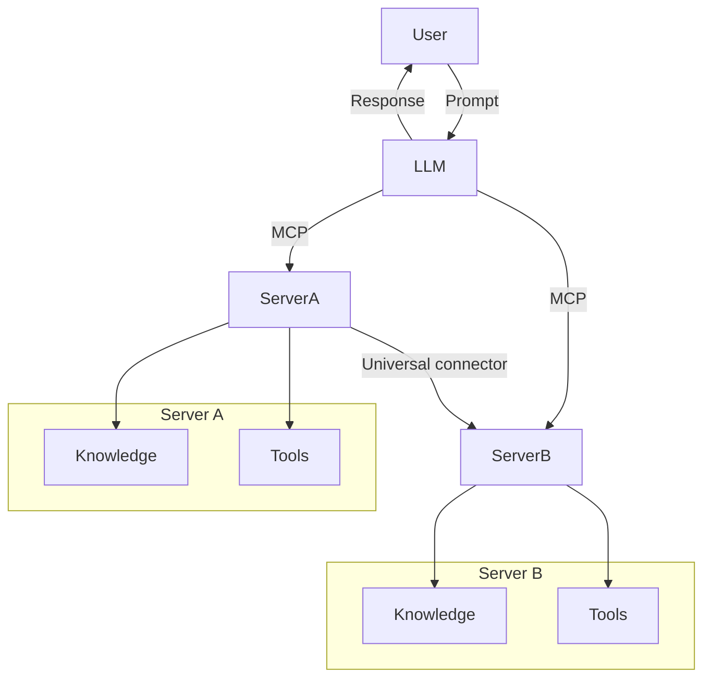

<!--
CO_OP_TRANSLATOR_METADATA:
{
  "original_hash": "cf84f987e1b771d2201408e110dfd2db",
  "translation_date": "2025-05-20T18:07:29+00:00",
  "source_file": "00-Introduction/README.md",
  "language_code": "ro"
}
-->
# Introducere în Model Context Protocol (MCP): De ce contează pentru aplicațiile AI scalabile

Aplicațiile generative AI reprezintă un mare pas înainte, deoarece permit utilizatorului să interacționeze cu aplicația folosind prompturi în limbaj natural. Totuși, pe măsură ce se investesc mai mult timp și resurse în astfel de aplicații, vrei să te asiguri că poți integra cu ușurință funcționalități și resurse astfel încât să fie ușor de extins, ca aplicația ta să poată gestiona mai multe modele folosite simultan și complexitatea lor. Pe scurt, construirea aplicațiilor Gen AI este ușoară la început, dar pe măsură ce acestea cresc și devin mai complexe, trebuie să începi să definești o arhitectură și cel mai probabil vei avea nevoie să te bazezi pe un standard pentru a te asigura că aplicațiile tale sunt construite într-un mod consecvent. Aici intervine MCP pentru a organiza lucrurile și a oferi un standard.

---

## **🔍 Ce este Model Context Protocol (MCP)?**

**Model Context Protocol (MCP)** este o **interfață deschisă și standardizată** care permite modelelor mari de limbaj (LLM-uri) să interacționeze fără probleme cu unelte externe, API-uri și surse de date. Oferă o arhitectură consecventă pentru a extinde funcționalitatea modelelor AI dincolo de datele lor de antrenament, permițând sisteme AI mai inteligente, scalabile și mai receptive.

---

## **🎯 De ce contează standardizarea în AI**

Pe măsură ce aplicațiile generative AI devin mai complexe, este esențial să adoptăm standarde care să asigure **scalabilitate, extensibilitate** și **mentenabilitate**. MCP răspunde acestor nevoi prin:

- Unificarea integrărilor model-unealtă
- Reducerea soluțiilor personalizate fragile și unice
- Permițând coexistenta mai multor modele într-un singur ecosistem

---

## **📚 Obiective de învățare**

La finalul acestui articol, vei putea:

- Defini **Model Context Protocol (MCP)** și cazurile sale de utilizare
- Înțelege cum MCP standardizează comunicarea model-unealtă
- Identifica componentele de bază ale arhitecturii MCP
- Explora aplicații reale ale MCP în mediul enterprise și în dezvoltare

---

## **💡 De ce Model Context Protocol (MCP) este un factor decisiv**

### **🔗 MCP rezolvă fragmentarea în interacțiunile AI**

Înainte de MCP, integrarea modelelor cu uneltele necesita:

- Cod personalizat pentru fiecare pereche unealtă-model
- API-uri ne-standard pentru fiecare furnizor
- Rupturi frecvente din cauza actualizărilor
- Scalabilitate slabă odată cu creșterea numărului de unelte

### **✅ Beneficiile standardizării MCP**

| **Beneficiu**            | **Descriere**                                                                 |
|--------------------------|-------------------------------------------------------------------------------|
| Interoperabilitate       | LLM-urile funcționează fără probleme cu unelte de la diferiți furnizori      |
| Consistență              | Comportament uniform pe platforme și unelte                                   |
| Reutilizabilitate        | Uneltele construite o dată pot fi folosite în proiecte și sisteme multiple    |
| Dezvoltare accelerată    | Reduce timpul de dezvoltare prin utilizarea interfețelor standard, plug-and-play |

---

## **🧱 Prezentare generală a arhitecturii MCP la nivel înalt**

MCP urmează un **model client-server**, unde:

- **MCP Hosts** rulează modelele AI
- **MCP Clients** inițiază cereri
- **MCP Servers** oferă context, unelte și capabilități

### **Componente cheie:**

- **Resources** – date statice sau dinamice pentru modele  
- **Prompts** – fluxuri de lucru predefinite pentru generare ghidată  
- **Tools** – funcții executabile precum căutare, calcule  
- **Sampling** – comportament agentic prin interacțiuni recursive

---

## Cum funcționează MCP Servers

Serverele MCP funcționează astfel:

- **Fluxul cererii**:  
    1. MCP Client trimite o cerere către Modelul AI care rulează pe un MCP Host.  
    2. Modelul AI identifică când are nevoie de unelte sau date externe.  
    3. Modelul comunică cu MCP Server folosind protocolul standardizat.

- **Funcționalități MCP Server**:  
    - Registrul uneltelor: Menține un catalog cu uneltele disponibile și capabilitățile lor.  
    - Autentificare: Verifică permisiunile pentru accesul la unelte.  
    - Gestionarea cererilor: Procesează cererile de unelte venite de la model.  
    - Formatarea răspunsului: Structurează rezultatele uneltelor într-un format pe care modelul îl poate înțelege.

- **Executarea uneltelor**:  
    - Serverul direcționează cererile către uneltele externe potrivite  
    - Uneltele își execută funcțiile specializate (căutare, calcul, interogări în baze de date etc.)  
    - Rezultatele sunt returnate modelului într-un format consecvent.

- **Finalizarea răspunsului**:  
    - Modelul AI încorporează rezultatele uneltelor în răspunsul său.  
    - Răspunsul final este trimis înapoi aplicației client.

## 👨‍💻 Cum să construiești un MCP Server (cu exemple)

Serverele MCP îți permit să extinzi capabilitățile LLM oferind date și funcționalitate.

Gata să încerci? Iată exemple de creare a unui MCP server simplu în diferite limbaje:

- **Exemplu Python**: https://github.com/modelcontextprotocol/python-sdk

- **Exemplu TypeScript**: https://github.com/modelcontextprotocol/typescript-sdk

- **Exemplu Java**: https://github.com/modelcontextprotocol/java-sdk

- **Exemplu C#/.NET**: https://github.com/modelcontextprotocol/csharp-sdk

## 🌍 Cazuri reale de utilizare MCP

MCP permite o gamă largă de aplicații prin extinderea capabilităților AI:

| **Aplicație**               | **Descriere**                                                                 |
|----------------------------|-------------------------------------------------------------------------------|
| Integrarea datelor enterprise | Conectează LLM-uri la baze de date, CRM-uri sau unelte interne              |
| Sisteme AI agentice         | Permite agenților autonomi acces la unelte și fluxuri decizionale             |
| Aplicații multimodale       | Combină unelte text, imagine și audio într-o singură aplicație AI unificată  |
| Integrare date în timp real | Adaugă date live în interacțiunile AI pentru rezultate mai precise și actuale|

### 🧠 MCP = Standard universal pentru interacțiunile AI

Model Context Protocol (MCP) acționează ca un standard universal pentru interacțiunile AI, la fel cum USB-C a standardizat conexiunile fizice pentru dispozitive. În lumea AI, MCP oferă o interfață consecventă, permițând modelelor (client) să se integreze fără probleme cu unelte și furnizori de date externi (servere). Astfel, elimină nevoia unor protocoale diverse și personalizate pentru fiecare API sau sursă de date.

Conform MCP, o unealtă compatibilă (numită MCP server) urmează un standard unificat. Aceste servere pot lista uneltele sau acțiunile oferite și execută acele acțiuni când sunt solicitate de un agent AI. Platformele de agenți AI care suportă MCP pot descoperi uneltele disponibile pe servere și le pot invoca prin acest protocol standard.

### 💡 Facilitează accesul la cunoștințe

Pe lângă oferirea de unelte, MCP facilitează și accesul la cunoștințe. Permite aplicațiilor să ofere context modelelor mari de limbaj (LLM) prin conectarea lor la diverse surse de date. De exemplu, un MCP server ar putea reprezenta un depozit de documente al unei companii, permițând agenților să preia informații relevante la cerere. Un alt server ar putea gestiona acțiuni specifice, cum ar fi trimiterea de emailuri sau actualizarea înregistrărilor. Din perspectiva agentului, acestea sunt doar unelte pe care le poate folosi — unele returnează date (context de cunoștințe), iar altele execută acțiuni. MCP gestionează eficient ambele.

Un agent care se conectează la un MCP server învață automat capabilitățile disponibile și datele accesibile printr-un format standard. Această standardizare permite disponibilitatea dinamică a uneltelor. De exemplu, adăugarea unui nou MCP server în sistemul agentului face ca funcțiile sale să fie imediat utilizabile, fără a necesita personalizări suplimentare ale instrucțiunilor agentului.

Această integrare simplificată se aliniază cu fluxul descris în diagrama mermaid, unde serverele oferă atât unelte, cât și cunoștințe, asigurând o colaborare fără întreruperi între sisteme.

### 👉 Exemplu: Soluție agent scalabilă

## 🔐 Beneficii practice ale MCP

Iată beneficiile practice ale utilizării MCP:

- **Actualitate**: Modelele pot accesa informații actualizate dincolo de datele lor de antrenament  
- **Extinderea capabilităților**: Modelele pot folosi unelte specializate pentru sarcini pentru care nu au fost antrenate  
- **Reducerea halucinațiilor**: Sursele externe de date oferă o bază factuală  
- **Confidențialitate**: Datele sensibile pot rămâne în medii securizate, fără a fi încorporate în prompturi

## 📌 Concluzii cheie

Următoarele sunt concluziile cheie pentru utilizarea MCP:

- **MCP** standardizează modul în care modelele AI interacționează cu uneltele și datele  
- Promovează **extensibilitatea, consistența și interoperabilitatea**  
- MCP ajută la **reducerea timpului de dezvoltare, creșterea fiabilității și extinderea capabilităților modelelor**  
- Arhitectura client-server **permite aplicații AI flexibile și extensibile**

## 🧠 Exercițiu

Gândește-te la o aplicație AI pe care dorești să o construiești.

- Ce **unelte sau date externe** ar putea să-i îmbunătățească capabilitățile?  
- Cum ar putea MCP să facă integrarea **mai simplă și mai sigură**?

## Resurse suplimentare

- [MCP GitHub Repository](https://github.com/modelcontextprotocol)

## Ce urmează

Următorul: [Chapter 1: Core Concepts](/01-CoreConcepts/README.md)

**Declinare a responsabilității**:  
Acest document a fost tradus folosind serviciul de traducere AI [Co-op Translator](https://github.com/Azure/co-op-translator). Deși ne străduim pentru acuratețe, vă rugăm să rețineți că traducerile automate pot conține erori sau inexactități. Documentul original în limba sa nativă trebuie considerat sursa autoritară. Pentru informații critice, se recomandă traducerea profesională realizată de un specialist uman. Nu ne asumăm responsabilitatea pentru eventualele neînțelegeri sau interpretări greșite care pot apărea în urma utilizării acestei traduceri.