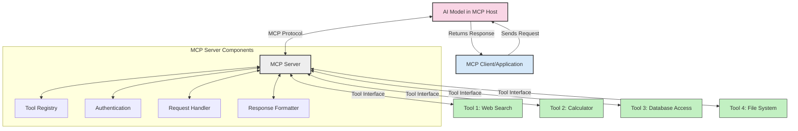
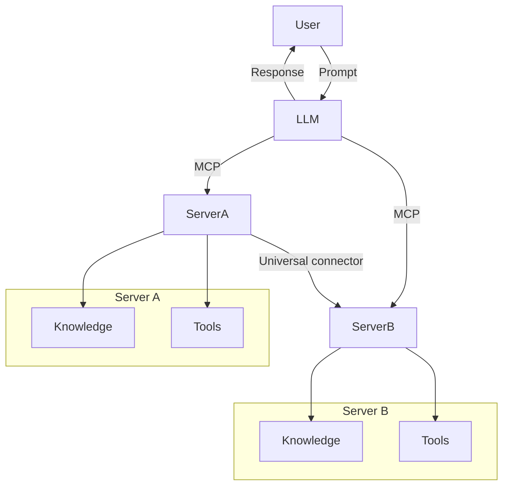

<!--
CO_OP_TRANSLATOR_METADATA:
{
  "original_hash": "1d88dee994dcbb3fa52c271d0c0817b5",
  "translation_date": "2025-05-20T22:28:05+00:00",
  "source_file": "00-Introduction/README.md",
  "language_code": "ro"
}
-->
# Introducere în Model Context Protocol (MCP): De ce contează pentru aplicațiile AI scalabile

Aplicațiile AI generative reprezintă un pas important înainte, deoarece permit utilizatorului să interacționeze cu aplicația folosind prompturi în limbaj natural. Totuși, pe măsură ce se investesc mai mult timp și resurse în astfel de aplicații, vrei să te asiguri că poți integra cu ușurință funcționalități și resurse într-un mod care să permită extinderea facilă, ca aplicația ta să suporte utilizarea mai multor modele și să gestioneze diverse particularități ale acestora. Pe scurt, dezvoltarea aplicațiilor Gen AI este simplă la început, dar pe măsură ce acestea cresc și devin mai complexe, este necesar să definești o arhitectură și probabil vei avea nevoie să te bazezi pe un standard pentru a asigura o construcție coerentă a aplicațiilor. Aici intervine MCP, care organizează lucrurile și oferă un standard.

---

## **🔍 Ce este Model Context Protocol (MCP)?**

**Model Context Protocol (MCP)** este o **interfață deschisă și standardizată** care permite modelelor de limbaj mari (LLM) să interacționeze fără probleme cu instrumente externe, API-uri și surse de date. Oferă o arhitectură consistentă pentru a extinde funcționalitatea modelelor AI dincolo de datele lor de antrenament, facilitând sisteme AI mai inteligente, scalabile și mai receptive.

---

## **🎯 De ce este importantă standardizarea în AI**

Pe măsură ce aplicațiile AI generative devin mai complexe, este esențial să adopți standarde care să asigure **scalabilitate, extensibilitate** și **mentenanță**. MCP răspunde acestor nevoi prin:

- Unificarea integrărilor model-instrument
- Reducerea soluțiilor personalizate fragile și unice
- Permițând coexistarea mai multor modele într-un singur ecosistem

---

## **📚 Obiective de învățare**

La finalul acestui articol, vei putea:

- Defini **Model Context Protocol (MCP)** și cazurile sale de utilizare
- Înțelege cum MCP standardizează comunicarea model-instrument
- Identifica componentele principale ale arhitecturii MCP
- Explora aplicații reale ale MCP în contexte enterprise și de dezvoltare

---

## **💡 De ce Model Context Protocol (MCP) este un schimbător de joc**

### **🔗 MCP rezolvă fragmentarea în interacțiunile AI**

Înainte de MCP, integrarea modelelor cu instrumentele necesita:

- Cod personalizat pentru fiecare pereche model-instrument
- API-uri non-standard pentru fiecare furnizor
- Defecțiuni frecvente din cauza actualizărilor
- Scalabilitate slabă pe măsură ce numărul de instrumente crește

### **✅ Beneficiile standardizării MCP**

| **Beneficiu**            | **Descriere**                                                                   |
|--------------------------|--------------------------------------------------------------------------------|
| Interoperabilitate       | LLM-urile funcționează fără probleme cu instrumente de la diferiți furnizori  |
| Consistență              | Comportament uniform pe platforme și instrumente                              |
| Reutilizare              | Instrumentele construite o dată pot fi folosite în mai multe proiecte și sisteme |
| Dezvoltare accelerată    | Reducerea timpului de dezvoltare prin folosirea interfețelor standardizate, plug-and-play |

---

## **🧱 Prezentare generală a arhitecturii MCP la nivel înalt**

MCP urmează un **model client-server**, unde:

- **MCP Hosts** rulează modelele AI
- **MCP Clients** inițiază cereri
- **MCP Servers** oferă context, instrumente și capabilități

### **Componente cheie:**

- **Resurse** – date statice sau dinamice pentru modele  
- **Prompturi** – fluxuri de lucru predefinite pentru generare ghidată  
- **Instrumente** – funcții executabile precum căutare, calcule  
- **Sampling** – comportament agentic prin interacțiuni recursive

---

## Cum funcționează MCP Servers

Serverele MCP funcționează astfel:

- **Fluxul cererii**:  
    1. MCP Client trimite o cerere către Modelul AI care rulează într-un MCP Host.  
    2. Modelul AI identifică momentul în care are nevoie de instrumente sau date externe.  
    3. Modelul comunică cu MCP Server folosind protocolul standardizat.

- **Funcționalitatea MCP Server**:  
    - Registrul instrumentelor: menține un catalog al instrumentelor disponibile și capabilitățile acestora.  
    - Autentificare: verifică permisiunile pentru accesul la instrumente.  
    - Gestionarea cererilor: procesează cererile de instrumente primite de la model.  
    - Formatarea răspunsului: structurează ieșirile instrumentelor într-un format pe care modelul îl poate înțelege.

- **Executarea instrumentelor**:  
    - Serverul direcționează cererile către instrumentele externe potrivite  
    - Instrumentele execută funcțiile specializate (căutare, calcul, interogări baze de date etc.)  
    - Rezultatele sunt returnate modelului într-un format consistent.

- **Finalizarea răspunsului**:  
    - Modelul AI încorporează rezultatele instrumentelor în răspunsul său.  
    - Răspunsul final este trimis înapoi aplicației client.

## 👨‍💻 Cum să construiești un MCP Server (cu exemple)

Serverele MCP îți permit să extinzi capabilitățile LLM prin furnizarea de date și funcționalități.

Ești gata să încerci? Iată exemple de creare a unui server MCP simplu în diferite limbaje:

- **Exemplu Python**: https://github.com/modelcontextprotocol/python-sdk

- **Exemplu TypeScript**: https://github.com/modelcontextprotocol/typescript-sdk

- **Exemplu Java**: https://github.com/modelcontextprotocol/java-sdk

- **Exemplu C#/.NET**: https://github.com/modelcontextprotocol/csharp-sdk

## 🌍 Cazuri reale de utilizare pentru MCP

MCP permite o gamă largă de aplicații prin extinderea capabilităților AI:

| **Aplicație**               | **Descriere**                                                                 |
|----------------------------|-------------------------------------------------------------------------------|
| Integrarea datelor enterprise | Conectează LLM-uri la baze de date, CRM-uri sau instrumente interne          |
| Sisteme AI agentice         | Permite agenților autonomi acces la instrumente și fluxuri decizionale       |
| Aplicații multimodale       | Combină instrumente text, imagine și audio într-o singură aplicație AI unificată |
| Integrare date în timp real | Adaugă date live în interacțiunile AI pentru rezultate mai precise și actualizate |

### 🧠 MCP = Standard universal pentru interacțiunile AI

Model Context Protocol (MCP) funcționează ca un standard universal pentru interacțiunile AI, similar modului în care USB-C a standardizat conexiunile fizice pentru dispozitive. În lumea AI, MCP oferă o interfață consistentă, permițând modelelor (clienți) să se integreze fără probleme cu instrumente și furnizori de date externi (servere). Aceasta elimină necesitatea unor protocoale diverse și personalizate pentru fiecare API sau sursă de date.

Sub MCP, un instrument compatibil (numit MCP server) respectă un standard unificat. Aceste servere pot lista instrumentele sau acțiunile pe care le oferă și pot executa acele acțiuni când sunt solicitate de un agent AI. Platformele de agenți AI care suportă MCP pot descoperi instrumentele disponibile de la servere și le pot invoca prin acest protocol standard.

### 💡 Facilitează accesul la cunoștințe

Pe lângă oferirea de instrumente, MCP facilitează și accesul la cunoștințe. Permite aplicațiilor să ofere context modelelor mari de limbaj (LLM) prin conectarea acestora la diverse surse de date. De exemplu, un MCP server poate reprezenta un depozit de documente al unei companii, permițând agenților să acceseze informații relevante la cerere. Un alt server poate gestiona acțiuni specifice, precum trimiterea de emailuri sau actualizarea înregistrărilor. Din perspectiva agentului, acestea sunt doar instrumente pe care le poate folosi — unele returnează date (context de cunoștințe), altele execută acțiuni. MCP gestionează eficient ambele situații.

Un agent care se conectează la un MCP server învață automat capabilitățile disponibile ale serverului și datele accesibile printr-un format standard. Această standardizare permite disponibilitatea dinamică a instrumentelor. De exemplu, adăugarea unui nou MCP server în sistemul agentului face funcțiile sale imediat utilizabile, fără a necesita personalizări suplimentare ale instrucțiunilor agentului.

Această integrare simplificată se aliniază cu fluxul descris în diagrama mermaid, unde serverele furnizează atât instrumente, cât și cunoștințe, asigurând o colaborare fără întreruperi între sisteme.

### 👉 Exemplu: Soluție scalabilă pentru agenți

## 🔐 Beneficii practice ale MCP

Iată beneficiile practice ale utilizării MCP:

- **Actualitate**: Modelele pot accesa informații actualizate dincolo de datele de antrenament  
- **Extinderea capabilităților**: Modelele pot folosi instrumente specializate pentru sarcini pentru care nu au fost antrenate  
- **Reducerea halucinațiilor**: Sursele externe de date oferă fundament factual  
- **Confidențialitate**: Datele sensibile pot rămâne în medii securizate, fără a fi încorporate în prompturi

## 📌 Concluzii cheie

Iată concluziile esențiale pentru utilizarea MCP:

- **MCP** standardizează modul în care modelele AI interacționează cu instrumente și date  
- Promovează **extensibilitatea, consistența și interoperabilitatea**  
- MCP ajută la **reducerea timpului de dezvoltare, îmbunătățirea fiabilității și extinderea capabilităților modelului**  
- Arhitectura client-server **permite aplicații AI flexibile și extensibile**

## 🧠 Exercițiu

Gândește-te la o aplicație AI pe care dorești să o construiești.

- Ce **instrumente externe sau date** ar putea să-i îmbunătățească capabilitățile?  
- Cum ar putea MCP să facă integrarea **mai simplă și mai fiabilă**?

## Resurse suplimentare

- [MCP GitHub Repository](https://github.com/modelcontextprotocol)

## Ce urmează

Următorul pas: [Capitolul 1: Concepte de bază](/01-CoreConcepts/README.md)

**Declinare a responsabilității**:  
Acest document a fost tradus folosind serviciul de traducere AI [Co-op Translator](https://github.com/Azure/co-op-translator). Deși ne străduim pentru acuratețe, vă rugăm să țineți cont că traducerile automate pot conține erori sau inexactități. Documentul original în limba sa nativă trebuie considerat sursa autorizată. Pentru informații critice, se recomandă traducerea profesională realizată de un specialist uman. Nu ne asumăm răspunderea pentru eventualele neînțelegeri sau interpretări greșite rezultate din utilizarea acestei traduceri.