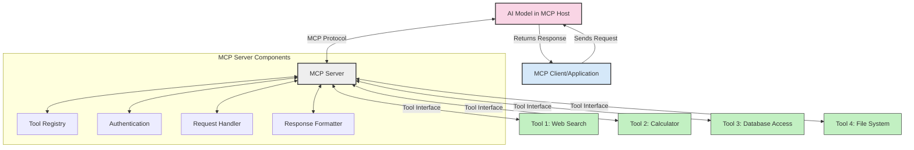
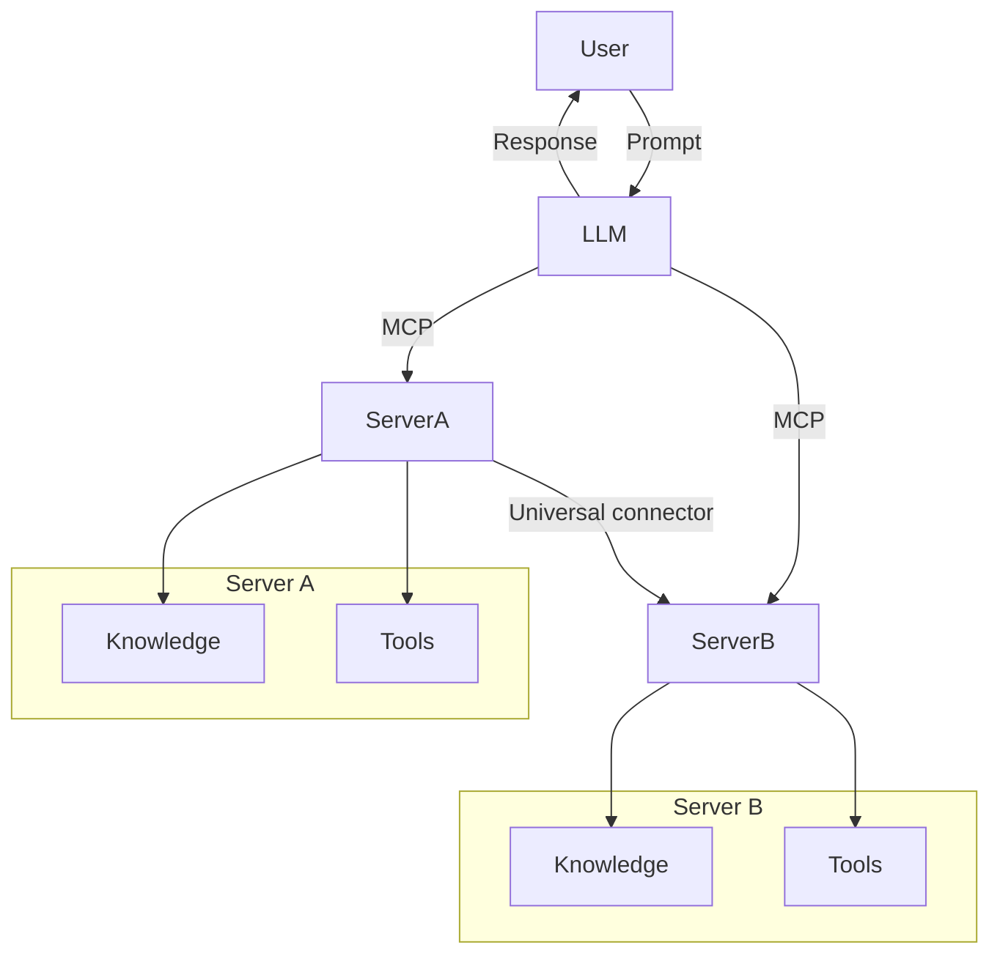

<!--
CO_OP_TRANSLATOR_METADATA:
{
  "original_hash": "02301140adbd807ecf0f17720fa307bc",
  "translation_date": "2025-05-17T06:09:34+00:00",
  "source_file": "00-Introduction/README.md",
  "language_code": "ro"
}
-->
# Introducere în Protocolul Contextului Modelului (MCP): De ce este important pentru aplicațiile AI scalabile

Aplicațiile AI generative reprezintă un pas important înainte, deoarece permit utilizatorului să interacționeze cu aplicația folosind sugestii în limbaj natural. Totuși, pe măsură ce se investesc mai mult timp și resurse în astfel de aplicații, vrei să te asiguri că poți integra cu ușurință funcționalități și resurse într-un mod care să fie ușor de extins, că aplicația ta poate gestiona mai mult decât un singur model utilizat și complexitățile sale. Pe scurt, construirea aplicațiilor AI generative este ușor de început, dar pe măsură ce crește și devine mai complexă, trebuie să începi să definești o arhitectură și, cel mai probabil, va trebui să te bazezi pe un standard pentru a te asigura că aplicațiile tale sunt construite într-un mod consistent. Aici intervine MCP pentru a organiza lucrurile și pentru a oferi un standard.

---

## **🔍 Ce este Protocolul Contextului Modelului (MCP)?**

**Protocolul Contextului Modelului (MCP)** este o **interfață deschisă și standardizată** care permite modelelor de limbaj mare (LLMs) să interacționeze fără probleme cu instrumente externe, API-uri și surse de date. Oferă o arhitectură consistentă pentru a îmbunătăți funcționalitatea modelului AI dincolo de datele lor de antrenament, permițând sisteme AI mai inteligente, scalabile și mai receptive.

---

## **🎯 De ce contează standardizarea în AI**

Pe măsură ce aplicațiile AI generative devin mai complexe, este esențial să adopți standarde care să asigure **scalabilitate, extensibilitate** și **mentenabilitate**. MCP abordează aceste nevoi prin:

- Unificarea integrărilor model-instrument
- Reducerea soluțiilor personalizate fragile și unice
- Permiterea coexistenței mai multor modele într-un singur ecosistem

---

## **📚 Obiective de învățare**

La finalul acestui articol, vei putea:

- Defini **Protocolul Contextului Modelului (MCP)** și cazurile sale de utilizare
- Înțelege cum MCP standardizează comunicarea model-instrument
- Identifica componentele de bază ale arhitecturii MCP
- Explora aplicații reale ale MCP în contexte de afaceri și dezvoltare

---

## **💡 De ce Protocolul Contextului Modelului (MCP) este revoluționar**

### **🔗 MCP rezolvă fragmentarea în interacțiunile AI**

Înainte de MCP, integrarea modelelor cu instrumente necesita:

- Cod personalizat pentru fiecare pereche instrument-model
- API-uri nestandardizate pentru fiecare furnizor
- Probleme frecvente din cauza actualizărilor
- Scalabilitate slabă cu mai multe instrumente

### **✅ Beneficiile standardizării MCP**

| **Beneficiu**             | **Descriere**                                                                   |
|---------------------------|---------------------------------------------------------------------------------|
| Interoperabilitate        | LLM-urile funcționează fără probleme cu instrumente de la diferiți furnizori     |
| Consistență               | Comportament uniform pe platforme și instrumente                                |
| Reutilizabilitate         | Instrumentele construite o dată pot fi utilizate în proiecte și sisteme         |
| Dezvoltare accelerată     | Reducerea timpului de dezvoltare prin utilizarea interfețelor standardizate     |

---

## **🧱 Prezentare generală a arhitecturii MCP la nivel înalt**

MCP urmează un **model client-server**, unde:

- **Gazdele MCP** rulează modelele AI
- **Clienții MCP** inițiază cereri
- **Serverele MCP** oferă context, instrumente și capabilități

### **Componente cheie:**

- **Resurse** – Date statice sau dinamice pentru modele  
- **Sugestii** – Fluxuri de lucru predefinite pentru generare ghidată  
- **Instrumente** – Funcții executabile precum căutare, calcule  
- **Sampling** – Comportament agentic prin interacțiuni recursive

---

## Cum funcționează serverele MCP

Serverele MCP funcționează în următorul mod:

- **Fluxul de cerere**: 
    1. Clientul MCP trimite o cerere către modelul AI care rulează într-o gazdă MCP.
    2. Modelul AI identifică când are nevoie de instrumente sau date externe.
    3. Modelul comunică cu serverul MCP folosind protocolul standardizat.

- **Funcționalitatea serverului MCP**:
    - Registrul de instrumente: Menține un catalog de instrumente disponibile și capabilitățile lor.
    - Autentificare: Verifică permisiunile pentru accesul la instrumente.
    - Handler de cereri: Procesează cererile de instrumente primite de la model.
    - Formatter de răspuns: Structurează ieșirile instrumentelor într-un format pe care modelul îl poate înțelege.

- **Execuția instrumentului**: 
    - Serverul direcționează cererile către instrumentele externe adecvate
    - Instrumentele își execută funcțiile specializate (căutare, calcul, interogări de baze de date etc.)
    - Rezultatele sunt returnate modelului într-un format consistent.

- **Finalizarea răspunsului**: 
    - Modelul AI încorporează ieșirile instrumentelor în răspunsul său.
    - Răspunsul final este trimis înapoi aplicației client.

## 👨‍💻 Cum să construiești un server MCP (cu exemple)

Serverele MCP îți permit să extinzi capabilitățile LLM prin furnizarea de date și funcționalitate. 

Gata să încerci? Iată exemple de creare a unui server MCP simplu în diferite limbi:

- **Exemplu Python**: https://github.com/modelcontextprotocol/python-sdk

- **Exemplu TypeScript**: https://github.com/modelcontextprotocol/typescript-sdk

- **Exemplu Java**: https://github.com/modelcontextprotocol/java-sdk

- **Exemplu C#/.NET**: https://github.com/modelcontextprotocol/csharp-sdk

## 🌍 Cazuri de utilizare reale pentru MCP

MCP permite o gamă largă de aplicații prin extinderea capabilităților AI:

| **Aplicație**              | **Descriere**                                                                   |
|----------------------------|---------------------------------------------------------------------------------|
| Integrarea datelor de afaceri | Conectează LLM-uri la baze de date, CRM-uri sau instrumente interne            |
| Sisteme AI agentice        | Permite agenților autonomi acces la instrumente și fluxuri de lucru de luare a deciziilor |
| Aplicații multi-modale     | Combină instrumente text, imagine și audio într-o singură aplicație AI unificată |
| Integrarea datelor în timp real | Aduce date live în interacțiunile AI pentru rezultate mai precise și actuale |

### 🧠 MCP = Standard universal pentru interacțiunile AI

Protocolul Contextului Modelului (MCP) acționează ca un standard universal pentru interacțiunile AI, la fel cum USB-C a standardizat conexiunile fizice pentru dispozitive. În lumea AI, MCP oferă o interfață consistentă, permițând modelelor (clienți) să se integreze fără probleme cu instrumente externe și furnizori de date (servere). Acest lucru elimină necesitatea unor protocoale diverse și personalizate pentru fiecare API sau sursă de date.

Sub MCP, un instrument compatibil MCP (denumit server MCP) urmează un standard unificat. Aceste servere pot lista instrumentele sau acțiunile pe care le oferă și le pot executa atunci când sunt solicitate de un agent AI. Platformele de agenți AI care suportă MCP sunt capabile să descopere instrumentele disponibile de la servere și să le invoce prin acest protocol standard.

### 💡 Facilitează accesul la cunoaștere

Dincolo de oferirea de instrumente, MCP facilitează și accesul la cunoaștere. Permite aplicațiilor să ofere context modelelor de limbaj mare (LLMs) prin conectarea lor la diverse surse de date. De exemplu, un server MCP ar putea reprezenta un depozit de documente al unei companii, permițând agenților să recupereze informații relevante la cerere. Un alt server ar putea gestiona acțiuni specifice, precum trimiterea de e-mailuri sau actualizarea de înregistrări. Din perspectiva agentului, acestea sunt pur și simplu instrumente pe care le poate folosi—unele instrumente returnează date (context de cunoaștere), în timp ce altele efectuează acțiuni. MCP gestionează eficient ambele.

Un agent care se conectează la un server MCP învață automat capabilitățile disponibile ale serverului și datele accesibile printr-un format standard. Această standardizare permite disponibilitatea dinamică a instrumentelor. De exemplu, adăugarea unui nou server MCP la sistemul unui agent face ca funcțiile sale să fie imediat utilizabile fără a necesita personalizarea suplimentară a instrucțiunilor agentului.

Această integrare simplificată se aliniază cu fluxul descris în diagrama mermaid, unde serverele oferă atât instrumente cât și cunoaștere, asigurând colaborarea fără probleme între sisteme. 

### 👉 Exemplu: Soluție de agent scalabil

## 🔐 Beneficii practice ale MCP

Iată câteva beneficii practice ale utilizării MCP:

- **Actualitate**: Modelele pot accesa informații actualizate dincolo de datele lor de antrenament
- **Extinderea capabilităților**: Modelele pot utiliza instrumente specializate pentru sarcini pentru care nu au fost antrenate
- **Reducerea halucinațiilor**: Sursele de date externe oferă o bază factuală
- **Confidențialitate**: Datele sensibile pot rămâne în medii securizate în loc să fie încorporate în sugestii

## 📌 Concluzii cheie

Iată concluziile cheie pentru utilizarea MCP:

- **MCP** standardizează modul în care modelele AI interacționează cu instrumente și date
- Promovează **extensibilitate, consistență și interoperabilitate**
- MCP ajută la **reducerea timpului de dezvoltare, îmbunătățirea fiabilității și extinderea capabilităților modelului**
- Arhitectura client-server **permite aplicații AI flexibile și extensibile**

## 🧠 Exercițiu

Gândește-te la o aplicație AI pe care ești interesat să o construiești.

- Ce **instrumente sau date externe** ar putea îmbunătăți capabilitățile sale?
- Cum ar putea MCP să facă integrarea **mai simplă și mai fiabilă?**

## Resurse suplimentare

- [Repository MCP pe GitHub](https://github.com/modelcontextprotocol)

## Ce urmează

Următorul: [Capitolul 1: Concepte de bază](/01-CoreConcepts/README.md)

**Declinarea responsabilității**:  
Acest document a fost tradus folosind serviciul de traducere AI [Co-op Translator](https://github.com/Azure/co-op-translator). Deși ne străduim să asigurăm acuratețea, vă rugăm să fiți conștienți că traducerile automate pot conține erori sau inexactități. Documentul original în limba sa maternă ar trebui considerat sursa autoritară. Pentru informații critice, se recomandă traducerea umană profesională. Nu ne asumăm responsabilitatea pentru neînțelegerile sau interpretările greșite care pot apărea din utilizarea acestei traduceri.