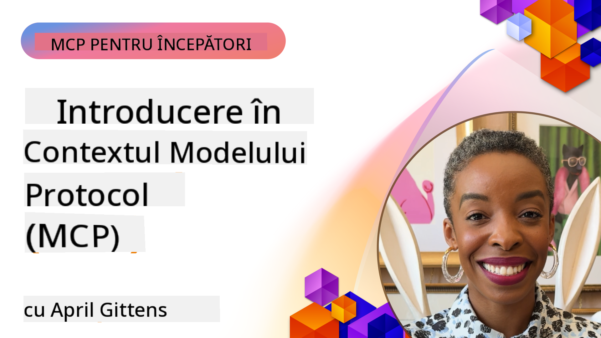
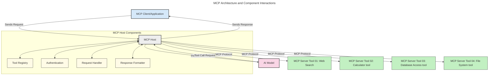
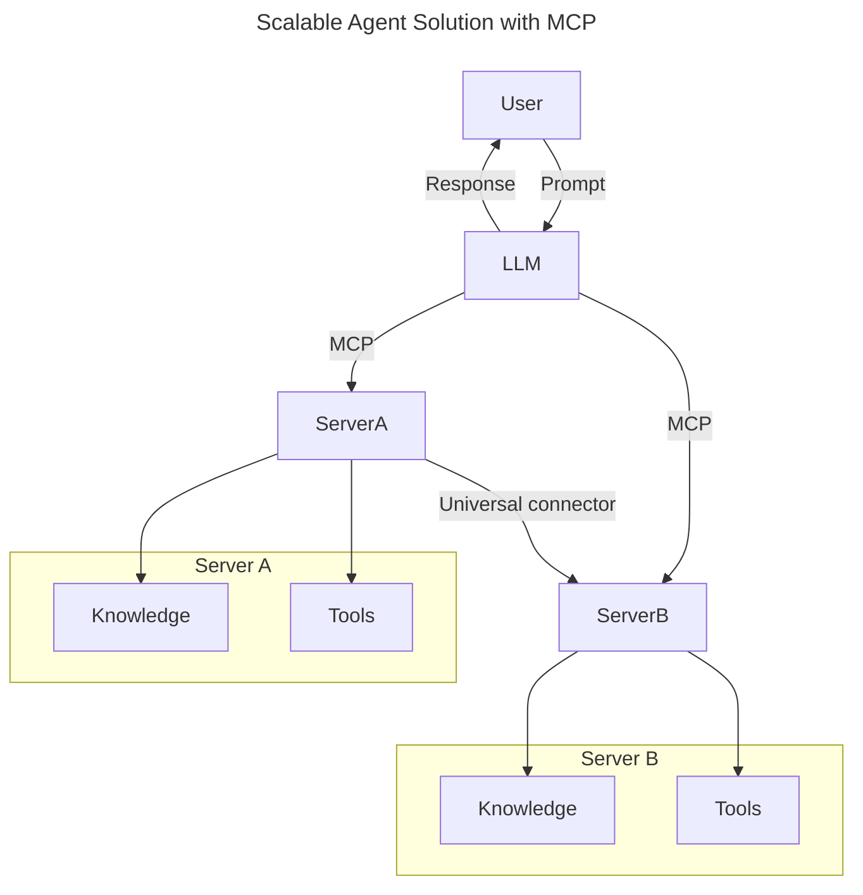
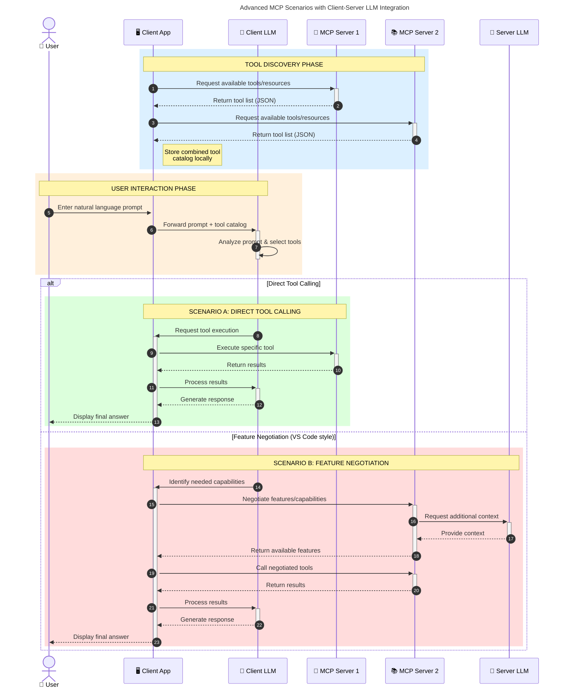

<!--
CO_OP_TRANSLATOR_METADATA:
{
  "original_hash": "0df1ee78a6dd8300f3a040ca5b411c2e",
  "translation_date": "2025-08-19T16:40:46+00:00",
  "source_file": "00-Introduction/README.md",
  "language_code": "ro"
}
-->
# Introducere în Protocolul de Context al Modelului (MCP): De ce este important pentru aplicațiile AI scalabile

_(Faceți clic pe imaginea de mai sus pentru a viziona videoclipul acestei lecții)_

Aplicațiile AI generative reprezintă un mare pas înainte, deoarece permit utilizatorilor să interacționeze cu aplicația folosind prompturi în limbaj natural. Totuși, pe măsură ce se investesc mai mult timp și resurse în astfel de aplicații, este esențial să vă asigurați că puteți integra funcționalități și resurse într-un mod ușor de extins, astfel încât aplicația să poată deservi mai multe modele și să gestioneze diversele lor particularități. Pe scurt, construirea aplicațiilor AI generative este ușoară la început, dar pe măsură ce acestea cresc și devin mai complexe, trebuie să începeți să definiți o arhitectură și, cel mai probabil, să vă bazați pe un standard pentru a vă asigura că aplicațiile sunt construite într-un mod consecvent. Aici intervine MCP pentru a organiza lucrurile și a oferi un standard.

---

## **🔍 Ce este Protocolul de Context al Modelului (MCP)?**

**Protocolul de Context al Modelului (MCP)** este o **interfață deschisă și standardizată** care permite modelelor mari de limbaj (LLMs) să interacționeze fără probleme cu instrumente externe, API-uri și surse de date. Acesta oferă o arhitectură consecventă pentru a îmbunătăți funcționalitatea modelelor AI dincolo de datele lor de antrenament, permițând sisteme AI mai inteligente, scalabile și mai receptive.

---

## **🎯 De ce contează standardizarea în AI**

Pe măsură ce aplicațiile AI generative devin mai complexe, este esențial să adoptați standarde care să asigure **scalabilitatea, extensibilitatea, mentenabilitatea** și **evitarea dependenței de un singur furnizor**. MCP răspunde acestor nevoi prin:

- Unificarea integrărilor între modele și instrumente
- Reducerea soluțiilor personalizate fragile
- Permisiunea ca mai multe modele de la furnizori diferiți să coexiste într-un singur ecosistem

**Notă:** Deși MCP se prezintă ca un standard deschis, nu există planuri de a standardiza MCP prin organisme existente precum IEEE, IETF, W3C, ISO sau alte organisme de standardizare.

---

## **📚 Obiectivele învățării**

La finalul acestui articol, veți putea:

- Defini **Protocolul de Context al Modelului (MCP)** și cazurile sale de utilizare
- Înțelege cum MCP standardizează comunicarea între modele și instrumente
- Identifica componentele de bază ale arhitecturii MCP
- Explora aplicații reale ale MCP în contexte de afaceri și dezvoltare

---

## **💡 De ce Protocolul de Context al Modelului (MCP) este revoluționar**

### **🔗 MCP rezolvă fragmentarea în interacțiunile AI**

Înainte de MCP, integrarea modelelor cu instrumentele presupunea:

- Cod personalizat pentru fiecare pereche model-instrument
- API-uri nestandardizate pentru fiecare furnizor
- Defecțiuni frecvente din cauza actualizărilor
- Scalabilitate redusă cu mai multe instrumente

### **✅ Beneficiile standardizării MCP**

| **Beneficiu**              | **Descriere**                                                                |
|----------------------------|-------------------------------------------------------------------------------|
| Interoperabilitate         | LLM-urile funcționează fără probleme cu instrumente de la diferiți furnizori |
| Consistență                | Comportament uniform pe platforme și instrumente                             |
| Reutilizabilitate          | Instrumentele construite o dată pot fi utilizate în mai multe proiecte       |
| Dezvoltare accelerată      | Reducerea timpului de dezvoltare prin utilizarea interfețelor standardizate   |

---

## **🧱 Prezentare generală a arhitecturii MCP la nivel înalt**

MCP urmează un model **client-server**, în care:

- **Gazdele MCP** rulează modelele AI
- **Clienții MCP** inițiază cereri
- **Serverele MCP** furnizează context, instrumente și capabilități

### **Componente cheie:**

- **Resurse** – Date statice sau dinamice pentru modele  
- **Prompturi** – Fluxuri de lucru predefinite pentru generare ghidată  
- **Instrumente** – Funcții executabile precum căutări, calcule  
- **Eșantionare** – Comportament agentic prin interacțiuni recursive  

---

## Cum funcționează serverele MCP

Serverele MCP operează astfel:

- **Fluxul cererii**:
    1. O cerere este inițiată de un utilizator final sau de un software care acționează în numele acestuia.
    2. **Clientul MCP** trimite cererea către o **Gazdă MCP**, care gestionează runtime-ul modelului AI.
    3. **Modelul AI** primește promptul utilizatorului și poate solicita acces la instrumente sau date externe prin una sau mai multe apeluri de instrumente.
    4. **Gazda MCP**, nu modelul direct, comunică cu **Serverul MCP** corespunzător folosind protocolul standardizat.
- **Funcționalitatea Gazdei MCP**:
    - **Registrul de instrumente**: Menține un catalog al instrumentelor disponibile și al capabilităților acestora.
    - **Autentificare**: Verifică permisiunile pentru accesul la instrumente.
    - **Handler de cereri**: Procesează cererile de instrumente primite de la model.
    - **Formatarea răspunsurilor**: Structurează ieșirile instrumentelor într-un format pe care modelul îl poate înțelege.
- **Execuția Serverului MCP**:
    - **Gazda MCP** direcționează apelurile de instrumente către unul sau mai multe **Servere MCP**, fiecare expunând funcții specializate (de exemplu, căutări, calcule, interogări de baze de date).
    - **Serverele MCP** își îndeplinesc operațiunile respective și returnează rezultatele către **Gazda MCP** într-un format consecvent.
    - **Gazda MCP** formatează și retransmite aceste rezultate către **Modelul AI**.
- **Finalizarea răspunsului**:
    - **Modelul AI** încorporează ieșirile instrumentelor într-un răspuns final.
    - **Gazda MCP** trimite acest răspuns înapoi către **Clientul MCP**, care îl livrează utilizatorului final sau software-ului apelant.

## 👨‍💻 Cum să construiți un server MCP (cu exemple)

Serverele MCP vă permit să extindeți capabilitățile LLM oferind date și funcționalități.

Gata să încercați? Iată SDK-uri specifice limbajului și/sau stack-ului, cu exemple de creare a unor servere MCP simple în diferite limbaje/stack-uri:

- **Python SDK**: https://github.com/modelcontextprotocol/python-sdk

- **TypeScript SDK**: https://github.com/modelcontextprotocol/typescript-sdk

- **Java SDK**: https://github.com/modelcontextprotocol/java-sdk

- **C#/.NET SDK**: https://github.com/modelcontextprotocol/csharp-sdk

---

## 🌍 Cazuri de utilizare reale pentru MCP

MCP permite o gamă largă de aplicații prin extinderea capabilităților AI:

| **Aplicație**               | **Descriere**                                                                |
|-----------------------------|-------------------------------------------------------------------------------|
| Integrarea datelor în afaceri | Conectarea LLM-urilor la baze de date, CRM-uri sau instrumente interne       |
| Sisteme AI agentice         | Permite agenților autonomi acces la instrumente și fluxuri de luare a deciziilor |
| Aplicații multi-modale      | Combinarea textului, imaginilor și sunetului într-o singură aplicație AI unificată |
| Integrarea datelor în timp real | Aducerea datelor live în interacțiunile AI pentru rezultate mai precise și actuale |

### 🧠 MCP = Standard universal pentru interacțiunile AI

Protocolul de Context al Modelului (MCP) acționează ca un standard universal pentru interacțiunile AI, la fel cum USB-C a standardizat conexiunile fizice pentru dispozitive. În lumea AI, MCP oferă o interfață consecventă, permițând modelelor (clienților) să se integreze fără probleme cu instrumente externe și furnizori de date (servere). Acest lucru elimină necesitatea unor protocoale diverse și personalizate pentru fiecare API sau sursă de date.

Sub MCP, un instrument compatibil MCP (denumit server MCP) urmează un standard unificat. Aceste servere pot lista instrumentele sau acțiunile pe care le oferă și le pot executa atunci când sunt solicitate de un agent AI. Platformele de agenți AI care suportă MCP sunt capabile să descopere instrumentele disponibile de la servere și să le invoce prin acest protocol standard.

### 💡 Facilitează accesul la cunoștințe

Dincolo de oferirea de instrumente, MCP facilitează și accesul la cunoștințe. Acesta permite aplicațiilor să ofere context modelelor mari de limbaj (LLMs) prin conectarea lor la diverse surse de date. De exemplu, un server MCP ar putea reprezenta un depozit de documente al unei companii, permițând agenților să recupereze informații relevante la cerere. Un alt server ar putea gestiona acțiuni specifice, cum ar fi trimiterea de e-mailuri sau actualizarea înregistrărilor. Din perspectiva agentului, acestea sunt pur și simplu instrumente pe care le poate utiliza—unele instrumente returnează date (context de cunoștințe), în timp ce altele efectuează acțiuni. MCP gestionează eficient ambele.

Un agent care se conectează la un server MCP învață automat capabilitățile disponibile ale serverului și datele accesibile printr-un format standard. Această standardizare permite disponibilitatea dinamică a instrumentelor. De exemplu, adăugarea unui nou server MCP în sistemul unui agent face ca funcțiile acestuia să fie utilizabile imediat, fără a necesita personalizări suplimentare ale instrucțiunilor agentului.

Această integrare simplificată se aliniază cu fluxul descris în diagrama următoare, unde serverele oferă atât instrumente, cât și cunoștințe, asigurând o colaborare fără probleme între sisteme.

### 👉 Exemplu: Soluție scalabilă pentru agenți

### 🔄 Scenarii avansate MCP cu integrarea LLM pe partea clientului

Dincolo de arhitectura de bază MCP, există scenarii avansate în care atât clientul, cât și serverul conțin LLM-uri, permițând interacțiuni mai sofisticate. În diagrama următoare, **Aplicația Client** ar putea fi un IDE cu un număr de instrumente MCP disponibile pentru utilizarea de către LLM:

---

## 🔐 Beneficii practice ale MCP

Iată beneficiile practice ale utilizării MCP:

- **Actualitate**: Modelele pot accesa informații actualizate dincolo de datele lor de antrenament
- **Extinderea capabilităților**: Modelele pot utiliza instrumente specializate pentru sarcini pentru care nu au fost antrenate
- **Reducerea halucinațiilor**: Sursele externe de date oferă o bază factuală
- **Confidențialitate**: Datele sensibile pot rămâne în medii securizate, în loc să fie incluse în prompturi

---

## 📌 Concluzii cheie

Iată concluziile cheie pentru utilizarea MCP:

- **MCP** standardizează modul în care modelele AI interacționează cu instrumentele și datele
- Promovează **extensibilitatea, consistența și interoperabilitatea**
- MCP ajută la **reducerea timpului de dezvoltare, îmbunătățirea fiabilității și extinderea capabilităților modelelor**
- Arhitectura client-server **permite aplicații AI flexibile și extensibile**

---

## 🧠 Exercițiu

Gândiți-vă la o aplicație AI pe care sunteți interesat să o construiți.

- Ce **instrumente externe sau date** ar putea să-i îmbunătățească capabilitățile?
- Cum ar putea MCP să facă integrarea **mai simplă și mai fiabilă**?

---

## Resurse suplimentare

- [Repository-ul GitHub MCP](https://github.com/modelcontextprotocol)

---

## Ce urmează

Următorul capitol: [Capitolul 1: Concepte de bază](../01-CoreConcepts/README.md)

**Declinarea responsabilității**:  
Acest document a fost tradus folosind serviciul de traducere AI [Co-op Translator](https://github.com/Azure/co-op-translator). Deși depunem eforturi pentru a asigura acuratețea, vă rugăm să rețineți că traducerile automate pot conține erori sau inexactități. Documentul original în limba sa nativă ar trebui considerat sursa autoritară. Pentru informații critice, se recomandă traducerea profesională realizată de un specialist uman. Nu ne asumăm răspunderea pentru eventualele neînțelegeri sau interpretări greșite care pot apărea din utilizarea acestei traduceri.