<!--
CO_OP_TRANSLATOR_METADATA:
{
  "original_hash": "25a94c681cf43612ff394d8cf78a74de",
  "translation_date": "2025-05-27T16:12:43+00:00",
  "source_file": "00-Introduction/README.md",
  "language_code": "ro"
}
-->
# Introducere în Model Context Protocol (MCP): De ce este important pentru aplicațiile AI scalabile

Aplicațiile de AI generativ reprezintă un pas important înainte, deoarece permit utilizatorului să interacționeze cu aplicația folosind comenzi în limbaj natural. Totuși, pe măsură ce se investesc mai mult timp și resurse în astfel de aplicații, vrei să te asiguri că poți integra cu ușurință funcționalități și resurse astfel încât să fie ușor de extins, ca aplicația ta să poată gestiona mai multe modele utilizate simultan și să poată face față diverselor particularități ale modelelor. Pe scurt, construirea aplicațiilor Gen AI este ușoară la început, dar pe măsură ce acestea cresc și devin mai complexe, trebuie să începi să definești o arhitectură și cel mai probabil vei avea nevoie să te bazezi pe un standard care să asigure că aplicațiile tale sunt construite într-un mod consistent. Aici intervine MCP pentru a organiza lucrurile și a oferi un standard.

---

## **🔍 Ce este Model Context Protocol (MCP)?**

**Model Context Protocol (MCP)** este o **interfață deschisă și standardizată** care permite modelelor mari de limbaj (LLM) să interacționeze fără probleme cu unelte externe, API-uri și surse de date. Oferă o arhitectură consistentă pentru a extinde funcționalitatea modelelor AI dincolo de datele pe care au fost antrenate, facilitând sisteme AI mai inteligente, scalabile și mai receptive.

---

## **🎯 De ce contează standardizarea în AI**

Pe măsură ce aplicațiile AI generative devin mai complexe, este esențial să adoptăm standarde care să asigure **scalabilitate, extensibilitate** și **mentenabilitate**. MCP răspunde acestor nevoi prin:

- Unificarea integrărilor model-unealtă
- Reducerea soluțiilor personalizate fragile și unice
- Permițând coexistenta mai multor modele într-un singur ecosistem

---

## **📚 Obiective de învățare**

La finalul acestui articol, vei putea:

- Defini **Model Context Protocol (MCP)** și cazurile sale de utilizare
- Înțelege cum MCP standardizează comunicarea model-unealtă
- Identifica componentele cheie ale arhitecturii MCP
- Explora aplicații reale ale MCP în mediul enterprise și dezvoltare

---

## **💡 De ce Model Context Protocol (MCP) este un factor decisiv**

### **🔗 MCP rezolvă fragmentarea în interacțiunile AI**

Înainte de MCP, integrarea modelelor cu unelte necesita:

- Cod personalizat pentru fiecare pereche unealtă-model
- API-uri ne-standardizate pentru fiecare furnizor
- Întreruperi frecvente cauzate de actualizări
- Scalabilitate redusă pe măsură ce apar mai multe unelte

### **✅ Beneficiile standardizării MCP**

| **Beneficiu**            | **Descriere**                                                                 |
|--------------------------|-------------------------------------------------------------------------------|
| Interoperabilitate       | LLM-urile funcționează fără probleme cu unelte de la diferiți furnizori       |
| Consistență              | Comportament uniform pe platforme și unelte                                   |
| Reutilizare              | Uneltele construite o dată pot fi folosite în mai multe proiecte și sisteme   |
| Dezvoltare accelerată    | Reducerea timpului de dezvoltare prin utilizarea unor interfețe standard, plug-and-play |

---

## **🧱 Prezentare generală a arhitecturii MCP la nivel înalt**

MCP urmează un **model client-server**, unde:

- **MCP Hosts** rulează modelele AI
- **MCP Clients** inițiază cererile
- **MCP Servers** oferă context, unelte și capabilități

### **Componente cheie:**

- **Resurse** – date statice sau dinamice pentru modele  
- **Prompts** – fluxuri de lucru predefinite pentru generare ghidată  
- **Unelte** – funcții executabile precum căutare, calcule  
- **Sampling** – comportament agentic prin interacțiuni recursive

---

## Cum funcționează MCP Servers

Serverele MCP operează astfel:

- **Fluxul cererilor**: 
    1. MCP Client trimite o cerere către Modelul AI care rulează pe un MCP Host.
    2. Modelul AI identifică când are nevoie de unelte sau date externe.
    3. Modelul comunică cu MCP Server folosind protocolul standardizat.

- **Funcționalități MCP Server**:
    - Registrul uneltelor: Păstrează un catalog al uneltelor disponibile și capabilitățile lor.
    - Autentificare: Verifică permisiunile pentru accesul la unelte.
    - Handler pentru cereri: Procesează cererile venite de la model pentru unelte.
    - Formatter pentru răspunsuri: Structurează rezultatele uneltelor într-un format pe care modelul îl poate înțelege.

- **Executarea uneltelor**: 
    - Serverul direcționează cererile către uneltele externe potrivite
    - Uneltele își execută funcțiile specializate (căutare, calcul, interogări în baze de date etc.)
    - Rezultatele sunt returnate modelului într-un format consistent.

- **Finalizarea răspunsului**: 
    - Modelul AI încorporează rezultatele uneltelor în răspunsul său.
    - Răspunsul final este trimis înapoi aplicației client.

## 👨‍💻 Cum să construiești un MCP Server (cu exemple)

Serverele MCP îți permit să extinzi capabilitățile LLM prin furnizarea de date și funcționalități.

Gata să încerci? Iată exemple de creare a unui MCP server simplu în diferite limbaje:

- **Exemplu Python**: https://github.com/modelcontextprotocol/python-sdk

- **Exemplu TypeScript**: https://github.com/modelcontextprotocol/typescript-sdk

- **Exemplu Java**: https://github.com/modelcontextprotocol/java-sdk

- **Exemplu C#/.NET**: https://github.com/modelcontextprotocol/csharp-sdk

## 🌍 Cazuri reale de utilizare pentru MCP

MCP permite o gamă largă de aplicații prin extinderea capabilităților AI:

| **Aplicație**              | **Descriere**                                                                |
|----------------------------|------------------------------------------------------------------------------|
| Integrare date enterprise  | Conectează LLM-uri la baze de date, CRM-uri sau unelte interne                |
| Sisteme AI agentice        | Permite agenților autonomi acces la unelte și fluxuri decizionale             |
| Aplicații multimodale      | Combină unelte text, imagine și audio într-o singură aplicație AI unificată  |
| Integrare date în timp real| Adu date live în interacțiunile AI pentru rezultate mai precise și actuale   |

### 🧠 MCP = Standard universal pentru interacțiunile AI

Model Context Protocol (MCP) funcționează ca un standard universal pentru interacțiunile AI, la fel cum USB-C a standardizat conexiunile fizice pentru dispozitive. În lumea AI, MCP oferă o interfață consistentă, permițând modelelor (client) să se integreze fără probleme cu unelte și furnizori de date externi (servere). Aceasta elimină nevoia unor protocoale diverse și personalizate pentru fiecare API sau sursă de date.

În cadrul MCP, o unealtă compatibilă MCP (numită MCP server) respectă un standard unificat. Aceste servere pot lista uneltele sau acțiunile pe care le oferă și le pot executa când sunt solicitate de un agent AI. Platformele de agenți AI care suportă MCP pot descoperi uneltele disponibile pe servere și le pot invoca prin acest protocol standard.

### 💡 Facilitează accesul la cunoaștere

Dincolo de a oferi unelte, MCP facilitează și accesul la cunoaștere. Permite aplicațiilor să furnizeze context modelelor mari de limbaj (LLM) prin conectarea lor la diverse surse de date. De exemplu, un MCP server poate reprezenta un depozit de documente al unei companii, permițând agenților să recupereze informații relevante la cerere. Un alt server poate gestiona acțiuni specifice, cum ar fi trimiterea de emailuri sau actualizarea înregistrărilor. Din perspectiva agentului, acestea sunt pur și simplu unelte pe care le poate folosi — unele unelte returnează date (context de cunoaștere), altele execută acțiuni. MCP gestionează eficient ambele.

Un agent care se conectează la un MCP server învață automat capabilitățile disponibile și datele accesibile printr-un format standard. Această standardizare permite disponibilitatea dinamică a uneltelor. De exemplu, adăugarea unui nou MCP server în sistemul unui agent face funcțiile acestuia imediat utilizabile, fără a necesita personalizări suplimentare ale instrucțiunilor agentului.

Această integrare simplificată se aliniază fluxului prezentat în diagrama mermaid, unde serverele oferă atât unelte, cât și cunoaștere, asigurând o colaborare fluidă între sisteme.

### 👉 Exemplu: Soluție scalabilă pentru agenți

### 🔄 Scenarii avansate MCP cu integrare LLM pe partea clientului

Dincolo de arhitectura de bază MCP, există scenarii avansate în care atât clientul, cât și serverul conțin LLM-uri, permițând interacțiuni mai sofisticate:

```mermaid
sequenceDiagram
    autonumber
    actor User as 👤 User
    participant ClientApp as 🖥️ Client App
    participant ClientLLM as 🧠 Client LLM
    participant Server1 as 🔧 MCP Server 1
    participant Server2 as 📚 MCP Server 2
    participant ServerLLM as 🤖 Server LLM
    
    %% Discovery Phase
    rect rgb(220, 240, 255)
        Note over ClientApp, Server2: TOOL DISCOVERY PHASE
        ClientApp->>+Server1: Request available tools/resources
        Server1-->>-ClientApp: Return tool list (JSON)
        ClientApp->>+Server2: Request available tools/resources
        Server2-->>-ClientApp: Return tool list (JSON)
        Note right of ClientApp: Store combined tool<br/>catalog locally
    end
    
    %% User Interaction
    rect rgb(255, 240, 220)
        Note over User, ClientLLM: USER INTERACTION PHASE
        User->>+ClientApp: Enter natural language prompt
        ClientApp->>+ClientLLM: Forward prompt + tool catalog
        ClientLLM->>-ClientLLM: Analyze prompt & select tools
    end
    
    %% Scenario A: Direct Tool Calling
    alt Direct Tool Calling
        rect rgb(220, 255, 220)
            Note over ClientApp, Server1: SCENARIO A: DIRECT TOOL CALLING
            ClientLLM->>+ClientApp: Request tool execution
            ClientApp->>+Server1: Execute specific tool
            Server1-->>-ClientApp: Return results
            ClientApp->>+ClientLLM: Process results
            ClientLLM-->>-ClientApp: Generate response
            ClientApp-->>-User: Display final answer
        end
    
    %% Scenario B: Feature Negotiation (VS Code style)
    else Feature Negotiation (VS Code style)
        rect rgb(255, 220, 220)
            Note over ClientApp, ServerLLM: SCENARIO B: FEATURE NEGOTIATION
            ClientLLM->>+ClientApp: Identify needed capabilities
            ClientApp->>+Server2: Negotiate features/capabilities
            Server2->>+ServerLLM: Request additional context
            ServerLLM-->>-Server2: Provide context
            Server2-->>-ClientApp: Return available features
            ClientApp->>+Server2: Call negotiated tools
            Server2-->>-ClientApp: Return results
            ClientApp->>+ClientLLM: Process results
            ClientLLM-->>-ClientApp: Generate response
            ClientApp-->>-User: Display final answer
        end
    end
```

## 🔐 Beneficii practice ale MCP

Iată beneficiile practice ale utilizării MCP:

- **Actualitate**: Modelele pot accesa informații actualizate dincolo de datele lor de antrenament
- **Extinderea capabilităților**: Modelele pot folosi unelte specializate pentru sarcini pentru care nu au fost antrenate
- **Reducerea halucinațiilor**: Sursele externe de date oferă o bază factuală
- **Confidențialitate**: Datele sensibile pot rămâne în medii securizate în loc să fie incluse în prompturi

## 📌 Concluzii cheie

Iată concluziile esențiale pentru utilizarea MCP:

- **MCP** standardizează modul în care modelele AI interacționează cu uneltele și datele
- Promovează **extensibilitate, consistență și interoperabilitate**
- MCP ajută la **reducerea timpului de dezvoltare, îmbunătățirea fiabilității și extinderea capabilităților modelelor**
- Arhitectura client-server **permite aplicații AI flexibile și extensibile**

## 🧠 Exercițiu

Gândește-te la o aplicație AI pe care vrei să o construiești.

- Ce **unelte externe sau date** ar putea să-i îmbunătățească capabilitățile?
- Cum ar putea MCP să facă integrarea **mai simplă și mai fiabilă**?

## Resurse suplimentare

- [MCP GitHub Repository](https://github.com/modelcontextprotocol)

## Ce urmează

Următorul pas: [Chapter 1: Core Concepts](/01-CoreConcepts/README.md)

**Declinare a responsabilității**:  
Acest document a fost tradus folosind serviciul de traducere AI [Co-op Translator](https://github.com/Azure/co-op-translator). Deși ne străduim pentru acuratețe, vă rugăm să rețineți că traducerile automate pot conține erori sau inexactități. Documentul original în limba sa nativă trebuie considerat sursa autoritară. Pentru informații critice, se recomandă traducerea profesională realizată de un specialist uman. Nu ne asumăm răspunderea pentru eventualele neînțelegeri sau interpretări greșite rezultate din utilizarea acestei traduceri.