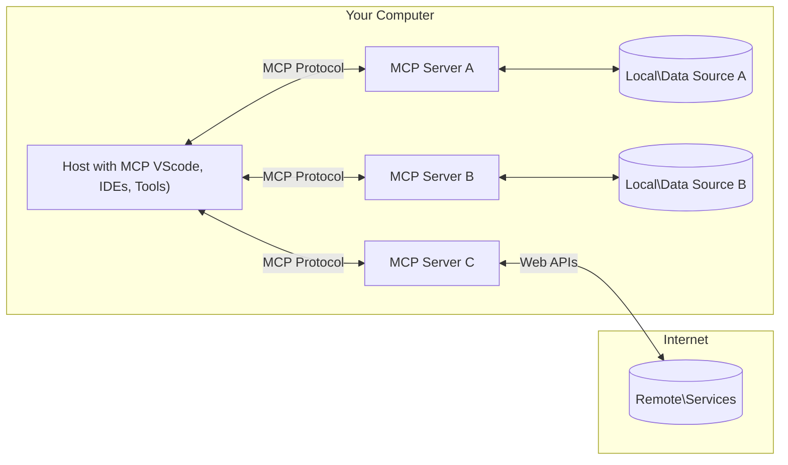

<!--
CO_OP_TRANSLATOR_METADATA:
{
  "original_hash": "b3b4a6ad10c3c0edbf7fa7cfa0ec496b",
  "translation_date": "2025-07-02T07:33:16+00:00",
  "source_file": "01-CoreConcepts/README.md",
  "language_code": "ro"
}
-->
# 📖 Concepte de bază MCP: Stăpânirea Protocolului Contextului Modelului pentru Integrarea AI

[Model Context Protocol (MCP)](https://github.com/modelcontextprotocol) este un cadru puternic și standardizat care optimizează comunicarea între Modelele Mari de Limbaj (LLM-uri) și unelte, aplicații și surse de date externe. Acest ghid optimizat SEO te va conduce prin conceptele esențiale ale MCP, asigurându-te că înțelegi arhitectura client-server, componentele cheie, mecanismele de comunicare și cele mai bune practici de implementare.

## Prezentare generală

Această lecție explorează arhitectura fundamentală și componentele care alcătuiesc ecosistemul Model Context Protocol (MCP). Vei învăța despre arhitectura client-server, componentele cheie și mecanismele de comunicare care susțin interacțiunile MCP.

## 👩‍🎓 Obiective cheie de învățare

La finalul acestei lecții, vei:

- Înțelege arhitectura client-server a MCP.
- Identifica rolurile și responsabilitățile gazdelor, clienților și serverelor.
- Analiza caracteristicile principale care fac din MCP un strat flexibil de integrare.
- Înțelege fluxul informațiilor în cadrul ecosistemului MCP.
- Obține perspective practice prin exemple de cod în .NET, Java, Python și JavaScript.

## 🔎 Arhitectura MCP: O privire detaliată

Ecosistemul MCP este construit pe un model client-server. Această structură modulară permite aplicațiilor AI să interacționeze eficient cu unelte, baze de date, API-uri și resurse contextuale. Hai să descompunem această arhitectură în componentele sale principale.

La bază, MCP urmează o arhitectură client-server în care o aplicație gazdă se poate conecta la mai multe servere:



- **MCP Hosts**: Programe precum VSCode, Claude Desktop, IDE-uri sau unelte AI care doresc să acceseze date prin MCP
- **MCP Clients**: Clienți de protocol care mențin conexiuni 1:1 cu serverele
- **MCP Servers**: Programe ușoare care expun capacități specifice prin Protocolul Contextului Modelului standardizat
- **Surse Locale de Date**: Fișierele, bazele de date și serviciile de pe calculatorul tău la care serverele MCP pot avea acces securizat
- **Servicii Remote**: Sisteme externe disponibile pe internet la care serverele MCP se pot conecta prin API-uri.

Protocolul MCP este un standard în evoluție; poți vedea cele mai recente actualizări în [specificația protocolului](https://modelcontextprotocol.io/specification/2025-06-18/)

### 1. Gazdele (Hosts)

În Model Context Protocol (MCP), gazdele joacă un rol crucial ca interfața principală prin care utilizatorii interacționează cu protocolul. Gazdele sunt aplicații sau medii care inițiază conexiuni cu serverele MCP pentru a accesa date, unelte și prompturi. Exemple de gazde includ medii integrate de dezvoltare (IDE-uri) precum Visual Studio Code, unelte AI precum Claude Desktop sau agenți personalizați creați pentru sarcini specifice.

**Gazdele** sunt aplicații LLM care inițiază conexiuni. Ele:

- Execută sau interacționează cu modelele AI pentru a genera răspunsuri.
- Inițiază conexiuni cu serverele MCP.
- Gestionează fluxul conversației și interfața cu utilizatorul.
- Controlează permisiunile și constrângerile de securitate.
- Se ocupă de consimțământul utilizatorului pentru partajarea datelor și execuția uneltelor.

### 2. Clienții (Clients)

Clienții sunt componente esențiale care facilitează interacțiunea dintre gazde și serverele MCP. Clienții acționează ca intermediari, permițând gazdelor să acceseze și să utilizeze funcționalitățile oferite de serverele MCP. Ei joacă un rol important în asigurarea unei comunicări fluide și a unui schimb eficient de date în arhitectura MCP.

**Clienții** sunt conectori în cadrul aplicației gazdă. Ei:

- Trimit cereri către servere cu prompturi/instrucțiuni.
- Negociază capabilitățile cu serverele.
- Gestionează cererile de execuție a uneltelor venite din partea modelelor.
- Procesează și afișează răspunsurile către utilizatori.

### 3. Serverele (Servers)

Serverele sunt responsabile pentru gestionarea cererilor venite de la clienții MCP și oferirea răspunsurilor corespunzătoare. Ele gestionează diverse operațiuni precum preluarea datelor, execuția uneltelor și generarea de prompturi. Serverele asigură o comunicare eficientă și de încredere între clienți și gazde, menținând integritatea procesului de interacțiune.

**Serverele** sunt servicii care oferă context și capabilități. Ele:

- Înregistrează funcționalitățile disponibile (resurse, prompturi, unelte)
- Primesc și execută apeluri către unelte din partea clientului
- Oferă informații contextuale pentru a îmbunătăți răspunsurile modelului
- Returnează rezultatele către client
- Mențin starea pe parcursul interacțiunilor, dacă este necesar

Serverele pot fi dezvoltate de oricine pentru a extinde capabilitățile modelului cu funcționalități specializate.

### 4. Funcționalități ale Serverelor

Serverele din Model Context Protocol (MCP) oferă blocuri fundamentale care permit interacțiuni complexe între clienți, gazde și modelele de limbaj. Aceste funcționalități sunt concepute pentru a extinde capabilitățile MCP prin oferirea de context structurat, unelte și prompturi.

Serverele MCP pot oferi oricare dintre următoarele funcționalități:

#### 📑 Resurse

Resursele în Model Context Protocol (MCP) includ diverse tipuri de context și date ce pot fi utilizate de utilizatori sau modele AI. Acestea includ:

- **Date contextuale**: Informații și contexte pe care utilizatorii sau modelele AI le pot folosi pentru luarea deciziilor și executarea sarcinilor.
- **Baze de cunoștințe și depozite de documente**: Colecții de date structurate și nestructurate, cum ar fi articole, manuale și lucrări de cercetare, care oferă perspective și informații valoroase.
- **Fișiere și baze de date locale**: Date stocate local pe dispozitive sau în baze de date, accesibile pentru procesare și analiză.
- **API-uri și servicii web**: Interfețe și servicii externe care oferă date și funcționalități suplimentare, permițând integrarea cu diverse resurse și unelte online.

Un exemplu de resursă poate fi un schema de bază de date sau un fișier accesibil astfel:

```text
file://log.txt
database://schema
```

### 🤖 Prompturi

Prompturile în Model Context Protocol (MCP) includ diverse șabloane predefinite și tipare de interacțiune concepute pentru a eficientiza fluxurile de lucru ale utilizatorilor și a îmbunătăți comunicarea. Acestea includ:

- **Mesaje și fluxuri de lucru șablon**: Mesaje și procese pre-structurate care ghidează utilizatorii prin sarcini și interacțiuni specifice.
- **Tipare predefinite de interacțiune**: Secvențe standardizate de acțiuni și răspunsuri care facilitează o comunicare consecventă și eficientă.
- **Șabloane specializate de conversație**: Șabloane personalizabile adaptate pentru tipuri specifice de conversații, asigurând interacțiuni relevante și contextuale.

Un șablon de prompt poate arăta astfel:

```markdown
Generate a product slogan based on the following {{product}} with the following {{keywords}}
```

#### ⛏️ Unelte (Tools)

Uneltele în Model Context Protocol (MCP) sunt funcții pe care modelul AI le poate executa pentru a îndeplini sarcini specifice. Aceste unelte sunt concepute pentru a extinde capabilitățile modelului AI prin furnizarea de operațiuni structurate și de încredere. Aspectele cheie includ:

- **Funcții pe care modelul AI le poate executa**: Uneltele sunt funcții executabile pe care modelul AI le poate invoca pentru a realiza diverse sarcini.
- **Nume unic și descriere**: Fiecare unealtă are un nume distinct și o descriere detaliată care explică scopul și funcționalitatea acesteia.
- **Parametri și rezultate**: Uneltele acceptă parametri specifici și returnează rezultate structurate, asigurând rezultate consecvente și previzibile.
- **Funcții discrete**: Uneltele realizează funcții discrete precum căutări web, calcule și interogări în baze de date.

Un exemplu de unealtă ar putea arăta astfel:

```typescript
server.tool(
  "GetProducts",
  {
    pageSize: z.string().optional(),
    pageCount: z.string().optional()
  }, () => {
    // return results from API
  }
)
```

## Funcționalități ale Clienților

În Model Context Protocol (MCP), clienții oferă mai multe funcționalități cheie serverelor, sporind funcționalitatea generală și interacțiunea în cadrul protocolului. Una dintre funcționalitățile notabile este Sampling.

### 👉 Sampling

- **Comportamente agentice inițiate de server**: Clienții permit serverelor să inițieze acțiuni sau comportamente specifice în mod autonom, sporind capacitățile dinamice ale sistemului.
- **Interacțiuni recursive cu LLM-uri**: Această funcționalitate permite interacțiuni recursive cu modelele mari de limbaj (LLM-uri), facilitând un proces mai complex și iterativ al sarcinilor.
- **Solicitarea completărilor suplimentare ale modelului**: Serverele pot cere completări suplimentare de la model, asigurând răspunsuri complete și contextuale.

## Fluxul informațiilor în MCP

Model Context Protocol (MCP) definește un flux structurat de informații între gazde, clienți, servere și modele. Înțelegerea acestui flux ajută la clarificarea modului în care cererile utilizatorilor sunt procesate și cum uneltele și datele externe sunt integrate în răspunsurile modelului.

- **Gazda inițiază conexiunea**  
  Aplicația gazdă (cum ar fi un IDE sau o interfață de chat) stabilește o conexiune cu un server MCP, de obicei prin STDIO, WebSocket sau alt transport suportat.

- **Negocierea capabilităților**  
  Clientul (încorporat în gazdă) și serverul schimbă informații despre funcționalitățile, uneltele, resursele și versiunile protocolului suportate. Astfel, ambele părți înțeleg ce capabilități sunt disponibile pentru sesiune.

- **Cererea utilizatorului**  
  Utilizatorul interacționează cu gazda (de exemplu, introduce un prompt sau o comandă). Gazda colectează această intrare și o transmite clientului pentru procesare.

- **Utilizarea resurselor sau uneltelor**  
  - Clientul poate solicita context suplimentar sau resurse de la server (cum ar fi fișiere, intrări din baze de date sau articole din baze de cunoștințe) pentru a îmbogăți înțelegerea modelului.
  - Dacă modelul determină că este nevoie de o unealtă (de exemplu, pentru a obține date, a efectua un calcul sau a apela un API), clientul trimite o cerere de invocare a uneltei către server, specificând numele uneltei și parametrii.

- **Execuția pe server**  
  Serverul primește cererea pentru resursă sau unealtă, execută operațiunile necesare (cum ar fi rularea unei funcții, interogarea unei baze de date sau preluarea unui fișier) și returnează rezultatele clientului într-un format structurat.

- **Generarea răspunsului**  
  Clientul integrează răspunsurile serverului (datele resursei, rezultatele uneltelor etc.) în interacțiunea curentă cu modelul. Modelul folosește aceste informații pentru a genera un răspuns complet și relevant contextual.

- **Prezentarea rezultatului**  
  Gazda primește rezultatul final de la client și îl afișează utilizatorului, adesea incluzând atât textul generat de model, cât și rezultatele execuțiilor uneltelor sau căutărilor în resurse.

Acest flux permite MCP să susțină aplicații AI avansate, interactive și conștiente de context, conectând modele cu unelte și surse de date externe fără întreruperi.

## Detalii despre protocol

MCP (Model Context Protocol) este construit peste [JSON-RPC 2.0](https://www.jsonrpc.org/), oferind un format standardizat, independent de limbaj, pentru comunicarea între gazde, clienți și servere. Această bază permite interacțiuni fiabile, structurate și extensibile pe diverse platforme și limbaje de programare.

### Caracteristici cheie ale protocolului

MCP extinde JSON-RPC 2.0 cu convenții suplimentare pentru invocarea uneltelor, accesul la resurse și gestionarea prompturilor. Suportă mai multe straturi de transport (STDIO, WebSocket, SSE) și permite o comunicare sigură, extensibilă și independentă de limbaj între componente.

#### 🧢 Protocol de bază

- **Formatul mesajelor JSON-RPC**: Toate cererile și răspunsurile folosesc specificația JSON-RPC 2.0, asigurând o structură consecventă pentru apeluri de metode, parametri, rezultate și gestionarea erorilor.
- **Conexiuni stateful**: Sesiunile MCP mențin starea pe parcursul mai multor cereri, susținând conversații continue, acumularea de context și gestionarea resurselor.
- **Negocierea capabilităților**: În timpul stabilirii conexiunii, clienții și serverele schimbă informații despre funcționalitățile suportate, versiunile protocolului, uneltele și resursele disponibile. Astfel, ambele părți înțeleg capabilitățile celuilalt și se pot adapta corespunzător.

#### ➕ Utilitare suplimentare

Mai jos sunt câteva utilitare și extensii de protocol pe care MCP le oferă pentru a îmbunătăți experiența dezvoltatorilor și a permite scenarii avansate:

- **Opțiuni de configurare**: MCP permite configurarea dinamică a parametrilor sesiunii, cum ar fi permisiunile uneltelor, accesul la resurse și setările modelului, adaptate fiecărei interacțiuni.
- **Urmărirea progresului**: Operațiunile de durată pot raporta actualizări de progres, permițând interfețe responsabile și o experiență mai bună pentru utilizator în timpul sarcinilor complexe.
- **Anularea cererilor**: Clienții pot anula cererile în curs, oferind utilizatorilor posibilitatea de a întrerupe operațiuni care nu mai sunt necesare sau durează prea mult.
- **Raportarea erorilor**: Mesajele și codurile de eroare standardizate ajută la diagnosticarea problemelor, gestionarea elegantă a eșecurilor și oferirea de feedback util utilizatorilor și dezvoltatorilor.
- **Logare**: Atât clienții, cât și serverele pot emite jurnale structurate pentru auditare, depanare și monitorizarea interacțiunilor protocolului.

Prin valorificarea acestor caracteristici, MCP asigură o comunicare robustă, sigură și flexibilă între modelele de limbaj și uneltele sau sursele de date externe.

### 🔐 Considerații de securitate

Implementările MCP trebuie să respecte câteva principii cheie de securitate pentru a asigura interacțiuni sigure și de încredere:

- **Consimțământul și controlul utilizatorului**: Utilizatorii trebuie să își dea consimțământul explicit înainte ca orice date să fie accesate sau operațiuni să fie efectuate. Ei trebuie să aibă un control clar asupra datelor partajate și acțiunilor autorizate, sprijinit de interfețe intuitive pentru revizuirea și aprobarea activităților.

- **Confidențialitatea datelor**: Datele utilizatorilor trebuie să fie expuse doar cu consimțământ explicit și protejate prin controale adecvate de acces. Implementările MCP trebuie să prevină transmiterea neautorizată a datelor și să asigure menținerea confidențialității pe tot parcursul interacțiunilor.

- **Siguranța uneltelor**: Înainte de a invoca orice unealtă, este necesar consimțământul explicit al utilizatorului. Utilizatorii trebuie să înțeleagă clar funcționalitatea fiecărei unelte, iar limitele de securitate robuste trebuie aplicate pentru a preveni execuția neintenționată sau nesigură a uneltelor.

Respectând aceste principii, MCP asigură menținerea încrederii, confidențialității și siguranței utilizatorilor în toate interacțiunile protocolului.

## Exemple de cod: Componente cheie

Mai jos sunt exemple de cod în mai multe limbaje populare care ilustrează cum să implementezi componente cheie ale unui server MCP și unelte.

### Exemplu .NET: Crearea unui server MCP simplu cu unelte

**Declinare de responsabilitate**:  
Acest document a fost tradus folosind serviciul de traducere AI [Co-op Translator](https://github.com/Azure/co-op-translator). Deși ne străduim pentru acuratețe, vă rugăm să rețineți că traducerile automate pot conține erori sau inexactități. Documentul original în limba sa nativă trebuie considerat sursa autorizată. Pentru informații critice, se recomandă traducerea profesională realizată de un specialist uman. Nu ne asumăm răspunderea pentru eventualele neînțelegeri sau interpretări greșite care pot apărea în urma utilizării acestei traduceri.