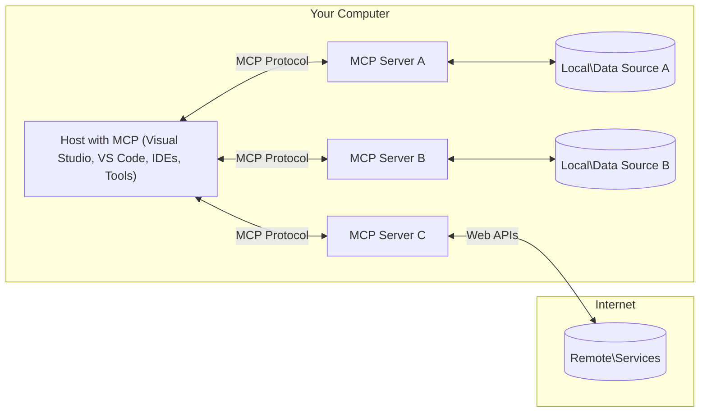

<!--
CO_OP_TRANSLATOR_METADATA:
{
  "original_hash": "0a6a7bcb289c024a91289e0444cb370b",
<<<<<<< HEAD
  "translation_date": "2025-08-18T20:36:01+00:00",
=======
  "translation_date": "2025-08-18T15:47:55+00:00",
>>>>>>> origin/main
  "source_file": "01-CoreConcepts/README.md",
  "language_code": "ro"
}
-->
# Concepte de bază MCP: Stăpânirea Protocolului de Context al Modelului pentru Integrarea AI

[](https://youtu.be/earDzWGtE84)

_(Faceți clic pe imaginea de mai sus pentru a viziona videoclipul acestei lecții)_

[Model Context Protocol (MCP)](https://gi- **Consimțământ explicit al utilizatorului**: Toate accesările de date și operațiunile necesită aprobarea explicită a utilizatorului înainte de execuție. Utilizatorii trebuie să înțeleagă clar ce date vor fi accesate și ce acțiuni vor fi efectuate, având control detaliat asupra permisiunilor și autorizărilor.

<<<<<<< HEAD
- **Protecția confidențialității datelor**: Datele utilizatorului sunt expuse doar cu consimțământ explicit și trebuie protejate prin controale de acces robuste pe toată durata interacțiunii. Implementările trebuie să prevină transmiterea neautorizată a datelor și să mențină limite stricte de confidențialitate.
=======
- **Protecția confidențialității datelor**: Datele utilizatorului sunt expuse doar cu consimțământ explicit și trebuie protejate prin controale de acces robuste pe tot parcursul ciclului de interacțiune. Implementările trebuie să prevină transmiterea neautorizată a datelor și să mențină limite stricte de confidențialitate.
>>>>>>> origin/main

- **Siguranța execuției instrumentelor**: Fiecare invocare a unui instrument necesită consimțământ explicit al utilizatorului, cu o înțelegere clară a funcționalității, parametrilor și impactului potențial. Limitele de securitate robuste trebuie să prevină execuțiile neintenționate, nesigure sau malițioase ale instrumentelor.

- **Securitatea stratului de transport**: Toate canalele de comunicare ar trebui să utilizeze mecanisme adecvate de criptare și autentificare. Conexiunile la distanță trebuie să implementeze protocoale de transport securizate și o gestionare corespunzătoare a acreditivelor.

#### Ghiduri de implementare:

- **Gestionarea permisiunilor**: Implementați sisteme de permisiuni detaliate care permit utilizatorilor să controleze ce servere, instrumente și resurse sunt accesibile.
<<<<<<< HEAD
- **Autentificare și autorizare**: Utilizați metode de autentificare securizate (OAuth, chei API) cu gestionare și expirare corespunzătoare a tokenurilor.  
=======
- **Autentificare și autorizare**: Utilizați metode de autentificare securizate (OAuth, chei API) cu gestionarea și expirarea corespunzătoare a tokenurilor.  
>>>>>>> origin/main
- **Validarea intrărilor**: Validați toți parametrii și datele de intrare conform schemelor definite pentru a preveni atacurile de tip injecție.
- **Jurnalizare audit**: Mențineți jurnale cuprinzătoare ale tuturor operațiunilor pentru monitorizarea securității și conformitate.

[Model Context Protocol (MCP)](https://modelcontextprotocol.io/specification/2025-06-18/) este un cadru standardizat și puternic care optimizează comunicarea între Modelele de Limbaj de Mari Dimensiuni (LLMs) și instrumentele, aplicațiile și sursele de date externe. Acest ghid vă va conduce prin conceptele de bază ale MCP, asigurându-vă că înțelegeți arhitectura client-server, componentele esențiale, mecanismele de comunicare și cele mai bune practici de implementare.

## Prezentare generală

Această lecție explorează arhitectura fundamentală și componentele care alcătuiesc ecosistemul Model Context Protocol (MCP). Veți învăța despre arhitectura client-server, componentele cheie și mecanismele de comunicare care alimentează interacțiunile MCP.

<<<<<<< HEAD
## Obiective cheie de învățare
=======
## Obiectivele principale ale lecției
>>>>>>> origin/main

Până la sfârșitul acestei lecții, veți:

- Înțelege arhitectura client-server MCP.
- Identifica rolurile și responsabilitățile gazdelor, clienților și serverelor.
- Analiza caracteristicile de bază care fac din MCP un strat de integrare flexibil.
- Învăța cum circulă informațiile în cadrul ecosistemului MCP.
- Obține perspective practice prin exemple de cod în .NET, Java, Python și JavaScript.

## Arhitectura MCP: O privire mai profundă

Ecosistemul MCP este construit pe un model client-server. Această structură modulară permite aplicațiilor AI să interacționeze eficient cu instrumente, baze de date, API-uri și resurse contextuale. Să descompunem această arhitectură în componentele sale de bază.

La bază, MCP urmează o arhitectură client-server în care o aplicație gazdă se poate conecta la mai multe servere:



- **Gazde MCP**: Programe precum VSCode, Claude Desktop, IDE-uri sau instrumente AI care doresc să acceseze date prin MCP.
- **Clienți MCP**: Clienți de protocol care mențin conexiuni 1:1 cu serverele.
- **Servere MCP**: Programe ușoare care expun fiecare capabilități specifice prin Protocolul de Context al Modelului standardizat.
- **Surse de date locale**: Fișierele, bazele de date și serviciile computerului dvs. pe care serverele MCP le pot accesa în siguranță.
- **Servicii la distanță**: Sisteme externe disponibile pe internet la care serverele MCP se pot conecta prin API-uri.

<<<<<<< HEAD
Protocolul MCP este un standard în evoluție care utilizează versiuni bazate pe date (format YYYY-MM-DD). Versiunea curentă a protocolului este **2025-06-18**. Puteți vedea cele mai recente actualizări ale [specificației protocolului](https://modelcontextprotocol.io/specification/2025-06-18/).
=======
Protocolul MCP este un standard în evoluție care folosește versiuni bazate pe date (format YYYY-MM-DD). Versiunea curentă a protocolului este **2025-06-18**. Puteți vedea cele mai recente actualizări ale [specificației protocolului](https://modelcontextprotocol.io/specification/2025-06-18/).
>>>>>>> origin/main

### 1. Gazde

În Model Context Protocol (MCP), **Gazdele** sunt aplicații AI care servesc drept interfața principală prin care utilizatorii interacționează cu protocolul. Gazdele coordonează și gestionează conexiunile la mai multe servere MCP prin crearea de clienți MCP dedicați pentru fiecare conexiune la server. Exemple de gazde includ:

- **Aplicații AI**: Claude Desktop, Visual Studio Code, Claude Code.
<<<<<<< HEAD
- **Mediuri de dezvoltare**: IDE-uri și editoare de cod cu integrare MCP.  
=======
- **Mediile de dezvoltare**: IDE-uri și editoare de cod cu integrare MCP.  
>>>>>>> origin/main
- **Aplicații personalizate**: Agenți AI și instrumente construite pentru scopuri specifice.

**Gazdele** sunt aplicații care coordonează interacțiunile modelelor AI. Ele:

- **Orchestrează modelele AI**: Execută sau interacționează cu LLM-uri pentru a genera răspunsuri și a coordona fluxurile de lucru AI.
- **Gestionează conexiunile clienților**: Creează și mențin un client MCP pentru fiecare conexiune la server MCP.
- **Controlează interfața utilizatorului**: Gestionează fluxul conversației, interacțiunile utilizatorului și prezentarea răspunsurilor.  
- **Aplică securitatea**: Controlează permisiunile, constrângerile de securitate și autentificarea.
- **Gestionează consimțământul utilizatorului**: Administrează aprobarea utilizatorului pentru partajarea datelor și execuția instrumentelor.

### 2. Clienți

**Clienții** sunt componente esențiale care mențin conexiuni dedicate unu-la-unu între Gazde și serverele MCP. Fiecare client MCP este instanțiat de Gazdă pentru a se conecta la un server MCP specific, asigurând canale de comunicare organizate și sigure. Mai mulți clienți permit Gazdelor să se conecteze simultan la mai multe servere.

**Clienții** sunt componente de conectare în cadrul aplicației gazdă. Ei:

- **Comunicare prin protocol**: Trimit cereri JSON-RPC 2.0 către servere cu solicitări și instrucțiuni.
- **Negocierea capabilităților**: Negociază caracteristicile suportate și versiunile protocolului cu serverele în timpul inițializării.
- **Execuția instrumentelor**: Gestionează cererile de execuție a instrumentelor de la modele și procesează răspunsurile.
- **Actualizări în timp real**: Gestionează notificările și actualizările în timp real de la servere.
- **Procesarea răspunsurilor**: Procesează și formatează răspunsurile serverelor pentru afișarea către utilizatori.

### 3. Servere

<<<<<<< HEAD
**Serverele** sunt programe care furnizează context, instrumente și capabilități clienților MCP. Ele pot fi executate local (pe aceeași mașină cu Gazda) sau la distanță (pe platforme externe) și sunt responsabile de gestionarea cererilor clienților și de furnizarea de răspunsuri structurate. Serverele expun funcționalități specifice prin Protocolul de Context al Modelului standardizat.
=======
**Serverele** sunt programe care oferă context, instrumente și capabilități clienților MCP. Ele pot fi executate local (pe aceeași mașină cu Gazda) sau la distanță (pe platforme externe) și sunt responsabile de gestionarea cererilor clienților și de furnizarea de răspunsuri structurate. Serverele expun funcționalități specifice prin Protocolul de Context al Modelului standardizat.
>>>>>>> origin/main

**Serverele** sunt servicii care oferă context și capabilități. Ele:

- **Înregistrarea caracteristicilor**: Înregistrează și expun primitivele disponibile (resurse, solicitări, instrumente) către clienți.
- **Procesarea cererilor**: Primesc și execută apeluri de instrumente, cereri de resurse și solicitări de prompturi de la clienți.
- **Furnizarea contextului**: Oferă informații contextuale și date pentru a îmbunătăți răspunsurile modelului.
- **Gestionarea stării**: Mențin starea sesiunii și gestionează interacțiunile cu stare, atunci când este necesar.
- **Notificări în timp real**: Trimit notificări despre schimbările de capabilități și actualizări către clienții conectați.

Serverele pot fi dezvoltate de oricine pentru a extinde capabilitățile modelului cu funcționalități specializate și suportă scenarii de implementare atât locale, cât și la distanță.

### 4. Primitivele serverului

Serverele din Model Context Protocol (MCP) oferă trei **primitive** de bază care definesc elementele fundamentale pentru interacțiuni bogate între clienți, gazde și modele de limbaj. Aceste primitive specifică tipurile de informații contextuale și acțiuni disponibile prin protocol.

Serverele MCP pot expune orice combinație a următoarelor trei primitive de bază:

#### Resurse

**Resursele** sunt surse de date care oferă informații contextuale aplicațiilor AI. Ele reprezintă conținut static sau dinamic care poate îmbunătăți înțelegerea și luarea deciziilor de către model:

- **Date contextuale**: Informații structurate și context pentru consumul modelului AI.
- **Baze de cunoștințe**: Repozitorii de documente, articole, manuale și lucrări de cercetare.
- **Surse de date locale**: Fișiere, baze de date și informații ale sistemului local.  
- **Date externe**: Răspunsuri API, servicii web și date ale sistemelor la distanță.
- **Conținut dinamic**: Date în timp real care se actualizează în funcție de condițiile externe.

Resursele sunt identificate prin URI-uri și suportă descoperirea prin metodele `resources/list` și recuperarea prin `resources/read`:

```text
file://documents/project-spec.md
database://production/users/schema
api://weather/current
```

#### Solicitări

**Solicitările** sunt șabloane reutilizabile care ajută la structurarea interacțiunilor cu modelele de limbaj. Ele oferă modele standardizate de interacțiune și fluxuri de lucru șablonizate:

- **Interacțiuni bazate pe șabloane**: Mesaje pre-structurate și inițiatoare de conversații.
- **Șabloane de fluxuri de lucru**: Secvențe standardizate pentru sarcini și interacțiuni comune.
- **Exemple few-shot**: Șabloane bazate pe exemple pentru instruirea modelului.
- **Solicitări de sistem**: Solicitări fundamentale care definesc comportamentul și contextul modelului.
- **Șabloane dinamice**: Solicitări parametrizate care se adaptează la contexte specifice.

Solicitările suportă substituirea variabilelor și pot fi descoperite prin `prompts/list` și recuperate cu `prompts/get`:

```markdown
Generate a {{task_type}} for {{product}} targeting {{audience}} with the following requirements: {{requirements}}
```

#### Instrumente

**Instrumentele** sunt funcții executabile pe care modelele AI le pot invoca pentru a efectua acțiuni specifice. Ele reprezintă „verbele” ecosistemului MCP, permițând modelelor să interacționeze cu sisteme externe:

- **Funcții executabile**: Operațiuni discrete pe care modelele le pot invoca cu parametri specifici.
- **Integrarea sistemelor externe**: Apeluri API, interogări de baze de date, operațiuni pe fișiere, calcule.
- **Identitate unică**: Fiecare instrument are un nume distinct, o descriere și o schemă de parametri.
- **I/O structurat**: Instrumentele acceptă parametri validați și returnează răspunsuri structurate, tipizate.
- **Capabilități de acțiune**: Permit modelelor să efectueze acțiuni reale și să recupereze date live.

Instrumentele sunt definite cu JSON Schema pentru validarea parametrilor și descoperite prin `tools/list` și executate prin `tools/call`:

```typescript
server.tool(
  "search_products", 
  {
    query: z.string().describe("Search query for products"),
    category: z.string().optional().describe("Product category filter"),
    max_results: z.number().default(10).describe("Maximum results to return")
  }, 
  async (params) => {
    // Execute search and return structured results
    return await productService.search(params);
  }
);
```

## Primitivele clientului

În Model Context Protocol (MCP), **clienții** pot expune primitive care permit serverelor să solicite capabilități suplimentare de la aplicația gazdă. Aceste primitive de partea clientului permit implementări de server mai bogate și mai interactive, care pot accesa capabilitățile modelului AI și interacțiunile utilizatorului.

### Eșantionare

**Eșantionarea** permite serverelor să solicite completări ale modelului de limbaj din aplicația AI a clientului. Această primitivă permite serverelor să acceseze capabilitățile LLM fără a încorpora propriile dependențe de model:

- **Acces independent de model**: Serverele pot solicita completări fără a include SDK-uri LLM sau a gestiona accesul la model.
- **AI inițiat de server**: Permite serverelor să genereze autonom conținut folosind modelul AI al clientului.
<<<<<<< HEAD
- **Interacțiuni recursive LLM**: Suportă scenarii complexe în care serverele au nevoie de asistență AI pentru procesare.
=======
- **Interacțiuni recursive cu LLM**: Suportă scenarii complexe în care serverele au nevoie de asistență AI pentru procesare.
>>>>>>> origin/main
- **Generare de conținut dinamic**: Permite serverelor să creeze răspunsuri contextuale folosind modelul gazdei.

Eșantionarea este inițiată prin metoda `sampling/complete`, unde serverele trimit cereri de completare către clienți.

<<<<<<< HEAD
### Elicitare  

**Elicitarea** permite serverelor să solicite informații suplimentare sau confirmări de la utilizatori prin interfața clientului:

- **Solicitări de intrare ale utilizatorului**: Serverele pot cere informații suplimentare atunci când sunt necesare pentru execuția instrumentelor.
- **Dialoguri de confirmare**: Solicită aprobarea utilizatorului pentru operațiuni sensibile sau cu impact.
- **Fluxuri de lucru interactive**: Permit serverelor să creeze interacțiuni pas cu pas cu utilizatorii.
- **Colectare dinamică de parametri**: Adună parametri lipsă sau opționali în timpul execuției instrumentelor.

Cereri de elicitare sunt realizate folosind metoda `elicitation/request` pentru a colecta intrări de la utilizator prin interfața clientului.
=======
### Solicitare

**Solicitarea** permite serverelor să ceară informații suplimentare sau confirmări de la utilizatori prin interfața clientului:

- **Cereri de intrare ale utilizatorului**: Serverele pot solicita informații suplimentare atunci când sunt necesare pentru execuția instrumentelor.
- **Dialoguri de confirmare**: Solicită aprobarea utilizatorului pentru operațiuni sensibile sau cu impact.
- **Fluxuri de lucru interactive**: Permit serverelor să creeze interacțiuni pas cu pas cu utilizatorul.
- **Colectare dinamică de parametri**: Adună parametri lipsă sau opționali în timpul execuției instrumentelor.

Solicitările sunt realizate folosind metoda `elicitation/request` pentru a colecta intrările utilizatorului prin interfața clientului.
>>>>>>> origin/main

### Jurnalizare

**Jurnalizarea** permite serverelor să trimită mesaje de jurnal structurate către clienți pentru depanare, monitorizare și vizibilitate operațională:

- **Suport pentru depanare**: Permite serverelor să furnizeze jurnale detaliate de execuție pentru depanare.
- **Monitorizare operațională**: Trimite actualizări de stare și metrici de performanță către clienți.
- **Raportare a erorilor**: Furnizează context detaliat al erorilor și informații de diagnostic.
- **Urme de audit**: Creează jurnale cuprinzătoare ale operațiunilor și deciziilor serverului.

Mesajele de jurnalizare sunt trimise către clienți pentru a oferi transparență în operațiunile serverului și pentru a facilita depanarea.

## Fluxul de informații în MCP

Model Context Protocol (MCP) definește un flux structurat de informații între gazde, clienți, servere și modele. Înțelegerea acestui flux ajută la clarificarea modului în care cererile utilizatorilor sunt procesate și cum instrumentele și datele externe sunt integrate în răspunsurile modelului.

- **Gazda inițiază conexiunea**  
  Aplicația gazdă (cum ar fi un IDE sau o interfață de chat) stabilește o conexiune la un server MCP, de obicei prin STDIO, WebSocket sau un alt transport suportat.

- **Negocierea capabilităților**  
  Clientul (încorporat în gazdă) și serverul schimbă informații despre caracteristicile, instrumentele, resursele și versiunile protocolului suportate. Acest lucru asigură că ambele părți înțeleg ce capabilități sunt disponibile pentru sesiune.

<<<<<<< HEAD
- **Cererile utilizatorului**  
  Utilizatorul interacționează cu gazda (de exemplu, introduce un prompt sau o comandă). Gazda colectează această intrare și o transmite clientului pentru procesare.

- **Utilizarea resurselor sau instrumentelor**  
  - Clientul poate solicita context suplimentar sau resurse de la server (cum ar fi fișiere, intrări din baze de date sau articole din baze de cunoștințe) pentru a îmbogăți înțelegerea modelului.
  - Dacă modelul determină că este necesar un instrument (de exemplu, pentru a prelua date, a efectua un calcul sau a apela un
- **Gestionarea ciclului de viață**: Se ocupă de inițializarea conexiunii, negocierea capabilităților și încheierea sesiunii între clienți și servere  
- **Primitivele serverului**: Permite serverelor să ofere funcționalități de bază prin instrumente, resurse și șabloane  
- **Primitivele clientului**: Permite serverelor să solicite completări de la LLM-uri, să obțină input de la utilizatori și să trimită mesaje de jurnal  
- **Notificări în timp real**: Suportă notificări asincrone pentru actualizări dinamice fără interogare constantă  

#### Caracteristici cheie:

- **Negocierea versiunii protocolului**: Utilizează versiuni bazate pe dată (YYYY-MM-DD) pentru a asigura compatibilitatea  
- **Descoperirea capabilităților**: Clienții și serverele schimbă informații despre funcționalitățile suportate în timpul inițializării  
- **Sesiuni cu stare**: Menține starea conexiunii pe parcursul mai multor interacțiuni pentru continuitatea contextului  

### Strat de transport
=======
- **Cererea utilizatorului**  
  Utilizatorul interacționează cu gazda (de exemplu, introduce un prompt sau o comandă). Gazda colectează această intrare și o transmite clientului pentru procesare.

- **Utilizarea resurselor sau instrumentelor**  
  - Clientul poate solicita context suplimentar sau resurse de la server (cum ar fi fișiere, intrări din baze de date sau articole din baze de cunoștințe) pentru a îmbunătăți înțelegerea modelului.
  - Dacă modelul determină că este necesar un instrument (de exemplu, pentru a prelua date, a efectua un calcul sau a apela un API), client
- **Gestionarea ciclului de viață**: Se ocupă de inițializarea conexiunii, negocierea capabilităților și încheierea sesiunii între clienți și servere  
- **Primitivele serverului**: Permite serverelor să ofere funcționalități de bază prin instrumente, resurse și șabloane  
- **Primitivele clientului**: Permite serverelor să solicite completări de la LLM-uri, să obțină input de la utilizatori și să trimită mesaje de jurnal  
- **Notificări în timp real**: Suportă notificări asincrone pentru actualizări dinamice fără a necesita interogări periodice  

#### Funcționalități cheie:

- **Negocierea versiunii protocolului**: Utilizează versiuni bazate pe date (YYYY-MM-DD) pentru a asigura compatibilitatea  
- **Descoperirea capabilităților**: Clienții și serverele schimbă informații despre funcționalitățile suportate în timpul inițializării  
- **Sesiuni cu stare**: Menține starea conexiunii pe parcursul mai multor interacțiuni pentru continuitatea contextului  

### Stratul de transport
>>>>>>> origin/main

**Stratul de transport** gestionează canalele de comunicare, încadrarea mesajelor și autentificarea între participanții MCP:

#### Mecanisme de transport suportate:

<<<<<<< HEAD
1. **Transport STDIO**:  
   - Utilizează fluxurile de intrare/ieșire standard pentru comunicarea directă între procese  
   - Optim pentru procese locale pe aceeași mașină, fără costuri de rețea  
   - Utilizat frecvent pentru implementările locale ale serverelor MCP  

2. **Transport HTTP transmisibil**:  
   - Utilizează HTTP POST pentru mesaje de la client la server  
   - Opțional, Server-Sent Events (SSE) pentru streaming de la server la client  
   - Permite comunicarea cu servere la distanță prin rețele  
   - Suportă autentificarea standard HTTP (token-uri bearer, chei API, anteturi personalizate)  
   - MCP recomandă OAuth pentru autentificare sigură bazată pe token-uri  

#### Abstracția transportului:

Stratul de transport abstractizează detaliile comunicării față de stratul de date, permițând același format de mesaj JSON-RPC 2.0 pentru toate mecanismele de transport. Această abstractizare permite aplicațiilor să comute fără probleme între servere locale și la distanță.
=======
1. **Transport STDIO**:
   - Utilizează fluxurile standard de intrare/ieșire pentru comunicarea directă între procese  
   - Optimizat pentru procese locale pe aceeași mașină, fără costuri suplimentare de rețea  
   - Utilizat frecvent pentru implementările locale ale serverelor MCP  

2. **Transport HTTP Streamable**:
   - Utilizează HTTP POST pentru mesaje de la client la server  
   - Opțional, Server-Sent Events (SSE) pentru streaming de la server la client  
   - Permite comunicarea cu servere la distanță prin rețele  
   - Suportă autentificarea standard HTTP (tokenuri bearer, chei API, antete personalizate)  
   - MCP recomandă OAuth pentru autentificare sigură bazată pe tokenuri  

#### Abstracția transportului:

Stratul de transport abstractizează detaliile de comunicare față de stratul de date, permițând utilizarea aceluiași format de mesaje JSON-RPC 2.0 pe toate mecanismele de transport. Această abstractizare permite aplicațiilor să comute fără probleme între servere locale și la distanță.
>>>>>>> origin/main

### Considerații de securitate

Implementările MCP trebuie să respecte mai multe principii critice de securitate pentru a asigura interacțiuni sigure, de încredere și securizate în toate operațiunile protocolului:

<<<<<<< HEAD
- **Consimțământul și controlul utilizatorului**: Utilizatorii trebuie să ofere consimțământ explicit înainte ca orice date să fie accesate sau operațiuni să fie efectuate. Aceștia trebuie să aibă control clar asupra datelor partajate și acțiunilor autorizate, susținut de interfețe intuitive pentru revizuirea și aprobarea activităților.  

- **Confidențialitatea datelor**: Datele utilizatorului trebuie expuse doar cu consimțământ explicit și trebuie protejate prin controale adecvate de acces. Implementările MCP trebuie să prevină transmiterea neautorizată de date și să asigure confidențialitatea pe parcursul tuturor interacțiunilor.  

- **Siguranța instrumentelor**: Înainte de a invoca orice instrument, este necesar consimțământul explicit al utilizatorului. Utilizatorii trebuie să înțeleagă clar funcționalitatea fiecărui instrument, iar limitele de securitate robuste trebuie să fie aplicate pentru a preveni execuțiile neintenționate sau nesigure ale instrumentelor.  

Respectând aceste principii de securitate, MCP asigură menținerea încrederii, confidențialității și siguranței utilizatorilor în toate interacțiunile protocolului, oferind în același timp integrări puternice cu AI.

## Exemple de cod: componente cheie

Mai jos sunt exemple de cod în mai multe limbaje de programare populare care ilustrează cum să implementați componentele cheie ale serverului MCP și instrumentele.
=======
- **Consimțământul și controlul utilizatorului**: Utilizatorii trebuie să își dea consimțământul explicit înainte ca orice date să fie accesate sau operațiuni să fie efectuate. Aceștia trebuie să aibă control clar asupra datelor partajate și acțiunilor autorizate, susținut de interfețe intuitive pentru revizuirea și aprobarea activităților.

- **Confidențialitatea datelor**: Datele utilizatorilor trebuie expuse doar cu consimțământ explicit și protejate prin controale adecvate de acces. Implementările MCP trebuie să prevină transmiterea neautorizată a datelor și să asigure menținerea confidențialității pe parcursul tuturor interacțiunilor.

- **Siguranța instrumentelor**: Înainte de a invoca orice instrument, este necesar consimțământul explicit al utilizatorului. Utilizatorii trebuie să înțeleagă clar funcționalitatea fiecărui instrument, iar limitele de securitate robuste trebuie să fie aplicate pentru a preveni execuțiile neintenționate sau nesigure ale instrumentelor.

Prin respectarea acestor principii de securitate, MCP asigură menținerea încrederii, confidențialității și siguranței utilizatorilor în toate interacțiunile protocolului, oferind în același timp integrații puternice cu AI.

## Exemple de cod: Componente cheie

Mai jos sunt exemple de cod în mai multe limbaje de programare populare care ilustrează cum să implementați componentele și instrumentele cheie ale unui server MCP.
>>>>>>> origin/main

### Exemplu .NET: Crearea unui server MCP simplu cu instrumente

Iată un exemplu practic în .NET care demonstrează cum să implementați un server MCP simplu cu instrumente personalizate. Acest exemplu arată cum să definiți și să înregistrați instrumente, să gestionați cererile și să conectați serverul utilizând Model Context Protocol.

```csharp
using System;
using System.Threading.Tasks;
using ModelContextProtocol.Server;
using ModelContextProtocol.Server.Transport;
using ModelContextProtocol.Server.Tools;

public class WeatherServer
{
    public static async Task Main(string[] args)
    {
        // Create an MCP server
        var server = new McpServer(
            name: "Weather MCP Server",
            version: "1.0.0"
        );
        
        // Register our custom weather tool
        server.AddTool<string, WeatherData>("weatherTool", 
            description: "Gets current weather for a location",
            execute: async (location) => {
                // Call weather API (simplified)
                var weatherData = await GetWeatherDataAsync(location);
                return weatherData;
            });
        
        // Connect the server using stdio transport
        var transport = new StdioServerTransport();
        await server.ConnectAsync(transport);
        
        Console.WriteLine("Weather MCP Server started");
        
        // Keep the server running until process is terminated
        await Task.Delay(-1);
    }
    
    private static async Task<WeatherData> GetWeatherDataAsync(string location)
    {
        // This would normally call a weather API
        // Simplified for demonstration
        await Task.Delay(100); // Simulate API call
        return new WeatherData { 
            Temperature = 72.5,
            Conditions = "Sunny",
            Location = location
        };
    }
}

public class WeatherData
{
    public double Temperature { get; set; }
    public string Conditions { get; set; }
    public string Location { get; set; }
}
```

<<<<<<< HEAD
### Exemplu Java: Componentele serverului MCP
=======
### Exemplu Java: Componentele unui server MCP
>>>>>>> origin/main

Acest exemplu demonstrează același server MCP și înregistrarea instrumentelor ca în exemplul .NET de mai sus, dar implementat în Java.

```java
import io.modelcontextprotocol.server.McpServer;
import io.modelcontextprotocol.server.McpToolDefinition;
import io.modelcontextprotocol.server.transport.StdioServerTransport;
import io.modelcontextprotocol.server.tool.ToolExecutionContext;
import io.modelcontextprotocol.server.tool.ToolResponse;

public class WeatherMcpServer {
    public static void main(String[] args) throws Exception {
        // Create an MCP server
        McpServer server = McpServer.builder()
            .name("Weather MCP Server")
            .version("1.0.0")
            .build();
            
        // Register a weather tool
        server.registerTool(McpToolDefinition.builder("weatherTool")
            .description("Gets current weather for a location")
            .parameter("location", String.class)
            .execute((ToolExecutionContext ctx) -> {
                String location = ctx.getParameter("location", String.class);
                
                // Get weather data (simplified)
                WeatherData data = getWeatherData(location);
                
                // Return formatted response
                return ToolResponse.content(
                    String.format("Temperature: %.1f°F, Conditions: %s, Location: %s", 
                    data.getTemperature(), 
                    data.getConditions(), 
                    data.getLocation())
                );
            })
            .build());
        
        // Connect the server using stdio transport
        try (StdioServerTransport transport = new StdioServerTransport()) {
            server.connect(transport);
            System.out.println("Weather MCP Server started");
            // Keep server running until process is terminated
            Thread.currentThread().join();
        }
    }
    
    private static WeatherData getWeatherData(String location) {
        // Implementation would call a weather API
        // Simplified for example purposes
        return new WeatherData(72.5, "Sunny", location);
    }
}

class WeatherData {
    private double temperature;
    private String conditions;
    private String location;
    
    public WeatherData(double temperature, String conditions, String location) {
        this.temperature = temperature;
        this.conditions = conditions;
        this.location = location;
    }
    
    public double getTemperature() {
        return temperature;
    }
    
    public String getConditions() {
        return conditions;
    }
    
    public String getLocation() {
        return location;
    }
}
```

### Exemplu Python: Construirea unui server MCP

<<<<<<< HEAD
În acest exemplu, arătăm cum să construiți un server MCP în Python. Sunt prezentate două moduri diferite de a crea instrumente.
=======
În acest exemplu, arătăm cum să construiți un server MCP în Python. Sunt prezentate, de asemenea, două moduri diferite de a crea instrumente.
>>>>>>> origin/main

```python
#!/usr/bin/env python3
import asyncio
from mcp.server.fastmcp import FastMCP
from mcp.server.transports.stdio import serve_stdio

# Create a FastMCP server
mcp = FastMCP(
    name="Weather MCP Server",
    version="1.0.0"
)

@mcp.tool()
def get_weather(location: str) -> dict:
    """Gets current weather for a location."""
    # This would normally call a weather API
    # Simplified for demonstration
    return {
        "temperature": 72.5,
        "conditions": "Sunny",
        "location": location
    }

# Alternative approach using a class
class WeatherTools:
    @mcp.tool()
    def forecast(self, location: str, days: int = 1) -> dict:
        """Gets weather forecast for a location for the specified number of days."""
        # This would normally call a weather API forecast endpoint
        # Simplified for demonstration
        return {
            "location": location,
            "forecast": [
                {"day": i+1, "temperature": 70 + i, "conditions": "Partly Cloudy"}
                for i in range(days)
            ]
        }

# Instantiate the class to register its tools
weather_tools = WeatherTools()

# Start the server using stdio transport
if __name__ == "__main__":
    asyncio.run(serve_stdio(mcp))
```

### Exemplu JavaScript: Crearea unui server MCP

<<<<<<< HEAD
Acest exemplu arată crearea unui server MCP în JavaScript și cum să înregistrați două instrumente legate de vreme.
=======
Acest exemplu arată cum să creați un server MCP în JavaScript și cum să înregistrați două instrumente legate de vreme.
>>>>>>> origin/main

```javascript
// Using the official Model Context Protocol SDK
import { McpServer } from "@modelcontextprotocol/sdk/server/mcp.js";
import { StdioServerTransport } from "@modelcontextprotocol/sdk/server/stdio.js";
import { z } from "zod"; // For parameter validation

// Create an MCP server
const server = new McpServer({
  name: "Weather MCP Server",
  version: "1.0.0"
});

// Define a weather tool
server.tool(
  "weatherTool",
  {
    location: z.string().describe("The location to get weather for")
  },
  async ({ location }) => {
    // This would normally call a weather API
    // Simplified for demonstration
    const weatherData = await getWeatherData(location);
    
    return {
      content: [
        { 
          type: "text", 
          text: `Temperature: ${weatherData.temperature}°F, Conditions: ${weatherData.conditions}, Location: ${weatherData.location}` 
        }
      ]
    };
  }
);

// Define a forecast tool
server.tool(
  "forecastTool",
  {
    location: z.string(),
    days: z.number().default(3).describe("Number of days for forecast")
  },
  async ({ location, days }) => {
    // This would normally call a weather API
    // Simplified for demonstration
    const forecast = await getForecastData(location, days);
    
    return {
      content: [
        { 
          type: "text", 
          text: `${days}-day forecast for ${location}: ${JSON.stringify(forecast)}` 
        }
      ]
    };
  }
);

// Helper functions
async function getWeatherData(location) {
  // Simulate API call
  return {
    temperature: 72.5,
    conditions: "Sunny",
    location: location
  };
}

async function getForecastData(location, days) {
  // Simulate API call
  return Array.from({ length: days }, (_, i) => ({
    day: i + 1,
    temperature: 70 + Math.floor(Math.random() * 10),
    conditions: i % 2 === 0 ? "Sunny" : "Partly Cloudy"
  }));
}

// Connect the server using stdio transport
const transport = new StdioServerTransport();
server.connect(transport).catch(console.error);

console.log("Weather MCP Server started");
```

<<<<<<< HEAD
Acest exemplu JavaScript demonstrează cum să creați un client MCP care se conectează la un server, trimite un șablon și procesează răspunsul, inclusiv orice apeluri de instrumente care au fost făcute.
=======
Acest exemplu JavaScript demonstrează cum să creați un client MCP care se conectează la un server, trimite un șablon și procesează răspunsul, inclusiv orice apeluri de instrumente efectuate.
>>>>>>> origin/main

## Securitate și autorizare

MCP include mai multe concepte și mecanisme încorporate pentru gestionarea securității și autorizării pe parcursul protocolului:

<<<<<<< HEAD
1. **Controlul permisiunilor instrumentelor**:  
   Clienții pot specifica ce instrumente are voie un model să utilizeze în timpul unei sesiuni. Acest lucru asigură că doar instrumentele autorizate explicit sunt accesibile, reducând riscul operațiunilor neintenționate sau nesigure. Permisiunile pot fi configurate dinamic pe baza preferințelor utilizatorului, politicilor organizaționale sau contextului interacțiunii.  

2. **Autentificare**:  
   Serverele pot solicita autentificare înainte de a acorda acces la instrumente, resurse sau operațiuni sensibile. Acest lucru poate implica chei API, token-uri OAuth sau alte scheme de autentificare. Autentificarea adecvată asigură că doar clienții și utilizatorii de încredere pot invoca capabilitățile serverului.  

3. **Validare**:  
   Validarea parametrilor este aplicată pentru toate invocările de instrumente. Fiecare instrument definește tipurile, formatele și constrângerile așteptate pentru parametrii săi, iar serverul validează cererile primite în consecință. Acest lucru previne intrările defecte sau malițioase să ajungă la implementările instrumentelor și ajută la menținerea integrității operațiunilor.  

4. **Limitarea ratei**:  
   Pentru a preveni abuzurile și a asigura utilizarea echitabilă a resurselor serverului, serverele MCP pot implementa limitarea ratei pentru apelurile de instrumente și accesul la resurse. Limitele de rată pot fi aplicate per utilizator, per sesiune sau global și ajută la protejarea împotriva atacurilor de tip denial-of-service sau consumului excesiv de resurse.  

Prin combinarea acestor mecanisme, MCP oferă o fundație sigură pentru integrarea modelelor lingvistice cu instrumente și surse de date externe, oferind utilizatorilor și dezvoltatorilor control detaliat asupra accesului și utilizării.

## Mesaje de protocol și fluxul de comunicare

Comunicarea MCP utilizează mesaje structurate **JSON-RPC 2.0** pentru a facilita interacțiuni clare și fiabile între gazde, clienți și servere. Protocolul definește modele specifice de mesaje pentru diferite tipuri de operațiuni:

### Tipuri de mesaje de bază:

#### **Mesaje de inițializare**  
- Cerere **`initialize`**: Stabilește conexiunea și negociază versiunea protocolului și capabilitățile  
- Răspuns **`initialize`**: Confirmă funcționalitățile suportate și informațiile serverului  
- **`notifications/initialized`**: Semnalează că inițializarea este completă și sesiunea este gata  

#### **Mesaje de descoperire**  
- Cerere **`tools/list`**: Descoperă instrumentele disponibile de la server  
- Cerere **`resources/list`**: Listează resursele disponibile (surse de date)  
- Cerere **`prompts/list`**: Recuperează șabloanele de șablon disponibile  

#### **Mesaje de execuție**  
- Cerere **`tools/call`**: Execută un instrument specific cu parametrii furnizați  
- Cerere **`resources/read`**: Recuperează conținutul dintr-o resursă specifică  
- Cerere **`prompts/get`**: Obține un șablon cu parametri opționali  

#### **Mesaje pe partea clientului**  
- Cerere **`sampling/complete`**: Serverul solicită completarea LLM de la client  
- **`elicitation/request`**: Serverul solicită input de la utilizator prin interfața clientului  
- Mesaje de jurnalizare: Serverul trimite mesaje structurate de jurnal către client  

#### **Mesaje de notificare**  
=======
1. **Controlul permisiunilor pentru instrumente**:  
   Clienții pot specifica ce instrumente sunt permise unui model în timpul unei sesiuni. Acest lucru asigură că doar instrumentele autorizate explicit sunt accesibile, reducând riscul operațiunilor neintenționate sau nesigure. Permisiunile pot fi configurate dinamic pe baza preferințelor utilizatorului, politicilor organizaționale sau contextului interacțiunii.

2. **Autentificare**:  
   Serverele pot solicita autentificare înainte de a acorda acces la instrumente, resurse sau operațiuni sensibile. Acest lucru poate implica chei API, tokenuri OAuth sau alte scheme de autentificare. O autentificare corespunzătoare asigură că doar clienții și utilizatorii de încredere pot invoca capabilitățile serverului.

3. **Validare**:  
   Validarea parametrilor este aplicată pentru toate invocările de instrumente. Fiecare instrument definește tipurile, formatele și constrângerile așteptate pentru parametrii săi, iar serverul validează cererile primite în consecință. Acest lucru previne ca inputurile incorecte sau malițioase să ajungă la implementările instrumentelor și ajută la menținerea integrității operațiunilor.

4. **Limitarea ratei**:  
   Pentru a preveni abuzurile și a asigura utilizarea echitabilă a resurselor serverului, serverele MCP pot implementa limitarea ratei pentru apelurile de instrumente și accesul la resurse. Limitele de rată pot fi aplicate per utilizator, per sesiune sau global și ajută la protejarea împotriva atacurilor de tip denial-of-service sau a consumului excesiv de resurse.

Prin combinarea acestor mecanisme, MCP oferă o fundație sigură pentru integrarea modelelor lingvistice cu instrumente și surse de date externe, oferind în același timp utilizatorilor și dezvoltatorilor un control detaliat asupra accesului și utilizării.

## Mesaje ale protocolului și fluxul de comunicare

Comunicarea MCP utilizează mesaje structurate **JSON-RPC 2.0** pentru a facilita interacțiuni clare și de încredere între gazde, clienți și servere. Protocolul definește tipare specifice de mesaje pentru diferite tipuri de operațiuni:

### Tipuri de mesaje de bază:

#### **Mesaje de inițializare**
- **Cererea `initialize`**: Stabilește conexiunea și negociază versiunea protocolului și capabilitățile  
- **Răspunsul `initialize`**: Confirmă funcționalitățile suportate și informațiile serverului  
- **`notifications/initialized`**: Semnalează că inițializarea este completă și sesiunea este pregătită  

#### **Mesaje de descoperire**
- **Cererea `tools/list`**: Descoperă instrumentele disponibile pe server  
- **Cererea `resources/list`**: Listează resursele disponibile (surse de date)  
- **Cererea `prompts/list`**: Recuperează șabloanele de prompturi disponibile  

#### **Mesaje de execuție**  
- **Cererea `tools/call`**: Execută un instrument specific cu parametrii furnizați  
- **Cererea `resources/read`**: Recuperează conținut dintr-o resursă specifică  
- **Cererea `prompts/get`**: Obține un șablon de prompt cu parametri opționali  

#### **Mesaje pe partea clientului**
- **Cererea `sampling/complete`**: Serverul solicită completarea LLM de la client  
- **`elicitation/request`**: Serverul solicită input de la utilizator prin interfața clientului  
- **Mesaje de jurnalizare**: Serverul trimite mesaje structurate de jurnal către client  

#### **Mesaje de notificare**
>>>>>>> origin/main
- **`notifications/tools/list_changed`**: Serverul notifică clientul despre modificările instrumentelor  
- **`notifications/resources/list_changed`**: Serverul notifică clientul despre modificările resurselor  
- **`notifications/prompts/list_changed`**: Serverul notifică clientul despre modificările șabloanelor  

### Structura mesajelor:

Toate mesajele MCP urmează formatul JSON-RPC 2.0 cu:  
<<<<<<< HEAD
- **Mesaje de cerere**: Includ `id`, `method` și opțional `params`  
- **Mesaje de răspuns**: Includ `id` și fie `result`, fie `error`  
- **Mesaje de notificare**: Includ `method` și opțional `params` (fără `id` sau răspuns așteptat)  

Această comunicare structurată asigură interacțiuni fiabile, trasabile și extensibile, susținând scenarii avansate precum actualizări în timp real, lanțuri de instrumente și gestionarea robustă a erorilor.

## Concluzii cheie

- **Arhitectură**: MCP utilizează o arhitectură client-server unde gazdele gestionează multiple conexiuni ale clienților la servere  
- **Participanți**: Ecosistemul include gazde (aplicații AI), clienți (conectori de protocol) și servere (furnizori de capabilități)  
- **Mecanisme de transport**: Comunicarea suportă STDIO (local) și HTTP transmisibil cu SSE opțional (la distanță)  
- **Primitivele de bază**: Serverele expun instrumente (funcții executabile), resurse (surse de date) și șabloane (template-uri)  
- **Primitivele clientului**: Serverele pot solicita completări (LLM), input (utilizator) și jurnalizare de la clienți  
- **Fundația protocolului**: Bazat pe JSON-RPC 2.0 cu versiuni bazate pe dată (curent: 2025-06-18)  
=======
- **Mesaje de cerere**: Includ `id`, `method` și, opțional, `params`  
- **Mesaje de răspuns**: Includ `id` și fie `result`, fie `error`  
- **Mesaje de notificare**: Includ `method` și, opțional, `params` (fără `id` sau răspuns așteptat)  

Această comunicare structurată asigură interacțiuni fiabile, trasabile și extensibile, sprijinind scenarii avansate precum actualizări în timp real, lanțuri de instrumente și gestionarea robustă a erorilor.

## Concluzii cheie

- **Arhitectură**: MCP utilizează o arhitectură client-server în care gazdele gestionează conexiuni multiple între clienți și servere  
- **Participanți**: Ecosistemul include gazde (aplicații AI), clienți (conectori de protocol) și servere (furnizori de capabilități)  
- **Mecanisme de transport**: Comunicarea suportă STDIO (local) și HTTP Streamable cu SSE opțional (la distanță)  
- **Primitive de bază**: Serverele expun instrumente (funcții executabile), resurse (surse de date) și șabloane (template-uri)  
- **Primitivele clientului**: Serverele pot solicita completări (LLM), inputuri (de la utilizatori) și jurnalizare de la clienți  
- **Fundația protocolului**: Bazat pe JSON-RPC 2.0 cu versiuni bazate pe date (curent: 2025-06-18)  
>>>>>>> origin/main
- **Capabilități în timp real**: Suportă notificări pentru actualizări dinamice și sincronizare în timp real  
- **Securitate prioritară**: Consimțământ explicit al utilizatorului, protecția confidențialității datelor și transport securizat sunt cerințe de bază  

## Exercițiu

<<<<<<< HEAD
Proiectați un instrument MCP simplu care ar fi util în domeniul dvs. Definiți:  
1. Cum s-ar numi instrumentul  
2. Ce parametri ar accepta  
3. Ce output ar returna  
4. Cum ar putea un model să utilizeze acest instrument pentru a rezolva problemele utilizatorului  
=======
Proiectați un instrument MCP simplu care ar fi util în domeniul dumneavoastră. Definiți:  
1. Cum s-ar numi instrumentul  
2. Ce parametri ar accepta  
3. Ce output ar returna  
4. Cum ar putea un model să utilizeze acest instrument pentru a rezolva problemele utilizatorilor  
>>>>>>> origin/main

---

## Ce urmează

<<<<<<< HEAD
Următorul: [Capitolul 2: Securitate](../02-Security/README.md)  

**Declinarea responsabilității**:  
Acest document a fost tradus utilizând serviciul de traducere AI [Co-op Translator](https://github.com/Azure/co-op-translator). Deși depunem eforturi pentru a asigura acuratețea, vă rugăm să rețineți că traducerile automate pot conține erori sau inexactități. Documentul original în limba sa nativă ar trebui considerat sursa autoritară. Pentru informații critice, se recomandă traducerea profesională realizată de un specialist uman. Nu ne asumăm răspunderea pentru eventualele neînțelegeri sau interpretări greșite care pot apărea din utilizarea acestei traduceri.
=======
Următorul capitol: [Capitolul 2: Securitate](../02-Security/README.md)  

**Declinare de responsabilitate**:  
Acest document a fost tradus folosind serviciul de traducere AI [Co-op Translator](https://github.com/Azure/co-op-translator). Deși ne străduim să asigurăm acuratețea, vă rugăm să fiți conștienți că traducerile automate pot conține erori sau inexactități. Documentul original în limba sa natală ar trebui considerat sursa autoritară. Pentru informații critice, se recomandă traducerea profesională realizată de un specialist uman. Nu ne asumăm responsabilitatea pentru eventualele neînțelegeri sau interpretări greșite care pot apărea din utilizarea acestei traduceri.
>>>>>>> origin/main
