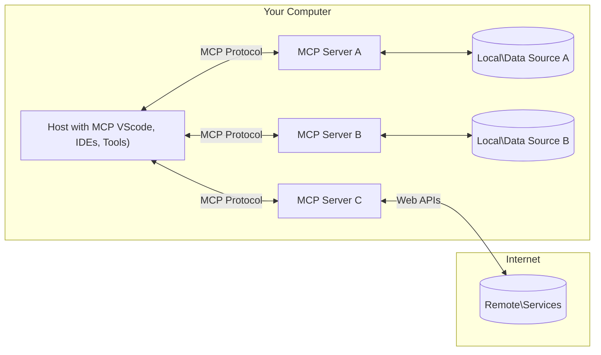

<!--
CO_OP_TRANSLATOR_METADATA:
{
  "original_hash": "355b12a5970c5c9e6db0bee970c751ba",
  "translation_date": "2025-07-13T16:22:31+00:00",
  "source_file": "01-CoreConcepts/README.md",
  "language_code": "ro"
}
-->
# 📖 Concepte de bază MCP: Stăpânirea Model Context Protocol pentru integrarea AI

[Model Context Protocol (MCP)](https://github.com/modelcontextprotocol) este un cadru standardizat și puternic care optimizează comunicarea între Modelele Mari de Limbaj (LLM) și unelte, aplicații și surse de date externe. Acest ghid optimizat SEO te va conduce prin conceptele esențiale ale MCP, asigurându-te că înțelegi arhitectura client-server, componentele cheie, mecanismele de comunicare și cele mai bune practici de implementare.

## Prezentare generală

Această lecție explorează arhitectura fundamentală și componentele care alcătuiesc ecosistemul Model Context Protocol (MCP). Vei învăța despre arhitectura client-server, componentele principale și mecanismele de comunicare care susțin interacțiunile MCP.

## 👩‍🎓 Obiective cheie de învățare

La finalul acestei lecții, vei:

- Înțelege arhitectura client-server MCP.
- Identifica rolurile și responsabilitățile Host-urilor, Client-ilor și Server-elor.
- Analiza caracteristicile de bază care fac din MCP un strat flexibil de integrare.
- Înțelege cum circulă informația în ecosistemul MCP.
- Obține perspective practice prin exemple de cod în .NET, Java, Python și JavaScript.

## 🔎 Arhitectura MCP: O privire mai detaliată

Ecosistemul MCP este construit pe un model client-server. Această structură modulară permite aplicațiilor AI să interacționeze eficient cu unelte, baze de date, API-uri și resurse contextuale. Să descompunem această arhitectură în componentele sale principale.

La bază, MCP urmează o arhitectură client-server în care o aplicație gazdă poate conecta mai mulți serveri:



- **MCP Hosts**: Programe precum VSCode, Claude Desktop, IDE-uri sau unelte AI care doresc să acceseze date prin MCP
- **MCP Clients**: Clienți de protocol care mențin conexiuni 1:1 cu serverele
- **MCP Servers**: Programe ușoare care expun fiecare capabilități specifice prin Model Context Protocol standardizat
- **Surse locale de date**: Fișierele, bazele de date și serviciile de pe calculatorul tău la care serverele MCP pot accesa în siguranță
- **Servicii la distanță**: Sisteme externe disponibile prin internet la care serverele MCP se pot conecta prin API-uri.

Protocolul MCP este un standard în evoluție, poți vedea cele mai recente actualizări în [specificația protocolului](https://modelcontextprotocol.io/specification/2025-06-18/)

### 1. Hosts

În Model Context Protocol (MCP), Host-urile joacă un rol crucial ca interfața principală prin care utilizatorii interacționează cu protocolul. Host-urile sunt aplicații sau medii care inițiază conexiuni cu serverele MCP pentru a accesa date, unelte și prompturi. Exemple de Host-uri includ medii integrate de dezvoltare (IDE-uri) precum Visual Studio Code, unelte AI precum Claude Desktop sau agenți personalizați creați pentru sarcini specifice.

**Host-urile** sunt aplicații LLM care inițiază conexiuni. Ele:

- Execută sau interacționează cu modelele AI pentru a genera răspunsuri.
- Inițiază conexiuni cu serverele MCP.
- Gestionează fluxul conversației și interfața cu utilizatorul.
- Controlează permisiunile și restricțiile de securitate.
- Se ocupă de consimțământul utilizatorului pentru partajarea datelor și executarea uneltelor.

### 2. Clients

Client-ii sunt componente esențiale care facilitează interacțiunea dintre Host-uri și serverele MCP. Client-ii acționează ca intermediari, permițând Host-urilor să acceseze și să utilizeze funcționalitățile oferite de serverele MCP. Ei joacă un rol important în asigurarea unei comunicări fluide și a unui schimb eficient de date în arhitectura MCP.

**Client-ii** sunt conectori în cadrul aplicației gazdă. Ei:

- Trimit cereri către servere cu prompturi/instrucțiuni.
- Negociază capabilitățile cu serverele.
- Gestionează cererile de execuție a uneltelor din partea modelelor.
- Procesează și afișează răspunsurile către utilizatori.

### 3. Servers

Serverele sunt responsabile pentru gestionarea cererilor venite de la clienții MCP și oferirea răspunsurilor adecvate. Ele administrează diverse operațiuni precum extragerea datelor, execuția uneltelor și generarea prompturilor. Serverele asigură o comunicare eficientă și fiabilă între clienți și Host-uri, menținând integritatea procesului de interacțiune.

**Serverele** sunt servicii care oferă context și capabilități. Ele:

- Înregistrează funcționalitățile disponibile (resurse, prompturi, unelte)
- Primesc și execută apeluri către unelte din partea clientului
- Oferă informații contextuale pentru a îmbunătăți răspunsurile modelului
- Returnează rezultatele către client
- Mențin starea pe durata interacțiunilor, dacă este necesar

Serverele pot fi dezvoltate de oricine pentru a extinde capabilitățile modelului cu funcționalități specializate.

### 4. Caracteristici ale Serverelor

Serverele din Model Context Protocol (MCP) oferă blocuri fundamentale care permit interacțiuni bogate între clienți, host-uri și modelele de limbaj. Aceste caracteristici sunt concepute pentru a îmbunătăți capabilitățile MCP prin oferirea de context structurat, unelte și prompturi.

Serverele MCP pot oferi oricare dintre următoarele caracteristici:

#### 📑 Resurse

Resursele în Model Context Protocol (MCP) cuprind diverse tipuri de context și date care pot fi utilizate de utilizatori sau modele AI. Acestea includ:

- **Date contextuale**: Informații și context pe care utilizatorii sau modelele AI le pot folosi pentru luarea deciziilor și executarea sarcinilor.
- **Baze de cunoștințe și depozite de documente**: Colecții de date structurate și nestructurate, precum articole, manuale și lucrări de cercetare, care oferă informații valoroase.
- **Fișiere și baze de date locale**: Date stocate local pe dispozitive sau în baze de date, accesibile pentru procesare și analiză.
- **API-uri și servicii web**: Interfețe și servicii externe care oferă date și funcționalități suplimentare, permițând integrarea cu diverse resurse și unelte online.

Un exemplu de resursă poate fi un schelet de bază de date sau un fișier accesibil astfel:

```text
file://log.txt
database://schema
```

### 🤖 Prompturi

Prompturile în Model Context Protocol (MCP) includ diverse șabloane predefinite și modele de interacțiune concepute pentru a simplifica fluxurile de lucru ale utilizatorilor și a îmbunătăți comunicarea. Acestea includ:

- **Mesaje și fluxuri de lucru șablonate**: Mesaje și procese pre-structurate care ghidează utilizatorii prin sarcini și interacțiuni specifice.
- **Modele de interacțiune predefinite**: Secvențe standardizate de acțiuni și răspunsuri care facilitează o comunicare consecventă și eficientă.
- **Șabloane specializate de conversație**: Șabloane personalizabile adaptate pentru tipuri specifice de conversații, asigurând interacțiuni relevante și contextuale.

Un șablon de prompt poate arăta astfel:

```markdown
Generate a product slogan based on the following {{product}} with the following {{keywords}}
```

#### ⛏️ Unelte

Uneltele în Model Context Protocol (MCP) sunt funcții pe care modelul AI le poate executa pentru a îndeplini sarcini specifice. Aceste unelte sunt concepute pentru a extinde capabilitățile modelului AI prin oferirea de operațiuni structurate și de încredere. Aspectele cheie includ:

- **Funcții pe care modelul AI le poate executa**: Uneltele sunt funcții executabile pe care modelul AI le poate invoca pentru a realiza diverse sarcini.
- **Nume unic și descriere**: Fiecare unealtă are un nume distinct și o descriere detaliată care explică scopul și funcționalitatea sa.
- **Parametri și rezultate**: Uneltele acceptă parametri specifici și returnează rezultate structurate, asigurând rezultate consistente și previzibile.
- **Funcții discrete**: Uneltele realizează funcții discrete precum căutări web, calcule și interogări în baze de date.

Un exemplu de unealtă ar putea arăta astfel:

```typescript
server.tool(
  "GetProducts",
  {
    pageSize: z.string().optional(),
    pageCount: z.string().optional()
  }, () => {
    // return results from API
  }
)
```

## Caracteristici ale Clientului

În Model Context Protocol (MCP), clienții oferă mai multe caracteristici cheie serverelor, îmbunătățind funcționalitatea generală și interacțiunea în cadrul protocolului. Una dintre caracteristicile notabile este Sampling.

### 👉 Sampling

- **Comportamente agentice inițiate de server**: Clienții permit serverelor să inițieze acțiuni sau comportamente specifice în mod autonom, sporind capabilitățile dinamice ale sistemului.
- **Interacțiuni recursive cu LLM**: Această caracteristică permite interacțiuni recursive cu modelele mari de limbaj (LLM), facilitând procesarea mai complexă și iterativă a sarcinilor.
- **Solicitarea de completări suplimentare ale modelului**: Serverele pot solicita completări suplimentare de la model, asigurând răspunsuri complete și relevante contextual.

## Fluxul informației în MCP

Model Context Protocol (MCP) definește un flux structurat de informații între host-uri, clienți, servere și modele. Înțelegerea acestui flux ajută la clarificarea modului în care cererile utilizatorilor sunt procesate și cum uneltele și datele externe sunt integrate în răspunsurile modelului.

- **Host-ul inițiază conexiunea**  
  Aplicația gazdă (cum ar fi un IDE sau o interfață de chat) stabilește o conexiune către un server MCP, de obicei prin STDIO, WebSocket sau alt transport suportat.

- **Negocierea capabilităților**  
  Clientul (încorporat în host) și serverul schimbă informații despre funcționalitățile, uneltele, resursele și versiunile protocolului suportate. Acest lucru asigură că ambele părți înțeleg ce capabilități sunt disponibile pentru sesiune.

- **Cererea utilizatorului**  
  Utilizatorul interacționează cu host-ul (de exemplu, introduce un prompt sau o comandă). Host-ul colectează această intrare și o transmite clientului pentru procesare.

- **Utilizarea resurselor sau uneltelor**  
  - Clientul poate solicita context sau resurse suplimentare de la server (cum ar fi fișiere, înregistrări din baze de date sau articole din baze de cunoștințe) pentru a îmbogăți înțelegerea modelului.
  - Dacă modelul determină că este necesară o unealtă (de exemplu, pentru a prelua date, a efectua un calcul sau a apela un API), clientul trimite o cerere de invocare a uneltei către server, specificând numele uneltei și parametrii.

- **Execuția serverului**  
  Serverul primește cererea pentru resursă sau unealtă, execută operațiunile necesare (cum ar fi rularea unei funcții, interogarea unei baze de date sau recuperarea unui fișier) și returnează rezultatele clientului într-un format structurat.

- **Generarea răspunsului**  
  Clientul integrează răspunsurile serverului (datele resurselor, rezultatele uneltelor etc.) în interacțiunea curentă cu modelul. Modelul folosește aceste informații pentru a genera un răspuns cuprinzător și relevant contextual.

- **Prezentarea rezultatului**  
  Host-ul primește rezultatul final de la client și îl afișează utilizatorului, adesea incluzând atât textul generat de model, cât și orice rezultate din execuțiile uneltelor sau căutările în resurse.

Acest flux permite MCP să susțină aplicații AI avansate, interactive și conștiente de context, conectând fără întreruperi modelele cu unelte și surse de date externe.

## Detalii despre protocol

MCP (Model Context Protocol) este construit peste [JSON-RPC 2.0](https://www.jsonrpc.org/), oferind un format standardizat, independent de limbaj, pentru comunicarea între host-uri, clienți și servere. Această bază permite interacțiuni fiabile, structurate și extensibile pe diverse platforme și limbaje de programare.

### Caracteristici cheie ale protocolului

MCP extinde JSON-RPC 2.0 cu convenții suplimentare pentru invocarea uneltelor, accesul la resurse și gestionarea prompturilor. Suportă mai multe straturi de transport (STDIO, WebSocket, SSE) și permite o comunicare sigură, extensibilă și independentă de limbaj între componente.

#### 🧢 Protocol de bază

- **Formatul mesajelor JSON-RPC**: Toate cererile și răspunsurile folosesc specificația JSON-RPC 2.0, asigurând o structură consecventă pentru apeluri de metode, parametri, rezultate și gestionarea erorilor.
- **Conexiuni cu stare**: Sesiunile MCP mențin starea pe durata mai multor cereri, susținând conversații continue, acumularea contextului și gestionarea resurselor.
- **Negocierea capabilităților**: În timpul stabilirii conexiunii, clienții și serverele schimbă informații despre funcționalitățile suportate, versiunile protocolului, uneltele și resursele disponibile. Acest lucru asigură că ambele părți înțeleg capabilitățile celuilalt și se pot adapta corespunzător.

#### ➕ Utilitare suplimentare

Mai jos sunt câteva utilitare și extensii ale protocolului pe care MCP le oferă pentru a îmbunătăți experiența dezvoltatorilor și a permite scenarii avansate:

- **Opțiuni de configurare**: MCP permite configurarea dinamică a parametrilor sesiunii, cum ar fi permisiunile uneltelor, accesul la resurse și setările modelului, adaptate fiecărei interacțiuni.
- **Urmărirea progresului**: Operațiunile de durată lungă pot raporta actualizări de progres, permițând interfețe responsive și o experiență mai bună în timpul sarcinilor complexe.
- **Anularea cererilor**: Clienții pot anula cererile aflate în curs, permițând utilizatorilor să întrerupă operațiuni care nu mai sunt necesare sau durează prea mult.
- **Raportarea erorilor**: Mesajele și codurile de eroare standardizate ajută la diagnosticarea problemelor, gestionarea elegantă a eșecurilor și oferirea de feedback util utilizatorilor și dezvoltatorilor.
- **Jurnalizare**: Atât clienții, cât și serverele pot emite jurnale structurate pentru audit, depanare și monitorizarea interacțiunilor protocolului.

Prin valorificarea acestor caracteristici, MCP asigură o comunicare robustă, sigură și flexibilă între modelele de limbaj și uneltele sau sursele de date externe.

### 🔐 Considerații de securitate

Implementările MCP trebuie să respecte câteva principii cheie de securitate pentru a asigura interacțiuni sigure și de încredere:

- **Consimțământul și controlul utilizatorului**: Utilizatorii trebuie să ofere consimțământ explicit înainte ca orice date să fie accesate sau operațiuni să fie efectuate. Ei trebuie să aibă un control clar asupra datelor partajate și acțiunilor autorizate, susținut de interfețe intuitive pentru revizuirea și aprobarea activităților.

- **Confidențialitatea datelor**: Datele utilizatorilor trebuie expuse doar cu consimțământ explicit și trebuie protejate prin controale adecvate de acces. Implementările MCP trebuie să prevină transmiterea neautorizată a datelor și să asigure menținerea confidențialității pe tot parcursul interacțiunilor.

- **Siguranța uneltelor**: Înainte de a invoca orice unealtă, este necesar consimțământul explicit al utilizatorului. Utilizatorii trebuie să înțeleagă clar funcționalitatea fiecărei unelte, iar limitele de securitate robuste trebuie aplicate pentru a preveni execuția neintenționată sau nesigură a uneltelor.

Respectând aceste principii, MCP asigură că încrederea, confidențialitatea și siguranța utilizatorilor sunt menținute în toate interacțiunile protocolului.

## Exemple de cod: Componente cheie

Mai jos sunt exemple de cod în câteva limbaje populare care ilustrează cum să implementezi componente cheie ale serverului MCP și unelte.

### Exemplu .NET: Crearea unui server MCP simplu cu unelte

Iată un exemplu practic în .NET care demonstrează cum să implementezi un server MCP simplu
MCP include mai multe concepte și mecanisme încorporate pentru gestionarea securității și autorizării pe tot parcursul protocolului:

1. **Controlul permisiunilor pentru unelte**:  
  Clienții pot specifica ce unelte poate folosi un model în timpul unei sesiuni. Acest lucru asigură că doar uneltele autorizate explicit sunt accesibile, reducând riscul unor operațiuni neintenționate sau nesigure. Permisiunile pot fi configurate dinamic în funcție de preferințele utilizatorului, politicile organizației sau contextul interacțiunii.

2. **Autentificare**:  
  Serverele pot solicita autentificare înainte de a acorda acces la unelte, resurse sau operațiuni sensibile. Aceasta poate implica chei API, token-uri OAuth sau alte scheme de autentificare. O autentificare corectă garantează că doar clienții și utilizatorii de încredere pot apela capabilitățile serverului.

3. **Validare**:  
  Validarea parametrilor este aplicată pentru toate apelurile către unelte. Fiecare unealtă definește tipurile, formatele și constrângerile așteptate pentru parametrii săi, iar serverul validează cererile primite în consecință. Acest lucru previne ca input-uri incorecte sau malițioase să ajungă la implementările uneltelor și ajută la menținerea integrității operațiunilor.

4. **Limitarea ratei**:  
  Pentru a preveni abuzurile și a asigura o utilizare echitabilă a resurselor serverului, serverele MCP pot implementa limitarea ratei pentru apelurile către unelte și accesul la resurse. Limitele pot fi aplicate pe utilizator, pe sesiune sau global și ajută la protejarea împotriva atacurilor de tip denial-of-service sau consumului excesiv de resurse.

Prin combinarea acestor mecanisme, MCP oferă o bază sigură pentru integrarea modelelor lingvistice cu unelte și surse de date externe, oferind utilizatorilor și dezvoltatorilor un control detaliat asupra accesului și utilizării.

## Mesaje de protocol

Comunicarea MCP folosește mesaje JSON structurate pentru a facilita interacțiuni clare și fiabile între clienți, servere și modele. Tipurile principale de mesaje includ:

- **Cerere client**  
  Trimisă de client către server, acest mesaj include de obicei:
  - Promptul sau comanda utilizatorului
  - Istoricul conversației pentru context
  - Configurarea și permisiunile uneltelor
  - Orice metadate suplimentare sau informații despre sesiune

- **Răspuns model**  
  Returnat de model (prin client), acest mesaj conține:
  - Text generat sau completare bazată pe prompt și context
  - Instrucțiuni opționale pentru apelarea unei unelte dacă modelul decide că este necesar
  - Referințe către resurse sau context suplimentar, după caz

- **Cerere unealtă**  
  Trimisă de client către server când o unealtă trebuie executată. Acest mesaj include:
  - Numele uneltei care trebuie apelată
  - Parametrii necesari uneltei (validați conform schemei uneltei)
  - Informații contextuale sau identificatori pentru urmărirea cererii

- **Răspuns unealtă**  
  Returnat de server după executarea unei unelte. Acest mesaj oferă:
  - Rezultatele execuției uneltei (date structurate sau conținut)
  - Orice erori sau informații despre starea apelului dacă acesta a eșuat
  - Opțional, metadate suplimentare sau jurnale legate de execuție

Aceste mesaje structurate asigură că fiecare pas din fluxul de lucru MCP este explicit, trasabil și extensibil, susținând scenarii avansate precum conversații multi-turn, concatenarea uneltelor și gestionarea robustă a erorilor.

## Aspecte esențiale

- MCP folosește o arhitectură client-server pentru a conecta modelele cu capabilități externe
- Ecosistemul este format din clienți, gazde, servere, unelte și surse de date
- Comunicarea poate avea loc prin STDIO, SSE sau WebSockets
- Uneltele sunt unitățile fundamentale de funcționalitate expuse modelelor
- Protocoalele de comunicare structurate asigură interacțiuni consistente

## Exercițiu

Proiectează o unealtă MCP simplă care ar fi utilă în domeniul tău. Definește:
1. Cum s-ar numi unealta
2. Ce parametri ar accepta
3. Ce rezultat ar returna
4. Cum ar putea un model să folosească această unealtă pentru a rezolva problemele utilizatorilor


---

## Ce urmează

Următorul: [Capitolul 2: Securitate](../02-Security/README.md)

**Declinare de responsabilitate**:  
Acest document a fost tradus folosind serviciul de traducere AI [Co-op Translator](https://github.com/Azure/co-op-translator). Deși ne străduim pentru acuratețe, vă rugăm să rețineți că traducerile automate pot conține erori sau inexactități. Documentul original în limba sa nativă trebuie considerat sursa autorizată. Pentru informații critice, se recomandă traducerea profesională realizată de un specialist uman. Nu ne asumăm răspunderea pentru eventualele neînțelegeri sau interpretări greșite rezultate din utilizarea acestei traduceri.