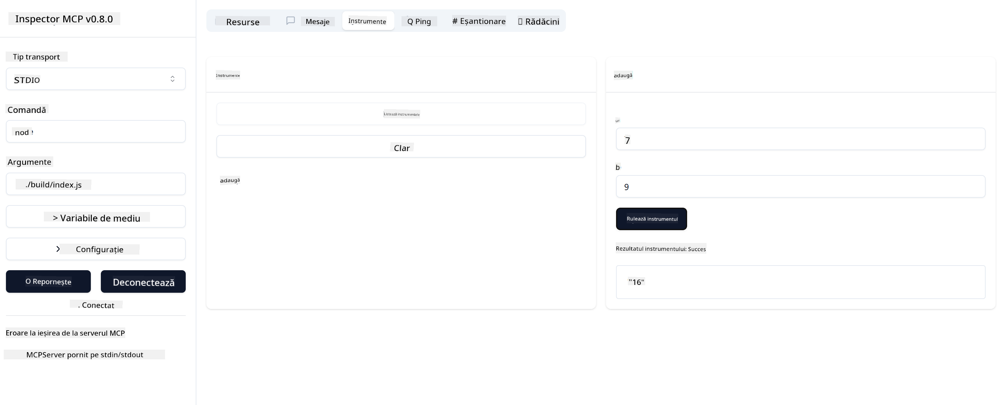

<!--
CO_OP_TRANSLATOR_METADATA:
{
  "original_hash": "5331ffd328a54b90f76706c52b673e27",
  "translation_date": "2025-05-17T08:54:05+00:00",
  "source_file": "03-GettingStarted/01-first-server/README.md",
  "language_code": "ro"
}
-->
# Introducere în MCP

Bun venit la primii tăi pași cu Protocolul de Context al Modelului (MCP)! Fie că ești nou în MCP sau vrei să îți aprofundezi cunoștințele, acest ghid te va conduce prin procesul esențial de configurare și dezvoltare. Vei descoperi cum MCP permite integrarea fără cusur între modelele AI și aplicații și vei învăța cum să-ți pregătești rapid mediul pentru a construi și testa soluții bazate pe MCP.

> Pe scurt; Dacă dezvolți aplicații AI, știi că poți adăuga instrumente și alte resurse la LLM-ul tău (model de limbaj mare), pentru a-l face mai informat. Totuși, dacă plasezi acele instrumente și resurse pe un server, aplicația și capabilitățile serverului pot fi utilizate de orice client cu/fără un LLM.

## Prezentare generală

Această lecție oferă îndrumări practice despre configurarea mediilor MCP și construirea primelor aplicații MCP. Vei învăța cum să configurezi instrumentele și cadrele necesare, să construiești servere MCP de bază, să creezi aplicații gazdă și să testezi implementările tale.

Protocolul de Context al Modelului (MCP) este un protocol deschis care standardizează modul în care aplicațiile oferă context LLM-urilor. Gândește-te la MCP ca la un port USB-C pentru aplicațiile AI - oferă o modalitate standardizată de a conecta modelele AI la diferite surse de date și instrumente.

## Obiectivele învățării

Până la sfârșitul acestei lecții, vei putea:

- Să configurezi medii de dezvoltare pentru MCP în C#, Java, Python, TypeScript și JavaScript
- Să construiești și să implementezi servere MCP de bază cu caracteristici personalizate (resurse, prompturi și instrumente)
- Să creezi aplicații gazdă care se conectează la serverele MCP
- Să testezi și să depanezi implementările MCP

## Configurarea mediului tău MCP

Înainte de a începe să lucrezi cu MCP, este important să îți pregătești mediul de dezvoltare și să înțelegi fluxul de lucru de bază. Această secțiune te va ghida prin pașii inițiali de configurare pentru a asigura un început lin cu MCP.

### Cerințe preliminare

Înainte de a te aprofunda în dezvoltarea MCP, asigură-te că ai:

- **Mediu de Dezvoltare**: Pentru limbajul ales (C#, Java, Python, TypeScript sau JavaScript)
- **IDE/Editor**: Visual Studio, Visual Studio Code, IntelliJ, Eclipse, PyCharm sau orice editor de cod modern
- **Manageri de Pachete**: NuGet, Maven/Gradle, pip sau npm/yarn
- **Chei API**: Pentru orice servicii AI pe care intenționezi să le folosești în aplicațiile tale gazdă

## Structura de bază a unui server MCP

Un server MCP include de obicei:

- **Configurarea Serverului**: Setarea portului, autentificare și alte setări
- **Resurse**: Date și context puse la dispoziția LLM-urilor
- **Instrumente**: Funcționalitate pe care modelele o pot invoca
- **Prompturi**: Șabloane pentru generarea sau structurarea textului

Iată un exemplu simplificat în TypeScript:

```typescript
import { Server, Tool, Resource } from "@modelcontextprotocol/typescript-server-sdk";

// Create a new MCP server
const server = new Server({
  port: 3000,
  name: "Example MCP Server",
  version: "1.0.0"
});

// Register a tool
server.registerTool({
  name: "calculator",
  description: "Performs basic calculations",
  parameters: {
    expression: {
      type: "string",
      description: "The math expression to evaluate"
    }
  },
  handler: async (params) => {
    const result = eval(params.expression);
    return { result };
  }
});

// Start the server
server.start();
```

În codul precedent am:

- Importat clasele necesare din SDK-ul MCP TypeScript.
- Creat și configurat o nouă instanță de server MCP.
- Înregistrat un instrument personalizat (`calculator`) cu o funcție de manipulare.
- Pornit serverul pentru a asculta cererile MCP primite.

## Testare și depanare

Înainte de a începe testarea serverului tău MCP, este important să înțelegi instrumentele disponibile și cele mai bune practici pentru depanare. Testarea eficientă asigură că serverul tău se comportă așa cum te aștepți și te ajută să identifici și să rezolvi rapid problemele. Secțiunea următoare conturează abordările recomandate pentru validarea implementării tale MCP.

MCP oferă instrumente pentru a te ajuta să testezi și să depanezi serverele tale:

- **Instrumentul Inspector**, această interfață grafică îți permite să te conectezi la serverul tău și să testezi instrumentele, prompturile și resursele.
- **curl**, poți de asemenea să te conectezi la serverul tău folosind un instrument de linie de comandă ca curl sau alți clienți care pot crea și rula comenzi HTTP.

### Utilizarea MCP Inspector

[MCP Inspector](https://github.com/modelcontextprotocol/inspector) este un instrument vizual de testare care te ajută să:

1. **Descoperi Capabilitățile Serverului**: Detectează automat resursele, instrumentele și prompturile disponibile
2. **Testezi Execuția Instrumentelor**: Încearcă diferiți parametri și vezi răspunsurile în timp real
3. **Vizualizezi Metadatele Serverului**: Examinează informațiile serverului, schemele și configurațiile

```bash
# ex TypeScript, installing and running MCP Inspector
npx @modelcontextprotocol/inspector node build/index.js
```

Când rulezi comenzile de mai sus, MCP Inspector va lansa o interfață web locală în browserul tău. Te poți aștepta să vezi un tablou de bord care afișează serverele MCP înregistrate, instrumentele disponibile, resursele și prompturile. Interfața îți permite să testezi interactiv execuția instrumentelor, să inspectezi metadatele serverului și să vezi răspunsurile în timp real, făcând mai ușor să validezi și să depanezi implementările serverului tău MCP.

Iată o captură de ecran cu ceea ce poate arăta:


## Probleme comune de configurare și soluții

| Problemă | Soluție posibilă |
|-------|-------------------|
| Conexiune refuzată | Verifică dacă serverul rulează și portul este corect |
| Erori de execuție a instrumentului | Revizuiește validarea parametrilor și gestionarea erorilor |
| Eșecuri de autentificare | Verifică cheile API și permisiunile |
| Erori de validare a schemei | Asigură-te că parametrii se potrivesc cu schema definită |
| Serverul nu pornește | Verifică conflictele de port sau dependențele lipsă |
| Erori CORS | Configurează anteturile CORS corecte pentru cereri cross-origin |
| Probleme de autentificare | Verifică validitatea tokenului și permisiunile |

## Dezvoltare locală

Pentru dezvoltare și testare locală, poți rula servere MCP direct pe mașina ta:

1. **Pornește procesul serverului**: Rulează aplicația serverului tău MCP
2. **Configurează rețeaua**: Asigură-te că serverul este accesibil pe portul așteptat
3. **Conectează clienți**: Folosește URL-uri de conexiune locală ca `http://localhost:3000`

```bash
# Example: Running a TypeScript MCP server locally
npm run start
# Server running at http://localhost:3000
```

## Construirea primului tău server MCP

Am acoperit [Concepte de bază](/01-CoreConcepts/README.md) într-o lecție anterioară, acum este timpul să punem acele cunoștințe în practică.

### Ce poate face un server

Înainte de a începe să scriem cod, să ne reamintim ce poate face un server:

Un server MCP poate, de exemplu:

- Accesa fișiere locale și baze de date
- Conecta la API-uri remote
- Efectua calcule
- Integra cu alte instrumente și servicii
- Oferi o interfață de utilizator pentru interacțiune

Minunat, acum că știm ce putem face pentru el, să începem să codăm.

## Exercițiu: Crearea unui server

Pentru a crea un server, trebuie să urmezi acești pași:

- Instalează SDK-ul MCP.
- Creează un proiect și setează structura proiectului.
- Scrie codul serverului.
- Testează serverul.

### -1- Instalează SDK-ul

Acest lucru diferă puțin în funcție de runtime-ul ales, așa că alege unul dintre runtime-urile de mai jos:

Generative AI poate genera text, imagini și chiar cod.
Ești instruit pe date până în octombrie 2023.

### -2- Creează proiect

Acum că ai SDK-ul instalat, să creăm următorul proiect:

### -3- Creează fișierele proiectului

### -4- Creează codul serverului

### -5- Adăugarea unui instrument și a unei resurse

Adaugă un instrument și o resursă adăugând următorul cod:

### -6- Codul final

Să adăugăm ultimul cod de care avem nevoie pentru ca serverul să pornească:

### -7- Testează serverul

Pornește serverul cu următoarea comandă:

### -8- Rulează folosind inspectorul

Inspectorul este un instrument grozav care poate porni serverul tău și îți permite să interacționezi cu el, astfel încât să poți testa că funcționează. Să-l pornim:

> [!NOTE]
> ar putea arăta diferit în câmpul "comandă", deoarece conține comanda pentru rularea unui server cu runtime-ul tău specific

Ar trebui să vezi următoarea interfață de utilizator:


1. Conectează-te la server selectând butonul Connect
   Odată ce te conectezi la server, ar trebui să vezi acum următoarele:

   

1. Selectează "Tools" și "listTools", ar trebui să vezi "Add" afișându-se, selectează "Add" și completează valorile parametrilor.

   Ar trebui să vezi următorul răspuns, adică un rezultat de la instrumentul "add":

   

Felicitări, ai reușit să creezi și să rulezi primul tău server!

### SDK-uri oficiale

MCP oferă SDK-uri oficiale pentru mai multe limbi:
- [C# SDK](https://github.com/modelcontextprotocol/csharp-sdk) - Menținut în colaborare cu Microsoft
- [Java SDK](https://github.com/modelcontextprotocol/java-sdk) - Menținut în colaborare cu Spring AI
- [TypeScript SDK](https://github.com/modelcontextprotocol/typescript-sdk) - Implementarea oficială TypeScript
- [Python SDK](https://github.com/modelcontextprotocol/python-sdk) - Implementarea oficială Python
- [Kotlin SDK](https://github.com/modelcontextprotocol/kotlin-sdk) - Implementarea oficială Kotlin
- [Swift SDK](https://github.com/modelcontextprotocol/swift-sdk) - Menținut în colaborare cu Loopwork AI
- [Rust SDK](https://github.com/modelcontextprotocol/rust-sdk) - Implementarea oficială Rust

## Idei principale

- Configurarea unui mediu de dezvoltare MCP este simplă cu SDK-uri specifice limbajului
- Construirea serverelor MCP implică crearea și înregistrarea instrumentelor cu scheme clare
- Testarea și depanarea sunt esențiale pentru implementările MCP de încredere

## Exemple

- [Java Calculator](../samples/java/calculator/README.md)
- [.Net Calculator](../../../../03-GettingStarted/samples/csharp)
- [JavaScript Calculator](../samples/javascript/README.md)
- [TypeScript Calculator](../samples/typescript/README.md)
- [Python Calculator](../../../../03-GettingStarted/samples/python)

## Temă

Creează un server MCP simplu cu un instrument la alegerea ta:
1. Implementează instrumentul în limbajul preferat (.NET, Java, Python sau JavaScript).
2. Definește parametrii de intrare și valorile de returnare.
3. Rulează instrumentul inspector pentru a te asigura că serverul funcționează conform intenției.
4. Testează implementarea cu diferite intrări.

## Soluție

[Soluție](./solution/README.md)

## Resurse suplimentare

- [MCP GitHub Repository](https://github.com/microsoft/mcp-for-beginners)

## Ce urmează

Următorul: [Introducere în clienții MCP](/03-GettingStarted/02-client/README.md)

**Declinarea responsabilității**:  
Acest document a fost tradus folosind serviciul de traducere AI [Co-op Translator](https://github.com/Azure/co-op-translator). Deși ne străduim să asigurăm acuratețea, vă rugăm să fiți conștienți de faptul că traducerile automate pot conține erori sau inexactități. Documentul original în limba sa nativă ar trebui considerat sursa autoritară. Pentru informații critice, se recomandă traducerea umană profesională. Nu ne asumăm răspunderea pentru eventualele neînțelegeri sau interpretări greșite care pot apărea din utilizarea acestei traduceri.