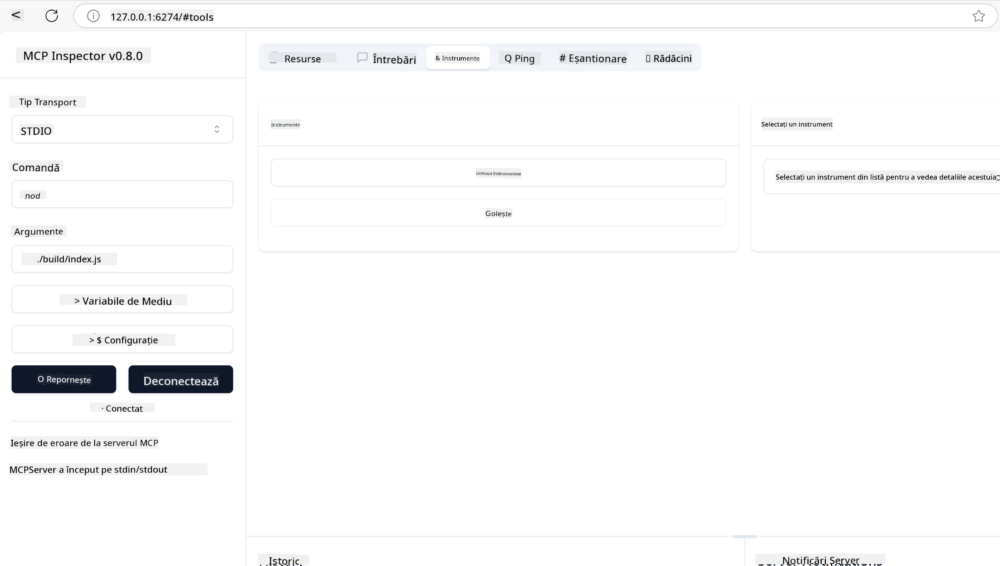

<!--
CO_OP_TRANSLATOR_METADATA:
{
  "original_hash": "262e6e510f0c3fe1e36180eadcd67c33",
  "translation_date": "2025-06-02T17:46:29+00:00",
  "source_file": "03-GettingStarted/01-first-server/README.md",
  "language_code": "ro"
}
-->
### -2- Crearea proiectului

Acum că ai instalat SDK-ul, să creăm următorul proiect:

### -3- Crearea fișierelor proiectului

### -4- Crearea codului serverului

### -5- Adăugarea unui tool și a unei resurse

Adaugă un tool și o resursă prin includerea următorului cod:

### -6 Codul final

Să adăugăm ultimul cod necesar pentru ca serverul să pornească:

### -7- Testarea serverului

Pornește serverul cu următoarea comandă:

### -8- Rulare folosind inspectorul

Inspectorul este un instrument excelent care poate porni serverul și îți permite să interacționezi cu el pentru a testa dacă funcționează. Să-l pornim:

> [!NOTE]
> poate arăta diferit în câmpul „command”, deoarece conține comanda pentru rularea unui server cu runtime-ul tău specific/

Ar trebui să vezi următoarea interfață de utilizator:

1. Conectează-te la server selectând butonul Connect  
   Odată ce te-ai conectat la server, ar trebui să vezi următorul ecran:

   

2. Selectează „Tools” și „listTools”, ar trebui să apară „Add”, selectează „Add” și completează valorile parametrilor.

   Ar trebui să vezi următorul răspuns, adică un rezultat de la tool-ul „add”:

   

Felicitări, ai reușit să creezi și să rulezi primul tău server!

### SDK-uri oficiale

MCP oferă SDK-uri oficiale pentru mai multe limbaje:
- [C# SDK](https://github.com/modelcontextprotocol/csharp-sdk) - Menținut în colaborare cu Microsoft
- [Java SDK](https://github.com/modelcontextprotocol/java-sdk) - Menținut în colaborare cu Spring AI
- [TypeScript SDK](https://github.com/modelcontextprotocol/typescript-sdk) - Implementarea oficială TypeScript
- [Python SDK](https://github.com/modelcontextprotocol/python-sdk) - Implementarea oficială Python
- [Kotlin SDK](https://github.com/modelcontextprotocol/kotlin-sdk) - Implementarea oficială Kotlin
- [Swift SDK](https://github.com/modelcontextprotocol/swift-sdk) - Menținut în colaborare cu Loopwork AI
- [Rust SDK](https://github.com/modelcontextprotocol/rust-sdk) - Implementarea oficială Rust

## Concluzii cheie

- Configurarea unui mediu de dezvoltare MCP este simplă cu SDK-uri specifice limbajelor
- Construirea serverelor MCP implică crearea și înregistrarea tool-urilor cu scheme clare
- Testarea și depanarea sunt esențiale pentru implementări MCP fiabile

## Exemple

- [Java Calculator](../samples/java/calculator/README.md)
- [.Net Calculator](../../../../03-GettingStarted/samples/csharp)
- [JavaScript Calculator](../samples/javascript/README.md)
- [TypeScript Calculator](../samples/typescript/README.md)
- [Python Calculator](../../../../03-GettingStarted/samples/python)

## Exercițiu

Creează un server MCP simplu cu un tool la alegere:
1. Implementează tool-ul în limbajul preferat (.NET, Java, Python sau JavaScript).
2. Definește parametrii de intrare și valorile returnate.
3. Rulează instrumentul inspector pentru a te asigura că serverul funcționează conform așteptărilor.
4. Testează implementarea cu diverse valori de intrare.

## Soluție

[Soluție](./solution/README.md)

## Resurse suplimentare

- [Construirea agenților folosind Model Context Protocol pe Azure](https://learn.microsoft.com/azure/developer/ai/intro-agents-mcp)
- [MCP la distanță cu Azure Container Apps (Node.js/TypeScript/JavaScript)](https://learn.microsoft.com/samples/azure-samples/mcp-container-ts/mcp-container-ts/)
- [Agent .NET OpenAI MCP](https://learn.microsoft.com/samples/azure-samples/openai-mcp-agent-dotnet/openai-mcp-agent-dotnet/)

## Ce urmează

Următorul pas: [Începerea cu MCP Clients](/03-GettingStarted/02-client/README.md)

**Declinare a responsabilității**:  
Acest document a fost tradus folosind serviciul de traducere AI [Co-op Translator](https://github.com/Azure/co-op-translator). Deși ne străduim pentru acuratețe, vă rugăm să rețineți că traducerile automate pot conține erori sau inexactități. Documentul original în limba sa nativă trebuie considerat sursa autoritară. Pentru informații critice, se recomandă traducerea profesională realizată de un specialist uman. Nu ne asumăm răspunderea pentru eventualele neînțelegeri sau interpretări greșite rezultate din utilizarea acestei traduceri.