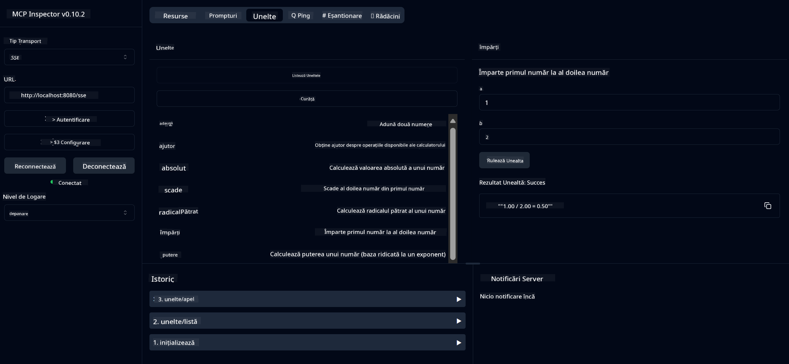

<!--
CO_OP_TRANSLATOR_METADATA:
{
  "original_hash": "ed9cab32cc67c12d8969b407aa47100a",
  "translation_date": "2025-07-13T17:56:33+00:00",
  "source_file": "03-GettingStarted/01-first-server/solution/java/README.md",
  "language_code": "ro"
}
-->
# Serviciu Calculator de Bază MCP

Acest serviciu oferă operații de bază pentru calculator prin Model Context Protocol (MCP) folosind Spring Boot cu transport WebFlux. Este conceput ca un exemplu simplu pentru începători care învață despre implementările MCP.

Pentru mai multe informații, consultați documentația de referință [MCP Server Boot Starter](https://docs.spring.io/spring-ai/reference/api/mcp/mcp-server-boot-starter-docs.html).


## Utilizarea Serviciului

Serviciul expune următoarele endpoint-uri API prin protocolul MCP:

- `add(a, b)`: Adună două numere
- `subtract(a, b)`: Scade al doilea număr din primul
- `multiply(a, b)`: Înmulțește două numere
- `divide(a, b)`: Împarte primul număr la al doilea (cu verificare pentru zero)
- `power(base, exponent)`: Calculează puterea unui număr
- `squareRoot(number)`: Calculează rădăcina pătrată (cu verificare pentru numere negative)
- `modulus(a, b)`: Calculează restul împărțirii
- `absolute(number)`: Calculează valoarea absolută

## Dependențe

Proiectul necesită următoarele dependențe principale:

```xml
<dependency>
    <groupId>org.springframework.ai</groupId>
    <artifactId>spring-ai-starter-mcp-server-webflux</artifactId>
</dependency>
```

## Construirea Proiectului

Construiește proiectul folosind Maven:
```bash
./mvnw clean install -DskipTests
```

## Pornirea Serverului

### Folosind Java

```bash
java -jar target/calculator-server-0.0.1-SNAPSHOT.jar
```

### Folosind MCP Inspector

MCP Inspector este un instrument util pentru interacțiunea cu serviciile MCP. Pentru a-l folosi cu acest serviciu de calculator:

1. **Instalează și pornește MCP Inspector** într-o fereastră nouă de terminal:
   ```bash
   npx @modelcontextprotocol/inspector
   ```

2. **Accesează interfața web** făcând clic pe URL-ul afișat de aplicație (de obicei http://localhost:6274)

3. **Configurează conexiunea**:
   - Setează tipul de transport la "SSE"
   - Setează URL-ul către endpoint-ul SSE al serverului tău: `http://localhost:8080/sse`
   - Apasă pe "Connect"

4. **Folosește instrumentele**:
   - Apasă pe "List Tools" pentru a vedea operațiile disponibile ale calculatorului
   - Selectează un instrument și apasă pe "Run Tool" pentru a executa o operație



**Declinare de responsabilitate**:  
Acest document a fost tradus folosind serviciul de traducere AI [Co-op Translator](https://github.com/Azure/co-op-translator). Deși ne străduim pentru acuratețe, vă rugăm să rețineți că traducerile automate pot conține erori sau inexactități. Documentul original în limba sa nativă trebuie considerat sursa autorizată. Pentru informații critice, se recomandă traducerea profesională realizată de un specialist uman. Nu ne asumăm răspunderea pentru eventualele neînțelegeri sau interpretări greșite rezultate din utilizarea acestei traduceri.