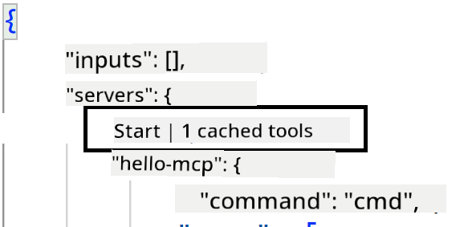
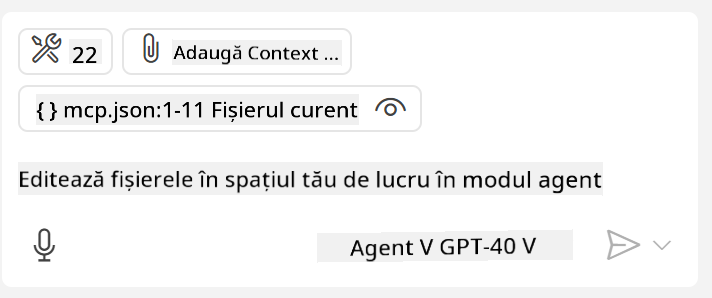

<!--
CO_OP_TRANSLATOR_METADATA:
{
  "original_hash": "c37fabfbc0dcbc9a4afb6d17e7d3be9f",
  "translation_date": "2025-05-17T11:15:43+00:00",
  "source_file": "03-GettingStarted/04-vscode/README.md",
  "language_code": "ro"
}
-->
Să discutăm mai multe despre cum folosim interfața vizuală în secțiunile următoare.

## Abordare

Iată cum trebuie să abordăm acest lucru la un nivel înalt:

- Configurați un fișier pentru a găsi Serverul MCP.
- Porniți/Conectați-vă la serverul respectiv pentru a-i lista capabilitățile.
- Utilizați capabilitățile respective prin interfața de chat GitHub Copilot.

Grozav, acum că înțelegem fluxul, să încercăm să folosim un Server MCP prin Visual Studio Code printr-un exercițiu.

## Exercițiu: Consumul unui server

În acest exercițiu, vom configura Visual Studio Code pentru a găsi serverul tău MCP astfel încât să poată fi utilizat din interfața de chat GitHub Copilot.

### -0- Prepas, activare descoperire Server MCP

Poate fi necesar să activați descoperirea serverelor MCP.

1. Accesați `File -> Preferences -> Settings` in Visual Studio Code.

1. Search for "MCP" and enable `chat.mcp.discovery.enabled` în fișierul settings.json.

### -1- Creați fișierul de configurare

Începeți prin crearea unui fișier de configurare în rădăcina proiectului, veți avea nevoie de un fișier numit MCP.json și să îl plasați într-un folder numit .vscode. Ar trebui să arate astfel:

```text
.vscode
|-- mcp.json
```

În continuare, să vedem cum putem adăuga o intrare de server.

### -2- Configurați un server

Adăugați următorul conținut în *mcp.json*:

```json
{
    "inputs": [],
    "servers": {
       "hello-mcp": {
           "command": "cmd",
           "args": [
               "/c", "node", "<absolute path>\\build\\index.js"
           ]
       }
    }
}
```

Iată un exemplu simplu de cum să porniți un server scris în Node.js, pentru alte medii de execuție indicați comanda corectă pentru pornirea serverului folosind `command` and `args`.

### -3- Porniți serverul

Acum că ați adăugat o intrare, să pornim serverul:

1. Localizați intrarea în *mcp.json* și asigurați-vă că găsiți pictograma "play":

    

1. Faceți clic pe pictograma "play", ar trebui să vedeți pictograma de unelte în chat-ul GitHub Copilot crescând numărul de unelte disponibile. Dacă faceți clic pe pictograma de unelte, veți vedea o listă de unelte înregistrate. Puteți bifa/debifa fiecare unealtă în funcție de dorința de a permite GitHub Copilot să le folosească ca context:

  

1. Pentru a rula o unealtă, tastați un prompt despre care știți că se potrivește cu descrierea uneia dintre uneltele voastre, de exemplu un prompt ca "add 22 to 1":

  

  Ar trebui să vedeți un răspuns spunând 23.

## Temă

Încercați să adăugați o intrare de server în fișierul *mcp.json* și asigurați-vă că puteți porni/opri serverul. Asigurați-vă că puteți comunica și cu uneltele de pe serverul vostru prin interfața de chat GitHub Copilot.

## Soluție

[Soluție](./solution/README.md)

## Concluzii

Concluziile din acest capitol sunt următoarele:

- Visual Studio Code este un client excelent care vă permite să consumați mai multe Servere MCP și uneltele lor.
- Interfața de chat GitHub Copilot este modul în care interacționați cu serverele.
- Puteți solicita utilizatorului să introducă date precum chei API care pot fi transmise Serverului MCP la configurarea intrării serverului în fișierul *mcp.json*.

## Exemple

- [Java Calculator](../samples/java/calculator/README.md)
- [.Net Calculator](../../../../03-GettingStarted/samples/csharp)
- [JavaScript Calculator](../samples/javascript/README.md)
- [TypeScript Calculator](../samples/typescript/README.md)
- [Python Calculator](../../../../03-GettingStarted/samples/python) 

## Resurse suplimentare

- [Documentația Visual Studio](https://code.visualstudio.com/docs/copilot/chat/mcp-servers)

## Ce urmează

- Următorul: [Crearea unui SSE Server](/03-GettingStarted/05-sse-server/README.md)

**Declinarea responsabilității**:  
Acest document a fost tradus folosind serviciul de traducere AI [Co-op Translator](https://github.com/Azure/co-op-translator). Deși ne străduim să asigurăm acuratețea, vă rugăm să fiți conștienți că traducerile automate pot conține erori sau inexactități. Documentul original în limba sa natală ar trebui considerat sursa autoritară. Pentru informații critice, se recomandă traducerea profesională umană. Nu ne asumăm responsabilitatea pentru eventualele neînțelegeri sau interpretări greșite care pot apărea din utilizarea acestei traduceri.