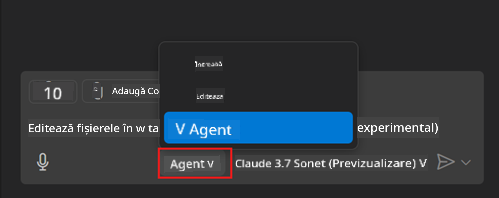
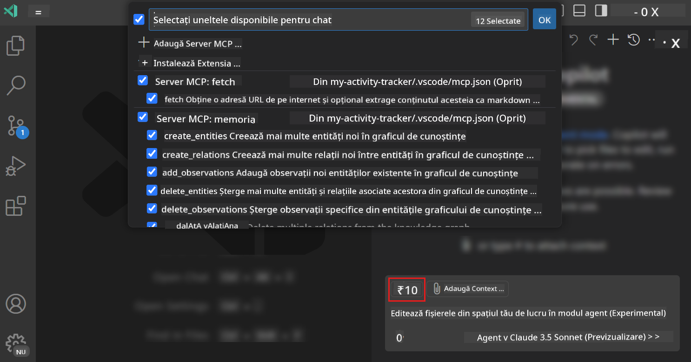
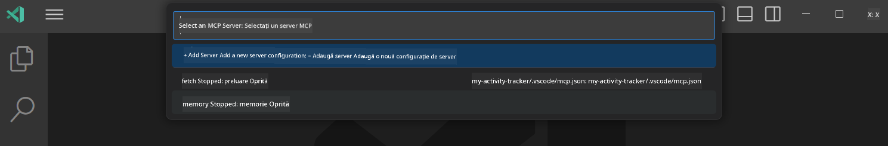
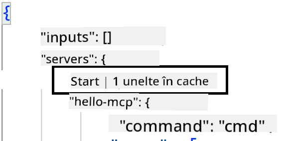
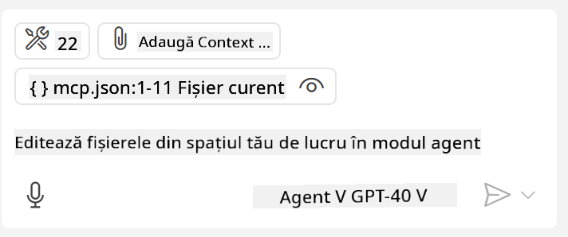
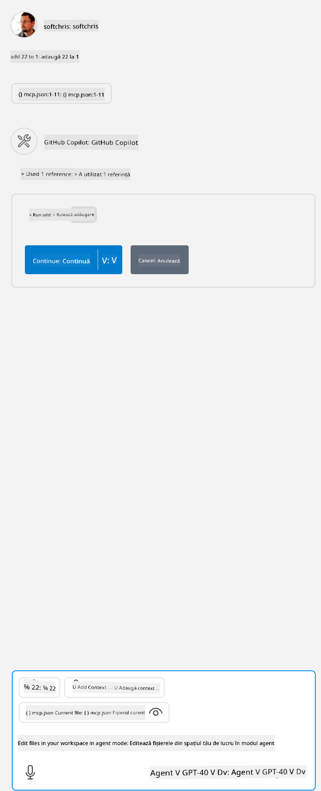

<!--
CO_OP_TRANSLATOR_METADATA:
{
  "original_hash": "d940b5e0af75e3a3a4d1c3179120d1d9",
  "translation_date": "2025-08-26T18:17:50+00:00",
  "source_file": "03-GettingStarted/04-vscode/README.md",
  "language_code": "ro"
}
-->
# Consumarea unui server din modul Agent GitHub Copilot

Visual Studio Code și GitHub Copilot pot acționa ca un client și pot consuma un MCP Server. De ce ne-ar interesa să facem asta, te-ai putea întreba? Ei bine, asta înseamnă că orice funcționalități are MCP Server pot fi acum utilizate direct din IDE-ul tău. Imaginează-ți, de exemplu, că adaugi serverul MCP al GitHub, ceea ce ți-ar permite să controlezi GitHub prin comenzi naturale, în loc să tastezi comenzi specifice în terminal. Sau imaginează-ți orice altceva care ar putea îmbunătăți experiența ta de dezvoltator, totul controlat prin limbaj natural. Acum începi să vezi avantajele, nu-i așa?

## Prezentare generală

Această lecție acoperă modul de utilizare a Visual Studio Code și a modului Agent al GitHub Copilot ca un client pentru MCP Server.

## Obiective de învățare

La finalul acestei lecții, vei putea:

- Consuma un MCP Server prin Visual Studio Code.
- Rula funcționalități precum unelte prin GitHub Copilot.
- Configura Visual Studio Code pentru a găsi și gestiona MCP Server-ul tău.

## Utilizare

Poți controla MCP Server-ul în două moduri diferite:

- Interfața utilizatorului – vei vedea cum se face acest lucru mai târziu în acest capitol.
- Terminal – este posibil să controlezi lucrurile din terminal folosind executabilul `code`:

  Pentru a adăuga un MCP Server în profilul tău de utilizator, folosește opțiunea de linie de comandă --add-mcp și furnizează configurația serverului JSON sub forma {\"name\":\"server-name\",\"command\":...}.

  ```
  code --add-mcp "{\"name\":\"my-server\",\"command\": \"uvx\",\"args\": [\"mcp-server-fetch\"]}"
  ```

### Capturi de ecran





Vom discuta mai multe despre cum utilizăm interfața vizuală în secțiunile următoare.

## Abordare

Iată cum trebuie să abordăm acest lucru la un nivel înalt:

- Configurăm un fișier pentru a găsi MCP Server-ul nostru.
- Pornim/Conectăm serverul pentru a lista capabilitățile acestuia.
- Utilizăm aceste capabilități prin intermediul interfeței de chat GitHub Copilot.

Minunat, acum că înțelegem fluxul, să încercăm să utilizăm un MCP Server prin Visual Studio Code printr-un exercițiu.

## Exercițiu: Consumarea unui server

În acest exercițiu, vom configura Visual Studio Code pentru a găsi MCP Server-ul tău astfel încât să poată fi utilizat prin interfața de chat GitHub Copilot.

### -0- Pas preliminar: activarea descoperirii MCP Server

Este posibil să fie nevoie să activezi descoperirea MCP Server-elor.

1. Mergi la `File -> Preferences -> Settings` în Visual Studio Code.

1. Caută "MCP" și activează `chat.mcp.discovery.enabled` în fișierul settings.json.

### -1- Crearea fișierului de configurare

Începe prin a crea un fișier de configurare în rădăcina proiectului tău. Vei avea nevoie de un fișier numit MCP.json, pe care să-l plasezi într-un folder numit .vscode. Ar trebui să arate astfel:

```text
.vscode
|-- mcp.json
```

În continuare, să vedem cum putem adăuga o intrare pentru server.

### -2- Configurarea unui server

Adaugă următorul conținut în *mcp.json*:

```json
{
    "inputs": [],
    "servers": {
       "hello-mcp": {
           "command": "node",
           "args": [
               "build/index.js"
           ]
       }
    }
}
```

Exemplul de mai sus arată cum să pornești un server scris în Node.js. Pentru alte runtime-uri, specifică comanda corectă pentru pornirea serverului folosind `command` și `args`.

### -3- Pornirea serverului

Acum că ai adăugat o intrare, să pornim serverul:

1. Localizează intrarea ta în *mcp.json* și asigură-te că găsești pictograma "play":

    

1. Fă clic pe pictograma "play". Ar trebui să vezi că numărul de unelte disponibile în GitHub Copilot Chat crește. Dacă faci clic pe pictograma uneltelor, vei vedea o listă cu uneltele înregistrate. Poți bifa/debifa fiecare unealtă în funcție de dorința ta ca GitHub Copilot să le utilizeze ca context:

  

1. Pentru a rula o unealtă, tastează un prompt care știi că se potrivește cu descrierea uneia dintre uneltele tale, de exemplu un prompt precum "adaugă 22 la 1":

  

  Ar trebui să vezi un răspuns care spune 23.

## Sarcină

Încearcă să adaugi o intrare pentru server în fișierul *mcp.json* și asigură-te că poți porni/opri serverul. Asigură-te că poți comunica cu uneltele de pe serverul tău prin interfața de chat GitHub Copilot.

## Soluție

[Soluție](./solution/README.md)

## Concluzii cheie

Concluziile acestui capitol sunt următoarele:

- Visual Studio Code este un client excelent care îți permite să consumi mai multe MCP Servere și uneltele lor.
- Interfața de chat GitHub Copilot este modul prin care interacționezi cu serverele.
- Poți solicita utilizatorului să introducă date, precum chei API, care pot fi transmise MCP Server-ului atunci când configurezi intrarea în fișierul *mcp.json*.

## Exemple

- [Calculator Java](../samples/java/calculator/README.md)
- [Calculator .Net](../../../../03-GettingStarted/samples/csharp)
- [Calculator JavaScript](../samples/javascript/README.md)
- [Calculator TypeScript](../samples/typescript/README.md)
- [Calculator Python](../../../../03-GettingStarted/samples/python)

## Resurse suplimentare

- [Documentația Visual Studio](https://code.visualstudio.com/docs/copilot/chat/mcp-servers)

## Ce urmează

- Următorul capitol: [Crearea unui server stdio](../05-stdio-server/README.md)

---

**Declinare de responsabilitate**:  
Acest document a fost tradus folosind serviciul de traducere AI [Co-op Translator](https://github.com/Azure/co-op-translator). Deși ne străduim să asigurăm acuratețea, vă rugăm să fiți conștienți că traducerile automate pot conține erori sau inexactități. Documentul original în limba sa maternă ar trebui considerat sursa autoritară. Pentru informații critice, se recomandă traducerea profesională realizată de un specialist uman. Nu ne asumăm responsabilitatea pentru eventualele neînțelegeri sau interpretări greșite care pot apărea din utilizarea acestei traduceri.