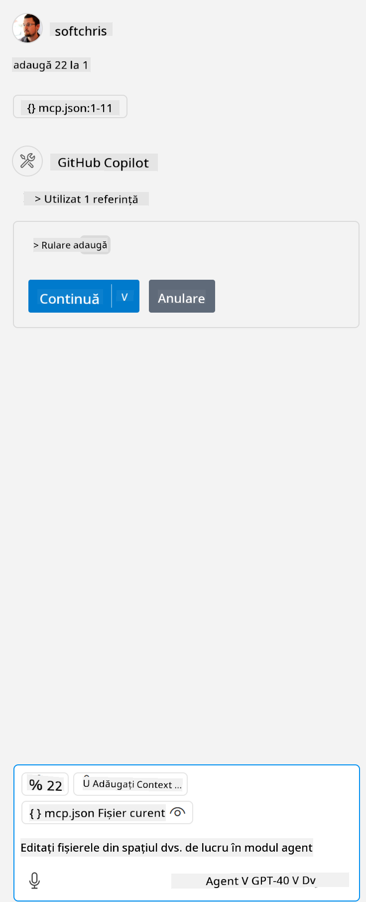

<!--
CO_OP_TRANSLATOR_METADATA:
{
  "original_hash": "96e08a8c1049dab757deb64cce4ea1e8",
  "translation_date": "2025-05-17T11:24:03+00:00",
  "source_file": "03-GettingStarted/04-vscode/solution/README.md",
  "language_code": "ro"
}
-->
# Rularea exemplului

Presupunem că aveți deja un cod de server funcțional. Vă rugăm să găsiți un server din unul dintre capitolele anterioare.

## Configurați mcp.json

Iată un fișier pe care îl folosiți ca referință, [mcp.json](../../../../../03-GettingStarted/04-vscode/solution/mcp.json).

Modificați intrarea serverului după cum este necesar pentru a indica calea absolută către serverul dumneavoastră, inclusiv comanda completă necesară pentru rulare.

În fișierul de exemplu menționat mai sus, intrarea serverului arată astfel:

```json
"hello-mcp": {
    "command": "cmd",
    "args": [
        "/c", "node", "<absolute path>\\build\\index.js"
    ]
}
```

Aceasta corespunde rulării unei comenzi de genul: `cmd /c node <cale absolută>\\build\index.js`. 

- Change this server entry to fit where your server file is located or to what's needed to startup your server depending on your chosen runtime and server location.

## Consume the features in the server

- Click the `play` icon, once you've added *mcp.json* to *./vscode* folder, 

    Observe the tooling icon change to increase the number of available tools. Tooling icon is located right above the chat field in GitHub Copilot.

## Run a tool

- Type a prompt in your chat window that matches the description of your tool. For example to trigger the tool `add` scrieți ceva de genul "adaugă 3 la 20".

    Ar trebui să vedeți un instrument prezentat deasupra casetei de text de chat, indicând să selectați pentru a rula instrumentul, ca în această imagine:

    

    Selectarea instrumentului ar trebui să producă un rezultat numeric spunând "23" dacă promptul dvs. a fost așa cum am menționat anterior.

**Declinarea responsabilității**:  
Acest document a fost tradus folosind serviciul de traducere AI [Co-op Translator](https://github.com/Azure/co-op-translator). Deși ne străduim să asigurăm acuratețea, vă rugăm să fiți conștienți că traducerile automate pot conține erori sau inexactități. Documentul original în limba sa natală ar trebui considerat sursa autoritară. Pentru informații critice, se recomandă traducerea umană profesională. Nu ne asumăm responsabilitatea pentru eventualele neînțelegeri sau interpretări greșite care pot apărea din utilizarea acestei traduceri.