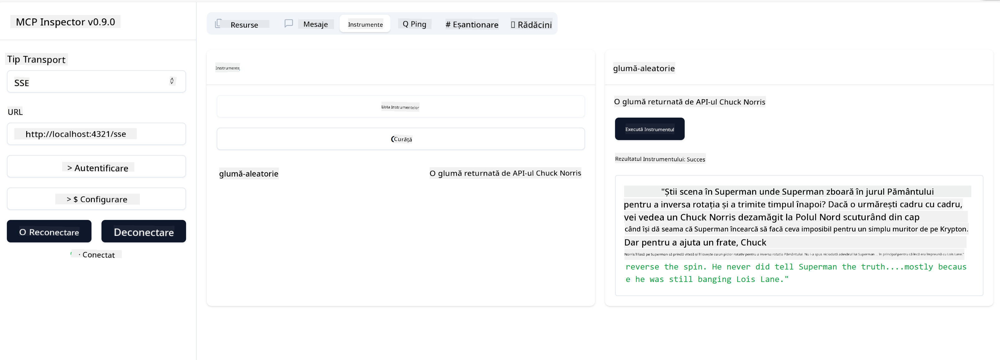

<!--
CO_OP_TRANSLATOR_METADATA:
{
  "original_hash": "6b1152afb5d4cb9a4175044694fd02ca",
  "translation_date": "2025-07-17T11:19:46+00:00",
  "source_file": "03-GettingStarted/05-sse-server/README.md",
  "language_code": "ro"
}
-->
# Server SSE

SSE (Server Sent Events) este un standard pentru streaming de la server către client, permițând serverelor să trimită actualizări în timp real către clienți prin HTTP. Acest lucru este deosebit de util pentru aplicații care necesită actualizări live, cum ar fi aplicațiile de chat, notificările sau fluxurile de date în timp real. De asemenea, serverul tău poate fi folosit de mai mulți clienți simultan, deoarece rulează pe un server care poate fi găzduit, de exemplu, în cloud.

## Prezentare generală

Această lecție acoperă cum să construiești și să consumi servere SSE.

## Obiective de învățare

La finalul acestei lecții, vei putea:

- Să construiești un server SSE.
- Să depanezi un server SSE folosind Inspector.
- Să consumi un server SSE folosind Visual Studio Code.

## SSE, cum funcționează

SSE este unul dintre cele două tipuri de transport suportate. Ai văzut deja primul, stdio, folosit în lecțiile anterioare. Diferența este următoarea:

- SSE necesită să gestionezi două lucruri: conexiunea și mesajele.
- Deoarece acest server poate rula oriunde, trebuie să reflectezi acest lucru în modul în care lucrezi cu unelte precum Inspector și Visual Studio Code. Asta înseamnă că, în loc să specifici cum să pornești serverul, indici punctul final (endpoint) unde se poate stabili conexiunea. Vezi exemplul de cod de mai jos:

### TypeScript

```typescript
app.get("/sse", async (_: Request, res: Response) => {
    const transport = new SSEServerTransport('/messages', res);
    transports[transport.sessionId] = transport;
    res.on("close", () => {
        delete transports[transport.sessionId];
    });
    await server.connect(transport);
});

app.post("/messages", async (req: Request, res: Response) => {
    const sessionId = req.query.sessionId as string;
    const transport = transports[sessionId];
    if (transport) {
        await transport.handlePostMessage(req, res);
    } else {
        res.status(400).send('No transport found for sessionId');
    }
});
```

În codul de mai sus:

- `/sse` este configurat ca o rută. Când se face o cerere către această rută, se creează o nouă instanță de transport și serverul *se conectează* folosind acest transport.
- `/messages` este ruta care gestionează mesajele primite.

### Python

```python
mcp = FastMCP("My App")

@mcp.tool()
def add(a: int, b: int) -> int:
    """Add two numbers"""
    return a + b

# Mount the SSE server to the existing ASGI server
app = Starlette(
    routes=[
        Mount('/', app=mcp.sse_app()),
    ]
)

```

În codul de mai sus:

- Creăm o instanță a unui server ASGI (folosind Starlette în mod specific) și montăm ruta implicită `/`.

  Ce se întâmplă în spate este că rutele `/sse` și `/messages` sunt configurate să gestioneze conexiunile și mesajele, respectiv. Restul aplicației, cum ar fi adăugarea de funcționalități precum unelte, se face la fel ca în serverele stdio.

### .NET    

```csharp
    var builder = WebApplication.CreateBuilder(args);
    builder.Services
        .AddMcpServer()
        .WithTools<Tools>();


    builder.Services.AddHttpClient();

    var app = builder.Build();

    app.MapMcp();
    ```

    Există două metode care ne ajută să trecem de la un server web la un server web care suportă SSE și acestea sunt:

    - `AddMcpServer`, această metodă adaugă capabilități.
    - `MapMcp`, aceasta adaugă rute precum `/SSE` și `/messages`.

Acum că știm puțin mai multe despre SSE, să construim un server SSE.

## Exercițiu: Crearea unui server SSE

Pentru a crea serverul, trebuie să ținem cont de două lucruri:

- Trebuie să folosim un server web pentru a expune punctele finale pentru conexiune și mesaje.
- Construim serverul așa cum am făcut cu stdio, folosind unelte, resurse și prompturi.

### -1- Crearea unei instanțe de server

Pentru a crea serverul, folosim aceleași tipuri ca la stdio. Totuși, pentru transport, trebuie să alegem SSE.

### TypeScript

```typescript
import { Request, Response } from "express";
import express from "express";
import { McpServer } from "@modelcontextprotocol/sdk/server/mcp.js";
import { SSEServerTransport } from "@modelcontextprotocol/sdk/server/sse.js";

const server = new McpServer({
  name: "example-server",
  version: "1.0.0"
});

const app = express();

const transports: {[sessionId: string]: SSEServerTransport} = {};
```

În codul de mai sus am:

- Creat o instanță de server.
- Definit o aplicație folosind framework-ul web express.
- Creat o variabilă transports pe care o vom folosi pentru a stoca conexiunile primite.

### Python

```python
from starlette.applications import Starlette
from starlette.routing import Mount, Host
from mcp.server.fastmcp import FastMCP


mcp = FastMCP("My App")
```

În codul de mai sus am:

- Importat bibliotecile necesare, inclusiv Starlette (un framework ASGI).
- Creat o instanță de server MCP numită `mcp`.

### .NET

```csharp
var builder = WebApplication.CreateBuilder(args);
builder.Services
    .AddMcpServer();


builder.Services.AddHttpClient();

var app = builder.Build();

// TODO: add routes 
```

Până acum am:

- Creat o aplicație web.
- Adăugat suport pentru funcționalitățile MCP prin `AddMcpServer`.

Următorul pas este să adăugăm rutele necesare.

### -2- Adăugarea rutelor

Să adăugăm rutele care gestionează conexiunea și mesajele primite:

### TypeScript

```typescript
app.get("/sse", async (_: Request, res: Response) => {
  const transport = new SSEServerTransport('/messages', res);
  transports[transport.sessionId] = transport;
  res.on("close", () => {
    delete transports[transport.sessionId];
  });
  await server.connect(transport);
});

app.post("/messages", async (req: Request, res: Response) => {
  const sessionId = req.query.sessionId as string;
  const transport = transports[sessionId];
  if (transport) {
    await transport.handlePostMessage(req, res);
  } else {
    res.status(400).send('No transport found for sessionId');
  }
});

app.listen(3001);
```

În codul de mai sus am definit:

- O rută `/sse` care instanțiază un transport de tip SSE și apelează `connect` pe serverul MCP.
- O rută `/messages` care se ocupă de mesajele primite.

### Python

```python
app = Starlette(
    routes=[
        Mount('/', app=mcp.sse_app()),
    ]
)
```

În codul de mai sus am:

- Creat o instanță de aplicație ASGI folosind framework-ul Starlette. Ca parte a acesteia, am trecut `mcp.sse_app()` în lista de rute. Astfel, se montează rutele `/sse` și `/messages` pe instanța aplicației.

### .NET

```csharp
var builder = WebApplication.CreateBuilder(args);
builder.Services
    .AddMcpServer();

builder.Services.AddHttpClient();

var app = builder.Build();

app.MapMcp();
```

Am adăugat o linie de cod la final `add.MapMcp()`, ceea ce înseamnă că acum avem rutele `/SSE` și `/messages`.

Următorul pas este să adăugăm capabilități serverului.

### -3- Adăugarea capabilităților serverului

Acum că am definit tot ce ține de SSE, să adăugăm capabilități serverului, cum ar fi unelte, prompturi și resurse.

### TypeScript

```typescript
server.tool("random-joke", "A joke returned by the chuck norris api", {},
  async () => {
    const response = await fetch("https://api.chucknorris.io/jokes/random");
    const data = await response.json();

    return {
      content: [
        {
          type: "text",
          text: data.value
        }
      ]
    };
  }
);
```

Iată cum poți adăuga o unealtă, de exemplu. Această unealtă creează o unealtă numită "random-joke" care apelează o API Chuck Norris și returnează un răspuns JSON.

### Python

```python
@mcp.tool()
def add(a: int, b: int) -> int:
    """Add two numbers"""
    return a + b
```

Acum serverul tău are o unealtă.

### TypeScript

```typescript
// server-sse.ts
import { Request, Response } from "express";
import express from "express";
import { McpServer } from "@modelcontextprotocol/sdk/server/mcp.js";
import { SSEServerTransport } from "@modelcontextprotocol/sdk/server/sse.js";

// Create an MCP server
const server = new McpServer({
  name: "example-server",
  version: "1.0.0",
});

const app = express();

const transports: { [sessionId: string]: SSEServerTransport } = {};

app.get("/sse", async (_: Request, res: Response) => {
  const transport = new SSEServerTransport("/messages", res);
  transports[transport.sessionId] = transport;
  res.on("close", () => {
    delete transports[transport.sessionId];
  });
  await server.connect(transport);
});

app.post("/messages", async (req: Request, res: Response) => {
  const sessionId = req.query.sessionId as string;
  const transport = transports[sessionId];
  if (transport) {
    await transport.handlePostMessage(req, res);
  } else {
    res.status(400).send("No transport found for sessionId");
  }
});

server.tool("random-joke", "A joke returned by the chuck norris api", {}, async () => {
  const response = await fetch("https://api.chucknorris.io/jokes/random");
  const data = await response.json();

  return {
    content: [
      {
        type: "text",
        text: data.value,
      },
    ],
  };
});

app.listen(3001);
```

### Python

```python
from starlette.applications import Starlette
from starlette.routing import Mount, Host
from mcp.server.fastmcp import FastMCP


mcp = FastMCP("My App")

@mcp.tool()
def add(a: int, b: int) -> int:
    """Add two numbers"""
    return a + b

# Mount the SSE server to the existing ASGI server
app = Starlette(
    routes=[
        Mount('/', app=mcp.sse_app()),
    ]
)
```

### .NET

1. Să creăm mai întâi câteva unelte, pentru asta vom crea un fișier *Tools.cs* cu următorul conținut:

  ```csharp
  using System.ComponentModel;
  using System.Text.Json;
  using ModelContextProtocol.Server;

  namespace server;

  [McpServerToolType]
  public sealed class Tools
  {

      public Tools()
      {
      
      }

      [McpServerTool, Description("Add two numbers together.")]
      public async Task<string> AddNumbers(
          [Description("The first number")] int a,
          [Description("The second number")] int b)
      {
          return (a + b).ToString();
      }

  }
  ```

  Aici am adăugat următoarele:

  - Am creat o clasă `Tools` cu decoratorul `McpServerToolType`.
  - Am definit o unealtă `AddNumbers` decorând metoda cu `McpServerTool`. Am furnizat și parametrii și implementarea.

1. Să folosim clasa `Tools` pe care tocmai am creat-o:

  ```csharp
  var builder = WebApplication.CreateBuilder(args);
  builder.Services
      .AddMcpServer()
      .WithTools<Tools>();


  builder.Services.AddHttpClient();

  var app = builder.Build();

  app.MapMcp();
  ```

  Am adăugat un apel la `WithTools` care specifică `Tools` ca fiind clasa care conține uneltele. Gata, suntem pregătiți.

Perfect, avem un server care folosește SSE, să-l testăm acum.

## Exercițiu: Depanarea unui server SSE cu Inspector

Inspector este un instrument excelent pe care l-am văzut în lecția anterioară [Crearea primului tău server](/03-GettingStarted/01-first-server/README.md). Să vedem dacă îl putem folosi și aici:

### -1- Pornirea inspectorului

Pentru a porni inspectorul, trebuie mai întâi să ai un server SSE pornit, așa că să facem asta:

1. Pornește serverul

    ### TypeScript

    ```sh
    tsx && node ./build/server-sse.ts
    ```

    ### Python

    ```sh
    uvicorn server:app
    ```

    Observă cum folosim executabilul `uvicorn` care se instalează când am tastat `pip install "mcp[cli]"`. Tastarea `server:app` înseamnă că încercăm să rulăm fișierul `server.py` și să avem o instanță Starlette numită `app`.

    ### .NET

    ```sh
    dotnet run
    ```

    Acest lucru ar trebui să pornească serverul. Pentru a interacționa cu el, ai nevoie de un terminal nou.

1. Pornește inspectorul

    > ![NOTE]
    > Rulează acest lucru într-o fereastră de terminal separată față de cea în care rulează serverul. De asemenea, trebuie să ajustezi comanda de mai jos pentru a se potrivi cu URL-ul unde rulează serverul tău.

    ```sh
    npx @modelcontextprotocol/inspector --cli http://localhost:8000/sse --method tools/list
    ```

    Pornirea inspectorului arată la fel în toate mediile de rulare. Observă că, în loc să trecem o cale către server și o comandă pentru pornirea serverului, trecem URL-ul unde serverul rulează și specificăm ruta `/sse`.

### -2- Testarea uneltei

Conectează serverul selectând SSE în lista derulantă și completează câmpul URL cu adresa unde rulează serverul tău, de exemplu http:localhost:4321/sse. Apoi apasă butonul "Connect". Ca înainte, selectează să listezi uneltele, alege o unealtă și oferă valorile de intrare. Ar trebui să vezi un rezultat ca în imaginea de mai jos:



Perfect, poți lucra cu inspectorul, să vedem acum cum putem lucra cu Visual Studio Code.

## Temă

Încearcă să extinzi serverul cu mai multe capabilități. Vezi [această pagină](https://api.chucknorris.io/) pentru a adăuga, de exemplu, o unealtă care apelează o API. Tu decizi cum ar trebui să arate serverul. Distracție plăcută :)

## Soluție

[Soluție](./solution/README.md) Iată o posibilă soluție cu cod funcțional.

## Concluzii cheie

Concluziile cheie din acest capitol sunt următoarele:

- SSE este al doilea tip de transport suportat, pe lângă stdio.
- Pentru a suporta SSE, trebuie să gestionezi conexiunile și mesajele primite folosind un framework web.
- Poți folosi atât Inspector, cât și Visual Studio Code pentru a consuma un server SSE, la fel ca serverele stdio. Observă că există mici diferențe între stdio și SSE. Pentru SSE, trebuie să pornești serverul separat și apoi să rulezi instrumentul inspector. Pentru inspector, există și diferențe în sensul că trebuie să specifici URL-ul.

## Exemple

- [Calculator Java](../samples/java/calculator/README.md)
- [Calculator .Net](../../../../03-GettingStarted/samples/csharp)
- [Calculator JavaScript](../samples/javascript/README.md)
- [Calculator TypeScript](../samples/typescript/README.md)
- [Calculator Python](../../../../03-GettingStarted/samples/python)

## Resurse suplimentare

- [SSE](https://developer.mozilla.org/en-US/docs/Web/API/Server-sent_events)

## Ce urmează

- Următorul: [HTTP Streaming cu MCP (Streamable HTTP)](../06-http-streaming/README.md)

**Declinare de responsabilitate**:  
Acest document a fost tradus folosind serviciul de traducere AI [Co-op Translator](https://github.com/Azure/co-op-translator). Deși ne străduim pentru acuratețe, vă rugăm să rețineți că traducerile automate pot conține erori sau inexactități. Documentul original în limba sa nativă trebuie considerat sursa autorizată. Pentru informații critice, se recomandă traducerea profesională realizată de un specialist uman. Nu ne asumăm răspunderea pentru eventualele neînțelegeri sau interpretări greșite rezultate din utilizarea acestei traduceri.