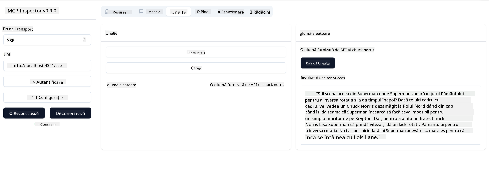

<!--
CO_OP_TRANSLATOR_METADATA:
{
  "original_hash": "0a8086dc4bf89448f83e7936db972c42",
  "translation_date": "2025-05-17T11:43:27+00:00",
  "source_file": "03-GettingStarted/05-sse-server/README.md",
  "language_code": "ro"
}
-->
Acum că știm puțin mai multe despre SSE, să construim un server SSE.

## Exercițiu: Crearea unui Server SSE

Pentru a crea serverul nostru, trebuie să ținem cont de două lucruri:

- Trebuie să folosim un server web pentru a expune puncte de acces pentru conexiune și mesaje.
- Construim serverul nostru așa cum facem în mod normal cu unelte, resurse și solicitări când folosim stdio.

### -1- Crearea unei instanțe de server

Pentru a crea serverul nostru, folosim aceleași tipuri ca și cu stdio. Totuși, pentru transport, trebuie să alegem SSE.

Să adăugăm următoarele rute.

### -2- Adăugarea rutelor

Să adăugăm rutele care se ocupă de conexiune și de mesajele primite:

Să adăugăm capacități serverului nostru.

### -3- Adăugarea capacităților serverului

Acum că am definit tot ce este specific SSE, să adăugăm capacități serverului precum unelte, solicitări și resurse.

Codul tău complet ar trebui să arate astfel:

Grozav, avem un server care folosește SSE, să-l testăm în continuare.

## Exercițiu: Debugging un Server SSE cu Inspector

Inspector este un instrument excelent pe care l-am văzut într-o lecție anterioară [Crearea primului tău server](/03-GettingStarted/01-first-server/README.md). Să vedem dacă putem folosi Inspector și aici:

### -1- Rularea inspectorului

Pentru a rula inspectorul, mai întâi trebuie să ai un server SSE în funcțiune, așa că să facem asta:

1. Rulează serverul

1. Rulează inspectorul

    > ![NOTE]
    > Rulează acest lucru într-o fereastră de terminal separată față de cea în care rulează serverul. De asemenea, notează că trebuie să ajustezi comanda de mai jos pentru a se potrivi cu URL-ul unde rulează serverul tău.

    ```sh
    npx @modelcontextprotocol/inspector --cli http://localhost:8000/sse --method tools/list
    ```

    Rularea inspectorului arată la fel în toate runtime-urile. Observă cum, în loc să trecem o cale către serverul nostru și o comandă pentru a porni serverul, trecem URL-ul unde rulează serverul și specificăm și ruta `/sse`.

### -2- Încercarea instrumentului

Conectează serverul selectând SSE din lista derulantă și completează câmpul URL unde rulează serverul tău, de exemplu http:localhost:4321/sse. Acum apasă butonul "Connect". Ca și înainte, alege să listezi uneltele, selectează o unealtă și furnizează valori de intrare. Ar trebui să vezi un rezultat ca mai jos:



Grozav, poți lucra cu inspectorul, să vedem cum putem lucra cu Visual Studio Code în continuare.

## Temă

Încearcă să îți construiești serverul cu mai multe capacități. Vezi [această pagină](https://api.chucknorris.io/) pentru a adăuga, de exemplu, o unealtă care apelează o API, tu decizi cum ar trebui să arate serverul. Distracție plăcută :)

## Soluție

[Soluție](./solution/README.md) Iată o posibilă soluție cu cod funcțional.

## Concluzii cheie

Concluziile din acest capitol sunt următoarele:

- SSE este al doilea tip de transport suportat, pe lângă stdio.
- Pentru a suporta SSE, trebuie să gestionezi conexiunile și mesajele primite folosind un framework web.
- Poți folosi atât Inspector, cât și Visual Studio Code pentru a consuma serverul SSE, la fel ca serverele stdio. Observă cum diferă puțin între stdio și SSE. Pentru SSE, trebuie să pornești serverul separat și apoi să rulezi instrumentul inspector. Pentru instrumentul inspector, există și câteva diferențe în sensul că trebuie să specifici URL-ul.

## Exemple

- [Calculator Java](../samples/java/calculator/README.md)
- [Calculator .Net](../../../../03-GettingStarted/samples/csharp)
- [Calculator JavaScript](../samples/javascript/README.md)
- [Calculator TypeScript](../samples/typescript/README.md)
- [Calculator Python](../../../../03-GettingStarted/samples/python)

## Resurse suplimentare

- [SSE](https://developer.mozilla.org/en-US/docs/Web/API/Server-sent_events)

## Ce urmează

- Următorul: [Introducere în AI Toolkit pentru VSCode](/03-GettingStarted/06-aitk/README.md)

**Declinare de responsabilitate**:  
Acest document a fost tradus folosind serviciul de traducere AI [Co-op Translator](https://github.com/Azure/co-op-translator). Deși ne străduim să asigurăm acuratețea, vă rugăm să fiți conștienți de faptul că traducerile automate pot conține erori sau inexactități. Documentul original în limba sa maternă ar trebui considerat sursa autoritară. Pentru informații critice, se recomandă traducerea profesională umană. Nu suntem responsabili pentru neînțelegeri sau interpretări greșite care pot apărea din utilizarea acestei traduceri.