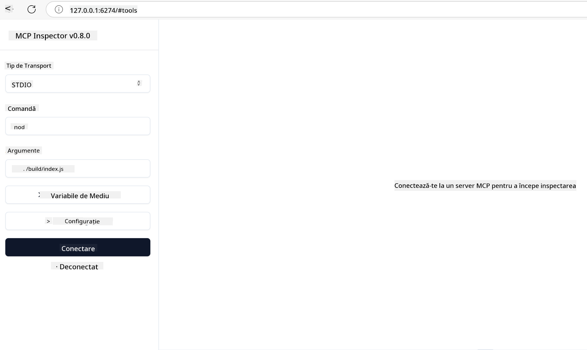

<!--
CO_OP_TRANSLATOR_METADATA:
{
  "original_hash": "717f34718a773f6cf52d8445e40a96bf",
  "translation_date": "2025-05-17T12:47:47+00:00",
  "source_file": "03-GettingStarted/07-testing/README.md",
  "language_code": "ro"
}
-->
## Testare și depanare

Înainte de a începe testarea serverului MCP, este important să înțelegi instrumentele disponibile și cele mai bune practici pentru depanare. Testarea eficientă asigură că serverul tău se comportă conform așteptărilor și te ajută să identifici și să rezolvi rapid problemele. Secțiunea următoare prezintă abordările recomandate pentru validarea implementării MCP.

## Prezentare generală

Această lecție acoperă cum să alegi abordarea corectă de testare și cel mai eficient instrument de testare.

## Obiective de învățare

Până la sfârșitul acestei lecții, vei fi capabil să:

- Descrii diverse abordări pentru testare.
- Utilizezi diferite instrumente pentru a testa eficient codul tău.

## Testarea serverelor MCP

MCP oferă instrumente care te ajută să testezi și să depanezi serverele tale:

- **MCP Inspector**: Un instrument de linie de comandă care poate fi rulat atât ca un instrument CLI, cât și ca un instrument vizual.
- **Testare manuală**: Poți folosi un instrument precum curl pentru a rula cereri web, dar orice instrument capabil să ruleze HTTP va fi potrivit.
- **Testare unitară**: Este posibil să folosești cadrul tău de testare preferat pentru a testa caracteristicile atât ale serverului, cât și ale clientului.

### Utilizarea MCP Inspector

Am descris utilizarea acestui instrument în lecțiile anterioare, dar să discutăm puțin despre el la un nivel înalt. Este un instrument construit în Node.js și îl poți folosi apelând executabilul `npx` care va descărca și instala temporar instrumentul și se va curăța singur după ce a terminat de rulat cererea ta.

[MCP Inspector](https://github.com/modelcontextprotocol/inspector) te ajută să:

- **Descoperi capacitățile serverului**: Detectează automat resursele disponibile, instrumentele și solicitările
- **Testezi execuția instrumentelor**: Încearcă diferiți parametri și vezi răspunsurile în timp real
- **Vizualizezi metadatele serverului**: Examinează informațiile serverului, schemele și configurațiile

O rulare tipică a instrumentului arată astfel:

```bash
npx @modelcontextprotocol/inspector node build/index.js
```

Comanda de mai sus pornește un MCP și interfața sa vizuală și lansează o interfață web locală în browserul tău. Te poți aștepta să vezi un tablou de bord care afișează serverele MCP înregistrate, instrumentele, resursele și solicitările disponibile. Interfața îți permite să testezi interactiv execuția instrumentelor, să inspectezi metadatele serverului și să vezi răspunsurile în timp real, făcând mai ușoară validarea și depanarea implementărilor serverului tău MCP.

Iată cum poate arăta: 

Poți de asemenea să rulezi acest instrument în modul CLI, caz în care adaugi atributul `--cli`. Iată un exemplu de rulare a instrumentului în modul "CLI", care listează toate instrumentele de pe server:

```sh
npx @modelcontextprotocol/inspector --cli node build/index.js --method tools/list
```

### Testare manuală

Pe lângă rularea instrumentului inspector pentru a testa capacitățile serverului, o altă abordare similară este să rulezi un client capabil să utilizeze HTTP, cum ar fi de exemplu curl.

Cu curl, poți testa serverele MCP direct folosind cereri HTTP:

```bash
# Example: Test server metadata
curl http://localhost:3000/v1/metadata

# Example: Execute a tool
curl -X POST http://localhost:3000/v1/tools/execute \
  -H "Content-Type: application/json" \
  -d '{"name": "calculator", "parameters": {"expression": "2+2"}}'
```

După cum poți vedea din utilizarea de mai sus a curl, folosești o cerere POST pentru a invoca un instrument folosind un payload format din numele instrumentului și parametrii săi. Folosește abordarea care ți se potrivește cel mai bine. Instrumentele CLI, în general, tind să fie mai rapide de utilizat și se pretează să fie scriptate, ceea ce poate fi util într-un mediu CI/CD.

### Testare unitară

Creează teste unitare pentru instrumentele și resursele tale pentru a te asigura că funcționează conform așteptărilor. Iată un exemplu de cod de testare.

```python
import pytest

from mcp.server.fastmcp import FastMCP
from mcp.shared.memory import (
    create_connected_server_and_client_session as create_session,
)

# Mark the whole module for async tests
pytestmark = pytest.mark.anyio


async def test_list_tools_cursor_parameter():
    """Test that the cursor parameter is accepted for list_tools.

    Note: FastMCP doesn't currently implement pagination, so this test
    only verifies that the cursor parameter is accepted by the client.
    """

 server = FastMCP("test")

    # Create a couple of test tools
    @server.tool(name="test_tool_1")
    async def test_tool_1() -> str:
        """First test tool"""
        return "Result 1"

    @server.tool(name="test_tool_2")
    async def test_tool_2() -> str:
        """Second test tool"""
        return "Result 2"

    async with create_session(server._mcp_server) as client_session:
        # Test without cursor parameter (omitted)
        result1 = await client_session.list_tools()
        assert len(result1.tools) == 2

        # Test with cursor=None
        result2 = await client_session.list_tools(cursor=None)
        assert len(result2.tools) == 2

        # Test with cursor as string
        result3 = await client_session.list_tools(cursor="some_cursor_value")
        assert len(result3.tools) == 2

        # Test with empty string cursor
        result4 = await client_session.list_tools(cursor="")
        assert len(result4.tools) == 2
    
```

Codul precedent face următoarele:

- Folosește cadrul pytest care îți permite să creezi teste ca funcții și să folosești declarații assert.
- Creează un server MCP cu două instrumente diferite.
- Folosește declarația `assert` pentru a verifica dacă anumite condiții sunt îndeplinite.

Aruncă o privire la [fișierul complet aici](https://github.com/modelcontextprotocol/python-sdk/blob/main/tests/client/test_list_methods_cursor.py)

Având fișierul de mai sus, poți testa propriul server pentru a te asigura că capacitățile sunt create așa cum ar trebui.

Toate SDK-urile majore au secțiuni de testare similare, astfel încât să te poți ajusta la timpul de execuție ales de tine.

## Exemple

- [Calculator Java](../samples/java/calculator/README.md)
- [Calculator .Net](../../../../03-GettingStarted/samples/csharp)
- [Calculator JavaScript](../samples/javascript/README.md)
- [Calculator TypeScript](../samples/typescript/README.md)
- [Calculator Python](../../../../03-GettingStarted/samples/python) 

## Resurse suplimentare

- [Python SDK](https://github.com/modelcontextprotocol/python-sdk)

## Ce urmează

- Următorul: [Implementare](/03-GettingStarted/08-deployment/README.md)

**Declinarea responsabilității**:  
Acest document a fost tradus folosind serviciul de traducere AI [Co-op Translator](https://github.com/Azure/co-op-translator). Deși ne străduim să asigurăm acuratețea, vă rugăm să fiți conștienți că traducerile automate pot conține erori sau inexactități. Documentul original în limba sa natală ar trebui considerat sursa autoritară. Pentru informații critice, se recomandă traducerea profesională realizată de oameni. Nu suntem responsabili pentru niciun fel de neînțelegeri sau interpretări greșite care pot apărea din utilizarea acestei traduceri.