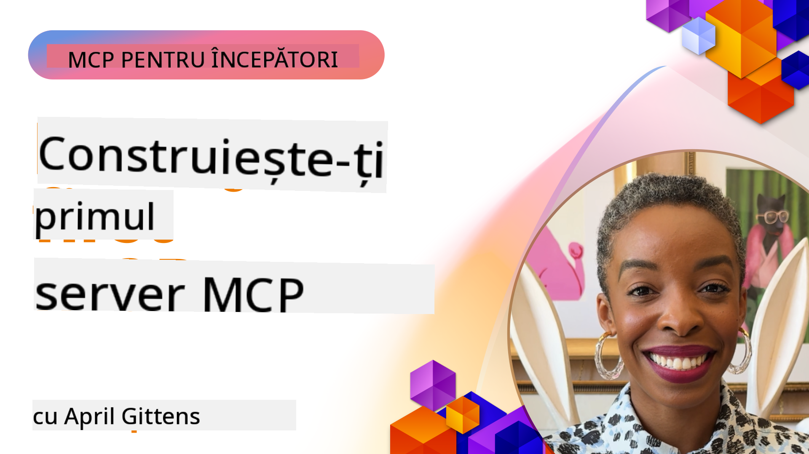

<!--
CO_OP_TRANSLATOR_METADATA:
{
  "original_hash": "858362ce0118de3fec0f9114bf396101",
  "translation_date": "2025-08-18T20:47:42+00:00",
  "source_file": "03-GettingStarted/README.md",
  "language_code": "ro"
}
-->
## Începeți  

_(Faceți clic pe imaginea de mai sus pentru a viziona videoclipul acestei lecții)_

Această secțiune constă din mai multe lecții:

- **1 Primul tău server**, în această primă lecție, vei învăța cum să creezi primul tău server și să-l inspectezi cu instrumentul de inspecție, o metodă valoroasă pentru testarea și depanarea serverului tău, [către lecție](01-first-server/README.md)

- **2 Client**, în această lecție, vei învăța cum să scrii un client care se poate conecta la serverul tău, [către lecție](02-client/README.md)

- **3 Client cu LLM**, o metodă și mai bună de a scrie un client este prin adăugarea unui LLM, astfel încât acesta să poată "negocia" cu serverul tău despre ce să facă, [către lecție](03-llm-client/README.md)

- **4 Consumarea unui server în modul GitHub Copilot Agent în Visual Studio Code**. Aici, vom analiza rularea serverului MCP din Visual Studio Code, [către lecție](04-vscode/README.md)

- **5 Consumarea dintr-un SSE (Server Sent Events)** SSE este un standard pentru streaming server-client, permițând serverelor să trimită actualizări în timp real către clienți prin HTTP [către lecție](05-sse-server/README.md)

- **6 Streaming HTTP cu MCP (Streamable HTTP)**. Învață despre streamingul modern HTTP, notificările de progres și cum să implementezi servere și clienți MCP scalabili, în timp real, folosind Streamable HTTP. [către lecție](06-http-streaming/README.md)

- **7 Utilizarea AI Toolkit pentru VSCode** pentru a consuma și testa clienții și serverele MCP [către lecție](07-aitk/README.md)

- **8 Testare**. Aici ne vom concentra în special pe cum putem testa serverul și clientul în diferite moduri, [către lecție](08-testing/README.md)

- **9 Implementare**. Acest capitol va analiza diferite moduri de a implementa soluțiile MCP, [către lecție](09-deployment/README.md)

Protocolul Model Context (MCP) este un protocol deschis care standardizează modul în care aplicațiile oferă context LLM-urilor. Gândește-te la MCP ca la un port USB-C pentru aplicațiile AI - oferă o modalitate standardizată de a conecta modelele AI la diferite surse de date și instrumente.

## Obiectivele învățării

Până la sfârșitul acestei lecții, vei putea:

- Configura medii de dezvoltare pentru MCP în C#, Java, Python, TypeScript și JavaScript
- Construi și implementa servere MCP de bază cu funcționalități personalizate (resurse, prompturi și instrumente)
- Crea aplicații gazdă care se conectează la serverele MCP
- Testa și depana implementările MCP
- Înțelege provocările comune de configurare și soluțiile acestora
- Conecta implementările MCP la servicii populare LLM

## Configurarea mediului MCP

Înainte de a începe să lucrezi cu MCP, este important să îți pregătești mediul de dezvoltare și să înțelegi fluxul de lucru de bază. Această secțiune te va ghida prin pașii inițiali de configurare pentru a asigura un început fără probleme cu MCP.

### Cerințe preliminare

Înainte de a te apuca de dezvoltarea MCP, asigură-te că ai:

- **Mediu de dezvoltare**: Pentru limbajul ales (C#, Java, Python, TypeScript sau JavaScript)
- **IDE/Editor**: Visual Studio, Visual Studio Code, IntelliJ, Eclipse, PyCharm sau orice editor modern de cod
- **Manageri de pachete**: NuGet, Maven/Gradle, pip sau npm/yarn
- **Chei API**: Pentru orice servicii AI pe care intenționezi să le utilizezi în aplicațiile gazdă

### SDK-uri oficiale

În capitolele următoare vei vedea soluții construite folosind Python, TypeScript, Java și .NET. Iată toate SDK-urile oficiale suportate.

MCP oferă SDK-uri oficiale pentru mai multe limbaje:
- [C# SDK](https://github.com/modelcontextprotocol/csharp-sdk) - Menținut în colaborare cu Microsoft
- [Java SDK](https://github.com/modelcontextprotocol/java-sdk) - Menținut în colaborare cu Spring AI
- [TypeScript SDK](https://github.com/modelcontextprotocol/typescript-sdk) - Implementarea oficială TypeScript
- [Python SDK](https://github.com/modelcontextprotocol/python-sdk) - Implementarea oficială Python
- [Kotlin SDK](https://github.com/modelcontextprotocol/kotlin-sdk) - Implementarea oficială Kotlin
- [Swift SDK](https://github.com/modelcontextprotocol/swift-sdk) - Menținut în colaborare cu Loopwork AI
- [Rust SDK](https://github.com/modelcontextprotocol/rust-sdk) - Implementarea oficială Rust

## Idei principale

- Configurarea unui mediu de dezvoltare MCP este simplă cu SDK-uri specifice limbajului
- Construirea serverelor MCP implică crearea și înregistrarea instrumentelor cu scheme clare
- Clienții MCP se conectează la servere și modele pentru a valorifica capabilități extinse
- Testarea și depanarea sunt esențiale pentru implementări MCP fiabile
- Opțiunile de implementare variază de la dezvoltare locală la soluții bazate pe cloud

## Practică

Avem un set de exemple care completează exercițiile pe care le vei vedea în toate capitolele din această secțiune. În plus, fiecare capitol are propriile exerciții și teme.

- [Calculator Java](./samples/java/calculator/README.md)
- [Calculator .Net](../../../03-GettingStarted/samples/csharp)
- [Calculator JavaScript](./samples/javascript/README.md)
- [Calculator TypeScript](./samples/typescript/README.md)
- [Calculator Python](../../../03-GettingStarted/samples/python)

## Resurse suplimentare

- [Construiește agenți folosind Model Context Protocol pe Azure](https://learn.microsoft.com/azure/developer/ai/intro-agents-mcp)
- [MCP Remote cu Azure Container Apps (Node.js/TypeScript/JavaScript)](https://learn.microsoft.com/samples/azure-samples/mcp-container-ts/mcp-container-ts/)
- [.NET OpenAI MCP Agent](https://learn.microsoft.com/samples/azure-samples/openai-mcp-agent-dotnet/openai-mcp-agent-dotnet/)

## Ce urmează

Următorul pas: [Crearea primului tău server MCP](01-first-server/README.md)

**Declinarea responsabilității**:  
Acest document a fost tradus utilizând serviciul de traducere AI [Co-op Translator](https://github.com/Azure/co-op-translator). Deși depunem eforturi pentru a asigura acuratețea, vă rugăm să rețineți că traducerile automate pot conține erori sau inexactități. Documentul original în limba sa nativă ar trebui considerat sursa autoritară. Pentru informații critice, se recomandă traducerea profesională realizată de un specialist. Nu ne asumăm răspunderea pentru eventualele neînțelegeri sau interpretări greșite care pot apărea din utilizarea acestei traduceri.