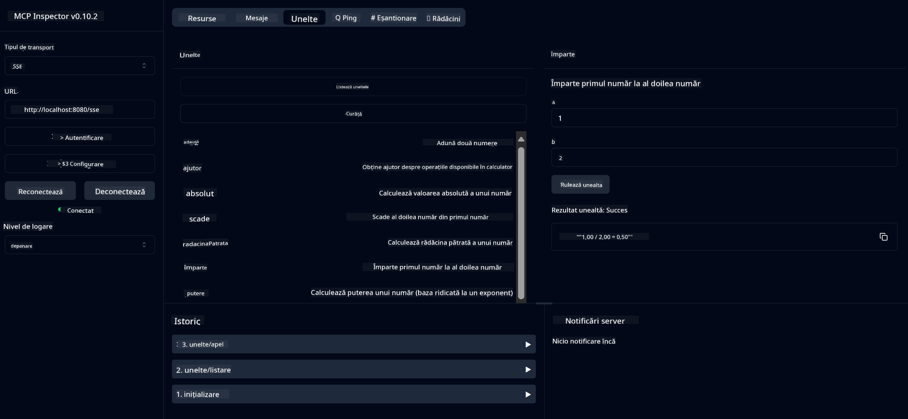

<!--
CO_OP_TRANSLATOR_METADATA:
{
  "original_hash": "13231e9951b68efd9df8c56bd5cdb27e",
  "translation_date": "2025-07-13T22:31:09+00:00",
  "source_file": "03-GettingStarted/samples/java/calculator/README.md",
  "language_code": "ro"
}
-->
# Serviciu Calculator de Bază MCP

Acest serviciu oferă operații de bază pentru calculator prin Model Context Protocol (MCP) folosind Spring Boot cu transport WebFlux. Este conceput ca un exemplu simplu pentru începători care învață despre implementările MCP.

Pentru mai multe informații, consultați documentația de referință [MCP Server Boot Starter](https://docs.spring.io/spring-ai/reference/api/mcp/mcp-server-boot-starter-docs.html).

## Prezentare generală

Serviciul demonstrează:
- Suport pentru SSE (Server-Sent Events)
- Înregistrare automată a uneltelor folosind adnotarea `@Tool` din Spring AI
- Funcții de bază ale calculatorului:
  - Adunare, scădere, înmulțire, împărțire
  - Calculul puterii și rădăcina pătrată
  - Modul (restul împărțirii) și valoarea absolută
  - Funcție de ajutor pentru descrierea operațiilor

## Caracteristici

Acest serviciu de calculator oferă următoarele capabilități:

1. **Operații aritmetice de bază**:
   - Adunarea a două numere
   - Scăderea unui număr din altul
   - Înmulțirea a două numere
   - Împărțirea unui număr la altul (cu verificare pentru împărțirea la zero)

2. **Operații avansate**:
   - Calculul puterii (ridicarea unei baze la un exponent)
   - Calculul rădăcinii pătrate (cu verificare pentru numere negative)
   - Calculul modulului (restul împărțirii)
   - Calculul valorii absolute

3. **Sistem de ajutor**:
   - Funcție de ajutor integrată care explică toate operațiile disponibile

## Utilizarea serviciului

Serviciul expune următoarele endpoint-uri API prin protocolul MCP:

- `add(a, b)`: Adună două numere
- `subtract(a, b)`: Scade al doilea număr din primul
- `multiply(a, b)`: Înmulțește două numere
- `divide(a, b)`: Împarte primul număr la al doilea (cu verificare pentru zero)
- `power(base, exponent)`: Calculează puterea unui număr
- `squareRoot(number)`: Calculează rădăcina pătrată (cu verificare pentru numere negative)
- `modulus(a, b)`: Calculează restul împărțirii
- `absolute(number)`: Calculează valoarea absolută
- `help()`: Oferă informații despre operațiile disponibile

## Client de test

Un client simplu de test este inclus în pachetul `com.microsoft.mcp.sample.client`. Clasa `SampleCalculatorClient` demonstrează operațiile disponibile ale serviciului de calculator.

## Utilizarea clientului LangChain4j

Proiectul include un client exemplu LangChain4j în `com.microsoft.mcp.sample.client.LangChain4jClient` care arată cum să integrezi serviciul de calculator cu LangChain4j și modelele GitHub:

### Cerințe preliminare

1. **Configurarea token-ului GitHub**:
   
   Pentru a folosi modelele AI de la GitHub (cum ar fi phi-4), ai nevoie de un token personal de acces GitHub:

   a. Accesează setările contului tău GitHub: https://github.com/settings/tokens
   
   b. Apasă pe „Generate new token” → „Generate new token (classic)”
   
   c. Dă token-ului un nume descriptiv
   
   d. Selectează următoarele permisiuni:
      - `repo` (Control complet asupra depozitelor private)
      - `read:org` (Citire membri organizație și echipe, citire proiecte organizație)
      - `gist` (Creare gist-uri)
      - `user:email` (Acces la adresele de email ale utilizatorului (doar citire))
   
   e. Apasă „Generate token” și copiază token-ul nou creat
   
   f. Setează-l ca variabilă de mediu:
      
      Pe Windows:
      ```
      set GITHUB_TOKEN=your-github-token
      ```
      
      Pe macOS/Linux:
      ```bash
      export GITHUB_TOKEN=your-github-token
      ```

   g. Pentru configurare persistentă, adaugă-l în variabilele de mediu prin setările sistemului

2. Adaugă dependența LangChain4j GitHub în proiectul tău (este deja inclusă în pom.xml):
   ```xml
   <dependency>
       <groupId>dev.langchain4j</groupId>
       <artifactId>langchain4j-github</artifactId>
       <version>${langchain4j.version}</version>
   </dependency>
   ```

3. Asigură-te că serverul calculatorului rulează pe `localhost:8080`

### Rularea clientului LangChain4j

Acest exemplu demonstrează:
- Conectarea la serverul MCP calculator prin transport SSE
- Folosirea LangChain4j pentru a crea un chatbot care utilizează operațiile calculatorului
- Integrarea cu modelele AI GitHub (acum folosind modelul phi-4)

Clientul trimite următoarele interogări exemplu pentru a demonstra funcționalitatea:
1. Calcularea sumei a două numere
2. Găsirea rădăcinii pătrate a unui număr
3. Obținerea informațiilor de ajutor despre operațiile disponibile ale calculatorului

Rulează exemplul și verifică ieșirea în consolă pentru a vedea cum modelul AI folosește uneltele calculatorului pentru a răspunde la întrebări.

### Configurarea modelului GitHub

Clientul LangChain4j este configurat să folosească modelul phi-4 de la GitHub cu următoarele setări:

```java
ChatLanguageModel model = GitHubChatModel.builder()
    .apiKey(System.getenv("GITHUB_TOKEN"))
    .timeout(Duration.ofSeconds(60))
    .modelName("phi-4")
    .logRequests(true)
    .logResponses(true)
    .build();
```

Pentru a folosi alte modele GitHub, schimbă pur și simplu parametrul `modelName` cu un alt model suportat (de ex., "claude-3-haiku-20240307", "llama-3-70b-8192" etc.).

## Dependențe

Proiectul necesită următoarele dependențe cheie:

```xml
<!-- For MCP Server -->
<dependency>
    <groupId>org.springframework.ai</groupId>
    <artifactId>spring-ai-starter-mcp-server-webflux</artifactId>
</dependency>

<!-- For LangChain4j integration -->
<dependency>
    <groupId>dev.langchain4j</groupId>
    <artifactId>langchain4j-mcp</artifactId>
    <version>${langchain4j.version}</version>
</dependency>

<!-- For GitHub models support -->
<dependency>
    <groupId>dev.langchain4j</groupId>
    <artifactId>langchain4j-github</artifactId>
    <version>${langchain4j.version}</version>
</dependency>
```

## Construirea proiectului

Construiește proiectul folosind Maven:
```bash
./mvnw clean install -DskipTests
```

## Rularea serverului

### Folosind Java

```bash
java -jar target/calculator-server-0.0.1-SNAPSHOT.jar
```

### Folosind MCP Inspector

MCP Inspector este un instrument util pentru interacțiunea cu serviciile MCP. Pentru a-l folosi cu acest serviciu de calculator:

1. **Instalează și pornește MCP Inspector** într-o fereastră nouă de terminal:
   ```bash
   npx @modelcontextprotocol/inspector
   ```

2. **Accesează interfața web** făcând clic pe URL-ul afișat de aplicație (de obicei http://localhost:6274)

3. **Configurează conexiunea**:
   - Setează tipul de transport la „SSE”
   - Setează URL-ul către endpoint-ul SSE al serverului tău: `http://localhost:8080/sse`
   - Apasă „Connect”

4. **Folosește uneltele**:
   - Apasă „List Tools” pentru a vedea operațiile disponibile ale calculatorului
   - Selectează o unealtă și apasă „Run Tool” pentru a executa o operație



### Folosind Docker

Proiectul include un Dockerfile pentru implementare containerizată:

1. **Construiește imaginea Docker**:
   ```bash
   docker build -t calculator-mcp-service .
   ```

2. **Rulează containerul Docker**:
   ```bash
   docker run -p 8080:8080 calculator-mcp-service
   ```

Aceasta va:
- Construi o imagine Docker multi-stage cu Maven 3.9.9 și Eclipse Temurin 24 JDK
- Crea o imagine optimizată pentru container
- Expune serviciul pe portul 8080
- Porni serviciul MCP calculator în interiorul containerului

Poți accesa serviciul la `http://localhost:8080` odată ce containerul este pornit.

## Depanare

### Probleme comune cu token-ul GitHub

1. **Probleme de permisiuni ale token-ului**: Dacă primești eroarea 403 Forbidden, verifică dacă token-ul are permisiunile corecte conform cerințelor.

2. **Token inexistent**: Dacă primești eroarea „No API key found”, asigură-te că variabila de mediu GITHUB_TOKEN este setată corect.

3. **Limitare de rată**: API-ul GitHub are limite de rată. Dacă întâmpini o eroare de limitare (cod status 429), așteaptă câteva minute înainte de a încerca din nou.

4. **Expirarea token-ului**: Token-urile GitHub pot expira. Dacă primești erori de autentificare după o perioadă, generează un token nou și actualizează variabila de mediu.

Dacă ai nevoie de ajutor suplimentar, consultă [documentația LangChain4j](https://github.com/langchain4j/langchain4j) sau [documentația API GitHub](https://docs.github.com/en/rest).

**Declinare de responsabilitate**:  
Acest document a fost tradus folosind serviciul de traducere AI [Co-op Translator](https://github.com/Azure/co-op-translator). Deși ne străduim pentru acuratețe, vă rugăm să rețineți că traducerile automate pot conține erori sau inexactități. Documentul original în limba sa nativă trebuie considerat sursa autorizată. Pentru informații critice, se recomandă traducerea profesională realizată de un specialist uman. Nu ne asumăm răspunderea pentru eventualele neînțelegeri sau interpretări greșite rezultate din utilizarea acestei traduceri.