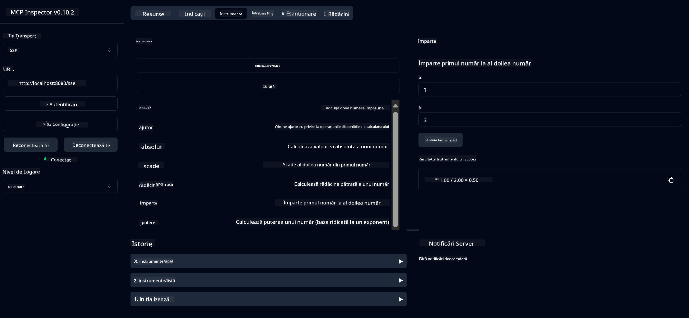

<!--
CO_OP_TRANSLATOR_METADATA:
{
  "original_hash": "13231e9951b68efd9df8c56bd5cdb27e",
  "translation_date": "2025-05-17T13:17:51+00:00",
  "source_file": "03-GettingStarted/samples/java/calculator/README.md",
  "language_code": "ro"
}
-->
# Serviciu de Calculator de Bază MCP

Acest serviciu oferă operații de bază ale calculatorului prin Protocolul de Context al Modelului (MCP) folosind Spring Boot cu transport WebFlux. Este conceput ca un exemplu simplu pentru începători care învață despre implementările MCP.

Pentru mai multe informații, consultați documentația de referință [MCP Server Boot Starter](https://docs.spring.io/spring-ai/reference/api/mcp/mcp-server-boot-starter-docs.html).

## Prezentare generală

Serviciul prezintă:
- Suport pentru SSE (Evenimente trimise de server)
- Înregistrarea automată a instrumentelor folosind anotarea `@Tool` a Spring AI
- Funcții de bază ale calculatorului:
  - Adunare, scădere, înmulțire, împărțire
  - Calculul puterii și rădăcina pătrată
  - Modulus (rest) și valoare absolută
  - Funcție de ajutor pentru descrierea operațiunilor

## Funcționalități

Acest serviciu de calculator oferă următoarele capabilități:

1. **Operații aritmetice de bază**:
   - Adunarea a două numere
   - Scăderea unui număr din altul
   - Înmulțirea a două numere
   - Împărțirea unui număr la altul (cu verificarea împărțirii la zero)

2. **Operații avansate**:
   - Calculul puterii (ridicarea unei baze la un exponent)
   - Calculul rădăcinii pătrate (cu verificarea numerelor negative)
   - Calculul modulus (rest)
   - Calculul valorii absolute

3. **Sistem de ajutor**:
   - Funcție de ajutor integrată care explică toate operațiunile disponibile

## Utilizarea Serviciului

Serviciul expune următoarele puncte finale API prin protocolul MCP:

- `add(a, b)`: Adună două numere
- `subtract(a, b)`: Scade al doilea număr din primul
- `multiply(a, b)`: Înmulțește două numere
- `divide(a, b)`: Împarte primul număr la al doilea (cu verificare zero)
- `power(base, exponent)`: Calculează puterea unui număr
- `squareRoot(number)`: Calculează rădăcina pătrată (cu verificare număr negativ)
- `modulus(a, b)`: Calculează restul la împărțire
- `absolute(number)`: Calculează valoarea absolută
- `help()`: Obține informații despre operațiunile disponibile

## Client de Test

Un client de test simplu este inclus în pachetul `com.microsoft.mcp.sample.client`. Clasa `SampleCalculatorClient` demonstrează operațiunile disponibile ale serviciului de calculator.

## Utilizarea Clientului LangChain4j

Proiectul include un exemplu de client LangChain4j în `com.microsoft.mcp.sample.client.LangChain4jClient` care demonstrează cum să integrați serviciul de calculator cu LangChain4j și modelele GitHub:

### Cerințe preliminare

1. **Configurarea Token-ului GitHub**:
   
   Pentru a utiliza modelele AI ale GitHub (cum ar fi phi-4), aveți nevoie de un token de acces personal GitHub:

   a. Mergeți la setările contului dvs. GitHub: https://github.com/settings/tokens
   
   b. Click pe "Generate new token" → "Generate new token (classic)"
   
   c. Dați token-ului dvs. un nume descriptiv
   
   d. Selectați următoarele scopuri:
      - `repo` (Control total al depozitelor private)
      - `read:org` (Citiți apartenența la organizație și echipă, citiți proiectele organizației)
      - `gist` (Creați gists)
      - `user:email` (Accesați adresele de email ale utilizatorului (doar citire))
   
   e. Click pe "Generate token" și copiați noul dvs. token
   
   f. Setați-l ca o variabilă de mediu:
      
      Pe Windows:
      ```
      set GITHUB_TOKEN=your-github-token
      ```
      
      Pe macOS/Linux:
      ```bash
      export GITHUB_TOKEN=your-github-token
      ```

   g. Pentru o configurare persistentă, adăugați-l la variabilele de mediu prin setările sistemului

2. Adăugați dependența LangChain4j GitHub la proiectul dvs. (deja inclus în pom.xml):
   ```xml
   <dependency>
       <groupId>dev.langchain4j</groupId>
       <artifactId>langchain4j-github</artifactId>
       <version>${langchain4j.version}</version>
   </dependency>
   ```

3. Asigurați-vă că serverul calculatorului rulează pe `localhost:8080`

### Rularea Clientului LangChain4j

Acest exemplu demonstrează:
- Conectarea la serverul MCP al calculatorului prin transport SSE
- Utilizarea LangChain4j pentru a crea un chat bot care folosește operațiunile calculatorului
- Integrarea cu modelele AI GitHub (acum folosind modelul phi-4)

Clientul trimite următoarele interogări de exemplu pentru a demonstra funcționalitatea:
1. Calcularea sumei a două numere
2. Găsirea rădăcinii pătrate a unui număr
3. Obținerea informațiilor de ajutor despre operațiunile disponibile ale calculatorului

Rulați exemplul și verificați ieșirea consolei pentru a vedea cum modelul AI folosește instrumentele calculatorului pentru a răspunde la interogări.

### Configurarea Modelului GitHub

Clientul LangChain4j este configurat pentru a utiliza modelul phi-4 al GitHub cu următoarele setări:

```java
ChatLanguageModel model = GitHubChatModel.builder()
    .apiKey(System.getenv("GITHUB_TOKEN"))
    .timeout(Duration.ofSeconds(60))
    .modelName("phi-4")
    .logRequests(true)
    .logResponses(true)
    .build();
```

Pentru a utiliza diferite modele GitHub, schimbați pur și simplu parametrul `modelName` la un alt model suportat (de exemplu, "claude-3-haiku-20240307", "llama-3-70b-8192", etc.).

## Dependențe

Proiectul necesită următoarele dependențe cheie:

```xml
<!-- For MCP Server -->
<dependency>
    <groupId>org.springframework.ai</groupId>
    <artifactId>spring-ai-starter-mcp-server-webflux</artifactId>
</dependency>

<!-- For LangChain4j integration -->
<dependency>
    <groupId>dev.langchain4j</groupId>
    <artifactId>langchain4j-mcp</artifactId>
    <version>${langchain4j.version}</version>
</dependency>

<!-- For GitHub models support -->
<dependency>
    <groupId>dev.langchain4j</groupId>
    <artifactId>langchain4j-github</artifactId>
    <version>${langchain4j.version}</version>
</dependency>
```

## Construirea Proiectului

Construiți proiectul folosind Maven:
```bash
./mvnw clean install -DskipTests
```

## Rularea Serverului

### Utilizarea Java

```bash
java -jar target/calculator-server-0.0.1-SNAPSHOT.jar
```

### Utilizarea MCP Inspector

MCP Inspector este un instrument util pentru interacțiunea cu serviciile MCP. Pentru a-l utiliza cu acest serviciu de calculator:

1. **Instalați și rulați MCP Inspector** într-o fereastră nouă de terminal:
   ```bash
   npx @modelcontextprotocol/inspector
   ```

2. **Accesați interfața web** făcând clic pe URL-ul afișat de aplicație (de obicei http://localhost:6274)

3. **Configurați conexiunea**:
   - Setați tipul de transport la "SSE"
   - Setați URL-ul la punctul final SSE al serverului dvs. care rulează: `http://localhost:8080/sse`
   - Click pe "Connect"

4. **Utilizați instrumentele**:
   - Click pe "List Tools" pentru a vedea operațiunile disponibile ale calculatorului
   - Selectați un instrument și click pe "Run Tool" pentru a executa o operațiune



### Utilizarea Docker

Proiectul include un Dockerfile pentru implementarea containerizată:

1. **Construiți imaginea Docker**:
   ```bash
   docker build -t calculator-mcp-service .
   ```

2. **Rulați containerul Docker**:
   ```bash
   docker run -p 8080:8080 calculator-mcp-service
   ```

Aceasta va:
- Construi o imagine Docker multi-stage cu Maven 3.9.9 și Eclipse Temurin 24 JDK
- Crea o imagine de container optimizată
- Expune serviciul pe portul 8080
- Porni serviciul de calculator MCP în interiorul containerului

Puteți accesa serviciul la `http://localhost:8080` odată ce containerul rulează.

## Depanare

### Probleme comune cu token-ul GitHub

1. **Probleme de permisiune a token-ului**: Dacă primiți o eroare 403 Forbidden, verificați dacă token-ul dvs. are permisiunile corecte așa cum sunt descrise în cerințele preliminare.

2. **Token-ul nu a fost găsit**: Dacă primiți o eroare "No API key found", asigurați-vă că variabila de mediu GITHUB_TOKEN este setată corect.

3. **Limitarea ratei**: API-ul GitHub are limite de rată. Dacă întâmpinați o eroare de limitare a ratei (cod de status 429), așteptați câteva minute înainte de a încerca din nou.

4. **Expirarea token-ului**: Token-urile GitHub pot expira. Dacă primiți erori de autentificare după un timp, generați un nou token și actualizați variabila dvs. de mediu.

Dacă aveți nevoie de asistență suplimentară, verificați documentația [LangChain4j](https://github.com/langchain4j/langchain4j) sau documentația [GitHub API](https://docs.github.com/en/rest).

**Declinarea responsabilității**:  
Acest document a fost tradus folosind serviciul de traducere AI [Co-op Translator](https://github.com/Azure/co-op-translator). Deși ne străduim să asigurăm acuratețea, vă rugăm să fiți conștienți că traducerile automate pot conține erori sau inexactități. Documentul original în limba sa natală ar trebui considerat sursa autoritară. Pentru informații critice, se recomandă traducerea profesională umană. Nu ne asumăm răspunderea pentru neînțelegerile sau interpretările greșite care pot apărea din utilizarea acestei traduceri.