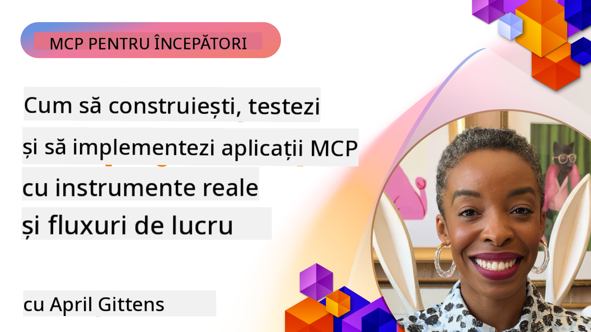
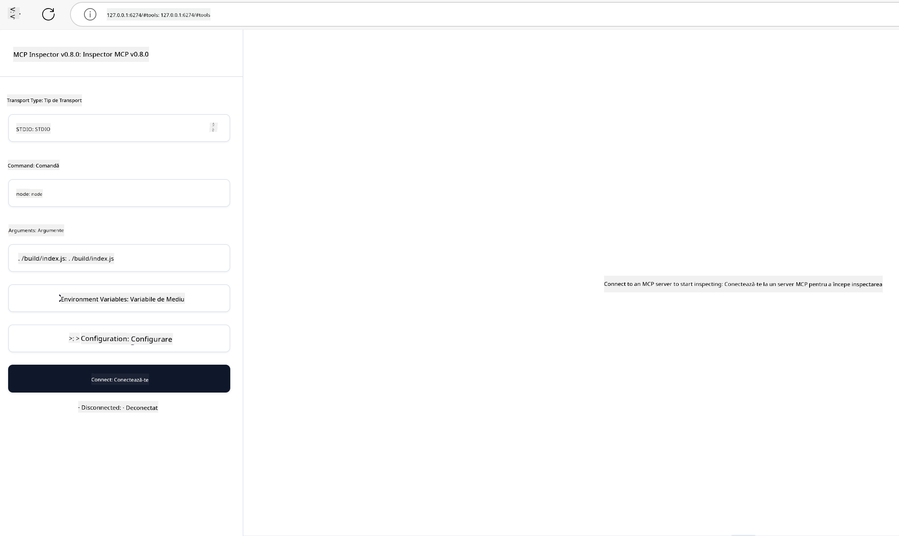

<!--
CO_OP_TRANSLATOR_METADATA:
{
  "original_hash": "83efa75a69bc831277263a6f1ae53669",
  "translation_date": "2025-08-19T16:22:33+00:00",
  "source_file": "04-PracticalImplementation/README.md",
  "language_code": "ro"
}
-->
# Implementare Practică

[](https://youtu.be/vCN9-mKBDfQ)

_(Click pe imaginea de mai sus pentru a viziona videoclipul acestei lecții)_

Implementarea practică este locul unde puterea Protocolului Model Context (MCP) devine palpabilă. Deși înțelegerea teoriei și arhitecturii din spatele MCP este importantă, valoarea reală apare atunci când aplici aceste concepte pentru a construi, testa și implementa soluții care rezolvă probleme din lumea reală. Acest capitol face legătura între cunoștințele conceptuale și dezvoltarea practică, ghidându-te prin procesul de aducere la viață a aplicațiilor bazate pe MCP.

Indiferent dacă dezvolți asistenți inteligenți, integrezi AI în fluxurile de lucru ale afacerii sau construiești instrumente personalizate pentru procesarea datelor, MCP oferă o fundație flexibilă. Designul său independent de limbaj și SDK-urile oficiale pentru limbaje de programare populare îl fac accesibil pentru o gamă largă de dezvoltatori. Prin utilizarea acestor SDK-uri, poți prototipa rapid, itera și scala soluțiile tale pe diferite platforme și medii.

În secțiunile următoare, vei găsi exemple practice, cod de probă și strategii de implementare care demonstrează cum să implementezi MCP în C#, Java cu Spring, TypeScript, JavaScript și Python. De asemenea, vei învăța cum să depanezi și testezi serverele MCP, să gestionezi API-uri și să implementezi soluții în cloud folosind Azure. Aceste resurse practice sunt concepute pentru a accelera procesul de învățare și pentru a te ajuta să construiești cu încredere aplicații MCP robuste, pregătite pentru producție.

## Prezentare Generală

Această lecție se concentrează pe aspectele practice ale implementării MCP în mai multe limbaje de programare. Vom explora cum să utilizăm SDK-urile MCP în C#, Java cu Spring, TypeScript, JavaScript și Python pentru a construi aplicații robuste, a depana și testa serverele MCP și a crea resurse, șabloane și instrumente reutilizabile.

## Obiective de Învățare

Până la sfârșitul acestei lecții, vei putea:

- Implementa soluții MCP folosind SDK-uri oficiale în diverse limbaje de programare
- Depana și testa serverele MCP în mod sistematic
- Crea și utiliza funcționalități ale serverului (Resurse, Șabloane și Instrumente)
- Proiecta fluxuri de lucru MCP eficiente pentru sarcini complexe
- Optimiza implementările MCP pentru performanță și fiabilitate

## Resurse SDK Oficiale

Protocolul Model Context oferă SDK-uri oficiale pentru mai multe limbaje:

- [C# SDK](https://github.com/modelcontextprotocol/csharp-sdk)
- [Java cu Spring SDK](https://github.com/modelcontextprotocol/java-sdk) **Notă:** necesită dependență de [Project Reactor](https://projectreactor.io). (Vezi [discuția problema 246](https://github.com/orgs/modelcontextprotocol/discussions/246).)
- [TypeScript SDK](https://github.com/modelcontextprotocol/typescript-sdk)
- [Python SDK](https://github.com/modelcontextprotocol/python-sdk)
- [Kotlin SDK](https://github.com/modelcontextprotocol/kotlin-sdk)

## Lucrul cu SDK-urile MCP

Această secțiune oferă exemple practice de implementare MCP în mai multe limbaje de programare. Poți găsi cod de probă în directorul `samples`, organizat pe limbaje.

### Exemple Disponibile

Repository-ul include [implementări de probă](../../../04-PracticalImplementation/samples) în următoarele limbaje:

- [C#](./samples/csharp/README.md)
- [Java cu Spring](./samples/java/containerapp/README.md)
- [TypeScript](./samples/typescript/README.md)
- [JavaScript](./samples/javascript/README.md)
- [Python](./samples/python/README.md)

Fiecare exemplu demonstrează concepte cheie MCP și modele de implementare pentru limbajul și ecosistemul specific.

## Funcționalități de Bază ale Serverului

Serverele MCP pot implementa orice combinație de aceste funcționalități:

### Resurse

Resursele oferă context și date pentru utilizator sau modelul AI:

- Repozitorii de documente
- Baze de cunoștințe
- Surse de date structurate
- Sisteme de fișiere

### Șabloane

Șabloanele sunt mesaje și fluxuri de lucru predefinite pentru utilizatori:

- Șabloane de conversație predefinite
- Modele de interacțiune ghidată
- Structuri de dialog specializate

### Instrumente

Instrumentele sunt funcții pe care modelul AI le poate executa:

- Utilități de procesare a datelor
- Integrări API externe
- Capacități computaționale
- Funcționalități de căutare

## Implementări de Probă: Implementare C#

Repository-ul oficial C# SDK conține mai multe implementări de probă care demonstrează diferite aspecte ale MCP:

- **Client MCP de bază**: Exemplu simplu care arată cum să creezi un client MCP și să apelezi instrumente
- **Server MCP de bază**: Implementare minimă a serverului cu înregistrare de instrumente de bază
- **Server MCP avansat**: Server complet cu înregistrare de instrumente, autentificare și gestionarea erorilor
- **Integrare ASP.NET**: Exemple care demonstrează integrarea cu ASP.NET Core
- **Modele de implementare a instrumentelor**: Diverse modele pentru implementarea instrumentelor cu niveluri diferite de complexitate

SDK-ul MCP pentru C# este în previzualizare și API-urile pot suferi modificări. Vom actualiza continuu acest blog pe măsură ce SDK-ul evoluează.

### Funcționalități Cheie

- [C# MCP Nuget ModelContextProtocol](https://www.nuget.org/packages/ModelContextProtocol)
- Construirea [primului tău server MCP](https://devblogs.microsoft.com/dotnet/build-a-model-context-protocol-mcp-server-in-csharp/).

Pentru exemple complete de implementare C#, vizitează [repository-ul oficial de exemple C# SDK](https://github.com/modelcontextprotocol/csharp-sdk).

## Implementare de Probă: Implementare Java cu Spring

SDK-ul Java cu Spring oferă opțiuni robuste de implementare MCP cu funcționalități de nivel enterprise.

### Funcționalități Cheie

- Integrare cu Spring Framework
- Siguranță puternică a tipurilor
- Suport pentru programare reactivă
- Gestionare cuprinzătoare a erorilor

Pentru un exemplu complet de implementare Java cu Spring, vezi [exemplul Java cu Spring](samples/java/containerapp/README.md) în directorul de exemple.

## Implementare de Probă: Implementare JavaScript

SDK-ul JavaScript oferă o abordare ușoară și flexibilă pentru implementarea MCP.

### Funcționalități Cheie

- Suport pentru Node.js și browser
- API bazat pe promisiuni
- Integrare ușoară cu Express și alte framework-uri
- Suport WebSocket pentru streaming

Pentru un exemplu complet de implementare JavaScript, vezi [exemplul JavaScript](samples/javascript/README.md) în directorul de exemple.

## Implementare de Probă: Implementare Python

SDK-ul Python oferă o abordare Pythonică pentru implementarea MCP cu integrații excelente pentru framework-uri ML.

### Funcționalități Cheie

- Suport async/await cu asyncio
- Integrare FastAPI
- Înregistrare simplă a instrumentelor
- Integrare nativă cu biblioteci ML populare

Pentru un exemplu complet de implementare Python, vezi [exemplul Python](samples/python/README.md) în directorul de exemple.

## Gestionarea API-urilor

Azure API Management este o soluție excelentă pentru securizarea serverelor MCP. Ideea este să plasezi o instanță Azure API Management în fața serverului MCP și să îi permiți să gestioneze funcționalități pe care probabil le dorești, cum ar fi:

- limitarea ratei
- gestionarea token-urilor
- monitorizarea
- echilibrarea încărcării
- securitatea

### Exemplu Azure

Iată un exemplu Azure care face exact acest lucru, adică [crearea unui server MCP și securizarea acestuia cu Azure API Management](https://github.com/Azure-Samples/remote-mcp-apim-functions-python).

Vezi cum are loc fluxul de autorizare în imaginea de mai jos:


În imaginea precedentă, se întâmplă următoarele:

- Autentificarea/Autorizarea are loc folosind Microsoft Entra.
- Azure API Management acționează ca un gateway și utilizează politici pentru a direcționa și gestiona traficul.
- Azure Monitor înregistrează toate cererile pentru analize ulterioare.

#### Fluxul de autorizare

Să analizăm fluxul de autorizare mai în detaliu:


#### Specificația de autorizare MCP

Află mai multe despre [specificația de autorizare MCP](https://modelcontextprotocol.io/specification/2025-03-26/basic/authorization#2-10-third-party-authorization-flow).

## Implementarea unui Server MCP Remote pe Azure

Să vedem dacă putem implementa exemplul menționat anterior:

1. Clonează repository-ul

    ```bash
    git clone https://github.com/Azure-Samples/remote-mcp-apim-functions-python.git
    cd remote-mcp-apim-functions-python
    ```

1. Înregistrează provider-ul de resurse `Microsoft.App`.

   - Dacă folosești Azure CLI, rulează `az provider register --namespace Microsoft.App --wait`.
   - Dacă folosești Azure PowerShell, rulează `Register-AzResourceProvider -ProviderNamespace Microsoft.App`. Apoi rulează `(Get-AzResourceProvider -ProviderNamespace Microsoft.App).RegistrationState` după un timp pentru a verifica dacă înregistrarea este completă.

1. Rulează această comandă [azd](https://aka.ms/azd) pentru a provisiona serviciul de gestionare API, aplicația funcțională (cu cod) și toate celelalte resurse Azure necesare:

    ```shell
    azd up
    ```

    Această comandă ar trebui să implementeze toate resursele cloud pe Azure.

### Testarea serverului tău cu MCP Inspector

1. Într-o **fereastră nouă de terminal**, instalează și rulează MCP Inspector:

    ```shell
    npx @modelcontextprotocol/inspector
    ```

    Ar trebui să vezi o interfață similară cu:

    

1. CTRL click pentru a încărca aplicația web MCP Inspector din URL-ul afișat de aplicație (de exemplu, [http://127.0.0.1:6274/#resources](http://127.0.0.1:6274/#resources)).
1. Setează tipul de transport la `SSE`.
1. Setează URL-ul la endpoint-ul SSE al API Management afișat după `azd up` și **Conectează-te**:

    ```shell
    https://<apim-servicename-from-azd-output>.azure-api.net/mcp/sse
    ```

1. **Listează Instrumente**. Click pe un instrument și **Rulează Instrument**.

Dacă toți pașii au funcționat, ar trebui să fii acum conectat la serverul MCP și să fi reușit să apelezi un instrument.

## Servere MCP pentru Azure

[Remote-mcp-functions](https://github.com/Azure-Samples/remote-mcp-functions-dotnet): Acest set de repository-uri sunt șabloane de pornire rapidă pentru construirea și implementarea serverelor MCP (Model Context Protocol) remote personalizate folosind Azure Functions cu Python, C# .NET sau Node/TypeScript.

Exemplele oferă o soluție completă care permite dezvoltatorilor să:

- Construiască și ruleze local: Dezvoltă și depanează un server MCP pe o mașină locală.
- Implementeze pe Azure: Implementează ușor în cloud cu o simplă comandă azd up.
- Conecteze de la clienți: Conectează-te la serverul MCP din diverse clienți, inclusiv modul agent Copilot din VS Code și instrumentul MCP Inspector.

### Funcționalități Cheie

- Securitate prin design: Serverul MCP este securizat folosind chei și HTTPS.
- Opțiuni de autentificare: Suportă OAuth folosind autentificare integrată și/sau API Management.
- Izolare rețea: Permite izolarea rețelei folosind Azure Virtual Networks (VNET).
- Arhitectură serverless: Utilizează Azure Functions pentru execuție scalabilă, bazată pe evenimente.
- Dezvoltare locală: Suport cuprinzător pentru dezvoltare și depanare locală.
- Implementare simplă: Proces de implementare simplificat pe Azure.

Repository-ul include toate fișierele de configurare necesare, codul sursă și definițiile infrastructurii pentru a începe rapid cu o implementare de server MCP pregătită pentru producție.

- [Azure Remote MCP Functions Python](https://github.com/Azure-Samples/remote-mcp-functions-python) - Implementare de probă MCP folosind Azure Functions cu Python.

- [Azure Remote MCP Functions .NET](https://github.com/Azure-Samples/remote-mcp-functions-dotnet) - Implementare de probă MCP folosind Azure Functions cu C# .NET.

- [Azure Remote MCP Functions Node/Typescript](https://github.com/Azure-Samples/remote-mcp-functions-typescript) - Implementare de probă MCP folosind Azure Functions cu Node/TypeScript.

## Concluzii Cheie

- SDK-urile MCP oferă instrumente specifice limbajului pentru implementarea soluțiilor MCP robuste.
- Procesul de depanare și testare este esențial pentru aplicațiile MCP fiabile.
- Șabloanele reutilizabile permit interacțiuni AI consistente.
- Fluxurile de lucru bine proiectate pot orchestra sarcini complexe folosind mai multe instrumente.
- Implementarea soluțiilor MCP necesită luarea în considerare a securității, performanței și gestionării erorilor.

## Exercițiu

Proiectează un flux de lucru MCP practic care abordează o problemă reală din domeniul tău:

1. Identifică 3-4 instrumente care ar fi utile pentru rezolvarea acestei probleme.
2. Creează o diagramă de flux care arată cum interacționează aceste instrumente.
3. Implementează o versiune de bază a unuia dintre instrumente folosind limbajul tău preferat.
4. Creează un șablon de prompt care ar ajuta modelul să utilizeze eficient instrumentul tău.

## Resurse Suplimentare

---

Următor: [Subiecte Avansate](../05-AdvancedTopics/README.md)

**Declinarea responsabilității**:  
Acest document a fost tradus utilizând serviciul de traducere AI [Co-op Translator](https://github.com/Azure/co-op-translator). Deși depunem eforturi pentru a asigura acuratețea, vă rugăm să aveți în vedere că traducerile automate pot conține erori sau inexactități. Documentul original în limba sa nativă ar trebui considerat sursa autoritară. Pentru informații critice, se recomandă traducerea profesională realizată de un specialist. Nu ne asumăm răspunderea pentru eventualele neînțelegeri sau interpretări greșite care pot apărea din utilizarea acestei traduceri.