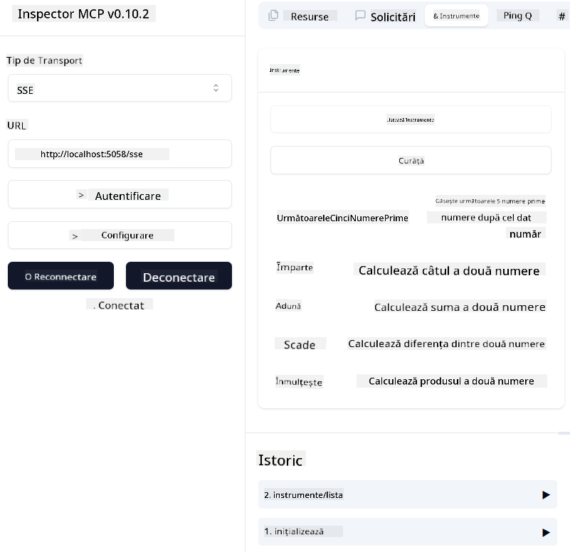
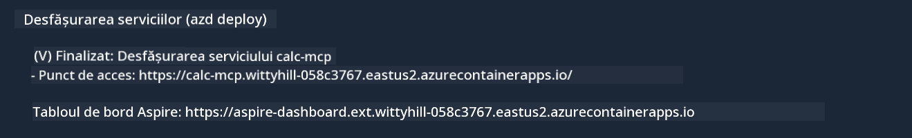

<!--
CO_OP_TRANSLATOR_METADATA:
{
  "original_hash": "5020a3e1a1c7f30c00f9e37f1fa208e3",
  "translation_date": "2025-05-17T14:12:21+00:00",
  "source_file": "04-PracticalImplementation/samples/csharp/README.md",
  "language_code": "ro"
}
-->
# Exemplar

Exemplul anterior arată cum să folosești un proiect .NET local cu tipul `sdio`. Și cum să rulezi serverul local într-un container. Aceasta este o soluție bună în multe situații. Totuși, poate fi util să ai serverul rulând de la distanță, cum ar fi într-un mediu cloud. Aici intervine tipul `http`.

Privind soluția din folderul `04-PracticalImplementation`, poate părea mult mai complexă decât cea anterioară. Dar în realitate, nu este. Dacă te uiți atent la proiectul `src/mcpserver/mcpserver.csproj`, vei vedea că este în mare parte același cod ca în exemplul anterior. Singura diferență este că folosim o bibliotecă diferită `ModelContextProtocol.AspNetCore` pentru a gestiona cererile HTTP. Și schimbăm metoda `IsPrime` pentru a o face privată, doar pentru a arăta că poți avea metode private în codul tău. Restul codului este la fel ca înainte.

Celelalte proiecte sunt de la [.NET Aspire](https://learn.microsoft.com/dotnet/aspire/get-started/aspire-overview). Având .NET Aspire în soluție va îmbunătăți experiența dezvoltatorului în timpul dezvoltării și testării și va ajuta cu observabilitatea. Nu este necesar pentru a rula serverul, dar este o practică bună să-l ai în soluția ta.

## Pornește serverul local

1. Din VS Code (cu extensia C# DevKit), deschide soluția `04-PracticalImplementation\samples\csharp\src\Calculator-chap4.sln`.
2. Apasă `F5` pentru a porni serverul. Ar trebui să pornească un browser web cu tabloul de bord .NET Aspire.

sau

1. Dintr-un terminal, navighează la folderul `04-PracticalImplementation\samples\csharp\src`
2. Execută următoarea comandă pentru a porni serverul:
   ```bash
    dotnet run --project .\AppHost
   ```

3. Din tabloul de bord, notează URL-ul `http`. Ar trebui să fie ceva de genul `http://localhost:5058/`.

## Test `SSE` cu Inspectorul de Protocol ModelContext.

Dacă ai Node.js 22.7.5 și mai sus, poți folosi Inspectorul de Protocol ModelContext pentru a testa serverul tău.

Pornește serverul și rulează următoarea comandă într-un terminal:

```bash
npx @modelcontextprotocol/inspector@latest
```



- Selectează `SSE` as the Transport type. SSE stand for Server-Sent Events. 
- In the Url field, enter the URL of the server noted earlier,and append `/sse`. Ar trebui să fie `http` (nu `https`) something like `http://localhost:5058/sse`.
- select the Connect button.

A nice thing about the Inspector is that it provide a nice visibility on what is happening.

- Try listing the availables tools
- Try some of them, it should works just like before.


## Test `SSE` with Github Copilot Chat in VS Code

To use the `SSE` transport with Github Copilot Chat, change the configuration of the `mcp-calc` server creat anterior să arate așa:

```json
"mcp-calc": {
    "type": "sse",
    "url": "http://localhost:5058/sse"
}
```

Fă câteva teste:
- Cere cele 3 numere prime după 6780. Observă cum Copilot va folosi noile instrumente `NextFivePrimeNumbers` și va returna doar primele 3 numere prime.
- Cere cele 7 numere prime după 111, pentru a vedea ce se întâmplă.

# Desfășurarea serverului pe Azure

Să desfășurăm serverul pe Azure pentru ca mai multe persoane să-l poată folosi.

Dintr-un terminal, navighează la folderul `04-PracticalImplementation\samples\csharp\src` și rulează următoarea comandă:

```bash
azd init
```

Aceasta va crea câteva fișiere local pentru a salva configurația resurselor Azure și infrastructura ta ca cod (IaC).

Apoi, rulează următoarea comandă pentru a desfășura serverul pe Azure:

```bash
azd up
```

După ce desfășurarea este finalizată, ar trebui să vezi un mesaj de genul acesta:



Navighează la tabloul de bord Aspire și notează URL-ul `HTTP` pentru a-l folosi în Inspectorul MCP și în chatul Github Copilot.

## Ce urmează?

Am încercat diferite tipuri de transport și instrumente de testare și am desfășurat serverul nostru MCP pe Azure. Dar ce se întâmplă dacă serverul nostru trebuie să acceseze resurse private? De exemplu, o bază de date sau o API privată? În capitolul următor, vom vedea cum putem îmbunătăți securitatea serverului nostru.

**Declinarea responsabilității**:  
Acest document a fost tradus folosind serviciul de traducere AI [Co-op Translator](https://github.com/Azure/co-op-translator). Deși ne străduim să asigurăm acuratețea, vă rugăm să fiți conștienți de faptul că traducerile automate pot conține erori sau inexactități. Documentul original în limba sa natală ar trebui considerat sursa autoritară. Pentru informații critice, se recomandă traducerea umană profesională. Nu ne asumăm responsabilitatea pentru eventualele neînțelegeri sau interpretări greșite care pot apărea din utilizarea acestei traduceri.