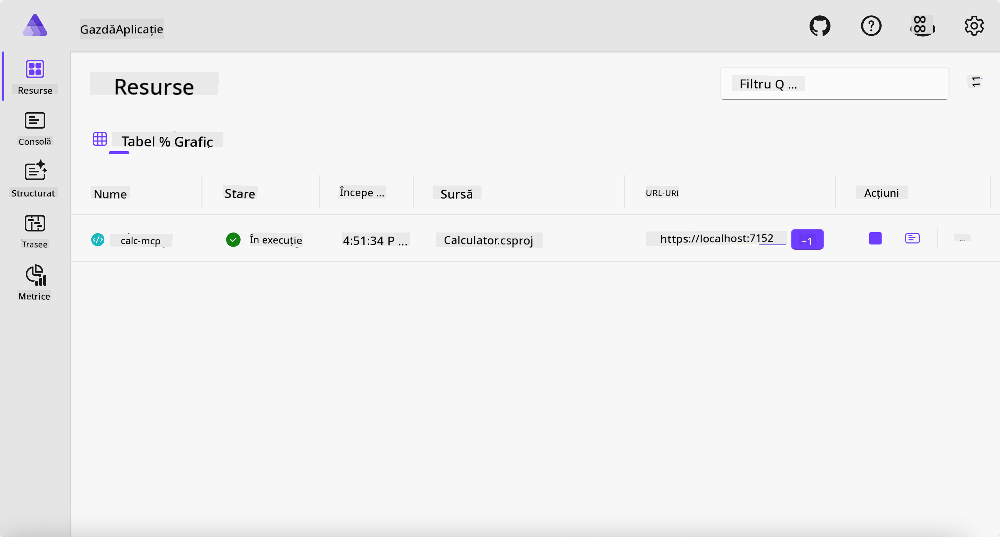
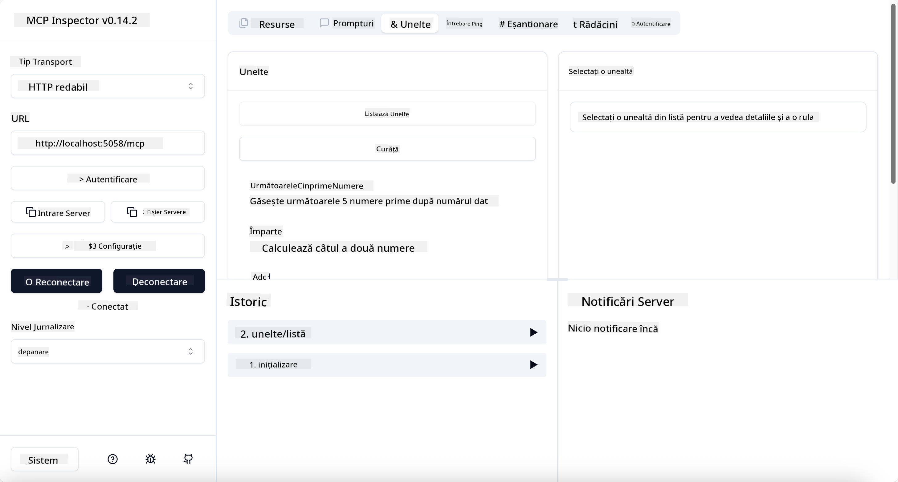
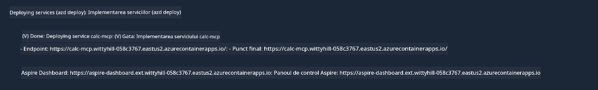

<!--
CO_OP_TRANSLATOR_METADATA:
{
  "original_hash": "0bc7bd48f55f1565f1d95ccb2c16f728",
  "translation_date": "2025-07-13T23:09:44+00:00",
  "source_file": "04-PracticalImplementation/samples/csharp/README.md",
  "language_code": "ro"
}
-->
# Exemplu

Exemplul anterior arată cum să folosești un proiect local .NET cu tipul `stdio`. Și cum să rulezi serverul local într-un container. Aceasta este o soluție bună în multe situații. Totuși, poate fi util să ai serverul rulând de la distanță, cum ar fi într-un mediu cloud. Aici intervine tipul `http`.

Privind soluția din folderul `04-PracticalImplementation`, poate părea mult mai complexă decât cea anterioară. Dar, în realitate, nu este așa. Dacă te uiți cu atenție la proiectul `src/Calculator`, vei vedea că este în mare parte același cod ca în exemplul anterior. Singura diferență este că folosim o bibliotecă diferită, `ModelContextProtocol.AspNetCore`, pentru a gestiona cererile HTTP. Și am schimbat metoda `IsPrime` să fie privată, doar pentru a arăta că poți avea metode private în codul tău. Restul codului este la fel ca înainte.

Celelalte proiecte provin de la [.NET Aspire](https://learn.microsoft.com/dotnet/aspire/get-started/aspire-overview). Având .NET Aspire în soluție va îmbunătăți experiența dezvoltatorului în timpul dezvoltării și testării și va ajuta la observabilitate. Nu este obligatoriu pentru rularea serverului, dar este o practică bună să îl ai în soluția ta.

## Pornește serverul local

1. Din VS Code (cu extensia C# DevKit), navighează în directorul `04-PracticalImplementation/samples/csharp`.
1. Execută următoarea comandă pentru a porni serverul:

   ```bash
    dotnet watch run --project ./src/AppHost
   ```

1. Când un browser web deschide dashboard-ul .NET Aspire, notează URL-ul `http`. Ar trebui să fie ceva de genul `http://localhost:5058/`.

   

## Testează Streamable HTTP cu MCP Inspector

Dacă ai Node.js 22.7.5 sau o versiune mai nouă, poți folosi MCP Inspector pentru a testa serverul tău.

Pornește serverul și rulează următoarea comandă într-un terminal:

```bash
npx @modelcontextprotocol/inspector http://localhost:5058
```



- Selectează `Streamable HTTP` ca tip de Transport.
- În câmpul Url, introdu URL-ul serverului notat anterior și adaugă `/mcp`. Ar trebui să fie `http` (nu `https`), ceva de genul `http://localhost:5058/mcp`.
- Apasă butonul Connect.

Un lucru plăcut la Inspector este că oferă o vizibilitate clară asupra a ceea ce se întâmplă.

- Încearcă să listezi uneltele disponibile
- Încearcă câteva dintre ele, ar trebui să funcționeze la fel ca înainte.

## Testează MCP Server cu GitHub Copilot Chat în VS Code

Pentru a folosi transportul Streamable HTTP cu GitHub Copilot Chat, schimbă configurația serverului `calc-mcp` creat anterior să arate astfel:

```jsonc
// .vscode/mcp.json
{
  "servers": {
    "calc-mcp": {
      "type": "http",
      "url": "http://localhost:5058/mcp"
    }
  }
}
```

Fă câteva teste:

- Cere "3 numere prime după 6780". Observă cum Copilot va folosi noile unelte `NextFivePrimeNumbers` și va returna doar primele 3 numere prime.
- Cere "7 numere prime după 111", să vezi ce se întâmplă.
- Cere "John are 24 de acadele și vrea să le împartă tuturor celor 3 copii ai săi. Câte acadele primește fiecare copil?", să vezi ce se întâmplă.

## Publică serverul pe Azure

Hai să publicăm serverul pe Azure ca să poată fi folosit de mai mulți oameni.

Dintr-un terminal, navighează în folderul `04-PracticalImplementation/samples/csharp` și rulează următoarea comandă:

```bash
azd up
```

După ce publicarea se termină, ar trebui să vezi un mesaj de genul acesta:



Ia URL-ul și folosește-l în MCP Inspector și în GitHub Copilot Chat.

```jsonc
// .vscode/mcp.json
{
  "servers": {
    "calc-mcp": {
      "type": "http",
      "url": "https://calc-mcp.gentleriver-3977fbcf.australiaeast.azurecontainerapps.io/mcp"
    }
  }
}
```

## Ce urmează?

Am încercat diferite tipuri de transport și unelte de testare. De asemenea, am publicat serverul MCP pe Azure. Dar ce se întâmplă dacă serverul nostru trebuie să acceseze resurse private? De exemplu, o bază de date sau o API privată? În capitolul următor, vom vedea cum putem îmbunătăți securitatea serverului nostru.

**Declinare de responsabilitate**:  
Acest document a fost tradus folosind serviciul de traducere AI [Co-op Translator](https://github.com/Azure/co-op-translator). Deși ne străduim pentru acuratețe, vă rugăm să rețineți că traducerile automate pot conține erori sau inexactități. Documentul original în limba sa nativă trebuie considerat sursa autorizată. Pentru informații critice, se recomandă traducerea profesională realizată de un specialist uman. Nu ne asumăm răspunderea pentru eventualele neînțelegeri sau interpretări greșite rezultate din utilizarea acestei traduceri.