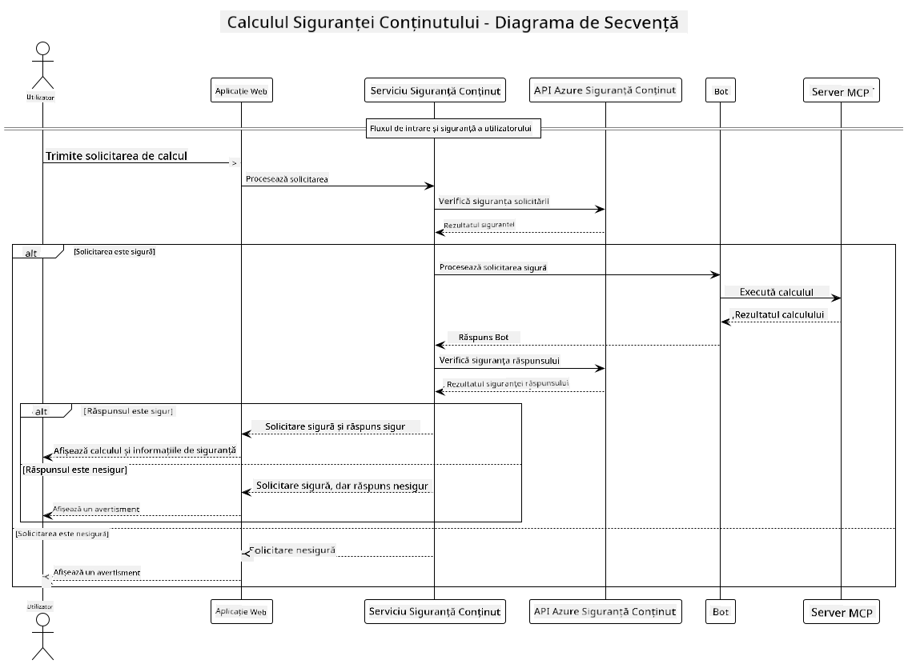

<!--
CO_OP_TRANSLATOR_METADATA:
{
  "original_hash": "e5ea5e7582f70008ea9bec3b3820f20a",
  "translation_date": "2025-07-13T23:20:04+00:00",
  "source_file": "04-PracticalImplementation/samples/java/containerapp/README.md",
  "language_code": "ro"
}
-->
## Arhitectura Sistemului

Acest proiect demonstrează o aplicație web care folosește verificarea siguranței conținutului înainte de a trimite solicitările utilizatorului către un serviciu de calculator prin Model Context Protocol (MCP).



### Cum Funcționează

1. **Input Utilizator**: Utilizatorul introduce o solicitare de calcul în interfața web  
2. **Verificare Siguranță Conținut (Input)**: Solicitarea este analizată de Azure Content Safety API  
3. **Decizie Siguranță (Input)**:  
   - Dacă conținutul este sigur (severitate < 2 în toate categoriile), se trimite mai departe către calculator  
   - Dacă conținutul este marcat ca potențial dăunător, procesul se oprește și se returnează un avertisment  
4. **Integrare Calculator**: Conținutul sigur este procesat de LangChain4j, care comunică cu serverul MCP calculator  
5. **Verificare Siguranță Conținut (Output)**: Răspunsul botului este analizat de Azure Content Safety API  
6. **Decizie Siguranță (Output)**:  
   - Dacă răspunsul botului este sigur, este afișat utilizatorului  
   - Dacă răspunsul botului este marcat ca potențial dăunător, este înlocuit cu un avertisment  
7. **Răspuns**: Rezultatele (dacă sunt sigure) sunt afișate utilizatorului împreună cu ambele analize de siguranță

## Utilizarea Model Context Protocol (MCP) cu Servicii de Calculator

Acest proiect demonstrează cum să folosești Model Context Protocol (MCP) pentru a apela serviciile MCP de calculator din LangChain4j. Implementarea folosește un server MCP local care rulează pe portul 8080 pentru a furniza operații de calculator.

### Configurarea Serviciului Azure Content Safety

Înainte de a folosi funcțiile de siguranță a conținutului, trebuie să creezi o resursă Azure Content Safety:

1. Autentifică-te în [Azure Portal](https://portal.azure.com)  
2. Apasă pe „Create a resource” și caută „Content Safety”  
3. Selectează „Content Safety” și apasă „Create”  
4. Introdu un nume unic pentru resursa ta  
5. Selectează abonamentul și grupul de resurse (sau creează unul nou)  
6. Alege o regiune suportată (verifică [Disponibilitatea Regiunilor](https://azure.microsoft.com/en-us/global-infrastructure/services/?products=cognitive-services) pentru detalii)  
7. Selectează un plan tarifar potrivit  
8. Apasă „Create” pentru a implementa resursa  
9. După finalizarea implementării, apasă „Go to resource”  
10. În panoul din stânga, sub „Resource Management”, selectează „Keys and Endpoint”  
11. Copiază una dintre chei și URL-ul endpoint-ului pentru pasul următor

### Configurarea Variabilelor de Mediu

Setează variabila de mediu `GITHUB_TOKEN` pentru autentificarea modelelor GitHub:  
```sh
export GITHUB_TOKEN=<your_github_token>
```

Pentru funcțiile de siguranță a conținutului, setează:  
```sh
export CONTENT_SAFETY_ENDPOINT=<your_content_safety_endpoint>
export CONTENT_SAFETY_KEY=<your_content_safety_key>
```

Aceste variabile de mediu sunt folosite de aplicație pentru autentificarea cu serviciul Azure Content Safety. Dacă aceste variabile nu sunt setate, aplicația va folosi valori generice pentru demonstrație, însă funcțiile de siguranță a conținutului nu vor funcționa corect.

### Pornirea Serverului MCP Calculator

Înainte de a rula clientul, trebuie să pornești serverul MCP calculator în modul SSE pe localhost:8080.

## Descrierea Proiectului

Acest proiect demonstrează integrarea Model Context Protocol (MCP) cu LangChain4j pentru a apela servicii de calculator. Caracteristici principale includ:

- Utilizarea MCP pentru conectarea la un serviciu de calculator pentru operații matematice de bază  
- Verificare dublă a siguranței conținutului atât pentru solicitările utilizatorului, cât și pentru răspunsurile botului  
- Integrare cu modelul gpt-4.1-nano de pe GitHub prin LangChain4j  
- Folosirea Server-Sent Events (SSE) pentru transportul MCP

## Integrarea Siguranței Conținutului

Proiectul include funcții complete de siguranță a conținutului pentru a asigura că atât inputurile utilizatorului, cât și răspunsurile sistemului sunt lipsite de conținut dăunător:

1. **Verificare Input**: Toate solicitările utilizatorului sunt analizate pentru categorii de conținut dăunător precum discurs de ură, violență, auto-vătămare și conținut sexual înainte de procesare.

2. **Verificare Output**: Chiar și atunci când se folosesc modele potențial nefiltrate, sistemul verifică toate răspunsurile generate prin aceleași filtre de siguranță a conținutului înainte de a le afișa utilizatorului.

Această abordare în două straturi asigură că sistemul rămâne sigur indiferent de modelul AI folosit, protejând utilizatorii atât de inputuri dăunătoare, cât și de răspunsuri AI potențial problematice.

## Client Web

Aplicația include o interfață web prietenoasă care permite utilizatorilor să interacționeze cu sistemul Content Safety Calculator:

### Funcționalități Interfață Web

- Formular simplu și intuitiv pentru introducerea solicitărilor de calcul  
- Validare dublă a siguranței conținutului (input și output)  
- Feedback în timp real privind siguranța solicitării și a răspunsului  
- Indicatori colorați pentru siguranță, ușor de interpretat  
- Design curat și responsive, compatibil cu diverse dispozitive  
- Exemple de solicitări sigure pentru ghidajul utilizatorilor

### Utilizarea Clientului Web

1. Pornește aplicația:  
   ```sh
   mvn spring-boot:run
   ```

2. Deschide browserul și accesează `http://localhost:8087`

3. Introdu o solicitare de calcul în zona de text oferită (de exemplu, „Calculează suma dintre 24.5 și 17.3”)

4. Apasă „Submit” pentru a procesa cererea

5. Vizualizează rezultatele, care vor include:  
   - Analiza siguranței conținutului pentru solicitarea ta  
   - Rezultatul calculat (dacă solicitarea a fost sigură)  
   - Analiza siguranței conținutului pentru răspunsul botului  
   - Orice avertismente de siguranță dacă inputul sau outputul au fost marcate

Clientul web gestionează automat ambele procese de verificare a siguranței conținutului, asigurând că toate interacțiunile sunt sigure și adecvate, indiferent de modelul AI folosit.

**Declinare de responsabilitate**:  
Acest document a fost tradus folosind serviciul de traducere AI [Co-op Translator](https://github.com/Azure/co-op-translator). Deși ne străduim pentru acuratețe, vă rugăm să rețineți că traducerile automate pot conține erori sau inexactități. Documentul original în limba sa nativă trebuie considerat sursa autorizată. Pentru informații critice, se recomandă traducerea profesională realizată de un specialist uman. Nu ne asumăm răspunderea pentru eventualele neînțelegeri sau interpretări greșite rezultate din utilizarea acestei traduceri.