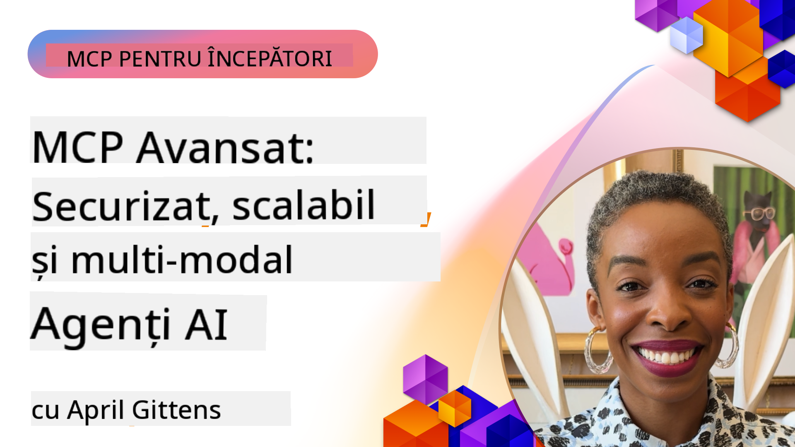

<!--
CO_OP_TRANSLATOR_METADATA:
{
  "original_hash": "d204bc94ea6027d06a703b21b711ca57",
  "translation_date": "2025-08-19T16:25:35+00:00",
  "source_file": "05-AdvancedTopics/README.md",
  "language_code": "ro"
}
-->
# Subiecte Avansate în MCP

_(Faceți clic pe imaginea de mai sus pentru a viziona videoclipul acestei lecții)_

Acest capitol acoperă o serie de subiecte avansate în implementarea Model Context Protocol (MCP), inclusiv integrarea multi-modală, scalabilitatea, cele mai bune practici de securitate și integrarea în mediul enterprise. Aceste subiecte sunt esențiale pentru construirea aplicațiilor MCP robuste și pregătite pentru producție, capabile să răspundă cerințelor sistemelor AI moderne.

## Prezentare Generală

Această lecție explorează concepte avansate în implementarea Model Context Protocol, concentrându-se pe integrarea multi-modală, scalabilitate, cele mai bune practici de securitate și integrarea în mediul enterprise. Aceste subiecte sunt esențiale pentru dezvoltarea aplicațiilor MCP de nivel enterprise, capabile să gestioneze cerințe complexe în medii corporative.

## Obiective de Învățare

La finalul acestei lecții, veți putea:

- Implementa capabilități multi-modale în cadrul framework-urilor MCP
- Proiecta arhitecturi MCP scalabile pentru scenarii cu cerințe ridicate
- Aplica cele mai bune practici de securitate aliniate principiilor de securitate MCP
- Integra MCP cu sisteme și framework-uri AI enterprise
- Optimiza performanța și fiabilitatea în medii de producție

## Lecții și Proiecte Exemplu

| Link | Titlu | Descriere |
|------|-------|-------------|
| [5.1 Integrare cu Azure](./mcp-integration/README.md) | Integrare cu Azure | Aflați cum să integrați serverul MCP pe Azure |
| [5.2 Exemplu Multi-modal](./mcp-multi-modality/README.md) | Exemple MCP Multi-modal  | Exemple pentru răspunsuri audio, imagine și multi-modale |
| [5.3 Exemplu MCP OAuth2](../../../05-AdvancedTopics/mcp-oauth2-demo) | Demo MCP OAuth2 | Aplicație minimală Spring Boot care demonstrează OAuth2 cu MCP, atât ca Authorization Server, cât și ca Resource Server. Demonstrează emiterea securizată de token-uri, endpoint-uri protejate, implementare în Azure Container Apps și integrare cu API Management. |
| [5.4 Root Contexts](./mcp-root-contexts/README.md) | Root Contexts  | Aflați mai multe despre root context și cum să le implementați |
| [5.5 Rutare](./mcp-routing/README.md) | Rutare | Aflați diferite tipuri de rutare |
| [5.6 Sampling](./mcp-sampling/README.md) | Sampling | Aflați cum să lucrați cu sampling |
| [5.7 Scalabilitate](./mcp-scaling/README.md) | Scalabilitate  | Aflați despre scalabilitate |
| [5.8 Securitate](./mcp-security/README.md) | Securitate  | Securizați serverul MCP |
| [5.9 Exemplu de Căutare Web](./web-search-mcp/README.md) | MCP Căutare Web | Server și client MCP în Python care integrează SerpAPI pentru căutare web, știri, produse și Q&A în timp real. Demonstrează orchestrarea multi-tool, integrarea cu API-uri externe și gestionarea robustă a erorilor. |
| [5.10 Streaming în Timp Real](./mcp-realtimestreaming/README.md) | Streaming  | Streaming-ul de date în timp real a devenit esențial în lumea bazată pe date de astăzi, unde afacerile și aplicațiile necesită acces imediat la informații pentru a lua decizii la timp. |
| [5.11 Căutare Web în Timp Real](./mcp-realtimesearch/README.md) | Căutare Web | Cum MCP transformă căutarea web în timp real prin furnizarea unei abordări standardizate pentru gestionarea contextului între modelele AI, motoarele de căutare și aplicații. | 
| [5.12 Autentificare Entra ID pentru Serverele Model Context Protocol](./mcp-security-entra/README.md) | Autentificare Entra ID | Microsoft Entra ID oferă o soluție robustă de gestionare a identității și accesului bazată pe cloud, asigurându-se că doar utilizatorii și aplicațiile autorizate pot interacționa cu serverul MCP. |
| [5.13 Integrarea Agentului Azure AI Foundry](./mcp-foundry-agent-integration/README.md) | Integrare Azure AI Foundry | Aflați cum să integrați serverele Model Context Protocol cu agenții Azure AI Foundry, permițând orchestrarea puternică a uneltelor și capabilități AI enterprise cu conexiuni standardizate la surse de date externe. |
| [5.14 Ingineria Contextului](./mcp-contextengineering/README.md) | Ingineria Contextului | Oportunitățile viitoare ale tehnicilor de inginerie a contextului pentru serverele MCP, inclusiv optimizarea contextului, gestionarea dinamică a contextului și strategii pentru ingineria eficientă a prompturilor în cadrul framework-urilor MCP. |

## Referințe Suplimentare

Pentru cele mai actualizate informații despre subiectele avansate MCP, consultați:
- [Documentația MCP](https://modelcontextprotocol.io/)
- [Specificația MCP](https://spec.modelcontextprotocol.io/)
- [Repository GitHub](https://github.com/modelcontextprotocol)

## Idei Principale

- Implementările MCP multi-modale extind capabilitățile AI dincolo de procesarea textului
- Scalabilitatea este esențială pentru implementările enterprise și poate fi abordată prin scalare orizontală și verticală
- Măsurile cuprinzătoare de securitate protejează datele și asigură controlul adecvat al accesului
- Integrarea în mediul enterprise cu platforme precum Azure OpenAI și Microsoft AI Foundry îmbunătățește capabilitățile MCP
- Implementările avansate MCP beneficiază de arhitecturi optimizate și de o gestionare atentă a resurselor

## Exercițiu

Proiectați o implementare MCP de nivel enterprise pentru un caz de utilizare specific:

1. Identificați cerințele multi-modale pentru cazul dvs. de utilizare
2. Conturați controalele de securitate necesare pentru protejarea datelor sensibile
3. Proiectați o arhitectură scalabilă care să gestioneze sarcini variabile
4. Planificați punctele de integrare cu sistemele AI enterprise
5. Documentați potențialele blocaje de performanță și strategiile de atenuare

## Resurse Suplimentare

- [Documentația Azure OpenAI](https://learn.microsoft.com/en-us/azure/ai-services/openai/)
- [Documentația Microsoft AI Foundry](https://learn.microsoft.com/en-us/ai-services/)

---

## Ce urmează

- [5.1 Integrarea MCP](./mcp-integration/README.md)

**Declinare de responsabilitate**:  
Acest document a fost tradus folosind serviciul de traducere AI [Co-op Translator](https://github.com/Azure/co-op-translator). Deși ne străduim să asigurăm acuratețea, vă rugăm să fiți conștienți că traducerile automate pot conține erori sau inexactități. Documentul original în limba sa natală ar trebui considerat sursa autoritară. Pentru informații critice, se recomandă traducerea profesională realizată de un specialist uman. Nu ne asumăm responsabilitatea pentru eventualele neînțelegeri sau interpretări greșite care pot apărea din utilizarea acestei traduceri.