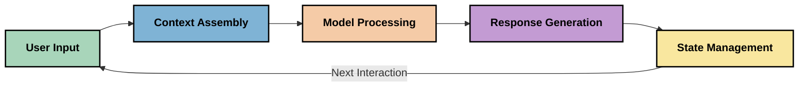
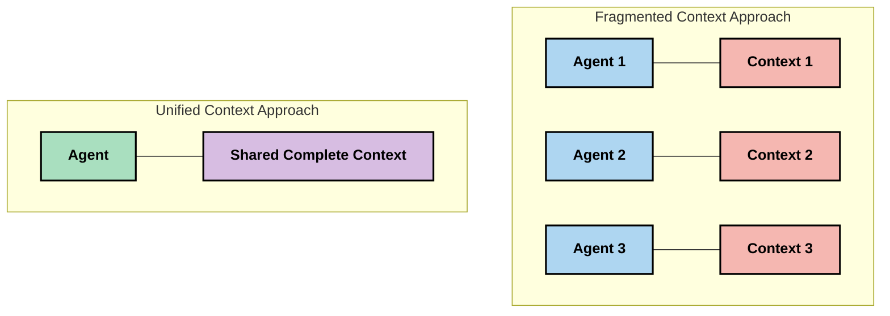
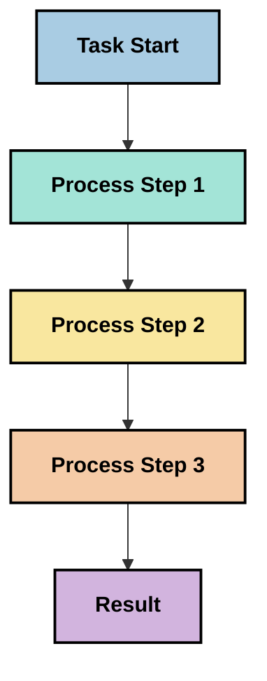
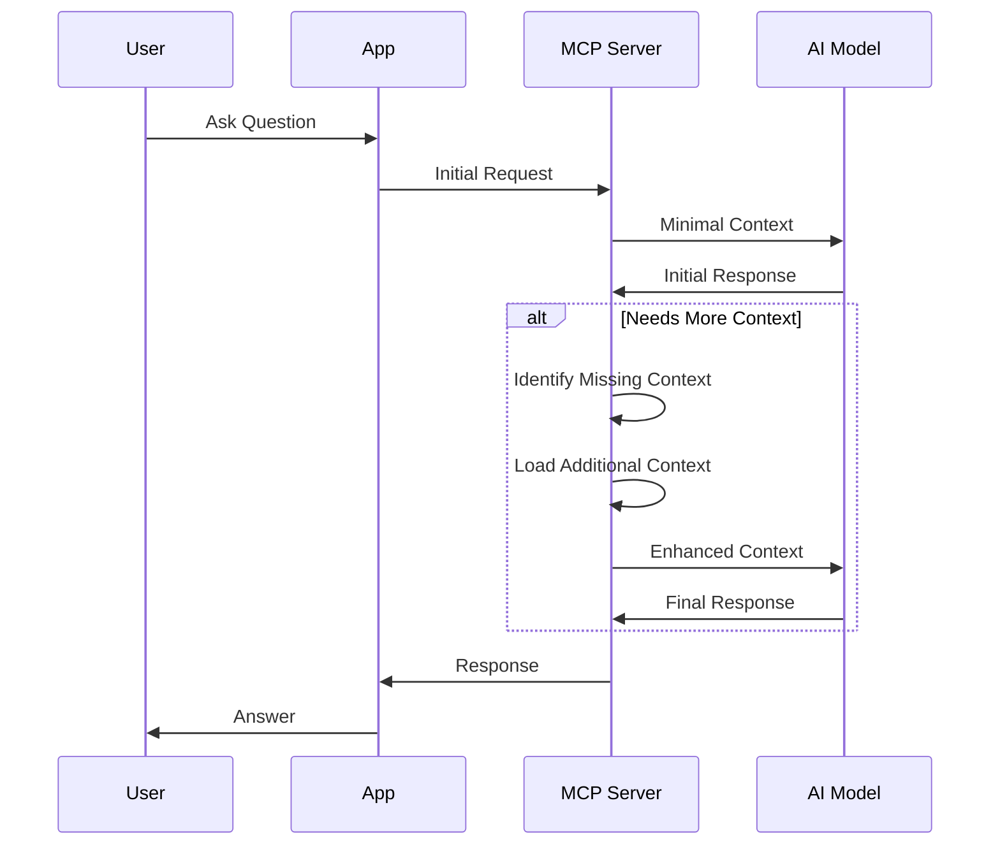
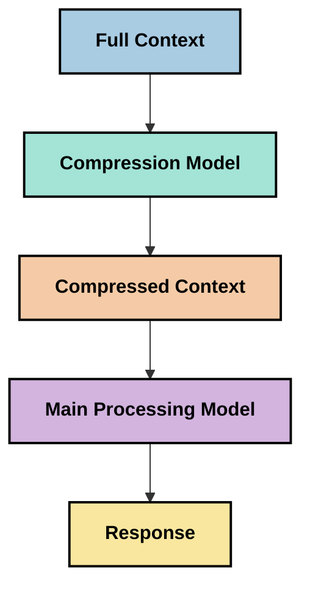

<!--
CO_OP_TRANSLATOR_METADATA:
{
  "original_hash": "fd169ca3071b81b5ee282e194bc823df",
  "translation_date": "2025-09-15T21:06:47+00:00",
  "source_file": "05-AdvancedTopics/mcp-contextengineering/README.md",
  "language_code": "ro"
}
-->
# Ingineria Contextului: Un Concept Emergent în Ecosistemul MCP

## Prezentare Generală

Ingineria contextului este un concept emergent în domeniul AI care explorează modul în care informațiile sunt structurate, livrate și menținute pe parcursul interacțiunilor dintre clienți și serviciile AI. Pe măsură ce ecosistemul Model Context Protocol (MCP) evoluează, înțelegerea modului de gestionare eficientă a contextului devine din ce în ce mai importantă. Acest modul introduce conceptul de inginerie a contextului și explorează potențialele sale aplicații în implementările MCP.

## Obiective de Învățare

La finalul acestui modul, vei putea:

- Înțelege conceptul emergent de inginerie a contextului și rolul său potențial în aplicațiile MCP
- Identifica provocările cheie în gestionarea contextului pe care designul protocolului MCP le abordează
- Explora tehnici pentru îmbunătățirea performanței modelelor prin gestionarea mai bună a contextului
- Lua în considerare abordări pentru măsurarea și evaluarea eficienței contextului
- Aplica aceste concepte emergente pentru a îmbunătăți experiențele AI prin cadrul MCP

## Introducere în Ingineria Contextului

Ingineria contextului este un concept emergent axat pe designul și gestionarea deliberată a fluxului de informații între utilizatori, aplicații și modele AI. Spre deosebire de domenii consacrate, cum ar fi ingineria prompturilor, ingineria contextului este încă definită de practicieni care lucrează pentru a rezolva provocările unice de a oferi modelelor AI informațiile potrivite la momentul potrivit.

Pe măsură ce modelele lingvistice mari (LLMs) au evoluat, importanța contextului a devenit din ce în ce mai evidentă. Calitatea, relevanța și structura contextului pe care îl oferim influențează direct rezultatele modelelor. Ingineria contextului explorează această relație și caută să dezvolte principii pentru gestionarea eficientă a contextului.

> „În 2025, modelele existente sunt extrem de inteligente. Dar chiar și cel mai inteligent om nu va putea să-și facă treaba eficient fără contextul a ceea ce i se cere să facă... 'Ingineria contextului' este nivelul următor al ingineriei prompturilor. Este vorba despre realizarea acestui lucru automat într-un sistem dinamic." — Walden Yan, Cognition AI

Ingineria contextului poate include:

1. **Selecția Contextului**: Determinarea informațiilor relevante pentru o anumită sarcină
2. **Structurarea Contextului**: Organizarea informațiilor pentru a maximiza înțelegerea modelului
3. **Livrarea Contextului**: Optimizarea modului și momentului în care informațiile sunt trimise modelelor
4. **Menținerea Contextului**: Gestionarea stării și evoluției contextului în timp
5. **Evaluarea Contextului**: Măsurarea și îmbunătățirea eficienței contextului

Aceste domenii de interes sunt deosebit de relevante pentru ecosistemul MCP, care oferă o modalitate standardizată pentru aplicații de a furniza context LLM-urilor.

## Perspectiva Călătoriei Contextului

O modalitate de a vizualiza ingineria contextului este de a urmări călătoria pe care o parcurge informația printr-un sistem MCP:



### Etape Cheie în Călătoria Contextului:

1. **Intrarea Utilizatorului**: Informații brute de la utilizator (text, imagini, documente)
2. **Asamblarea Contextului**: Combinarea intrării utilizatorului cu contextul sistemului, istoricul conversației și alte informații recuperate
3. **Procesarea Modelului**: Modelul AI procesează contextul asamblat
4. **Generarea Răspunsului**: Modelul produce rezultate bazate pe contextul furnizat
5. **Gestionarea Stării**: Sistemul își actualizează starea internă pe baza interacțiunii

Această perspectivă evidențiază natura dinamică a contextului în sistemele AI și ridică întrebări importante despre cum să gestionăm cel mai bine informațiile la fiecare etapă.

## Principii Emergente în Ingineria Contextului

Pe măsură ce domeniul ingineriei contextului prinde contur, unele principii timpurii încep să apară din partea practicienilor. Aceste principii pot ajuta la informarea alegerilor de implementare MCP:

### Principiul 1: Distribuie Contextul Complet

Contextul ar trebui să fie distribuit complet între toate componentele unui sistem, mai degrabă decât fragmentat între mai mulți agenți sau procese. Când contextul este distribuit, deciziile luate într-o parte a sistemului pot intra în conflict cu cele luate în altă parte.



În aplicațiile MCP, acest lucru sugerează proiectarea sistemelor în care contextul curge fără probleme prin întregul flux, mai degrabă decât să fie compartimentat.

### Principiul 2: Recunoaște Că Acțiunile Implică Decizii Implicite

Fiecare acțiune pe care o ia un model încorporează decizii implicite despre cum să interpreteze contextul. Când mai multe componente acționează pe contexte diferite, aceste decizii implicite pot intra în conflict, ducând la rezultate inconsistente.

Acest principiu are implicații importante pentru aplicațiile MCP:
- Preferă procesarea liniară a sarcinilor complexe în locul execuției paralele cu context fragmentat
- Asigură-te că toate punctele de decizie au acces la aceleași informații contextuale
- Proiectează sisteme în care pașii ulteriori pot vedea contextul complet al deciziilor anterioare

### Principiul 3: Echilibrează Adâncimea Contextului cu Limitările Ferestrei

Pe măsură ce conversațiile și procesele devin mai lungi, ferestrele de context se umplu în cele din urmă. Ingineria contextului explorează abordări pentru a gestiona această tensiune între contextul cuprinzător și limitările tehnice.

Abordări potențiale explorate includ:
- Compresia contextului care păstrează informațiile esențiale reducând în același timp utilizarea tokenilor
- Încărcarea progresivă a contextului pe baza relevanței pentru nevoile actuale
- Rezumarea interacțiunilor anterioare păstrând deciziile și faptele cheie

## Provocări ale Contextului și Designul Protocolului MCP

Model Context Protocol (MCP) a fost proiectat având în vedere provocările unice ale gestionării contextului. Înțelegerea acestor provocări ajută la explicarea aspectelor cheie ale designului protocolului MCP:

### Provocarea 1: Limitările Ferestrei de Context
Majoritatea modelelor AI au dimensiuni fixe ale ferestrei de context, limitând cantitatea de informații pe care le pot procesa simultan.

**Răspunsul Designului MCP:** 
- Protocolul suportă context structurat, bazat pe resurse, care poate fi referențiat eficient
- Resursele pot fi paginate și încărcate progresiv

### Provocarea 2: Determinarea Relevanței
Determinarea informațiilor cele mai relevante de inclus în context este dificilă.

**Răspunsul Designului MCP:**
- Instrumente flexibile permit recuperarea dinamică a informațiilor în funcție de necesitate
- Prompturi structurate permit organizarea consistentă a contextului

### Provocarea 3: Persistența Contextului
Gestionarea stării între interacțiuni necesită urmărirea atentă a contextului.

**Răspunsul Designului MCP:**
- Gestionarea sesiunilor standardizată
- Modele de interacțiune clar definite pentru evoluția contextului

### Provocarea 4: Context Multi-Modal
Diferite tipuri de date (text, imagini, date structurate) necesită tratamente diferite.

**Răspunsul Designului MCP:**
- Designul protocolului acomodează diverse tipuri de conținut
- Reprezentare standardizată a informațiilor multi-modale

### Provocarea 5: Securitate și Confidențialitate
Contextul conține adesea informații sensibile care trebuie protejate.

**Răspunsul Designului MCP:**
- Limite clare între responsabilitățile clientului și serverului
- Opțiuni de procesare locală pentru a minimiza expunerea datelor

Înțelegerea acestor provocări și modul în care MCP le abordează oferă o bază pentru explorarea tehnicilor mai avansate de inginerie a contextului.

## Abordări Emergente în Ingineria Contextului

Pe măsură ce domeniul ingineriei contextului se dezvoltă, apar câteva abordări promițătoare. Acestea reprezintă gândirea actuală, mai degrabă decât practici consacrate, și probabil vor evolua pe măsură ce câștigăm mai multă experiență cu implementările MCP.

### 1. Procesare Liniară pe Un Singur Fir

Spre deosebire de arhitecturile multi-agent care distribuie contextul, unii practicieni descoperă că procesarea liniară pe un singur fir produce rezultate mai consistente. Aceasta se aliniază cu principiul menținerii contextului unificat.



Deși această abordare poate părea mai puțin eficientă decât procesarea paralelă, produce adesea rezultate mai coerente și mai fiabile, deoarece fiecare pas se bazează pe o înțelegere completă a deciziilor anterioare.

### 2. Fragmentarea și Prioritizarea Contextului

Împărțirea contextelor mari în bucăți gestionabile și prioritizarea celor mai importante.

```python
# Conceptual Example: Context Chunking and Prioritization
def process_with_chunked_context(documents, query):
    # 1. Break documents into smaller chunks
    chunks = chunk_documents(documents)
    
    # 2. Calculate relevance scores for each chunk
    scored_chunks = [(chunk, calculate_relevance(chunk, query)) for chunk in chunks]
    
    # 3. Sort chunks by relevance score
    sorted_chunks = sorted(scored_chunks, key=lambda x: x[1], reverse=True)
    
    # 4. Use the most relevant chunks as context
    context = create_context_from_chunks([chunk for chunk, score in sorted_chunks[:5]])
    
    # 5. Process with the prioritized context
    return generate_response(context, query)
```

Conceptul de mai sus ilustrează cum am putea împărți documente mari în bucăți gestionabile și selecta doar cele mai relevante părți pentru context. Această abordare poate ajuta la lucrul în limitele ferestrei de context, utilizând în același timp baze de cunoștințe extinse.

### 3. Încărcarea Progresivă a Contextului

Încărcarea contextului progresiv, pe măsură ce este necesar, mai degrabă decât totul deodată.



Încărcarea progresivă a contextului începe cu un context minim și se extinde doar atunci când este necesar. Acest lucru poate reduce semnificativ utilizarea tokenilor pentru interogări simple, menținând în același timp capacitatea de a gestiona întrebări complexe.

### 4. Compresia și Rezumarea Contextului

Reducerea dimensiunii contextului păstrând informațiile esențiale.



Compresia contextului se concentrează pe:
- Eliminarea informațiilor redundante
- Rezumarea conținutului lung
- Extracția faptelor și detaliilor cheie
- Păstrarea elementelor critice ale contextului
- Optimizarea pentru eficiența tokenilor

Această abordare poate fi deosebit de valoroasă pentru menținerea conversațiilor lungi în limitele ferestrei de context sau pentru procesarea eficientă a documentelor mari. Unii practicieni folosesc modele specializate pentru compresia contextului și rezumarea istoricului conversațiilor.

## Considerații Exploratorii în Ingineria Contextului

Pe măsură ce explorăm domeniul emergent al ingineriei contextului, merită să ținem cont de câteva considerații atunci când lucrăm cu implementările MCP. Acestea nu sunt practici prescrise, ci mai degrabă domenii de explorare care pot aduce îmbunătățiri în cazul tău specific.

### Consideră Obiectivele Contextului Tău

Înainte de a implementa soluții complexe de gestionare a contextului, articulează clar ceea ce încerci să realizezi:
- Ce informații specifice are nevoie modelul pentru a avea succes?
- Care informații sunt esențiale versus suplimentare?
- Care sunt constrângerile tale de performanță (latență, limite de tokeni, costuri)?

### Explorează Abordări Stratificate ale Contextului

Unii practicieni descoperă succesul cu contextul aranjat în straturi conceptuale:
- **Stratul de Bază**: Informații esențiale de care modelul are întotdeauna nevoie
- **Stratul Situațional**: Context specific interacțiunii curente
- **Stratul Suport**: Informații suplimentare care pot fi utile
- **Stratul de Rezervă**: Informații accesate doar când sunt necesare

### Investighează Strategii de Recuperare

Eficiența contextului tău depinde adesea de modul în care recuperezi informațiile:
- Căutare semantică și încorporări pentru găsirea informațiilor relevante conceptual
- Căutare bazată pe cuvinte cheie pentru detalii factuale specifice
- Abordări hibride care combină mai multe metode de recuperare
- Filtrarea metadatelor pentru a restrânge domeniul pe baza categoriilor, datelor sau surselor

### Experimentează cu Coerența Contextului

Structura și fluxul contextului tău pot afecta înțelegerea modelului:
- Gruparea informațiilor conexe împreună
- Utilizarea formatării și organizării consistente
- Menținerea ordinii logice sau cronologice, acolo unde este cazul
- Evitarea informațiilor contradictorii

### Cântărește Compromisurile Arhitecturilor Multi-Agent

Deși arhitecturile multi-agent sunt populare în multe cadre AI, ele vin cu provocări semnificative pentru gestionarea contextului:
- Fragmentarea contextului poate duce la decizii inconsistente între agenți
- Procesarea paralelă poate introduce conflicte greu de reconciliat
- Supravegherea comunicării între agenți poate compensa câștigurile de performanță
- Gestionarea complexă a stării este necesară pentru a menține coerența

În multe cazuri, o abordare cu un singur agent, cu gestionarea cuprinzătoare a contextului, poate produce rezultate mai fiabile decât mai mulți agenți specializați cu context fragmentat.

### Dezvoltă Metode de Evaluare

Pentru a îmbunătăți ingineria contextului în timp, ia în considerare cum vei măsura succesul:
- Testarea A/B a diferitelor structuri de context
- Monitorizarea utilizării tokenilor și a timpilor de răspuns
- Urmărirea satisfacției utilizatorilor și a ratelor de finalizare a sarcinilor
- Analizarea momentelor și motivelor pentru care strategiile de context eșuează

Aceste considerații reprezintă domenii active de explorare în spațiul ingineriei contextului. Pe măsură ce domeniul se maturizează, este probabil să apară modele și practici mai definitive.

## Măsurarea Eficienței Contextului: Un Cadru în Evoluție

Pe măsură ce ingineria contextului devine un concept, practicienii încep să exploreze cum am putea măsura eficiența acesteia. Nu există încă un cadru stabilit, dar sunt luate în considerare diverse metrici care ar putea ajuta la ghidarea lucrărilor viitoare.

### Dimensiuni Potențiale de Măsurare

#### 1. Considerații de Eficiență a Intrării

- **Raport Context-Răspuns**: Cât de mult context este necesar în raport cu dimensiunea răspunsului?
- **Utilizarea Tokenilor**: Ce procent din tokenii contextului furnizat influențează răspunsul?
- **Reducerea Contextului**: Cât de eficient putem comprima informațiile brute?

#### 2. Considerații de Performanță

- **Impactul Latenței**: Cum afectează gestionarea contextului timpul de răspuns?
- **Economia Tokenilor**: Optimizăm utilizarea tokenilor eficient?
- **Precizia Recuperării**: Cât de relevante sunt informațiile recuperate?
- **Utilizarea Resurselor**: Ce resurse computaționale sunt necesare?

#### 3. Considerații de Calitate

- **Relevanța Răspunsului**: Cât de bine răspunde răspunsul la interogare?
- **Acuratețea Factuală**: Îmbunătățește gestionarea contextului corectitudinea factuală?
- **Consistența**: Sunt răspunsurile consistente pentru interogări similare?
- **Rata Halucinațiilor**: Reduce contextul mai bun halucinațiile modelului?

#### 4. Considerații de Experiență a Utilizatorului

- **Rata de Urmărire**: Cât de des au nevoie utilizatorii de clarificări?
- **Finalizarea Sarcinilor**: Reușesc utilizatorii să-și îndeplinească obiectivele?
- **Indicatori de Satisfacție**: Cum evaluează utilizatorii experiența lor?

### Abordări Exploratorii pentru Măsurare

Când experimentezi cu ingineria contextului în implementările MCP, ia în considerare aceste abordări exploratorii:

1. **Comparații de Bază**: Stabilește o bază cu abordări simple ale contextului înainte de a testa metode mai sofisticate

2. **Schimb
- [Model Context Protocol Website](https://modelcontextprotocol.io/)
- [Model Context Protocol Specification](https://github.com/modelcontextprotocol/modelcontextprotocol)
- [MCP Documentation](https://modelcontextprotocol.io/docs)
- [MCP C# SDK](https://github.com/modelcontextprotocol/csharp-sdk)
- [MCP Python SDK](https://github.com/modelcontextprotocol/python-sdk)
- [MCP TypeScript SDK](https://github.com/modelcontextprotocol/typescript-sdk)
- [MCP Inspector](https://github.com/modelcontextprotocol/inspector) - Instrument de testare vizuală pentru serverele MCP

### Articole despre Ingineria Contextului
- [Nu construiți multi-agents: Principii ale Ingineriei Contextului](https://cognition.ai/blog/dont-build-multi-agents) - Perspectivele lui Walden Yan asupra principiilor ingineriei contextului
- [Ghid practic pentru construirea agenților](https://cdn.openai.com/business-guides-and-resources/a-practical-guide-to-building-agents.pdf) - Ghidul OpenAI pentru proiectarea eficientă a agenților
- [Construirea agenților eficienți](https://www.anthropic.com/engineering/building-effective-agents) - Abordarea Anthropic pentru dezvoltarea agenților

### Cercetări conexe
- [Augmentare dinamică a recuperării pentru modele lingvistice mari](https://arxiv.org/abs/2310.01487) - Cercetare despre abordări dinamice de recuperare
- [Pierduți în mijloc: Cum folosesc modelele lingvistice contexte lungi](https://arxiv.org/abs/2307.03172) - Cercetare importantă despre modelele de procesare a contextului
- [Generarea ierarhică de imagini condiționate de text cu CLIP Latents](https://arxiv.org/abs/2204.06125) - Lucrarea DALL-E 2 cu perspective asupra structurării contextului
- [Explorarea rolului contextului în arhitecturile modelelor lingvistice mari](https://aclanthology.org/2023.findings-emnlp.124/) - Cercetare recentă despre gestionarea contextului
- [Colaborarea multi-agent: O analiză](https://arxiv.org/abs/2304.03442) - Cercetare despre sistemele multi-agent și provocările acestora

### Resurse suplimentare
- [Tehnici de optimizare a ferestrei de context](https://learn.microsoft.com/en-us/azure/ai-services/openai/concepts/context-window)
- [Tehnici avansate RAG](https://www.microsoft.com/en-us/research/blog/retrieval-augmented-generation-rag-and-frontier-models/)
- [Documentația Semantic Kernel](https://github.com/microsoft/semantic-kernel)
- [Toolkit AI pentru gestionarea contextului](https://github.com/microsoft/aitoolkit)

## Ce urmează 

- [5.15 MCP Custom Transport](../mcp-transport/README.md)

---

**Declinare de responsabilitate**:  
Acest document a fost tradus folosind serviciul de traducere AI [Co-op Translator](https://github.com/Azure/co-op-translator). Deși ne străduim să asigurăm acuratețea, vă rugăm să fiți conștienți că traducerile automate pot conține erori sau inexactități. Documentul original în limba sa maternă ar trebui considerat sursa autoritară. Pentru informații critice, se recomandă traducerea profesională realizată de un specialist uman. Nu ne asumăm responsabilitatea pentru eventualele neînțelegeri sau interpretări greșite care pot apărea din utilizarea acestei traduceri.