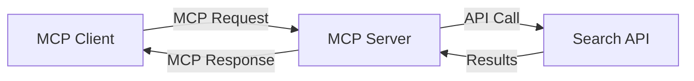
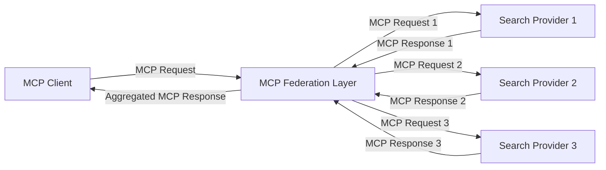
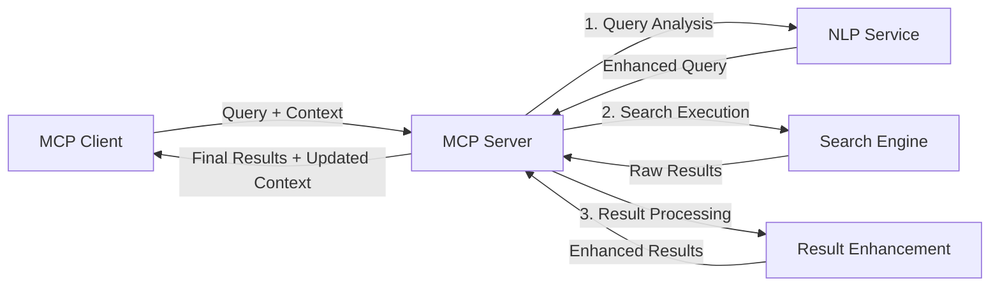

<!--
CO_OP_TRANSLATOR_METADATA:
{
  "original_hash": "eb12652eb7bd17f2193b835a344425c6",
  "translation_date": "2025-06-26T14:21:49+00:00",
  "source_file": "05-AdvancedTopics/mcp-realtimesearch/README.md",
  "language_code": "ro"
}
-->
## Disclaimer privind Exemplele de Cod

> **Notă Importantă**: Exemplele de cod de mai jos demonstrează integrarea Model Context Protocol (MCP) cu funcționalitatea de căutare web. Deși urmează modelele și structurile SDK-urilor oficiale MCP, acestea au fost simplificate în scopuri educaționale.
> 
> Aceste exemple ilustrează:
> 
> 1. **Implementare Python**: O implementare a unui server FastMCP care oferă un instrument de căutare web și se conectează la o API externă de căutare. Exemplul demonstrează gestionarea corectă a duratei de viață, manipularea contextului și implementarea instrumentului urmând modelele [SDK-ului oficial MCP pentru Python](https://github.com/modelcontextprotocol/python-sdk). Serverul utilizează transportul HTTP Streamable recomandat, care a înlocuit transportul SSE mai vechi pentru implementările de producție.
> 
> 2. **Implementare JavaScript**: O implementare în TypeScript/JavaScript folosind modelul FastMCP din [SDK-ul oficial MCP pentru TypeScript](https://github.com/modelcontextprotocol/typescript-sdk) pentru a crea un server de căutare cu definiții corecte ale instrumentelor și conexiuni client. Urmează cele mai recente modele recomandate pentru gestionarea sesiunilor și păstrarea contextului.
> 
> Aceste exemple necesită tratare suplimentară a erorilor, autentificare și cod specific de integrare API pentru utilizare în producție. Endpoint-urile API de căutare prezentate (`https://api.search-service.example/search`) sunt doar exemple și trebuie înlocuite cu endpoint-uri reale de servicii de căutare.
> 
> Pentru detalii complete despre implementare și cele mai actualizate metode, consultați [specificația oficială MCP](https://spec.modelcontextprotocol.io/) și documentația SDK-urilor.

## Concepte de Bază

### Framework-ul Model Context Protocol (MCP)

La bază, Model Context Protocol oferă o metodă standardizată pentru schimbul de context între modele AI, aplicații și servicii. În căutarea web în timp real, acest framework este esențial pentru crearea unor experiențe coerente de căutare cu mai multe interacțiuni. Componentele cheie includ:

1. **Arhitectură Client-Server**: MCP stabilește o separare clară între clienții de căutare (solicitatori) și serverele de căutare (furnizori), permițând modele flexibile de implementare.

2. **Comunicare JSON-RPC**: Protocolul folosește JSON-RPC pentru schimbul de mesaje, făcându-l compatibil cu tehnologiile web și ușor de implementat pe diverse platforme.

3. **Gestionarea Contextului**: MCP definește metode structurate pentru menținerea, actualizarea și valorificarea contextului de căutare în multiple interacțiuni.

4. **Definiții de Instrumente**: Capacitățile de căutare sunt expuse ca instrumente standardizate cu parametri și valori de retur bine definite.

5. **Suport pentru Streaming**: Protocolul suportă transmiterea rezultatelor în flux, esențială pentru căutarea în timp real, unde rezultatele pot apărea progresiv.

### Modele de Integrare a Căutării Web

La integrarea MCP cu căutarea web, apar mai multe modele:

#### 1. Integrarea Directă cu Furnizorul de Căutare

În acest model, serverul MCP interacționează direct cu una sau mai multe API-uri de căutare, traducând cererile MCP în apeluri specifice API-ului și formatează rezultatele ca răspunsuri MCP.

#### 2. Căutare Federată cu Păstrarea Contextului

Acest model distribuie interogările de căutare către mai mulți furnizori de căutare compatibili MCP, fiecare specializat posibil în diferite tipuri de conținut sau capabilități de căutare, menținând un context unificat.

#### 3. Lanț de Căutare Îmbunătățit cu Context

În acest model, procesul de căutare este împărțit în mai multe etape, contextul fiind îmbogățit la fiecare pas, rezultând rezultate progresiv mai relevante.

### Componentele Contextului de Căutare

În căutarea web bazată pe MCP, contextul include de obicei:

- **Istoricul Interogărilor**: Interogările anterioare din sesiune
- **Preferințele Utilizatorului**: Limbă, regiune, setări de căutare sigură
- **Istoricul Interacțiunilor**: Rezultatele pe care le-a accesat utilizatorul, timpul petrecut pe rezultate
- **Parametrii de Căutare**: Filtre, ordonări și alți modificatori ai căutării
- **Cunoștințe de Domeniu**: Context specific subiectului relevant pentru căutare
- **Context Temporal**: Factori de relevanță în funcție de timp
- **Preferințe de Sursă**: Surse de informații de încredere sau preferate

## Cazuri de Utilizare și Aplicații

### Cercetare și Colectare de Informații

MCP îmbunătățește fluxurile de lucru în cercetare prin:

- Păstrarea contextului de cercetare pe durata sesiunilor de căutare
- Permițând interogări mai sofisticate și relevante contextual
- Susținerea căutării federate pe mai multe surse
- Facilitarea extragerii de cunoștințe din rezultatele căutării

### Monitorizarea Știrilor și Tendințelor în Timp Real

Căutarea bazată pe MCP oferă avantaje pentru monitorizarea știrilor:

- Descoperirea aproape în timp real a știrilor emergente
- Filtrare contextuală a informațiilor relevante
- Urmărirea subiectelor și entităților pe multiple surse
- Alarme personalizate de știri bazate pe contextul utilizatorului

### Navigare și Cercetare Augmentată de AI

MCP deschide noi posibilități pentru navigarea augmentată de AI:

- Sugestii de căutare contextuale bazate pe activitatea curentă din browser
- Integrare fluidă a căutării web cu asistenți alimentați de LLM
- Rafinare multi-turn a căutării cu context păstrat
- Verificarea și confirmarea faptelor îmbunătățită

## Tendințe și Inovații Viitoare

### Evoluția MCP în Căutarea Web

Privind înainte, anticipăm că MCP va evolua pentru a aborda:

- **Căutare Multimodală**: Integrarea căutării text, imagine, audio și video cu context păstrat
- **Căutare Decentralizată**: Susținerea ecosistemelor de căutare distribuită și federată
- **Confidențialitatea în Căutare**: Mecanisme de căutare care protejează confidențialitatea, conștiente de context
- **Înțelegerea Interogărilor**: Analiză semantică profundă a interogărilor în limbaj natural

### Posibile Progrese Tehnologice

Tehnologiile emergente care vor modela viitorul căutării MCP:

1. **Arhitecturi de Căutare Neurală**: Sisteme de căutare bazate pe embedding-uri optimizate pentru MCP
2. **Context de Căutare Personalizat**: Învățarea tiparelor individuale de căutare ale utilizatorilor în timp
3. **Integrarea Grafurilor de Cunoștințe**: Căutare contextuală îmbunătățită prin grafuri de cunoștințe specifice domeniului
4. **Context Cross-Modal**: Menținerea contextului între diferite modalități de căutare

## Exerciții Practice

### Exercițiul 1: Configurarea unui Pipeline de Căutare MCP de Bază

În acest exercițiu vei învăța să:
- Configurezi un mediu de căutare MCP de bază
- Implementezi handleri de context pentru căutarea web
- Testezi și validezi păstrarea contextului pe parcursul iterațiilor de căutare

### Exercițiul 2: Construirea unui Asistent de Cercetare cu Căutare MCP

Creează o aplicație completă care:
- Procesează întrebări de cercetare în limbaj natural
- Realizează căutări web conștiente de context
- Sintetizează informații din mai multe surse
- Prezintă rezultate organizate de cercetare

### Exercițiul 3: Implementarea Căutării Federate Multi-Sursă cu MCP

Exercițiu avansat care acoperă:
- Trimiterea interogărilor conștiente de context către mai multe motoare de căutare
- Clasarea și agregarea rezultatelor
- Deduplicarea contextuală a rezultatelor căutării
- Gestionarea metadatelor specifice sursei

## Resurse Suplimentare

- [Model Context Protocol Specification](https://spec.modelcontextprotocol.io/) - Specificația oficială MCP și documentația detaliată a protocolului
- [Model Context Protocol Documentation](https://modelcontextprotocol.io/) - Tutoriale detaliate și ghiduri de implementare
- [MCP Python SDK](https://github.com/modelcontextprotocol/python-sdk) - Implementarea oficială Python a protocolului MCP
- [MCP TypeScript SDK](https://github.com/modelcontextprotocol/typescript-sdk) - Implementarea oficială TypeScript a protocolului MCP
- [MCP Reference Servers](https://github.com/modelcontextprotocol/servers) - Implementări de referință ale serverelor MCP
- [Bing Web Search API Documentation](https://learn.microsoft.com/en-us/bing/search-apis/bing-web-search/overview) - API-ul de căutare web Microsoft
- [Google Custom Search JSON API](https://developers.google.com/custom-search/v1/overview) - Motorul de căutare programabil Google
- [SerpAPI Documentation](https://serpapi.com/search-api) - API pentru paginile de rezultate ale motoarelor de căutare
- [Meilisearch Documentation](https://www.meilisearch.com/docs) - Motor de căutare open-source
- [Elasticsearch Documentation](https://www.elastic.co/guide/index.html) - Motor distribuit de căutare și analiză
- [LangChain Documentation](https://python.langchain.com/docs/get_started/introduction) - Construirea aplicațiilor cu LLM-uri

## Rezultate de Învățare

Parcurgând acest modul, vei putea să:

- Înțelegi fundamentele căutării web în timp real și provocările acesteia
- Explici cum Model Context Protocol (MCP) îmbunătățește capacitățile de căutare în timp real
- Implementezi soluții de căutare bazate pe MCP folosind framework-uri și API-uri populare
- Proiectezi și implementezi arhitecturi scalabile și performante de căutare cu MCP
- Aplici conceptele MCP în diverse cazuri de utilizare, inclusiv căutare semantică, asistență în cercetare și navigare augmentată de AI
- Evaluezi tendințele emergente și inovațiile viitoare în tehnologiile de căutare bazate pe MCP

### Considerații privind Încrederea și Siguranța

Când implementezi soluții de căutare web bazate pe MCP, amintește-ți aceste principii importante din specificația MCP:

1. **Consimțământul și Controlul Utilizatorului**: Utilizatorii trebuie să își dea consimțământul explicit și să înțeleagă toate accesările și operațiunile asupra datelor. Acest lucru este deosebit de important pentru implementările de căutare web care pot accesa surse externe de date.

2. **Confidențialitatea Datelor**: Asigură o manipulare adecvată a interogărilor și rezultatelor de căutare, mai ales când acestea pot conține informații sensibile. Implementează controale de acces corespunzătoare pentru protecția datelor utilizatorului.

3. **Siguranța Instrumentelor**: Implementează autorizare și validare corespunzătoare pentru instrumentele de căutare, deoarece acestea pot reprezenta riscuri de securitate prin executarea de cod arbitrar. Descrierile comportamentului instrumentelor trebuie considerate neîncrezătoare dacă nu provin de la un server de încredere.

4. **Documentație Clară**: Oferă documentație clară despre capabilități, limitări și considerații de securitate ale implementării tale de căutare bazată pe MCP, urmând ghidurile din specificația MCP.

5. **Fluxuri Robuste de Consimțământ**: Construiește fluxuri robuste de consimțământ și autorizare care explică clar ce face fiecare instrument înainte de a-i permite utilizarea, în special pentru instrumentele care interacționează cu resurse web externe.

Pentru detalii complete privind securitatea și considerațiile de încredere MCP, consultă [documentația oficială](https://modelcontextprotocol.io/specification/2025-03-26#security-and-trust-%26-safety).

## Ce urmează

- [5.11 Autentificare Entra ID pentru Serverele Model Context Protocol](../mcp-security-entra/README.md)

**Declinare a responsabilității**:  
Acest document a fost tradus folosind serviciul de traducere AI [Co-op Translator](https://github.com/Azure/co-op-translator). Deși ne străduim pentru acuratețe, vă rugăm să rețineți că traducerile automate pot conține erori sau inexactități. Documentul original în limba sa nativă trebuie considerat sursa autoritară. Pentru informații critice, se recomandă traducerea profesională realizată de un specialist uman. Nu ne asumăm răspunderea pentru eventualele neînțelegeri sau interpretări greșite rezultate din utilizarea acestei traduceri.