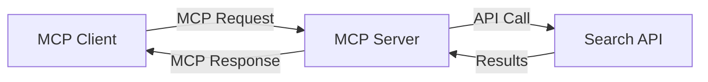
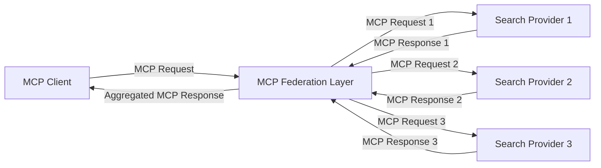
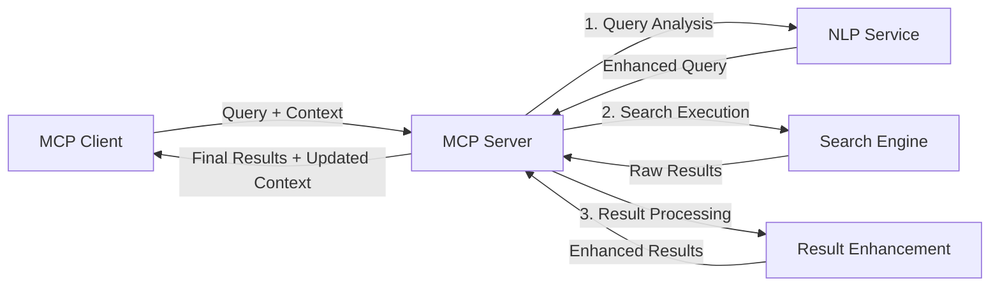

<!--
CO_OP_TRANSLATOR_METADATA:
{
  "original_hash": "eb12652eb7bd17f2193b835a344425c6",
  "translation_date": "2025-07-14T01:17:53+00:00",
  "source_file": "05-AdvancedTopics/mcp-realtimesearch/README.md",
  "language_code": "ro"
}
-->
## Declarație privind exemplele de cod

> **Notă importantă**: Exemplele de cod de mai jos demonstrează integrarea Model Context Protocol (MCP) cu funcționalitatea de căutare web. Deși urmează modelele și structurile SDK-urilor oficiale MCP, acestea au fost simplificate în scopuri educaționale.
> 
> Aceste exemple ilustrează:
> 
> 1. **Implementare Python**: O implementare a unui server FastMCP care oferă un instrument de căutare web și se conectează la o API externă de căutare. Acest exemplu demonstrează gestionarea corectă a duratei de viață, manipularea contextului și implementarea instrumentului urmând modelele din [SDK-ul oficial MCP pentru Python](https://github.com/modelcontextprotocol/python-sdk). Serverul utilizează transportul HTTP Streamable recomandat, care a înlocuit vechiul transport SSE pentru implementările de producție.
> 
> 2. **Implementare JavaScript**: O implementare în TypeScript/JavaScript folosind modelul FastMCP din [SDK-ul oficial MCP pentru TypeScript](https://github.com/modelcontextprotocol/typescript-sdk) pentru a crea un server de căutare cu definiții corecte ale instrumentelor și conexiuni client. Urmează cele mai recente modele recomandate pentru gestionarea sesiunilor și păstrarea contextului.
> 
> Aceste exemple necesită gestionare suplimentară a erorilor, autentificare și cod specific de integrare API pentru utilizare în producție. Endpoint-urile API de căutare afișate (`https://api.search-service.example/search`) sunt doar exemple și trebuie înlocuite cu endpoint-uri reale ale serviciilor de căutare.
> 
> Pentru detalii complete de implementare și cele mai actualizate metode, vă rugăm să consultați [specificația oficială MCP](https://spec.modelcontextprotocol.io/) și documentația SDK-urilor.

## Concepte de bază

### Framework-ul Model Context Protocol (MCP)

La bază, Model Context Protocol oferă o metodă standardizată prin care modelele AI, aplicațiile și serviciile pot schimba context. În căutarea web în timp real, acest framework este esențial pentru crearea unor experiențe coerente de căutare pe mai multe interacțiuni. Componentele cheie includ:

1. **Arhitectură Client-Server**: MCP stabilește o separare clară între clienții de căutare (cei care solicită) și serverele de căutare (furnizorii), permițând modele flexibile de implementare.

2. **Comunicare JSON-RPC**: Protocolul folosește JSON-RPC pentru schimbul de mesaje, făcându-l compatibil cu tehnologiile web și ușor de implementat pe diverse platforme.

3. **Gestionarea Contextului**: MCP definește metode structurate pentru menținerea, actualizarea și utilizarea contextului de căutare pe parcursul mai multor interacțiuni.

4. **Definiții de Instrumente**: Capacitățile de căutare sunt expuse ca instrumente standardizate cu parametri și valori de retur bine definite.

5. **Suport pentru Streaming**: Protocolul suportă transmiterea în flux a rezultatelor, esențială pentru căutarea în timp real unde rezultatele pot sosi progresiv.

### Modele de integrare a căutării web

La integrarea MCP cu căutarea web, apar mai multe modele:

#### 1. Integrare directă cu furnizorul de căutare

În acest model, serverul MCP interacționează direct cu una sau mai multe API-uri de căutare, traducând cererile MCP în apeluri specifice API-ului și formatează rezultatele ca răspunsuri MCP.

#### 2. Căutare federată cu păstrarea contextului

Acest model distribuie interogările de căutare către mai mulți furnizori compatibili MCP, fiecare specializat potențial în diferite tipuri de conținut sau capabilități de căutare, menținând în același timp un context unificat.

#### 3. Lanț de căutare îmbunătățit cu context

În acest model, procesul de căutare este împărțit în mai multe etape, contextul fiind îmbogățit la fiecare pas, rezultând rezultate din ce în ce mai relevante.

### Componente ale contextului de căutare

În căutarea web bazată pe MCP, contextul include de obicei:

- **Istoricul interogărilor**: Interogările anterioare din sesiune
- **Preferințele utilizatorului**: Limbă, regiune, setări de căutare sigură
- **Istoricul interacțiunilor**: Rezultatele pe care utilizatorul le-a accesat, timpul petrecut pe rezultate
- **Parametrii de căutare**: Filtre, ordonări și alți modificatori de căutare
- **Cunoștințe de domeniu**: Context specific subiectului relevant pentru căutare
- **Context temporal**: Factori de relevanță în funcție de timp
- **Preferințe de sursă**: Surse de informații de încredere sau preferate

## Cazuri de utilizare și aplicații

### Cercetare și colectare de informații

MCP îmbunătățește fluxurile de lucru de cercetare prin:

- Păstrarea contextului de cercetare pe parcursul sesiunilor de căutare
- Permițând interogări mai sofisticate și relevante contextual
- Susținerea căutării federate pe mai multe surse
- Facilitarea extragerii de cunoștințe din rezultatele căutării

### Monitorizarea știrilor și tendințelor în timp real

Căutarea alimentată de MCP oferă avantaje pentru monitorizarea știrilor:

- Descoperirea aproape în timp real a știrilor emergente
- Filtrarea contextuală a informațiilor relevante
- Urmărirea subiectelor și entităților pe mai multe surse
- Alarme personalizate de știri bazate pe contextul utilizatorului

### Navigare și cercetare augmentată de AI

MCP creează noi posibilități pentru navigarea augmentată de AI:

- Sugestii de căutare contextuale bazate pe activitatea curentă din browser
- Integrare fluidă a căutării web cu asistenți alimentați de LLM
- Rafinare a căutării pe mai multe interacțiuni cu păstrarea contextului
- Verificare și validare îmbunătățite a faptelor și informațiilor

## Tendințe și inovații viitoare

### Evoluția MCP în căutarea web

Privind spre viitor, anticipăm că MCP va evolua pentru a aborda:

- **Căutare multimodală**: Integrarea căutării text, imagine, audio și video cu context păstrat
- **Căutare descentralizată**: Susținerea ecosistemelor de căutare distribuită și federată
- **Confidențialitatea căutării**: Mecanisme de căutare care păstrează confidențialitatea, adaptate contextului  
- **Înțelegerea interogărilor**: Analiză semantică profundă a interogărilor de căutare în limbaj natural

### Posibile progrese tehnologice

Tehnologii emergente care vor modela viitorul căutării MCP:

1. **Arhitecturi de căutare neurală**: Sisteme de căutare bazate pe embedding-uri, optimizate pentru MCP  
2. **Context de căutare personalizat**: Învățarea tiparelor de căutare individuale ale utilizatorilor în timp  
3. **Integrarea graficelor de cunoștințe**: Căutare contextuală îmbunătățită prin grafice de cunoștințe specifice domeniului  
4. **Context cross-modal**: Menținerea contextului între diferite modalități de căutare

## Exerciții practice

### Exercițiul 1: Configurarea unui pipeline de căutare MCP de bază

În acest exercițiu vei învăța să:  
- Configurezi un mediu de căutare MCP de bază  
- Implementezi gestionarea contextului pentru căutarea pe web  
- Testezi și validezi păstrarea contextului pe parcursul iterărilor de căutare

### Exercițiul 2: Construirea unui asistent de cercetare cu MCP Search

Creează o aplicație completă care:  
- Procesează întrebări de cercetare în limbaj natural  
- Efectuează căutări web contextuale  
- Sintetizează informații din surse multiple  
- Prezintă rezultatele cercetării într-un mod organizat

### Exercițiul 3: Implementarea unei federări de căutare multi-sursă cu MCP

Exercițiu avansat care acoperă:  
- Trimiterea interogărilor contextuale către mai multe motoare de căutare  
- Clasarea și agregarea rezultatelor  
- Deduplicarea contextuală a rezultatelor căutării  
- Gestionarea metadatelor specifice surselor

## Resurse suplimentare

- [Model Context Protocol Specification](https://spec.modelcontextprotocol.io/) - Specificația oficială MCP și documentația detaliată a protocolului  
- [Model Context Protocol Documentation](https://modelcontextprotocol.io/) - Tutoriale detaliate și ghiduri de implementare  
- [MCP Python SDK](https://github.com/modelcontextprotocol/python-sdk) - Implementarea oficială Python a protocolului MCP  
- [MCP TypeScript SDK](https://github.com/modelcontextprotocol/typescript-sdk) - Implementarea oficială TypeScript a protocolului MCP  
- [MCP Reference Servers](https://github.com/modelcontextprotocol/servers) - Implementări de referință ale serverelor MCP  
- [Bing Web Search API Documentation](https://learn.microsoft.com/en-us/bing/search-apis/bing-web-search/overview) - API-ul de căutare web Microsoft  
- [Google Custom Search JSON API](https://developers.google.com/custom-search/v1/overview) - Motorul de căutare programabil Google  
- [SerpAPI Documentation](https://serpapi.com/search-api) - API pentru paginile cu rezultate ale motoarelor de căutare  
- [Meilisearch Documentation](https://www.meilisearch.com/docs) - Motor de căutare open-source  
- [Elasticsearch Documentation](https://www.elastic.co/guide/index.html) - Motor distribuit de căutare și analiză  
- [LangChain Documentation](https://python.langchain.com/docs/get_started/introduction) - Construirea aplicațiilor cu LLM-uri

## Rezultate așteptate

După finalizarea acestui modul vei putea să:  

- Înțelegi fundamentele căutării web în timp real și provocările acesteia  
- Explici cum Model Context Protocol (MCP) îmbunătățește capabilitățile căutării web în timp real  
- Implementezi soluții de căutare bazate pe MCP folosind framework-uri și API-uri populare  
- Proiectezi și implementezi arhitecturi de căutare scalabile și performante cu MCP  
- Aplici conceptele MCP în diverse cazuri de utilizare, inclusiv căutare semantică, asistență pentru cercetare și navigare augmentată de AI  
- Evaluezi tendințele emergente și inovațiile viitoare în tehnologiile de căutare bazate pe MCP

### Considerații privind încrederea și siguranța

Când implementezi soluții de căutare web bazate pe MCP, ține cont de aceste principii importante din specificația MCP:

1. **Consimțământul și controlul utilizatorului**: Utilizatorii trebuie să își dea consimțământul explicit și să înțeleagă toate operațiunile și accesul la date. Acest aspect este deosebit de important pentru implementările de căutare web care pot accesa surse externe de date.

2. **Confidențialitatea datelor**: Asigură o gestionare adecvată a interogărilor și rezultatelor de căutare, mai ales când acestea pot conține informații sensibile. Implementează controale de acces corespunzătoare pentru protejarea datelor utilizatorilor.

3. **Siguranța uneltelor**: Implementează autorizare și validare corespunzătoare pentru uneltele de căutare, deoarece acestea pot reprezenta riscuri de securitate prin executarea de cod arbitrar. Descrierile comportamentului uneltelor trebuie considerate neîncrezătoare, cu excepția cazului în care provin de la un server de încredere.

4. **Documentație clară**: Oferă documentație clară despre capabilitățile, limitările și considerațiile de securitate ale implementării tale MCP, urmând ghidurile din specificația MCP.

5. **Fluxuri robuste de consimțământ**: Construiește fluxuri robuste de consimțământ și autorizare care explică clar ce face fiecare unealtă înainte de a autoriza utilizarea acesteia, în special pentru uneltele care interacționează cu resurse web externe.

Pentru detalii complete despre securitatea și considerațiile de încredere MCP, consultă [documentația oficială](https://modelcontextprotocol.io/specification/2025-03-26#security-and-trust-%26-safety).

## Ce urmează

- [5.11 Autentificare Entra ID pentru serverele Model Context Protocol](../mcp-security-entra/README.md)

**Declinare de responsabilitate**:  
Acest document a fost tradus folosind serviciul de traducere AI [Co-op Translator](https://github.com/Azure/co-op-translator). Deși ne străduim pentru acuratețe, vă rugăm să rețineți că traducerile automate pot conține erori sau inexactități. Documentul original în limba sa nativă trebuie considerat sursa autorizată. Pentru informații critice, se recomandă traducerea profesională realizată de un specialist uman. Nu ne asumăm răspunderea pentru eventualele neînțelegeri sau interpretări greșite rezultate din utilizarea acestei traduceri.