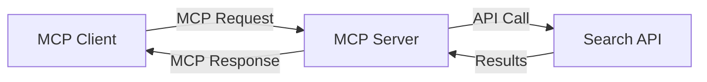
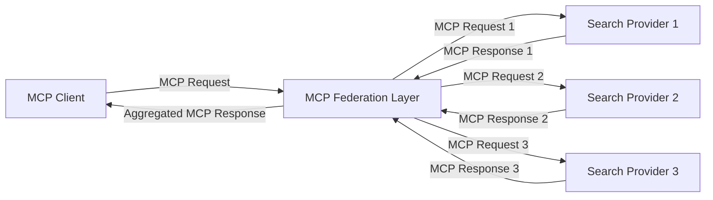
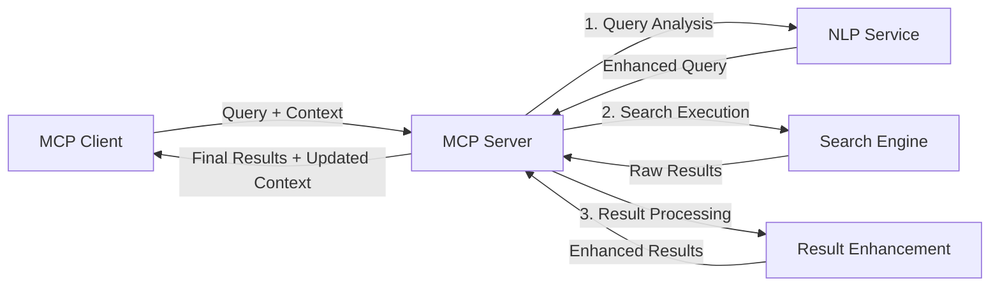

<!--
CO_OP_TRANSLATOR_METADATA:
{
  "original_hash": "16bef2c93c6a86d4ca6a8ce9e120e384",
  "translation_date": "2025-06-13T03:02:04+00:00",
  "source_file": "05-AdvancedTopics/mcp-realtimesearch/README.md",
  "language_code": "ro"
}
-->
## Disclaimer privind exemplele de cod

> **Notă importantă**: Exemplele de cod de mai jos demonstrează integrarea Model Context Protocol (MCP) cu funcționalitatea de căutare web. Deși urmează tiparele și structurile SDK-urilor oficiale MCP, acestea au fost simplificate în scopuri educaționale.
> 
> Aceste exemple prezintă:
> 
> 1. **Implementare Python**: Un server FastMCP care oferă un instrument de căutare web și se conectează la un API extern de căutare. Acest exemplu demonstrează gestionarea corectă a duratei de viață, manipularea contextului și implementarea instrumentului conform tiparelor din [SDK-ul oficial MCP Python](https://github.com/modelcontextprotocol/python-sdk). Serverul utilizează transportul HTTP Streamable recomandat, care a înlocuit transportul SSE mai vechi pentru implementările de producție.
> 
> 2. **Implementare JavaScript**: O implementare TypeScript/JavaScript folosind tiparul FastMCP din [SDK-ul oficial MCP TypeScript](https://github.com/modelcontextprotocol/typescript-sdk) pentru a crea un server de căutare cu definiții corecte ale instrumentelor și conexiuni client. Urmează cele mai recente tipare recomandate pentru gestionarea sesiunilor și păstrarea contextului.
> 
> Aceste exemple necesită gestionare suplimentară a erorilor, autentificare și cod specific de integrare API pentru utilizare în producție. Endpoint-urile API de căutare afișate (`https://api.search-service.example/search`) sunt doar exemplu și trebuie înlocuite cu endpoint-uri reale ale serviciilor de căutare.
> 
> Pentru detalii complete despre implementare și cele mai actualizate abordări, consultați [specificația oficială MCP](https://spec.modelcontextprotocol.io/) și documentația SDK-urilor.

## Concepte de bază

### Framework-ul Model Context Protocol (MCP)

La bază, Model Context Protocol oferă o modalitate standardizată pentru modelele AI, aplicații și servicii de a schimba context. În căutarea web în timp real, acest framework este esențial pentru crearea unor experiențe de căutare coerente, cu multiple interacțiuni. Componentele cheie includ:

1. **Arhitectură Client-Server**: MCP stabilește o separare clară între clienții de căutare (solicitatori) și serverele de căutare (furnizori), permițând modele flexibile de implementare.

2. **Comunicare JSON-RPC**: Protocolul folosește JSON-RPC pentru schimbul de mesaje, făcându-l compatibil cu tehnologiile web și ușor de implementat pe diferite platforme.

3. **Gestionarea Contextului**: MCP definește metode structurate pentru menținerea, actualizarea și valorificarea contextului de căutare pe parcursul mai multor interacțiuni.

4. **Definiții de Instrumente**: Capacitățile de căutare sunt expuse ca instrumente standardizate, cu parametri și valori de returnare bine definite.

5. **Suport pentru Streaming**: Protocolul suportă transmiterea în flux a rezultatelor, esențială pentru căutarea în timp real unde rezultatele pot sosi progresiv.

### Tipare de integrare pentru căutarea web

La integrarea MCP cu căutarea web, apar mai multe tipare:

#### 1. Integrare directă cu furnizorul de căutare

În acest tipar, serverul MCP interacționează direct cu unul sau mai multe API-uri de căutare, traducând cererile MCP în apeluri specifice API-ului și formatează rezultatele ca răspunsuri MCP.

#### 2. Căutare federată cu păstrarea contextului

Acest tipar distribuie interogările de căutare către mai mulți furnizori de căutare compatibili MCP, fiecare specializat potențial în tipuri diferite de conținut sau capabilități de căutare, menținând în același timp un context unificat.

#### 3. Lanț de căutare îmbunătățit cu context

În acest tipar, procesul de căutare este împărțit în mai multe etape, contextul fiind îmbogățit la fiecare pas, rezultând în rezultate din ce în ce mai relevante.

### Componente ale contextului de căutare

În căutarea web bazată pe MCP, contextul include de obicei:

- **Istoricul interogărilor**: Interogările anterioare din sesiune
- **Preferințele utilizatorului**: Limbă, regiune, setări de căutare sigură
- **Istoricul interacțiunilor**: Ce rezultate au fost accesate, timpul petrecut pe rezultate
- **Parametrii de căutare**: Filtre, ordonări și alți modificatori de căutare
- **Cunoștințe de domeniu**: Context specific subiectului relevant pentru căutare
- **Context temporal**: Factori de relevanță bazate pe timp
- **Preferințe sursă**: Surse de informații de încredere sau preferate

## Cazuri de utilizare și aplicații

### Cercetare și colectare de informații

MCP îmbunătățește fluxurile de lucru pentru cercetare prin:

- Păstrarea contextului de cercetare între sesiunile de căutare
- Permițând interogări mai sofisticate și contextual relevante
- Susținerea căutării federate multi-sursă
- Facilitarea extragerii de cunoștințe din rezultatele căutării

### Monitorizarea știrilor și a tendințelor în timp real

Căutarea bazată pe MCP oferă avantaje pentru monitorizarea știrilor:

- Descoperire aproape în timp real a știrilor emergente
- Filtrare contextuală a informațiilor relevante
- Urmărirea subiectelor și entităților pe mai multe surse
- Alarme personalizate pe baza contextului utilizatorului

### Navigare și cercetare augmentată de AI

MCP creează noi posibilități pentru navigarea augmentată de AI:

- Sugestii de căutare contextuale bazate pe activitatea curentă din browser
- Integrare fără întreruperi a căutării web cu asistenți LLM
- Rafinație multi-turn a căutării cu păstrarea contextului
- Verificare și validare îmbunătățite a faptelor și informațiilor

## Tendințe și inovații viitoare

### Evoluția MCP în căutarea web

Privind înainte, anticipăm că MCP va evolua pentru a aborda:

- **Căutare multimodală**: Integrarea căutării text, imagine, audio și video cu context păstrat
- **Căutare descentralizată**: Susținerea ecosistemelor de căutare distribuită și federată
- **Confidențialitatea căutării**: Mecanisme de căutare care păstrează confidențialitatea contextuală
- **Înțelegerea interogărilor**: Parsare semantică profundă a interogărilor în limbaj natural

### Posibile avansuri tehnologice

Tehnologii emergente care vor modela viitorul căutării MCP:

1. **Arhitecturi de căutare neurală**: Sisteme de căutare bazate pe embedding-uri, optimizate pentru MCP
2. **Context de căutare personalizat**: Învățarea tiparelor individuale de căutare ale utilizatorului în timp
3. **Integrarea grafurilor de cunoștințe**: Căutare contextuală îmbunătățită prin grafuri de cunoștințe specifice domeniului
4. **Context cross-modal**: Menținerea contextului între diferite modalități de căutare

## Exerciții practice

### Exercițiul 1: Configurarea unui pipeline simplu de căutare MCP

În acest exercițiu vei învăța cum să:
- Configurezi un mediu simplu de căutare MCP
- Implementezi handleri de context pentru căutarea web
- Testezi și validezi păstrarea contextului între iterațiile de căutare

### Exercițiul 2: Construirea unui asistent de cercetare cu căutare MCP

Creează o aplicație completă care:
- Procesează întrebări de cercetare în limbaj natural
- Efectuează căutări web contextuale
- Sintetizează informații din multiple surse
- Prezintă rezultate organizate ale cercetării

### Exercițiul 3: Implementarea căutării federate multi-sursă cu MCP

Exercițiu avansat care acoperă:
- Dispecerizarea interogărilor contextuale către mai multe motoare de căutare
- Clasarea și agregarea rezultatelor
- Deducerea contextuală a duplicatelor în rezultate
- Gestionarea metadatelor specifice surselor

## Resurse suplimentare

- [Specificația Model Context Protocol](https://spec.modelcontextprotocol.io/) - Specificația oficială MCP și documentația detaliată a protocolului
- [Documentația Model Context Protocol](https://modelcontextprotocol.io/) - Tutoriale detaliate și ghiduri de implementare
- [MCP Python SDK](https://github.com/modelcontextprotocol/python-sdk) - Implementarea oficială Python a protocolului MCP
- [MCP TypeScript SDK](https://github.com/modelcontextprotocol/typescript-sdk) - Implementarea oficială TypeScript a protocolului MCP
- [Servere de referință MCP](https://github.com/modelcontextprotocol/servers) - Implementări de referință ale serverelor MCP
- [Documentația Bing Web Search API](https://learn.microsoft.com/en-us/bing/search-apis/bing-web-search/overview) - API-ul de căutare web Microsoft
- [Google Custom Search JSON API](https://developers.google.com/custom-search/v1/overview) - Motorul de căutare programabil Google
- [Documentația SerpAPI](https://serpapi.com/search-api) - API pentru paginile de rezultate ale motoarelor de căutare
- [Documentația Meilisearch](https://www.meilisearch.com/docs) - Motor de căutare open-source
- [Documentația Elasticsearch](https://www.elastic.co/guide/index.html) - Motor distribuit de căutare și analiză
- [Documentația LangChain](https://python.langchain.com/docs/get_started/introduction) - Construirea aplicațiilor cu LLM-uri

## Rezultate așteptate

După finalizarea acestui modul, vei putea:

- Înțelege fundamentele căutării web în timp real și provocările acesteia
- Explica modul în care Model Context Protocol (MCP) îmbunătățește capacitățile de căutare web în timp real
- Implementa soluții de căutare bazate pe MCP folosind framework-uri și API-uri populare
- Proiecta și implementa arhitecturi scalabile și performante de căutare cu MCP
- Aplica conceptele MCP în diverse cazuri de utilizare, inclusiv căutare semantică, asistență pentru cercetare și navigare augmentată de AI
- Evalua tendințele emergente și inovațiile viitoare în tehnologiile de căutare bazate pe MCP

### Considerații privind încrederea și siguranța

Când implementezi soluții de căutare web bazate pe MCP, amintește-ți aceste principii importante din specificația MCP:

1. **Consimțământul și controlul utilizatorului**: Utilizatorii trebuie să își dea consimțământul explicit și să înțeleagă toate accesările și operațiunile asupra datelor. Acest lucru este deosebit de important pentru implementările de căutare web care pot accesa surse externe de date.

2. **Confidențialitatea datelor**: Asigură o gestionare adecvată a interogărilor și rezultatelor căutării, mai ales când acestea pot conține informații sensibile. Implementează controale de acces corespunzătoare pentru protejarea datelor utilizatorilor.

3. **Siguranța instrumentelor**: Implementează autorizare și validare corectă pentru instrumentele de căutare, deoarece acestea pot reprezenta riscuri de securitate prin executarea de cod arbitrar. Descrierile comportamentului instrumentelor trebuie considerate neîncrezătoare decât dacă provin de la un server de încredere.

4. **Documentație clară**: Oferă documentație clară despre capabilitățile, limitările și considerațiile de securitate ale implementării tale de căutare bazate pe MCP, urmând ghidurile din specificația MCP.

5. **Fluxuri robuste de consimțământ**: Construiește fluxuri robuste de consimțământ și autorizare care explică clar ce face fiecare instrument înainte de a autoriza utilizarea sa, în special pentru instrumentele care interacționează cu resurse web externe.

Pentru detalii complete privind securitatea și considerațiile de încredere MCP, consultă [documentația oficială](https://modelcontextprotocol.io/specification/2025-03-26#security-and-trust-%26-safety).

## Ce urmează

- [6. Contribuții din comunitate](../../06-CommunityContributions/README.md)

**Declinare a responsabilității**:  
Acest document a fost tradus folosind serviciul de traducere AI [Co-op Translator](https://github.com/Azure/co-op-translator). Deși ne străduim pentru acuratețe, vă rugăm să rețineți că traducerile automate pot conține erori sau inexactități. Documentul original în limba sa nativă trebuie considerat sursa autoritară. Pentru informații critice, se recomandă traducerea profesională realizată de un specialist uman. Nu ne asumăm responsabilitatea pentru eventualele neînțelegeri sau interpretări greșite rezultate din utilizarea acestei traduceri.