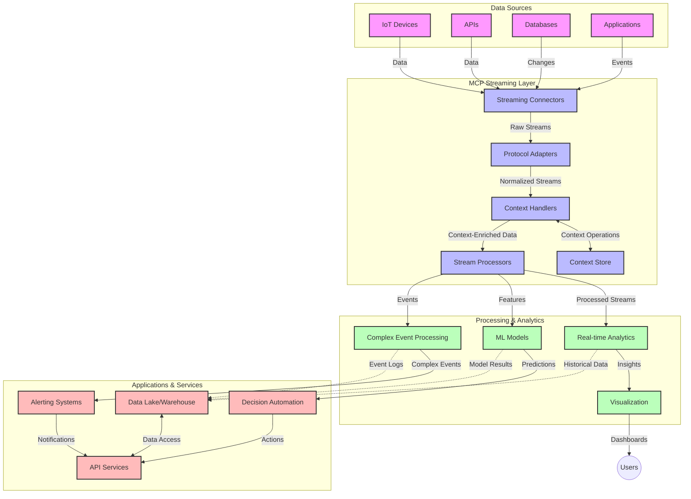

<!--
CO_OP_TRANSLATOR_METADATA:
{
  "original_hash": "195f7287638b77a549acadd96c8f981c",
  "translation_date": "2025-07-14T01:51:03+00:00",
  "source_file": "05-AdvancedTopics/mcp-realtimestreaming/README.md",
  "language_code": "ro"
}
-->
# Protocolul Model Context pentru Streaming de Date în Timp Real

## Prezentare generală

Streamingul de date în timp real a devenit esențial în lumea actuală orientată spre date, unde afacerile și aplicațiile au nevoie de acces imediat la informații pentru a lua decizii la timp. Protocolul Model Context (MCP) reprezintă un pas important în optimizarea acestor procese de streaming în timp real, îmbunătățind eficiența procesării datelor, menținând integritatea contextuală și sporind performanța generală a sistemului.

Acest modul explorează modul în care MCP transformă streamingul de date în timp real, oferind o abordare standardizată pentru gestionarea contextului între modelele AI, platformele de streaming și aplicații.

## Introducere în Streamingul de Date în Timp Real

Streamingul de date în timp real este un paradigm tehnologic care permite transferul, procesarea și analiza continuă a datelor pe măsură ce sunt generate, permițând sistemelor să reacționeze imediat la informații noi. Spre deosebire de procesarea tradițională în loturi, care operează pe seturi statice de date, streamingul procesează datele în mișcare, oferind insight-uri și acțiuni cu o latență minimă.

### Concepte de bază ale Streamingului de Date în Timp Real:

- **Flux continuu de date**: Datele sunt procesate ca un flux continuu, nesfârșit, de evenimente sau înregistrări.
- **Procesare cu latență redusă**: Sistemele sunt proiectate să minimizeze timpul dintre generarea și procesarea datelor.
- **Scalabilitate**: Arhitecturile de streaming trebuie să gestioneze volume și viteze variabile ale datelor.
- **Toleranță la erori**: Sistemele trebuie să fie rezistente la defecțiuni pentru a asigura un flux neîntrerupt de date.
- **Procesare cu stare**: Menținerea contextului între evenimente este esențială pentru o analiză relevantă.

### Protocolul Model Context și Streamingul în Timp Real

Protocolul Model Context (MCP) abordează mai multe provocări critice în mediile de streaming în timp real:

1. **Continuitate contextuală**: MCP standardizează modul în care contextul este menținut între componentele distribuite de streaming, asigurând accesul modelelor AI și nodurilor de procesare la contextul istoric și de mediu relevant.

2. **Gestionare eficientă a stării**: Prin oferirea unor mecanisme structurate pentru transmiterea contextului, MCP reduce suprasarcina gestionării stării în pipeline-urile de streaming.

3. **Interoperabilitate**: MCP creează un limbaj comun pentru partajarea contextului între tehnologii diverse de streaming și modele AI, permițând arhitecturi mai flexibile și extensibile.

4. **Context optimizat pentru streaming**: Implementările MCP pot prioritiza elementele de context cele mai relevante pentru luarea deciziilor în timp real, optimizând atât performanța, cât și acuratețea.

5. **Procesare adaptivă**: Cu o gestionare corectă a contextului prin MCP, sistemele de streaming pot ajusta dinamic procesarea în funcție de condițiile și tiparele evolutive ale datelor.

În aplicații moderne, de la rețele de senzori IoT până la platforme financiare de tranzacționare, integrarea MCP cu tehnologiile de streaming permite o procesare mai inteligentă, conștientă de context, capabilă să răspundă adecvat situațiilor complexe și în evoluție în timp real.

## Obiective de învățare

La finalul acestei lecții, vei putea:

- Înțelege fundamentele streamingului de date în timp real și provocările acestuia
- Explica modul în care Protocolul Model Context (MCP) îmbunătățește streamingul de date în timp real
- Implementa soluții de streaming bazate pe MCP folosind framework-uri populare precum Kafka și Pulsar
- Proiecta și implementa arhitecturi de streaming tolerante la erori și cu performanță ridicată folosind MCP
- Aplica conceptele MCP în cazuri de utilizare IoT, tranzacționare financiară și analize AI
- Evalua tendințele emergente și inovațiile viitoare în tehnologiile de streaming bazate pe MCP

### Definiție și importanță

Streamingul de date în timp real implică generarea, procesarea și livrarea continuă a datelor cu o latență minimă. Spre deosebire de procesarea în loturi, unde datele sunt colectate și procesate în grupuri, streamingul procesează datele incremental pe măsură ce sosesc, permițând insight-uri și acțiuni imediate.

Caracteristici cheie ale streamingului de date în timp real includ:

- **Latență redusă**: Procesarea și analiza datelor în câteva milisecunde până la secunde
- **Flux continuu**: Fluxuri neîntrerupte de date din diverse surse
- **Procesare imediată**: Analiza datelor pe măsură ce sosesc, nu în loturi
- **Arhitectură bazată pe evenimente**: Răspuns la evenimente pe măsură ce apar

### Provocări în streamingul tradițional de date

Abordările tradiționale de streaming se confruntă cu mai multe limitări:

1. **Pierderea contextului**: Dificultăți în menținerea contextului între sisteme distribuite
2. **Probleme de scalabilitate**: Provocări în extinderea pentru a gestiona volume mari și viteze ridicate ale datelor
3. **Complexitate în integrare**: Probleme de interoperabilitate între sisteme diferite
4. **Gestionarea latenței**: Echilibrarea debitului cu timpul de procesare
5. **Consistența datelor**: Asigurarea acurateței și completitudinii datelor pe întregul flux

## Înțelegerea Protocolului Model Context (MCP)

### Ce este MCP?

Protocolul Model Context (MCP) este un protocol de comunicare standardizat, conceput pentru a facilita interacțiunea eficientă între modelele AI și aplicații. În contextul streamingului de date în timp real, MCP oferă un cadru pentru:

- Păstrarea contextului pe tot parcursul pipeline-ului de date
- Standardizarea formatelor de schimb de date
- Optimizarea transmiterii seturilor mari de date
- Îmbunătățirea comunicării model-model și model-aplicație

### Componente de bază și arhitectură

Arhitectura MCP pentru streaming în timp real constă din mai multe componente cheie:

1. **Context Handlers**: Gestionează și mențin informațiile contextuale pe tot pipeline-ul de streaming
2. **Stream Processors**: Procesează fluxurile de date primite folosind tehnici conștiente de context
3. **Protocol Adapters**: Convertesc între diferite protocoale de streaming păstrând contextul
4. **Context Store**: Stochează și recuperează eficient informațiile contextuale
5. **Streaming Connectors**: Se conectează la diverse platforme de streaming (Kafka, Pulsar, Kinesis etc.)



### Cum îmbunătățește MCP gestionarea datelor în timp real

MCP abordează provocările tradiționale ale streamingului prin:

- **Integritate contextuală**: Menținerea relațiilor între punctele de date pe întregul pipeline
- **Transmitere optimizată**: Reducerea redundanței în schimbul de date prin gestionarea inteligentă a contextului
- **Interfețe standardizate**: Oferirea unor API-uri consistente pentru componentele de streaming
- **Reducerea latenței**: Minimiza suprasarcina procesării prin gestionarea eficientă a contextului
- **Scalabilitate sporită**: Susținerea scalării orizontale păstrând contextul

## Integrare și implementare

Sistemele de streaming de date în timp real necesită o proiectare și implementare atentă pentru a menține atât performanța, cât și integritatea contextuală. Protocolul Model Context oferă o abordare standardizată pentru integrarea modelelor AI și a tehnologiilor de streaming, permițând pipeline-uri de procesare mai sofisticate și conștiente de context.

### Prezentare generală a integrării MCP în arhitecturile de streaming

Implementarea MCP în mediile de streaming în timp real implică mai multe aspecte importante:

1. **Serializarea și transportul contextului**: MCP oferă mecanisme eficiente pentru codificarea informațiilor contextuale în pachetele de date de streaming, asigurând că contextul esențial însoțește datele pe tot parcursul pipeline-ului de procesare. Aceasta include formate standardizate de serializare optimizate pentru transportul în streaming.

2. **Procesare cu stare a fluxului**: MCP permite o procesare cu stare mai inteligentă prin menținerea unei reprezentări consistente a contextului între nodurile de procesare. Acest lucru este deosebit de valoros în arhitecturile distribuite de streaming, unde gestionarea stării este în mod tradițional dificilă.

3. **Timpul evenimentului vs. timpul procesării**: Implementările MCP în sistemele de streaming trebuie să abordeze provocarea comună de a diferenția între momentul în care au avut loc evenimentele și momentul în care sunt procesate. Protocolul poate încorpora context temporal care păstrează semantica timpului evenimentului.

4. **Gestionarea backpressure-ului**: Prin standardizarea gestionării contextului, MCP ajută la controlul backpressure-ului în sistemele de streaming, permițând componentelor să comunice capacitățile lor de procesare și să ajusteze fluxul în consecință.

5. **Fereastra de context și agregarea**: MCP facilitează operațiuni mai sofisticate de fereastră prin oferirea unor reprezentări structurate ale contextelor temporale și relaționale, permițând agregări mai relevante pe fluxurile de evenimente.

6. **Procesare exact o singură dată**: În sistemele de streaming care necesită semantică exactly-once, MCP poate încorpora metadate de procesare pentru a ajuta la urmărirea și verificarea stadiului procesării între componentele distribuite.

Implementarea MCP în diverse tehnologii de streaming creează o abordare unificată pentru gestionarea contextului, reducând necesitatea codului personalizat de integrare și sporind capacitatea sistemului de a menține un context semnificativ pe măsură ce datele circulă prin pipeline.

### MCP în diverse framework-uri de streaming de date

Aceste exemple urmează specificația actuală MCP, care se bazează pe un protocol JSON-RPC cu mecanisme distincte de transport. Codul demonstrează cum se pot implementa transporturi personalizate care integrează platforme de streaming precum Kafka și Pulsar, menținând în același timp compatibilitatea completă cu protocolul MCP.

Exemplele sunt concepute pentru a arăta cum platformele de streaming pot fi integrate cu MCP pentru a oferi procesare de date în timp real, păstrând conștientizarea contextuală care este esențială pentru MCP. Această abordare asigură că mostrele de cod reflectă cu acuratețe stadiul actual al specificației MCP din iunie 2025.

MCP poate fi integrat cu framework-uri populare de streaming, inclusiv:

#### Integrare Apache Kafka

```python
import asyncio
import json
from typing import Dict, Any, Optional
from confluent_kafka import Consumer, Producer, KafkaError
from mcp.client import Client, ClientCapabilities
from mcp.core.message import JsonRpcMessage
from mcp.core.transports import Transport

# Custom transport class to bridge MCP with Kafka
class KafkaMCPTransport(Transport):
    def __init__(self, bootstrap_servers: str, input_topic: str, output_topic: str):
        self.bootstrap_servers = bootstrap_servers
        self.input_topic = input_topic
        self.output_topic = output_topic
        self.producer = Producer({'bootstrap.servers': bootstrap_servers})
        self.consumer = Consumer({
            'bootstrap.servers': bootstrap_servers,
            'group.id': 'mcp-client-group',
            'auto.offset.reset': 'earliest'
        })
        self.message_queue = asyncio.Queue()
        self.running = False
        self.consumer_task = None
        
    async def connect(self):
        """Connect to Kafka and start consuming messages"""
        self.consumer.subscribe([self.input_topic])
        self.running = True
        self.consumer_task = asyncio.create_task(self._consume_messages())
        return self
        
    async def _consume_messages(self):
        """Background task to consume messages from Kafka and queue them for processing"""
        while self.running:
            try:
                msg = self.consumer.poll(1.0)
                if msg is None:
                    await asyncio.sleep(0.1)
                    continue
                
                if msg.error():
                    if msg.error().code() == KafkaError._PARTITION_EOF:
                        continue
                    print(f"Consumer error: {msg.error()}")
                    continue
                
                # Parse the message value as JSON-RPC
                try:
                    message_str = msg.value().decode('utf-8')
                    message_data = json.loads(message_str)
                    mcp_message = JsonRpcMessage.from_dict(message_data)
                    await self.message_queue.put(mcp_message)
                except Exception as e:
                    print(f"Error parsing message: {e}")
            except Exception as e:
                print(f"Error in consumer loop: {e}")
                await asyncio.sleep(1)
    
    async def read(self) -> Optional[JsonRpcMessage]:
        """Read the next message from the queue"""
        try:
            message = await self.message_queue.get()
            return message
        except Exception as e:
            print(f"Error reading message: {e}")
            return None
    
    async def write(self, message: JsonRpcMessage) -> None:
        """Write a message to the Kafka output topic"""
        try:
            message_json = json.dumps(message.to_dict())
            self.producer.produce(
                self.output_topic,
                message_json.encode('utf-8'),
                callback=self._delivery_report
            )
            self.producer.poll(0)  # Trigger callbacks
        except Exception as e:
            print(f"Error writing message: {e}")
    
    def _delivery_report(self, err, msg):
        """Kafka producer delivery callback"""
        if err is not None:
            print(f'Message delivery failed: {err}')
        else:
            print(f'Message delivered to {msg.topic()} [{msg.partition()}]')
    
    async def close(self) -> None:
        """Close the transport"""
        self.running = False
        if self.consumer_task:
            self.consumer_task.cancel()
            try:
                await self.consumer_task
            except asyncio.CancelledError:
                pass
        self.consumer.close()
        self.producer.flush()

# Example usage of the Kafka MCP transport
async def kafka_mcp_example():
    # Create MCP client with Kafka transport
    client = Client(
        {"name": "kafka-mcp-client", "version": "1.0.0"},
        ClientCapabilities({})
    )
    
    # Create and connect the Kafka transport
    transport = KafkaMCPTransport(
        bootstrap_servers="localhost:9092",
        input_topic="mcp-responses",
        output_topic="mcp-requests"
    )
    
    await client.connect(transport)
    
    try:
        # Initialize the MCP session
        await client.initialize()
        
        # Example of executing a tool via MCP
        response = await client.execute_tool(
            "process_data",
            {
                "data": "sample data",
                "metadata": {
                    "source": "sensor-1",
                    "timestamp": "2025-06-12T10:30:00Z"
                }
            }
        )
        
        print(f"Tool execution response: {response}")
        
        # Clean shutdown
        await client.shutdown()
    finally:
        await transport.close()

# Run the example
if __name__ == "__main__":
    asyncio.run(kafka_mcp_example())
```

#### Implementare Apache Pulsar

```python
import asyncio
import json
import pulsar
from typing import Dict, Any, Optional
from mcp.core.message import JsonRpcMessage
from mcp.core.transports import Transport
from mcp.server import Server, ServerOptions
from mcp.server.tools import Tool, ToolExecutionContext, ToolMetadata

# Create a custom MCP transport that uses Pulsar
class PulsarMCPTransport(Transport):
    def __init__(self, service_url: str, request_topic: str, response_topic: str):
        self.service_url = service_url
        self.request_topic = request_topic
        self.response_topic = response_topic
        self.client = pulsar.Client(service_url)
        self.producer = self.client.create_producer(response_topic)
        self.consumer = self.client.subscribe(
            request_topic,
            "mcp-server-subscription",
            consumer_type=pulsar.ConsumerType.Shared
        )
        self.message_queue = asyncio.Queue()
        self.running = False
        self.consumer_task = None
    
    async def connect(self):
        """Connect to Pulsar and start consuming messages"""
        self.running = True
        self.consumer_task = asyncio.create_task(self._consume_messages())
        return self
    
    async def _consume_messages(self):
        """Background task to consume messages from Pulsar and queue them for processing"""
        while self.running:
            try:
                # Non-blocking receive with timeout
                msg = self.consumer.receive(timeout_millis=500)
                
                # Process the message
                try:
                    message_str = msg.data().decode('utf-8')
                    message_data = json.loads(message_str)
                    mcp_message = JsonRpcMessage.from_dict(message_data)
                    await self.message_queue.put(mcp_message)
                    
                    # Acknowledge the message
                    self.consumer.acknowledge(msg)
                except Exception as e:
                    print(f"Error processing message: {e}")
                    # Negative acknowledge if there was an error
                    self.consumer.negative_acknowledge(msg)
            except Exception as e:
                # Handle timeout or other exceptions
                await asyncio.sleep(0.1)
    
    async def read(self) -> Optional[JsonRpcMessage]:
        """Read the next message from the queue"""
        try:
            message = await self.message_queue.get()
            return message
        except Exception as e:
            print(f"Error reading message: {e}")
            return None
    
    async def write(self, message: JsonRpcMessage) -> None:
        """Write a message to the Pulsar output topic"""
        try:
            message_json = json.dumps(message.to_dict())
            self.producer.send(message_json.encode('utf-8'))
        except Exception as e:
            print(f"Error writing message: {e}")
    
    async def close(self) -> None:
        """Close the transport"""
        self.running = False
        if self.consumer_task:
            self.consumer_task.cancel()
            try:
                await self.consumer_task
            except asyncio.CancelledError:
                pass
        self.consumer.close()
        self.producer.close()
        self.client.close()

# Define a sample MCP tool that processes streaming data
@Tool(
    name="process_streaming_data",
    description="Process streaming data with context preservation",
    metadata=ToolMetadata(
        required_capabilities=["streaming"]
    )
)
async def process_streaming_data(
    ctx: ToolExecutionContext,
    data: str,
    source: str,
    priority: str = "medium"
) -> Dict[str, Any]:
    """
    Process streaming data while preserving context
    
    Args:
        ctx: Tool execution context
        data: The data to process
        source: The source of the data
        priority: Priority level (low, medium, high)
        
    Returns:
        Dict containing processed results and context information
    """
    # Example processing that leverages MCP context
    print(f"Processing data from {source} with priority {priority}")
    
    # Access conversation context from MCP
    conversation_id = ctx.conversation_id if hasattr(ctx, 'conversation_id') else "unknown"
    
    # Return results with enhanced context
    return {
        "processed_data": f"Processed: {data}",
        "context": {
            "conversation_id": conversation_id,
            "source": source,
            "priority": priority,
            "processing_timestamp": ctx.get_current_time_iso()
        }
    }

# Example MCP server implementation using Pulsar transport
async def run_mcp_server_with_pulsar():
    # Create MCP server
    server = Server(
        {"name": "pulsar-mcp-server", "version": "1.0.0"},
        ServerOptions(
            capabilities={"streaming": True}
        )
    )
    
    # Register our tool
    server.register_tool(process_streaming_data)
    
    # Create and connect Pulsar transport
    transport = PulsarMCPTransport(
        service_url="pulsar://localhost:6650",
        request_topic="mcp-requests",
        response_topic="mcp-responses"
    )
    
    try:
        # Start the server with the Pulsar transport
        await server.run(transport)
    finally:
        await transport.close()

# Run the server
if __name__ == "__main__":
    asyncio.run(run_mcp_server_with_pulsar())
```

### Cele mai bune practici pentru implementare

La implementarea MCP pentru streaming în timp real:

1. **Proiectați pentru toleranță la erori**:
   - Implementați gestionarea corectă a erorilor
   - Folosiți cozi dead-letter pentru mesajele eșuate
   - Proiectați procesoare idempotente

2. **Optimizați performanța**:
   - Configurați dimensiuni adecvate ale bufferelor
   - Folosiți procesarea în loturi acolo unde este potrivit
   - Implementați mecanisme de backpressure

3. **Monitorizați și observați**:
   - Urmăriți metricile de procesare a fluxului
   - Monitorizați propagarea contextului
   - Configurați alerte pentru anomalii

4. **Asigurați-vă fluxurile**:
   - Implementați criptare pentru date sensibile
   - Folosiți autentificare și autorizare
   - Aplicați controale adecvate de acces

### MCP în IoT și Edge Computing

MCP îmbunătățește streamingul IoT prin:

- Păstrarea contextului dispozitivelor pe tot pipeline-ul de procesare
- Permițând streaming eficient de la edge la cloud
- Susținând analize în timp real pe fluxurile de date IoT
- Facilitând comunicarea device-to-device cu context

Exemplu: Rețele de senzori pentru orașe inteligente  
```
Sensors → Edge Gateways → MCP Stream Processors → Real-time Analytics → Automated Responses
```

### Rolul în tranzacțiile financiare și tranzacționarea de înaltă frecvență

MCP oferă avantaje semnificative pentru streamingul de date financiare:

- Procesare cu latență ultra-scăzută pentru decizii de tranzacționare
- Menținerea contextului tranzacțiilor pe tot parcursul procesării
- Susținerea procesării complexe a evenimentelor cu conștientizare contextuală
- Asigurarea consistenței datelor în sistemele distribuite de tranzacționare

### Îmbunătățirea analizelor de date conduse de AI

MCP creează noi posibilități pentru analizele în streaming:

- Antrenare și inferență a modelelor în timp real
- Învățare continuă din datele în streaming
- Extracție de caracteristici conștientă de context
- Pipeline-uri de inferență multi-model cu context păstrat

## Tendințe și inovații viitoare

### Evoluția MCP în medii în timp real

Privind spre viitor, anticipăm că MCP va evolua pentru a aborda:

- **Integrarea calculului cuantic**: Pregătirea pentru sisteme de streaming bazate pe quantum
- **Procesare nativă la edge**: Mutarea procesării conștiente de context către dispozitive edge
- **Gestionare autonomă a fluxurilor**: Pipeline-uri de streaming auto-optimizante
- **Streaming federat**: Procesare distribuită păstrând confidențialitatea

### Posibile avansări tehnologice

Tehnologii emergente care vor modela viitorul streamingului MCP:

1. **Protocoale de streaming optimizate pentru AI**: Protocoale personalizate pentru sarcini AI
2. **Integrarea calculului neuromorfic**: Calcul inspirat de creier pentru procesarea fluxurilor
3. **Streaming serverless**: Streaming scalabil, bazat pe evenimente, fără gestionarea infrastructurii
4. **Magazine de context distribuite**: Gestionare globală, dar foarte consistentă a contextului

## Exerciții practice

### Exercițiul 1: Configurarea unui pipeline de streaming MCP de bază

În acest exercițiu vei învăța să:  
- Configurezi un mediu de streaming MCP de bază  
- Implementezi context handlers pentru procesarea fluxului  
- Testezi și validezi păstrarea contextului

### Exercițiul 2: Construirea unui dashboard de analiză în timp real

Creează o aplicație completă care:  
- Preia date în streaming folosind MCP  
- Procesează fluxul menținând contextul  
- Vizualizează rezultatele în timp real

### Exercițiul 3: Implementarea procesării complexe a evenimentelor cu MCP

Exercițiu avansat care acoperă:  
- Detectarea tiparelor în fluxuri  
- Corelarea contextuală între mai multe fluxuri  
- Generarea de evenimente complexe cu context păstrat

## Resurse suplimentare

- [Model Context Protocol Specification](https://github.com/modelcontextprotocol) - Specificația oficială MCP și documentație  
- [Apache Kafka Documentation](https://kafka.apache.org/documentation/) - Informații despre Kafka pentru procesarea fluxurilor  
- [Apache Pulsar](https://pulsar.apache.org/) - Platformă unificată de mesagerie și streaming  
- [Streaming Systems: The What, Where, When, and How of Large-Scale Data Processing](https://www.oreilly.com/library/view/streaming-systems/9781491983867/) - Carte cuprinzătoare despre arhitecturi de streaming  
- [Microsoft Azure Event Hubs](https://learn.microsoft.com/azure/event-hubs/event-hubs-about) - Serviciu gestionat de streaming de evenimente  
- [MLflow Documentation](https://mlflow.org/docs/latest/index.html) - Pentru urmărirea și implementarea modelelor ML  
- [Real-Time Analytics with Apache Storm](https://storm.apache.org/releases/current/index.html) - Framework pentru calcul în timp real  
- [Flink ML](https://nightlies.apache.org/flink/flink-ml-docs-master/) - Bibliotecă de machine learning pentru Apache Flink  
- [LangChain Documentation](https://python.langchain.com/docs/get_started/introduction) - Construirea aplicațiilor cu LLM-uri

## Rezultate de învățare

Parcurgând acest modul, vei putea:

- Înțelege fundamentele streamingului de date în timp real și provocările acestuia  
- Explica modul în care Protocolul Model Context (MCP) îmbunătățește streamingul de date în timp real  
- Implementa soluții de streaming bazate pe MCP folosind framework-uri populare precum Kafka și Pulsar  
- Proiecta și implementa arhitecturi de streaming tolerante la erori și cu performanță ridic

**Declinare de responsabilitate**:  
Acest document a fost tradus folosind serviciul de traducere AI [Co-op Translator](https://github.com/Azure/co-op-translator). Deși ne străduim pentru acuratețe, vă rugăm să rețineți că traducerile automate pot conține erori sau inexactități. Documentul original în limba sa nativă trebuie considerat sursa autorizată. Pentru informații critice, se recomandă traducerea profesională realizată de un specialist uman. Nu ne asumăm răspunderea pentru eventualele neînțelegeri sau interpretări greșite rezultate din utilizarea acestei traduceri.