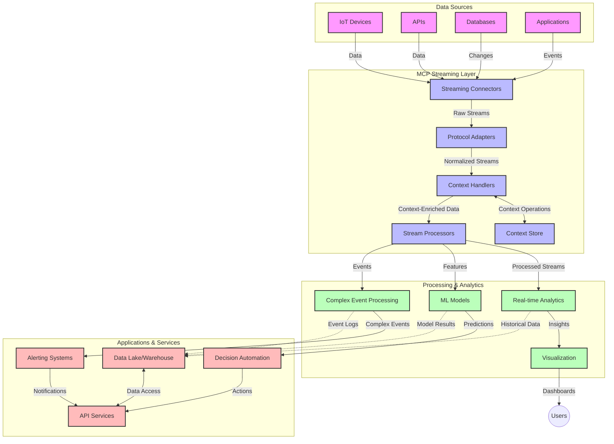

<!--
CO_OP_TRANSLATOR_METADATA:
{
  "original_hash": "68c518dbff8a3b127ed2aa934054c56c",
  "translation_date": "2025-06-11T17:30:04+00:00",
  "source_file": "05-AdvancedTopics/mcp-realtimestreaming/README.md",
  "language_code": "ro"
}
-->
# Protocolul Contextului Modelului pentru Streaming de Date în Timp Real

## Prezentare generală

Streaming-ul de date în timp real a devenit esențial în lumea actuală orientată spre date, unde afacerile și aplicațiile necesită acces imediat la informații pentru a lua decizii în timp util. Protocolul Contextului Modelului (MCP) reprezintă un pas important în optimizarea acestor procese de streaming în timp real, sporind eficiența procesării datelor, menținând integritatea contextului și îmbunătățind performanța generală a sistemului.

Acest modul explorează modul în care MCP transformă streaming-ul de date în timp real prin oferirea unei abordări standardizate pentru gestionarea contextului între modelele AI, platformele de streaming și aplicații.

## Introducere în Streaming-ul de Date în Timp Real

Streaming-ul de date în timp real este un paradigm tehnologic care permite transferul, procesarea și analiza continuă a datelor pe măsură ce sunt generate, permițând sistemelor să reacționeze imediat la informații noi. Spre deosebire de procesarea tradițională în loturi, care operează pe seturi statice de date, streaming-ul procesează datele în mișcare, oferind perspective și acțiuni cu latență minimă.

### Concepte de bază ale Streaming-ului de Date în Timp Real:

- **Flux continuu de date**: Datele sunt procesate ca un flux continuu, nesfârșit, de evenimente sau înregistrări.
- **Procesare cu latență redusă**: Sistemele sunt proiectate să minimizeze timpul dintre generarea și procesarea datelor.
- **Scalabilitate**: Arhitecturile de streaming trebuie să gestioneze volume și viteze variabile ale datelor.
- **Toleranță la erori**: Sistemele trebuie să fie rezistente la defecțiuni pentru a asigura un flux neîntrerupt de date.
- **Procesare cu stare**: Menținerea contextului între evenimente este crucială pentru o analiză semnificativă.

### Protocolul Contextului Modelului și Streaming-ul în Timp Real

Protocolul Contextului Modelului (MCP) abordează mai multe provocări critice în mediile de streaming în timp real:

1. **Continuitate contextuală**: MCP standardizează modul în care contextul este menținut între componentele distribuite de streaming, asigurând accesul modelelor AI și nodurilor de procesare la context istoric și de mediu relevant.

2. **Gestionarea eficientă a stării**: Prin oferirea de mecanisme structurate pentru transmiterea contextului, MCP reduce suprasarcina gestionării stării în conductele de streaming.

3. **Interoperabilitate**: MCP creează un limbaj comun pentru partajarea contextului între tehnologii diverse de streaming și modele AI, permițând arhitecturi mai flexibile și extensibile.

4. **Context optimizat pentru streaming**: Implementările MCP pot prioritiza elementele de context cele mai relevante pentru luarea deciziilor în timp real, optimizând atât performanța, cât și acuratețea.

5. **Procesare adaptivă**: Cu o gestionare adecvată a contextului prin MCP, sistemele de streaming pot ajusta dinamic procesarea în funcție de condițiile și tiparele în evoluție ale datelor.

În aplicații moderne, de la rețelele de senzori IoT până la platformele financiare de tranzacționare, integrarea MCP cu tehnologiile de streaming permite o procesare mai inteligentă, conștientă de context, care poate răspunde adecvat situațiilor complexe și în schimbare în timp real.

## Obiective de învățare

La finalul acestei lecții, vei putea:

- Înțelege fundamentele streaming-ului de date în timp real și provocările sale
- Explica modul în care Protocolul Contextului Modelului (MCP) îmbunătățește streaming-ul de date în timp real
- Implementa soluții de streaming bazate pe MCP folosind framework-uri populare precum Kafka și Pulsar
- Proiecta și implementa arhitecturi de streaming tolerante la erori și cu performanță ridicată folosind MCP
- Aplica conceptele MCP în cazuri de utilizare IoT, tranzacționare financiară și analize bazate pe AI
- Evalua tendințele emergente și inovațiile viitoare în tehnologiile de streaming bazate pe MCP

### Definiție și semnificație

Streaming-ul de date în timp real implică generarea, procesarea și livrarea continuă a datelor cu latență minimă. Spre deosebire de procesarea în loturi, unde datele sunt colectate și procesate în grupuri, datele de streaming sunt procesate incremental pe măsură ce sosesc, permițând obținerea imediată a perspectivelor și acțiunilor.

Caracteristici cheie ale streaming-ului de date în timp real includ:

- **Latență redusă**: Procesarea și analiza datelor în milisecunde până la secunde
- **Flux continuu**: Fluxuri neîntrerupte de date din diverse surse
- **Procesare imediată**: Analiza datelor pe măsură ce sosesc, nu în loturi
- **Arhitectură bazată pe evenimente**: Răspuns la evenimente pe măsură ce apar

### Provocări în Streaming-ul Tradițional de Date

Abordările tradiționale de streaming de date se confruntă cu mai multe limitări:

1. **Pierdere de context**: Dificultăți în menținerea contextului în sisteme distribuite
2. **Probleme de scalabilitate**: Provocări în scalarea pentru a gestiona volume mari și viteze ridicate de date
3. **Complexitate în integrare**: Probleme de interoperabilitate între sisteme diferite
4. **Gestionarea latenței**: Echilibrarea între debit și timpul de procesare
5. **Consistența datelor**: Asigurarea acurateței și completitudinii datelor pe întreg fluxul

## Înțelegerea Protocolului Contextului Modelului (MCP)

### Ce este MCP?

Protocolul Contextului Modelului (MCP) este un protocol de comunicare standardizat conceput pentru a facilita interacțiuni eficiente între modelele AI și aplicații. În contextul streaming-ului de date în timp real, MCP oferă un cadru pentru:

- Păstrarea contextului pe tot parcursul conductei de date
- Standardizarea formatelor de schimb de date
- Optimizarea transmiterii seturilor mari de date
- Îmbunătățirea comunicării model-model și model-aplicație

### Componente principale și arhitectură

Arhitectura MCP pentru streaming în timp real cuprinde mai multe componente cheie:

1. **Context Handlers**: Gestionează și mențin informațiile contextuale pe tot parcursul conductei de streaming
2. **Stream Processors**: Procesează fluxurile de date primite folosind tehnici conștiente de context
3. **Protocol Adapters**: Convertesc între diferite protocoale de streaming păstrând contextul
4. **Context Store**: Stochează și recuperează eficient informațiile contextuale
5. **Streaming Connectors**: Se conectează la diverse platforme de streaming (Kafka, Pulsar, Kinesis etc.)



### Cum îmbunătățește MCP gestionarea datelor în timp real

MCP abordează provocările tradiționale ale streaming-ului prin:

- **Integritate contextuală**: Menținerea relațiilor între punctele de date pe întreaga conductă
- **Transmitere optimizată**: Reducerea redundanței în schimbul de date prin gestionarea inteligentă a contextului
- **Interfețe standardizate**: Oferirea unor API-uri consistente pentru componentele de streaming
- **Reducerea latenței**: Minimiza suprasarcina de procesare prin gestionarea eficientă a contextului
- **Scalabilitate sporită**: Suport pentru scalare orizontală păstrând contextul

## Integrare și implementare

Sistemele de streaming de date în timp real necesită o proiectare arhitecturală atentă și implementare pentru a menține atât performanța, cât și integritatea contextuală. Protocolul Contextului Modelului oferă o abordare standardizată pentru integrarea modelelor AI și a tehnologiilor de streaming, permițând conducte de procesare mai sofisticate, conștiente de context.

### Prezentare generală a integrării MCP în arhitecturile de streaming

Implementarea MCP în mediile de streaming în timp real implică mai multe aspecte importante:

1. **Serializarea și transportul contextului**: MCP oferă mecanisme eficiente pentru codificarea informațiilor contextuale în pachetele de date de streaming, asigurând că contextul esențial însoțește datele pe tot parcursul conductei de procesare. Aceasta include formate de serializare standardizate, optimizate pentru transportul în streaming.

2. **Procesare stateful a fluxurilor**: MCP permite o procesare stateful mai inteligentă prin menținerea unei reprezentări consistente a contextului între nodurile de procesare. Acest lucru este deosebit de valoros în arhitecturile distribuite de streaming, unde gestionarea stării este în mod tradițional o provocare.

3. **Timpul evenimentului vs. timpul procesării**: Implementările MCP în sistemele de streaming trebuie să abordeze provocarea comună de a diferenția momentul în care evenimentele au avut loc și momentul în care sunt procesate. Protocolul poate încorpora context temporal care păstrează semantica timpului evenimentului.

4. **Gestionarea backpressure-ului**: Prin standardizarea gestionării contextului, MCP ajută la gestionarea backpressure-ului în sistemele de streaming, permițând componentelor să comunice capacitățile lor de procesare și să ajusteze fluxul în consecință.

5. **Ferestre și agregare de context**: MCP facilitează operațiuni mai sofisticate de windowing prin oferirea unor reprezentări structurate ale contextelor temporale și relaționale, permițând agregări mai semnificative pe fluxurile de evenimente.

6. **Procesare exactly-once**: În sistemele de streaming care necesită semantică exactly-once, MCP poate încorpora metadate de procesare pentru a ajuta la urmărirea și verificarea stării procesării între componente distribuite.

Implementarea MCP în diverse tehnologii de streaming creează o abordare unificată pentru gestionarea contextului, reducând necesitatea codului personalizat de integrare și sporind capacitatea sistemului de a menține un context semnificativ pe măsură ce datele circulă prin conductă.

### MCP în diferite framework-uri de streaming de date

MCP poate fi integrat cu framework-uri populare de streaming, inclusiv:

#### Integrarea Apache Kafka

```python
from mcp_streaming import MCPKafkaConnector

# Initialize MCP Kafka connector
connector = MCPKafkaConnector(
    bootstrap_servers='localhost:9092',
    context_preservation=True
)

# Create a context-aware consumer
consumer = connector.create_consumer('input-topic')

# Process streaming data with context
for message in consumer:
    context = message.get_context()
    data = message.get_value()
    
    # Process with context awareness
    result = process_with_context(data, context)
    
    # Produce output with preserved context
    connector.produce('output-topic', result, context=context)
```

#### Implementarea Apache Pulsar

```python
from mcp_streaming import MCPPulsarClient

# Initialize MCP Pulsar client
client = MCPPulsarClient('pulsar://localhost:6650')

# Subscribe with context awareness
consumer = client.subscribe('input-topic', 'subscription-name', 
                           context_enabled=True)

# Process messages with context preservation
while True:
    message = consumer.receive()
    context = message.get_context()
    
    # Process with context
    result = process_with_context(message.data(), context)
    
    # Acknowledge the message
    consumer.acknowledge(message)
    
    # Send result with preserved context
    producer = client.create_producer('output-topic')
    producer.send(result, context=context)
```

### Cele mai bune practici pentru implementare

Când implementezi MCP pentru streaming în timp real:

1. **Proiectează pentru toleranță la erori**:
   - Implementează gestionarea corectă a erorilor
   - Folosește cozi dead-letter pentru mesajele eșuate
   - Proiectează procesoare idempotente

2. **Optimizează pentru performanță**:
   - Configurează dimensiuni adecvate ale bufferelor
   - Folosește batch-uri acolo unde este potrivit
   - Implementează mecanisme de backpressure

3. **Monitorizează și observă**:
   - Urmărește metricile procesării fluxului
   - Monitorizează propagarea contextului
   - Configurează alerte pentru anomalii

4. **Asigură-ți fluxurile**:
   - Implementează criptare pentru date sensibile
   - Folosește autentificare și autorizare
   - Aplică controale adecvate de acces

### MCP în IoT și Edge Computing

MCP îmbunătățește streaming-ul IoT prin:

- Păstrarea contextului dispozitivelor pe tot parcursul conductei de procesare
- Permițând streaming eficient de la edge la cloud
- Susținerea analizelor în timp real pe fluxurile de date IoT
- Facilitarea comunicării device-to-device cu context

Exemplu: Rețele de senzori pentru orașe inteligente  
```
Sensors → Edge Gateways → MCP Stream Processors → Real-time Analytics → Automated Responses
```

### Rolul în tranzacțiile financiare și tranzacționarea de înaltă frecvență

MCP oferă avantaje semnificative pentru streaming-ul de date financiare:

- Procesare cu latență ultra-scăzută pentru decizii de tranzacționare
- Menținerea contextului tranzacțiilor pe tot parcursul procesării
- Susținerea procesării complexe a evenimentelor cu conștientizare contextuală
- Asigurarea consistenței datelor în sistemele distribuite de tranzacționare

### Îmbunătățirea analizelor de date bazate pe AI

MCP creează noi posibilități pentru analizele de streaming:

- Antrenare și inferență de modele în timp real
- Învățare continuă din datele de streaming
- Extracție de caracteristici conștientă de context
- Conducte de inferență multi-model cu context păstrat

## Tendințe și inovații viitoare

### Evoluția MCP în mediile în timp real

Privind spre viitor, anticipăm că MCP va evolua pentru a aborda:

- **Integrarea calculului cuantic**: Pregătirea pentru sisteme de streaming bazate pe quantum
- **Procesare edge-native**: Mutarea unei părți mai mari a procesării conștiente de context către dispozitive edge
- **Gestionarea autonomă a fluxului**: Conducte de streaming auto-optimizante
- **Streaming federat**: Procesare distribuită păstrând confidențialitatea

### Posibile avansuri tehnologice

Tehnologii emergente care vor modela viitorul streaming-ului MCP:

1. **Protocoale de streaming optimizate pentru AI**: Protocoale personalizate special pentru sarcinile AI
2. **Integrarea calculului neuromorfic**: Calcul inspirat de creier pentru procesarea fluxurilor
3. **Streaming serverless**: Streaming scalabil, bazat pe evenimente, fără gestionarea infrastructurii
4. **Magazine de context distribuite**: Gestionarea contextului distribuită global, dar extrem de consistentă

## Exerciții practice

### Exercițiul 1: Configurarea unei conducte MCP de streaming de bază

În acest exercițiu vei învăța cum să:  
- Configurezi un mediu de streaming MCP de bază  
- Implementezi handleri de context pentru procesarea fluxului  
- Testezi și validezi păstrarea contextului

### Exercițiul 2: Construirea unui dashboard de analiză în timp real

Creează o aplicație completă care:  
- Preia date de streaming folosind MCP  
- Procesează fluxul menținând contextul  
- Vizualizează rezultatele în timp real

### Exercițiul 3: Implementarea procesării complexe a evenimentelor cu MCP

Exercițiu avansat care acoperă:  
- Detectarea de pattern-uri în fluxuri  
- Corelarea contextuală între multiple fluxuri  
- Generarea de evenimente complexe cu context păstrat

## Resurse suplimentare

- [Model Context Protocol Specification](https://github.com/microsoft/model-context-protocol) - Specificația oficială MCP și documentație  
- [Apache Kafka Documentation](https://kafka.apache.org/documentation/) - Învață despre Kafka pentru procesarea fluxurilor  
- [Apache Pulsar](https://pulsar.apache.org/) - Platformă unificată de mesagerie și streaming  
- [Streaming Systems: The What, Where, When, and How of Large-Scale Data Processing](https://www.oreilly.com/library/view/streaming-systems/9781491983867/) - Carte cuprinzătoare despre arhitecturi de streaming  
- [Microsoft Azure Event Hubs](https://learn.microsoft.com/en-us/azure/event-hubs/event-hubs-about) - Serviciu gestionat de streaming de evenimente  
- [MLflow Documentation](https://mlflow.org/docs/latest/index.html) - Pentru urmărirea și implementarea modelelor ML  
- [Real-Time Analytics with Apache Storm](https://storm.apache.org/releases/current/index.html) - Framework de procesare pentru calcul în timp real  
- [Flink ML](https://nightlies.apache.org/flink/flink-ml-docs-master/) - Bibliotecă de machine learning pentru Apache Flink  
- [LangChain Documentation](https://python.langchain.com/docs/get_started/introduction) - Construirea de aplicații cu LLM-uri

## Rezultate ale învățării

Parcurgând acest modul, vei putea:

- Înțelege fundamentele streaming-ului de date în timp real și provocările sale  
- Explica cum Protocolul Contextului Modelului (MCP) îmbunătățește streaming-ul de date în timp real  
- Implementa soluții de streaming bazate pe MCP folosind framework-uri populare precum Kafka și Pulsar  
- Proiecta și implementa arhitecturi de streaming tolerante la erori și performante folosind MCP  
- Aplica conceptele MCP în IoT, tranzacționare financiară și analize bazate pe AI  
- Evalua tendințele emergente și inovațiile viitoare în tehnologiile de streaming bazate pe MCP

## Ce urmează

- [6. Community Contributions](../../06-CommunityContributions/README.md)

**Declinare a responsabilității**:  
Acest document a fost tradus folosind serviciul de traducere AI [Co-op Translator](https://github.com/Azure/co-op-translator). Deși ne străduim pentru acuratețe, vă rugăm să rețineți că traducerile automate pot conține erori sau inexactități. Documentul original în limba sa nativă trebuie considerat sursa autorizată. Pentru informații critice, se recomandă traducerea profesională realizată de un specialist uman. Nu ne asumăm responsabilitatea pentru eventualele neînțelegeri sau interpretări greșite rezultate din utilizarea acestei traduceri.