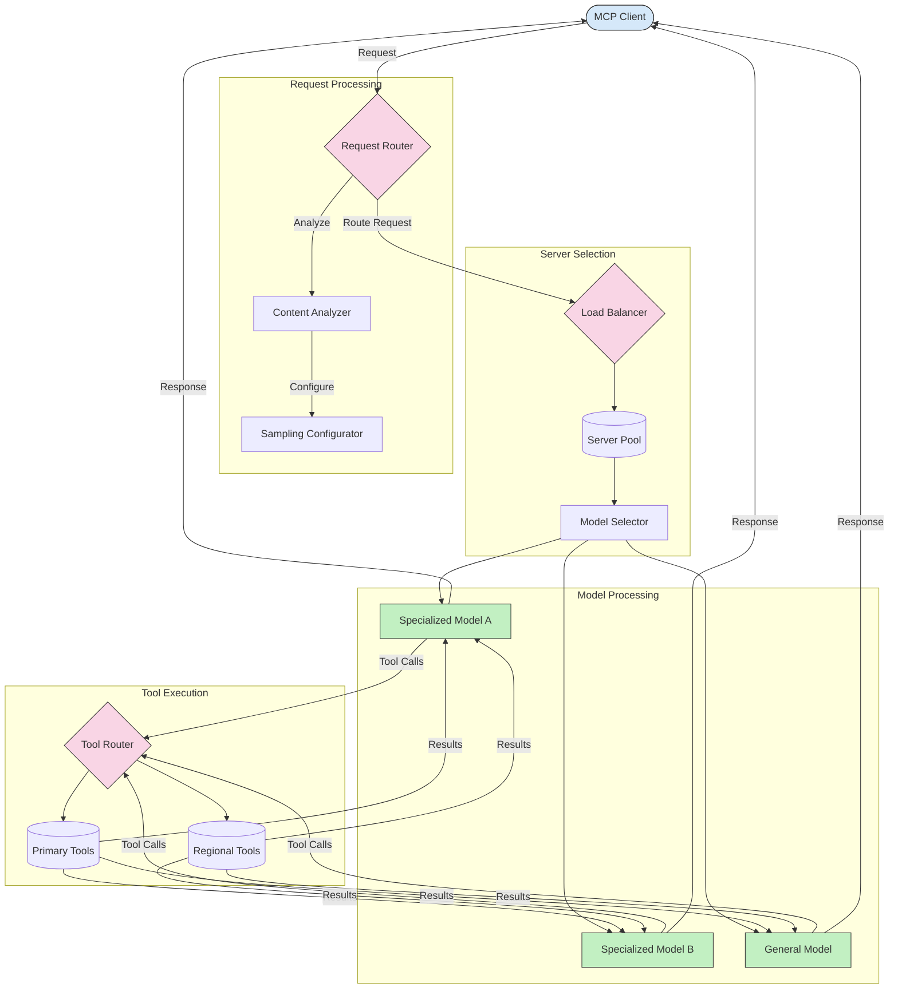

<!--
CO_OP_TRANSLATOR_METADATA:
{
  "original_hash": "a621fc52c7daec552eb8b3b48c0361dd",
  "translation_date": "2025-06-02T19:49:25+00:00",
  "source_file": "05-AdvancedTopics/mcp-routing/README.md",
  "language_code": "ro"
}
-->
## Arhitectura de Eșantionare și Rutare în MCP

Eșantionarea este o componentă esențială a Model Context Protocol (MCP) care permite procesarea și rutarea eficientă a cererilor. Aceasta implică analizarea cererilor primite pentru a determina modelul sau serviciul cel mai potrivit pentru a le gestiona, pe baza unor criterii variate, cum ar fi tipul de conținut, contextul utilizatorului și încărcarea sistemului.

Eșantionarea și rutarea pot fi combinate pentru a crea o arhitectură robustă care optimizează utilizarea resurselor și asigură disponibilitate ridicată. Procesul de eșantionare poate fi folosit pentru clasificarea cererilor, în timp ce rutarea le direcționează către modelele sau serviciile potrivite.

Diagrama de mai jos ilustrează modul în care eșantionarea și rutarea funcționează împreună într-o arhitectură MCP cuprinzătoare:

## Ce urmează

- [Sampling](../mcp-sampling/README.md)

**Declinare a responsabilității**:  
Acest document a fost tradus folosind serviciul de traducere AI [Co-op Translator](https://github.com/Azure/co-op-translator). Deși ne străduim pentru acuratețe, vă rugăm să rețineți că traducerile automate pot conține erori sau inexactități. Documentul original în limba sa nativă trebuie considerat sursa autoritară. Pentru informații critice, se recomandă traducerea profesională realizată de un specialist uman. Nu ne asumăm responsabilitatea pentru eventualele neînțelegeri sau interpretări greșite rezultate din utilizarea acestei traduceri.