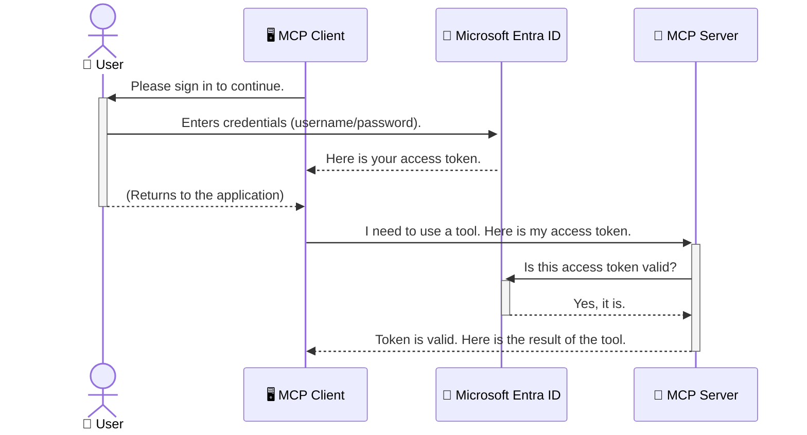

<!--
CO_OP_TRANSLATOR_METADATA:
{
  "original_hash": "9abe1d303ab126f9a8b87f03cebe5213",
  "translation_date": "2025-06-26T14:58:43+00:00",
  "source_file": "05-AdvancedTopics/mcp-security-entra/README.md",
  "language_code": "ro"
}
-->
# Asigurarea fluxurilor de lucru AI: Autentificarea Entra ID pentru serverele Model Context Protocol

## Introducere  
Securizarea serverului tău Model Context Protocol (MCP) este la fel de importantă ca încuietorarea ușii de la intrarea în casă. Lăsarea serverului MCP deschis expune uneltele și datele tale accesului neautorizat, ceea ce poate duce la breșe de securitate. Microsoft Entra ID oferă o soluție robustă de gestionare a identității și accesului în cloud, ajutând să te asiguri că doar utilizatorii și aplicațiile autorizate pot interacționa cu serverul tău MCP. În această secțiune vei învăța cum să protejezi fluxurile tale AI folosind autentificarea Entra ID.

## Obiective de învățare  
La finalul acestei secțiuni vei putea:

- Înțelege importanța securizării serverelor MCP.  
- Explica elementele de bază ale Microsoft Entra ID și autentificarea OAuth 2.0.  
- Recunoaște diferența dintre clienți publici și confidențiali.  
- Implementa autentificarea Entra ID atât în scenarii locale (client public), cât și în scenarii cu server MCP la distanță (client confidențial).  
- Aplica cele mai bune practici de securitate în dezvoltarea fluxurilor AI.

# Asigurarea fluxurilor de lucru AI: Autentificarea Entra ID pentru serverele Model Context Protocol

La fel cum nu ai lăsa ușa de la intrarea în casă descuiată, nu ar trebui să lași serverul MCP deschis oricui. Securizarea fluxurilor tale AI este esențială pentru construirea unor aplicații robuste, de încredere și sigure. Acest capitol îți va prezenta cum să folosești Microsoft Entra ID pentru a proteja serverele MCP, asigurând că doar utilizatorii și aplicațiile autorizate pot accesa uneltele și datele tale.

## De ce este importantă securitatea pentru serverele MCP

Imaginează-ți că serverul tău MCP are o unealtă care poate trimite emailuri sau accesa o bază de date a clienților. Un server nesecurizat ar însemna că oricine ar putea folosi acea unealtă, ceea ce poate duce la acces neautorizat la date, spam sau alte activități malițioase.

Prin implementarea autentificării, te asiguri că fiecare cerere către server este verificată, confirmând identitatea utilizatorului sau aplicației care face cererea. Acesta este primul și cel mai important pas în securizarea fluxurilor tale AI.

## Introducere în Microsoft Entra ID

**Microsoft Entra ID** este un serviciu cloud de gestionare a identității și accesului. Gândește-te la el ca la un agent de securitate universal pentru aplicațiile tale. Se ocupă de procesul complex de verificare a identității utilizatorilor (autentificare) și de stabilire a ceea ce au voie să facă (autorizare).

Folosind Entra ID, poți:

- Permite autentificare sigură pentru utilizatori.  
- Proteja API-urile și serviciile.  
- Gestiona politicile de acces dintr-un singur loc.

Pentru serverele MCP, Entra ID oferă o soluție robustă și larg recunoscută pentru a controla cine poate accesa funcționalitățile serverului tău.

---

## Înțelegerea mecanismului: Cum funcționează autentificarea Entra ID

Entra ID folosește standarde deschise precum **OAuth 2.0** pentru gestionarea autentificării. Deși detaliile pot fi complexe, conceptul de bază este simplu și poate fi înțeles printr-o analogie.

### O introducere simplă în OAuth 2.0: Cheia valetului

Gândește-te la OAuth 2.0 ca la un serviciu de valet pentru mașina ta. Când ajungi la un restaurant, nu îi dai valetului cheia principală. În schimb, îi oferi o **cheie valet** care are permisiuni limitate – poate porni mașina și încuia ușile, dar nu poate deschide portbagajul sau torpedoul.

În această analogie:

- **Tu** ești **Utilizatorul**.  
- **Mașina ta** este **Serverul MCP** cu uneltele și datele sale valoroase.  
- **Valetul** este **Microsoft Entra ID**.  
- **Personalul de parcare** este **Clientul MCP** (aplicația care încearcă să acceseze serverul).  
- **Cheia valet** este **Tokenul de acces**.

Tokenul de acces este un șir securizat de text pe care clientul MCP îl primește de la Entra ID după ce te autentifici. Clientul prezintă acest token serverului MCP la fiecare cerere. Serverul poate verifica tokenul pentru a confirma că cererea este legitimă și că clientul are permisiunile necesare, toate acestea fără să gestioneze direct datele tale de autentificare (cum ar fi parola).

### Fluxul de autentificare

Iată cum funcționează procesul în practică:



### Prezentarea Microsoft Authentication Library (MSAL)

Înainte să trecem la cod, este important să introducem un component cheie pe care îl vei vedea în exemple: **Microsoft Authentication Library (MSAL)**.

MSAL este o bibliotecă dezvoltată de Microsoft care face mult mai ușor pentru dezvoltatori să gestioneze autentificarea. În loc să scrii tot codul complex pentru gestionarea tokenurilor de securitate, semnarea utilizatorilor și reîmprospătarea sesiunilor, MSAL se ocupă de tot acest efort.

Utilizarea unei biblioteci precum MSAL este recomandată pentru că:

- **Este sigură:** implementează protocoale standard din industrie și cele mai bune practici de securitate, reducând riscul vulnerabilităților în codul tău.  
- **Simplifică dezvoltarea:** ascunde complexitatea protocoalelor OAuth 2.0 și OpenID Connect, permițându-ți să adaugi autentificare robustă în aplicație cu doar câteva linii de cod.  
- **Este întreținută:** Microsoft menține și actualizează activ MSAL pentru a răspunde noilor amenințări de securitate și schimbări de platformă.

MSAL suportă o gamă largă de limbaje și framework-uri, inclusiv .NET, JavaScript/TypeScript, Python, Java, Go și platforme mobile precum iOS și Android. Astfel, poți folosi aceleași modele consistente de autentificare pe întregul tău stack tehnologic.

Pentru mai multe detalii despre MSAL, poți consulta documentația oficială [MSAL overview documentation](https://learn.microsoft.com/entra/identity-platform/msal-overview).

---

## Securizarea serverului MCP cu Entra ID: un ghid pas cu pas

Acum să parcurgem cum să securizezi un server MCP local (care comunică prin `stdio`) using Entra ID. This example uses a **public client**, which is suitable for applications running on a user's machine, like a desktop app or a local development server.

### Scenario 1: Securing a Local MCP Server (with a Public Client)

In this scenario, we'll look at an MCP server that runs locally, communicates over `stdio`, and uses Entra ID to authenticate the user before allowing access to its tools. The server will have a single tool that fetches the user's profile information from the Microsoft Graph API.

#### 1. Setting Up the Application in Entra ID

Before writing any code, you need to register your application in Microsoft Entra ID. This tells Entra ID about your application and grants it permission to use the authentication service.

1. Navigate to the **[Microsoft Entra portal](https://entra.microsoft.com/)**.
2. Go to **App registrations** and click **New registration**.
3. Give your application a name (e.g., "My Local MCP Server").
4. For **Supported account types**, select **Accounts in this organizational directory only**.
5. You can leave the **Redirect URI** blank for this example.
6. Click **Register**.

Once registered, take note of the **Application (client) ID** and **Directory (tenant) ID**. You'll need these in your code.

#### 2. The Code: A Breakdown

Let's look at the key parts of the code that handle authentication. The full code for this example is available in the [Entra ID - Local - WAM](https://github.com/Azure-Samples/mcp-auth-servers/tree/main/src/entra-id-local-wam) folder of the [mcp-auth-servers GitHub repository](https://github.com/Azure-Samples/mcp-auth-servers).

**`AuthenticationService.cs`**

This class is responsible for handling the interaction with Entra ID.

- **`CreateAsync`**: This method initializes the `PublicClientApplication` from the MSAL (Microsoft Authentication Library). It's configured with your application's `clientId` and `tenantId`.
- **`WithBroker`**: This enables the use of a broker (like the Windows Web Account Manager), which provides a more secure and seamless single sign-on experience.
- **`AcquireTokenAsync`**: aceasta este metoda principală. Mai întâi încearcă să obțină un token silențios (adică utilizatorul nu trebuie să se autentifice din nou dacă are deja o sesiune validă). Dacă nu poate obține un token silențios, va solicita utilizatorului să se autentifice interactiv.

```csharp
// Simplified for clarity
public static async Task<AuthenticationService> CreateAsync(ILogger<AuthenticationService> logger)
{
    var msalClient = PublicClientApplicationBuilder
        .Create(_clientId) // Your Application (client) ID
        .WithAuthority(AadAuthorityAudience.AzureAdMyOrg)
        .WithTenantId(_tenantId) // Your Directory (tenant) ID
        .WithBroker(new BrokerOptions(BrokerOptions.OperatingSystems.Windows))
        .Build();

    // ... cache registration ...

    return new AuthenticationService(logger, msalClient);
}

public async Task<string> AcquireTokenAsync()
{
    try
    {
        // Try silent authentication first
        var accounts = await _msalClient.GetAccountsAsync();
        var account = accounts.FirstOrDefault();

        AuthenticationResult? result = null;

        if (account != null)
        {
            result = await _msalClient.AcquireTokenSilent(_scopes, account).ExecuteAsync();
        }
        else
        {
            // If no account, or silent fails, go interactive
            result = await _msalClient.AcquireTokenInteractive(_scopes).ExecuteAsync();
        }

        return result.AccessToken;
    }
    catch (Exception ex)
    {
        _logger.LogError(ex, "An error occurred while acquiring the token.");
        throw; // Optionally rethrow the exception for higher-level handling
    }
}
```

**`Program.cs`**

This is where the MCP server is set up and the authentication service is integrated.

- **`AddSingleton<AuthenticationService>`**: This registers the `AuthenticationService` with the dependency injection container, so it can be used by other parts of the application (like our tool).
- **`GetUserDetailsFromGraph` tool**: This tool requires an instance of `AuthenticationService`. Before it does anything, it calls `authService.AcquireTokenAsync()` folosește pentru a obține un token de acces valid. Dacă autentificarea reușește, folosește tokenul pentru a apela Microsoft Graph API și a prelua detaliile utilizatorului.

```csharp
// Simplified for clarity
[McpServerTool(Name = "GetUserDetailsFromGraph")]
public static async Task<string> GetUserDetailsFromGraph(
    AuthenticationService authService)
{
    try
    {
        // This will trigger the authentication flow
        var accessToken = await authService.AcquireTokenAsync();

        // Use the token to create a GraphServiceClient
        var graphClient = new GraphServiceClient(
            new BaseBearerTokenAuthenticationProvider(new TokenProvider(authService)));

        var user = await graphClient.Me.GetAsync();

        return System.Text.Json.JsonSerializer.Serialize(user);
    }
    catch (Exception ex)
    {
        return $"Error: {ex.Message}";
    }
}
```

#### 3. Cum funcționează totul împreună

1. Când clientul MCP încearcă să folosească `GetUserDetailsFromGraph` tool, the tool first calls `AcquireTokenAsync`.
2. `AcquireTokenAsync` triggers the MSAL library to check for a valid token.
3. If no token is found, MSAL, through the broker, will prompt the user to sign in with their Entra ID account.
4. Once the user signs in, Entra ID issues an access token.
5. The tool receives the token and uses it to make a secure call to the Microsoft Graph API.
6. The user's details are returned to the MCP client.

This process ensures that only authenticated users can use the tool, effectively securing your local MCP server.

### Scenario 2: Securing a Remote MCP Server (with a Confidential Client)

When your MCP server is running on a remote machine (like a cloud server) and communicates over a protocol like HTTP Streaming, the security requirements are different. In this case, you should use a **confidential client** and the **Authorization Code Flow**. This is a more secure method because the application's secrets are never exposed to the browser.

This example uses a TypeScript-based MCP server that uses Express.js to handle HTTP requests.

#### 1. Setting Up the Application in Entra ID

The setup in Entra ID is similar to the public client, but with one key difference: you need to create a **client secret**.

1. Navigate to the **[Microsoft Entra portal](https://entra.microsoft.com/)**.
2. In your app registration, go to the **Certificates & secrets** tab.
3. Click **New client secret**, give it a description, and click **Add**.
4. **Important:** Copy the secret value immediately. You will not be able to see it again.
5. You also need to configure a **Redirect URI**. Go to the **Authentication** tab, click **Add a platform**, select **Web**, and enter the redirect URI for your application (e.g., `http://localhost:3001/auth/callback`).

> **⚠️ Important Security Note:** For production applications, Microsoft strongly recommends using **secretless authentication** methods such as **Managed Identity** or **Workload Identity Federation** instead of client secrets. Client secrets pose security risks as they can be exposed or compromised. Managed identities provide a more secure approach by eliminating the need to store credentials in your code or configuration.
>
> For more information about managed identities and how to implement them, see the [Managed identities for Azure resources overview](https://learn.microsoft.com/entra/identity/managed-identities-azure-resources/overview).

#### 2. The Code: A Breakdown

This example uses a session-based approach. When the user authenticates, the server stores the access token and refresh token in a session and gives the user a session token. This session token is then used for subsequent requests. The full code for this example is available in the [Entra ID - Confidential client](https://github.com/Azure-Samples/mcp-auth-servers/tree/main/src/entra-id-cca-session) folder of the [mcp-auth-servers GitHub repository](https://github.com/Azure-Samples/mcp-auth-servers).

**`Server.ts`**

This file sets up the Express server and the MCP transport layer.

- **`requireBearerAuth`**: This is middleware that protects the `/sse` and `/message` endpoints. It checks for a valid bearer token in the `Authorization` header of the request.
- **`EntraIdServerAuthProvider`**: This is a custom class that implements the `McpServerAuthorizationProvider` interface. It's responsible for handling the OAuth 2.0 flow.
- **`/auth/callback`**: acest endpoint gestionează redirecționarea de la Entra ID după ce utilizatorul s-a autentificat. Schimbă codul de autorizare cu un token de acces și un token de reîmprospătare.

```typescript
// Simplified for clarity
const app = express();
const { server } = createServer();
const provider = new EntraIdServerAuthProvider();

// Protect the SSE endpoint
app.get("/sse", requireBearerAuth({
  provider,
  requiredScopes: ["User.Read"]
}), async (req, res) => {
  // ... connect to the transport ...
});

// Protect the message endpoint
app.post("/message", requireBearerAuth({
  provider,
  requiredScopes: ["User.Read"]
}), async (req, res) => {
  // ... handle the message ...
});

// Handle the OAuth 2.0 callback
app.get("/auth/callback", (req, res) => {
  provider.handleCallback(req.query.code, req.query.state)
    .then(result => {
      // ... handle success or failure ...
    });
});
```

**`Tools.ts`**

This file defines the tools that the MCP server provides. The `getUserDetails` este similar cu cel din exemplul anterior, dar obține tokenul de acces din sesiune.

```typescript
// Simplified for clarity
server.setRequestHandler(CallToolRequestSchema, async (request) => {
  const { name } = request.params;
  const context = request.params?.context as { token?: string } | undefined;
  const sessionToken = context?.token;

  if (name === ToolName.GET_USER_DETAILS) {
    if (!sessionToken) {
      throw new AuthenticationError("Authentication token is missing or invalid. Ensure the token is provided in the request context.");
    }

    // Get the Entra ID token from the session store
    const tokenData = tokenStore.getToken(sessionToken);
    const entraIdToken = tokenData.accessToken;

    const graphClient = Client.init({
      authProvider: (done) => {
        done(null, entraIdToken);
      }
    });

    const user = await graphClient.api('/me').get();

    // ... return user details ...
  }
});
```

**`auth/EntraIdServerAuthProvider.ts`**

This class handles the logic for:

- Redirecting the user to the Entra ID sign-in page.
- Exchanging the authorization code for an access token.
- Storing the tokens in the `tokenStore`.
- Refreshing the access token when it expires.

#### 3. How It All Works Together

1. When a user first tries to connect to the MCP server, the `requireBearerAuth` middleware will see that they don't have a valid session and will redirect them to the Entra ID sign-in page.
2. The user signs in with their Entra ID account.
3. Entra ID redirects the user back to the `/auth/callback` endpoint with an authorization code.
4. The server exchanges the code for an access token and a refresh token, stores them, and creates a session token which is sent to the client.
5. The client can now use this session token in the `Authorization` header for all future requests to the MCP server.
6. When the `getUserDetails` când este apelată, folosește tokenul din sesiune pentru a găsi tokenul de acces Entra ID și apoi îl folosește pentru a apela Microsoft Graph API.

Acest flux este mai complex decât cel pentru clientul public, dar este necesar pentru endpoint-urile expuse pe internet. Deoarece serverele MCP la distanță sunt accesibile prin internetul public, ele necesită măsuri de securitate mai puternice pentru a preveni accesul neautorizat și atacurile potențiale.

## Cele mai bune practici de securitate

- **Folosește întotdeauna HTTPS**: criptează comunicația între client și server pentru a proteja tokenurile de interceptare.  
- **Implementarea controlului accesului bazat pe roluri (RBAC)**: nu verifica doar *dacă* un utilizator este autentificat, ci și *ce* are voie să facă. Poți defini roluri în Entra ID și să le verifici în serverul MCP.  
- **Monitorizează și auditează**: înregistrează toate evenimentele de autentificare pentru a detecta și reacționa la activități suspecte.  
- **Gestionează limitarea ratei și throttling-ul**: Microsoft Graph și alte API-uri implementează limitarea cererilor pentru a preveni abuzul. Implementează în serverul MCP logica de retry cu backoff exponențial pentru a gestiona elegant răspunsurile HTTP 429 (Prea multe cereri). Ia în considerare cache-ul pentru datele accesate frecvent pentru a reduce apelurile API.  
- **Stocarea securizată a tokenurilor**: stochează tokenurile de acces și cele de reîmprospătare în mod securizat. Pentru aplicații locale, folosește mecanismele de stocare securizată ale sistemului. Pentru aplicații server, ia în calcul folosirea stocării criptate sau servicii de gestionare a cheilor securizate precum Azure Key Vault.  
- **Gestionarea expirării tokenurilor**: tokenurile de acces au o durată limitată de valabilitate. Implementează reîmprospătarea automată a tokenurilor folosind tokenurile de reîmprospătare pentru a menține o experiență fluidă fără a cere reautentificare.  
- **Ia în considerare utilizarea Azure API Management**: deși implementarea securității direct în serverul MCP îți oferă control detaliat, gateway-urile API precum Azure API Management pot gestiona automat multe dintre aceste aspecte de securitate, inclusiv autentificarea, autorizarea, limitarea ratei și monitorizarea. Acestea oferă un strat centralizat de securitate între clienți și serverele MCP. Pentru mai multe detalii despre folosirea gateway-urilor API cu MCP, vezi [Azure API Management Your Auth Gateway For MCP Servers](https://techcommunity.microsoft.com/blog/integrationsonazureblog/azure-api-management-your-auth-gateway-for-mcp-servers/4402690).

## Puncte cheie

- Securizarea serverului MCP este esențială pentru protejarea datelor și uneltelor tale.  
- Microsoft Entra ID oferă o soluție robustă și scalabilă pentru autentificare și autorizare.  
- Folosește un **client public** pentru aplicații locale și un **client confidențial** pentru servere la distanță.  
- **Authorization Code Flow** este cea mai sigură opțiune pentru aplicațiile web.

## Exercițiu

1. Gândește-te la un server MCP pe care ai putea să-l construiești. Ar fi un server local sau unul la distanță?  
2. În funcție de răspuns, ai folosi un client public sau confidențial?  
3. Ce permisiuni ar solicita serverul tău MCP pentru a efectua acțiuni asupra Microsoft Graph?

## Exerciții practice

### Exercițiul 1: Înregistrează o aplicație în Entra ID  
Accesează portalul Microsoft Entra.  
Înregistrează o aplicație nouă pentru serverul tău MCP.  
Notează Application (client) ID și Directory (tenant) ID.

### Exercițiul 2: Securizează un server MCP local (Client Public)  
Urmează exemplul de cod pentru a integra MSAL (Microsoft Authentication Library) pentru autentificarea utilizatorului.  
Testează fluxul de autentificare apelând unealta MCP care preia detalii despre utilizator din Microsoft Graph.

### Exercițiul 3: Securizează un server MCP la distanță (Client Confidențial)  
Înregistrează un client confidențial în Entra ID și creează un secret de client.  
Configurează serverul Express.js MCP să folosească Authorization Code Flow.  
Testează endpoint-urile protejate și confirmă accesul pe bază de token.

### Exercițiul 4: Aplică cele mai bune practici de securitate  
Activează HTTPS pentru serverul tău local sau la distanță.  
Implementează controlul accesului bazat pe roluri (RBAC) în logica serverului.  
Adaugă gestionarea expirării tokenurilor și stocarea securizată a acestora.

## Resurse

1. **Documentație MSAL Overview**  
   Află cum Microsoft Authentication Library (MSAL) facilitează obținerea securizată a tokenurilor pe diferite platforme:  
   [MSAL Overview on Microsoft Learn](https://learn.microsoft.com/en-gb/entra/msal/overview)

2. **Depozitul GitHub Azure-Samples/mcp-auth-servers**  
   Implementări de referință ale serverelor MCP care demonstrează fluxurile de autentificare:  
   [Azure-Samples/mcp-auth-servers on GitHub](https://github.com/Azure-Samples/mcp-auth-servers)

3. **Prezentare Managed Identities for Azure Resources**  
   Înțelege cum să elimini secretele folosind identități gestionate atribuite sistemului sau utilizatorului:  
   [Managed Identities Overview on Microsoft Learn](https://learn.microsoft.com/en-us/entra/identity/managed-identities-azure-resources/)

4. **Azure API Management: Your Auth Gateway for MCP Servers**  
   O analiză detaliată despre utilizarea APIM ca gateway OAuth2 securizat pentru serverele MCP:  
   [Azure API Management Your Auth Gateway For MCP Servers](https://techcommunity.microsoft.com/blog/integrationsonazureblog/azure-api-management-your-auth-gateway-for-mcp-servers/4402690)

5. **Referință permisiuni Microsoft Graph**  
   Listă completă de permisiuni delegate și pentru aplicații pentru Microsoft Graph:  
   [Microsoft Graph Permissions Reference](https://learn.microsoft.com/zh-tw/graph/permissions-reference)

## Rezultate ale învățării  
După ce parcurgi această secțiune, vei putea:

- Explica de ce autentificarea este critică pentru serverele MCP și fluxurile AI.  
- Configura și seta autentificarea Entra ID pentru scenarii locale și la distanță.  
- Alege tipul corect de client (public sau confidențial) în funcție de implementarea serverului.  
- Implementa practici de codare securizată, inclusiv stocarea tokenurilor și autorizarea bazată pe roluri.  
- Proteja cu încredere serverul MCP și uneltele sale împotriva accesului neautorizat.

## Ce urmează

- [6. Contribuții din comunitate](../../06-CommunityContributions/README.md)

**Declinare de responsabilitate**:  
Acest document a fost tradus folosind serviciul de traducere AI [Co-op Translator](https://github.com/Azure/co-op-translator). Deși ne străduim pentru acuratețe, vă rugăm să rețineți că traducerile automate pot conține erori sau inexactități. Documentul original în limba sa nativă trebuie considerat sursa autoritară. Pentru informații critice, se recomandă traducerea profesională realizată de un specialist uman. Nu ne asumăm răspunderea pentru eventualele neînțelegeri sau interpretări greșite care pot apărea în urma utilizării acestei traduceri.