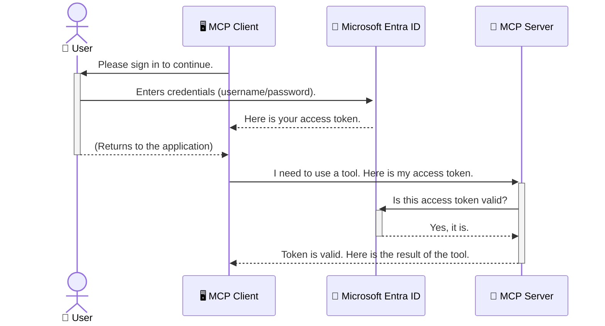

<!--
CO_OP_TRANSLATOR_METADATA:
{
  "original_hash": "6e562d7e5a77c8982da4aa8f762ad1d8",
  "translation_date": "2025-07-14T03:16:00+00:00",
  "source_file": "05-AdvancedTopics/mcp-security-entra/README.md",
  "language_code": "ro"
}
-->
# Asigurarea fluxurilor de lucru AI: Autentificarea Entra ID pentru serverele Model Context Protocol

## Introducere  
Securizarea serverului Model Context Protocol (MCP) este la fel de importantă ca încuietorile ușii de la intrare a casei tale. Lăsarea serverului MCP deschis expune uneltele și datele tale accesului neautorizat, ceea ce poate duce la breșe de securitate. Microsoft Entra ID oferă o soluție robustă de gestionare a identității și accesului în cloud, ajutând să te asiguri că doar utilizatorii și aplicațiile autorizate pot interacționa cu serverul tău MCP. În această secțiune, vei învăța cum să-ți protejezi fluxurile de lucru AI folosind autentificarea Entra ID.

## Obiective de învățare  
La finalul acestei secțiuni, vei putea:

- Să înțelegi importanța securizării serverelor MCP.  
- Să explici elementele de bază ale Microsoft Entra ID și autentificarea OAuth 2.0.  
- Să recunoști diferența dintre clienți publici și confidențiali.  
- Să implementezi autentificarea Entra ID atât în scenarii locale (client public), cât și la distanță (client confidențial) pentru serverele MCP.  
- Să aplici cele mai bune practici de securitate în dezvoltarea fluxurilor de lucru AI.

## Securitate și MCP  

La fel cum nu ai lăsa ușa de la intrare a casei descuiată, nu ar trebui să lași serverul MCP deschis pentru oricine. Securizarea fluxurilor tale de lucru AI este esențială pentru a construi aplicații robuste, de încredere și sigure. Acest capitol îți va prezenta cum să folosești Microsoft Entra ID pentru a securiza serverele MCP, asigurându-te că doar utilizatorii și aplicațiile autorizate pot interacționa cu uneltele și datele tale.

## De ce contează securitatea pentru serverele MCP  

Imaginează-ți că serverul tău MCP are o unealtă care poate trimite emailuri sau accesa o bază de date cu clienți. Un server nesecurizat ar însemna că oricine ar putea folosi acea unealtă, ceea ce poate duce la acces neautorizat la date, spam sau alte activități malițioase.

Prin implementarea autentificării, te asiguri că fiecare cerere către server este verificată, confirmând identitatea utilizatorului sau aplicației care face cererea. Acesta este primul și cel mai important pas în securizarea fluxurilor tale de lucru AI.

## Introducere în Microsoft Entra ID  

[**Microsoft Entra ID**](https://adoption.microsoft.com/microsoft-security/entra/) este un serviciu cloud pentru gestionarea identității și accesului. Gândește-l ca pe un paznic universal pentru aplicațiile tale. El se ocupă de procesul complex de verificare a identității utilizatorilor (autentificare) și de determinare a ceea ce au voie să facă (autorizare).

Folosind Entra ID, poți:

- Să activezi autentificarea sigură pentru utilizatori.  
- Să protejezi API-urile și serviciile.  
- Să gestionezi politicile de acces dintr-un singur loc.

Pentru serverele MCP, Entra ID oferă o soluție robustă și de încredere pentru a controla cine poate accesa funcționalitățile serverului tău.

---

## Înțelegerea mecanismului: Cum funcționează autentificarea Entra ID  

Entra ID folosește standarde deschise precum **OAuth 2.0** pentru a gestiona autentificarea. Deși detaliile pot fi complexe, conceptul de bază este simplu și poate fi înțeles printr-o analogie.

### O introducere simplă în OAuth 2.0: Cheia valetului  

Gândește-te la OAuth 2.0 ca la un serviciu de valet pentru mașina ta. Când ajungi la un restaurant, nu îi dai valetului cheia principală. În schimb, îi oferi o **cheie valet** care are permisiuni limitate – poate porni mașina și încuia ușile, dar nu poate deschide portbagajul sau torpedoul.

În această analogie:

- **Tu** ești **Utilizatorul**.  
- **Mașina ta** este **Serverul MCP** cu uneltele și datele sale valoroase.  
- **Valetul** este **Microsoft Entra ID**.  
- **Atendentul de parcare** este **Clientul MCP** (aplicația care încearcă să acceseze serverul).  
- **Cheia valet** este **Tokenul de acces**.

Tokenul de acces este un șir securizat de text pe care clientul MCP îl primește de la Entra ID după ce te autentifici. Clientul apoi prezintă acest token serverului MCP la fiecare cerere. Serverul poate verifica tokenul pentru a se asigura că cererea este legitimă și că clientul are permisiunile necesare, fără a fi nevoie să gestioneze direct datele tale de autentificare (cum ar fi parola).

### Fluxul de autentificare  

Iată cum funcționează procesul în practică:



### Prezentarea Microsoft Authentication Library (MSAL)  

Înainte să intrăm în cod, este important să prezentăm un component cheie pe care îl vei vedea în exemple: **Microsoft Authentication Library (MSAL)**.

MSAL este o bibliotecă dezvoltată de Microsoft care face mult mai ușoară gestionarea autentificării pentru dezvoltatori. În loc să scrii tot codul complex pentru gestionarea tokenurilor de securitate, autentificărilor și reîmprospătării sesiunilor, MSAL se ocupă de toate acestea.

Folosirea unei biblioteci precum MSAL este recomandată deoarece:

- **Este sigură:** implementează protocoale standard din industrie și cele mai bune practici de securitate, reducând riscul vulnerabilităților în codul tău.  
- **Simplifică dezvoltarea:** ascunde complexitatea protocoalelor OAuth 2.0 și OpenID Connect, permițându-ți să adaugi autentificare robustă în aplicația ta cu doar câteva linii de cod.  
- **Este întreținută:** Microsoft menține și actualizează activ MSAL pentru a răspunde noilor amenințări de securitate și schimbărilor de platformă.

MSAL suportă o gamă largă de limbaje și cadre de aplicații, inclusiv .NET, JavaScript/TypeScript, Python, Java, Go și platforme mobile precum iOS și Android. Asta înseamnă că poți folosi aceleași modele consistente de autentificare pe întregul tău stack tehnologic.

Pentru mai multe informații despre MSAL, poți consulta documentația oficială [MSAL overview](https://learn.microsoft.com/entra/identity-platform/msal-overview).

---

## Securizarea serverului MCP cu Entra ID: Ghid pas cu pas  

Acum, să parcurgem cum să securizezi un server MCP local (care comunică prin `stdio`) folosind Entra ID. Acest exemplu folosește un **client public**, potrivit pentru aplicații care rulează pe mașina utilizatorului, cum ar fi o aplicație desktop sau un server local de dezvoltare.

### Scenariul 1: Securizarea unui server MCP local (cu client public)  

În acest scenariu, vom analiza un server MCP care rulează local, comunică prin `stdio` și folosește Entra ID pentru a autentifica utilizatorul înainte de a-i permite accesul la unelte. Serverul va avea o singură unealtă care preia informațiile profilului utilizatorului din Microsoft Graph API.

#### 1. Configurarea aplicației în Entra ID  

Înainte să scrii cod, trebuie să-ți înregistrezi aplicația în Microsoft Entra ID. Acest lucru informează Entra ID despre aplicația ta și îi acordă permisiunea de a folosi serviciul de autentificare.

1. Accesează **[portalul Microsoft Entra](https://entra.microsoft.com/)**.  
2. Mergi la **App registrations** și apasă pe **New registration**.  
3. Dă un nume aplicației tale (de exemplu, „My Local MCP Server”).  
4. La **Supported account types**, selectează **Accounts in this organizational directory only**.  
5. Poți lăsa câmpul **Redirect URI** necompletat pentru acest exemplu.  
6. Apasă pe **Register**.

După înregistrare, notează-ți **Application (client) ID** și **Directory (tenant) ID**. Le vei folosi în cod.

#### 2. Codul: O privire de ansamblu  

Să vedem părțile cheie din cod care gestionează autentificarea. Codul complet pentru acest exemplu este disponibil în folderul [Entra ID - Local - WAM](https://github.com/Azure-Samples/mcp-auth-servers/tree/main/src/entra-id-local-wam) din [mcp-auth-servers GitHub repository](https://github.com/Azure-Samples/mcp-auth-servers).

**`AuthenticationService.cs`**

Această clasă se ocupă de interacțiunea cu Entra ID.

- **`CreateAsync`**: Inițializează `PublicClientApplication` din MSAL. Este configurat cu `clientId` și `tenantId` ale aplicației tale.  
- **`WithBroker`**: Activează utilizarea unui broker (cum ar fi Windows Web Account Manager), care oferă o experiență de autentificare unică mai sigură și mai fluidă.  
- **`AcquireTokenAsync`**: Metoda principală. Încearcă mai întâi să obțină un token silențios (adică utilizatorul nu trebuie să se autentifice din nou dacă are deja o sesiune validă). Dacă nu se poate obține un token silențios, va solicita utilizatorului să se autentifice interactiv.

```csharp
// Simplified for clarity
public static async Task<AuthenticationService> CreateAsync(ILogger<AuthenticationService> logger)
{
    var msalClient = PublicClientApplicationBuilder
        .Create(_clientId) // Your Application (client) ID
        .WithAuthority(AadAuthorityAudience.AzureAdMyOrg)
        .WithTenantId(_tenantId) // Your Directory (tenant) ID
        .WithBroker(new BrokerOptions(BrokerOptions.OperatingSystems.Windows))
        .Build();

    // ... cache registration ...

    return new AuthenticationService(logger, msalClient);
}

public async Task<string> AcquireTokenAsync()
{
    try
    {
        // Try silent authentication first
        var accounts = await _msalClient.GetAccountsAsync();
        var account = accounts.FirstOrDefault();

        AuthenticationResult? result = null;

        if (account != null)
        {
            result = await _msalClient.AcquireTokenSilent(_scopes, account).ExecuteAsync();
        }
        else
        {
            // If no account, or silent fails, go interactive
            result = await _msalClient.AcquireTokenInteractive(_scopes).ExecuteAsync();
        }

        return result.AccessToken;
    }
    catch (Exception ex)
    {
        _logger.LogError(ex, "An error occurred while acquiring the token.");
        throw; // Optionally rethrow the exception for higher-level handling
    }
}
```

**`Program.cs`**

Aici este configurat serverul MCP și este integrat serviciul de autentificare.

- **`AddSingleton<AuthenticationService>`**: Înregistrează `AuthenticationService` în containerul de injecție de dependențe, astfel încât să poată fi folosit de alte părți ale aplicației (cum ar fi unealta noastră).  
- Unealta **`GetUserDetailsFromGraph`** necesită o instanță de `AuthenticationService`. Înainte de orice, apelează `authService.AcquireTokenAsync()` pentru a obține un token de acces valid. Dacă autentificarea reușește, folosește tokenul pentru a apela Microsoft Graph API și a prelua detaliile utilizatorului.

```csharp
// Simplified for clarity
[McpServerTool(Name = "GetUserDetailsFromGraph")]
public static async Task<string> GetUserDetailsFromGraph(
    AuthenticationService authService)
{
    try
    {
        // This will trigger the authentication flow
        var accessToken = await authService.AcquireTokenAsync();

        // Use the token to create a GraphServiceClient
        var graphClient = new GraphServiceClient(
            new BaseBearerTokenAuthenticationProvider(new TokenProvider(authService)));

        var user = await graphClient.Me.GetAsync();

        return System.Text.Json.JsonSerializer.Serialize(user);
    }
    catch (Exception ex)
    {
        return $"Error: {ex.Message}";
    }
}
```

#### 3. Cum funcționează totul împreună  

1. Când clientul MCP încearcă să folosească unealta `GetUserDetailsFromGraph`, unealta apelează mai întâi `AcquireTokenAsync`.  
2. `AcquireTokenAsync` determină biblioteca MSAL să verifice dacă există un token valid.  
3. Dacă nu există token, MSAL, prin broker, va solicita utilizatorului să se autentifice cu contul Entra ID.  
4. După autentificare, Entra ID emite un token de acces.  
5. Unealta primește tokenul și îl folosește pentru a face un apel securizat către Microsoft Graph API.  
6. Detaliile utilizatorului sunt returnate clientului MCP.

Acest proces asigură că doar utilizatorii autentificați pot folosi unealta, securizând eficient serverul MCP local.

### Scenariul 2: Securizarea unui server MCP la distanță (cu client confidențial)  

Când serverul MCP rulează pe o mașină la distanță (de exemplu, un server cloud) și comunică printr-un protocol precum HTTP Streaming, cerințele de securitate sunt diferite. În acest caz, ar trebui să folosești un **client confidențial** și **Authorization Code Flow**. Aceasta este o metodă mai sigură deoarece secretele aplicației nu sunt niciodată expuse browserului.

Acest exemplu folosește un server MCP bazat pe TypeScript care utilizează Express.js pentru gestionarea cererilor HTTP.

#### 1. Configurarea aplicației în Entra ID  

Configurarea în Entra ID este similară cu cea pentru clientul public, dar cu o diferență esențială: trebuie să creezi un **secret de client**.

1. Accesează **[portalul Microsoft Entra](https://entra.microsoft.com/)**.  
2. În înregistrarea aplicației tale, mergi la fila **Certificates & secrets**.  
3. Apasă pe **New client secret**, adaugă o descriere și apasă **Add**.  
4. **Important:** Copiază imediat valoarea secretului. Nu vei mai putea să o vezi din nou.  
5. De asemenea, trebuie să configurezi un **Redirect URI**. Mergi la fila **Authentication**, apasă pe **Add a platform**, selectează **Web** și introdu URI-ul de redirecționare pentru aplicația ta (de exemplu, `http://localhost:3001/auth/callback`).

> **⚠️ Notă importantă de securitate:** Pentru aplicațiile de producție, Microsoft recomandă cu tărie folosirea metodelor de autentificare fără secret, cum ar fi **Managed Identity** sau **Workload Identity Federation**, în locul secretelor de client. Secretele de client prezintă riscuri de securitate deoarece pot fi expuse sau compromise. Identitățile gestionate oferă o abordare mai sigură, eliminând necesitatea stocării credențialelor în cod sau configurație.  
>  
> Pentru mai multe informații despre identitățile gestionate și cum să le implementezi, vezi [Managed identities for Azure resources overview](https://learn.microsoft.com/entra/identity/managed-identities-azure-resources/overview).

#### 2. Codul: O privire de ansamblu  

Acest exemplu folosește o abordare bazată pe sesiuni. Când utilizatorul se autentifică, serverul stochează tokenul de acces și tokenul de reîmprospătare într-o sesiune și îi oferă utilizatorului un token de sesiune. Acest token de sesiune este folosit apoi pentru cererile ulterioare. Codul complet pentru acest exemplu este disponibil în folderul [Entra ID - Confidential client](https://github.com/Azure-Samples/mcp-auth-servers/tree/main/src/entra-id-cca-session) din [mcp-auth-servers GitHub repository](https://github.com/Azure-Samples/mcp-auth-servers).

**`Server.ts`**

Acest fișier configurează serverul Express și stratul de transport MCP.

- **`requireBearerAuth`**: Middleware care protejează endpoint-urile `/sse` și `/message`. Verifică dacă există un token bearer valid în antetul `Authorization` al cererii.  
- **`EntraIdServerAuthProvider`**: O clasă personalizată care implementează interfața `McpServerAuthorizationProvider`. Se ocupă de gestionarea fluxului OAuth 2.0.  
- **`/auth/callback`**: Endpoint care gestionează redirecționarea de la Entra ID după ce utilizatorul s-a autentificat. Face schimbul codului de autorizare pentru un token de acces și un token de reîmprospătare.

```typescript
// Simplified for clarity
const app = express();
const { server } = createServer();
const provider = new EntraIdServerAuthProvider();

// Protect the SSE endpoint
app.get("/sse", requireBearerAuth({
  provider,
  requiredScopes: ["User.Read"]
}), async (req, res) => {
  // ... connect to the transport ...
});

// Protect the message endpoint
app.post("/message", requireBearerAuth({
  provider,
  requiredScopes: ["User.Read"]
}), async (req, res) => {
  // ... handle the message ...
});

// Handle the OAuth 2.0 callback
app.get("/auth/callback", (req, res) => {
  provider.handleCallback(req.query.code, req.query.state)
    .then(result => {
      // ... handle success or failure ...
    });
});
```

**`Tools.ts`**

Acest fișier definește uneltele pe care le oferă serverul MCP. Unealta `getUserDetails` este similară cu cea din exemplul anterior, dar obține tokenul de acces din sesiune.

```typescript
// Simplified for clarity
server.setRequestHandler(CallToolRequestSchema, async (request) => {
  const { name } = request.params;
  const context = request.params?.context as { token?: string } | undefined;
  const sessionToken = context?.token;

  if (name === ToolName.GET_USER_DETAILS) {
    if (!sessionToken) {
      throw new AuthenticationError("Authentication token is missing or invalid. Ensure the token is provided in the request context.");
    }

    // Get the Entra ID token from the session store
    const tokenData = tokenStore.getToken(sessionToken);
    const entraIdToken = tokenData.accessToken;

    const graphClient = Client.init({
      authProvider: (done) => {
        done(null, entraIdToken);
      }
    });

    const user = await graphClient.api('/me').get();

    // ... return user details ...
  }
});
```

**`auth/EntraIdServerAuthProvider.ts`**

Această clasă gestionează logica pentru:

- Redirecționarea utilizatorului către pagina de autentificare Entra ID.  
- Schimbul codului de autorizare pentru un token de acces.  
- Stocarea tokenurilor în `tokenStore`.  
- Reîmprospătarea tokenului de acces când expiră.

#### 3. Cum funcționează totul împreună  

1. Când un utilizator încearcă prima dată să se conecteze la serverul MCP, middleware-ul `requireBearerAuth` observă că nu are o sesiune validă și îl redirecționează către pagina de autentificare Entra ID.  
2. Utilizatorul se autentifică cu contul său Entra ID.  
3. Entra ID redirecționează utilizatorul înapoi către endpoint-ul `/auth/callback` cu un cod de autorizare.
4. Serverul schimbă codul pentru un token de acces și un token de reîmprospătare, le stochează și creează un token de sesiune care este trimis clientului.  
5. Clientul poate acum să folosească acest token de sesiune în antetul `Authorization` pentru toate cererile viitoare către serverul MCP.  
6. Când este apelat instrumentul `getUserDetails`, acesta folosește tokenul de sesiune pentru a căuta tokenul de acces Entra ID și apoi îl folosește pentru a apela Microsoft Graph API.

Acest flux este mai complex decât cel pentru clientul public, dar este necesar pentru endpoint-urile accesibile prin internet. Deoarece serverele MCP la distanță sunt accesibile prin internetul public, ele necesită măsuri de securitate mai puternice pentru a preveni accesul neautorizat și potențialele atacuri.


## Cele mai bune practici de securitate

- **Folosiți întotdeauna HTTPS**: Criptați comunicarea dintre client și server pentru a proteja tokenurile de interceptare.  
- **Implementați controlul accesului bazat pe roluri (RBAC)**: Nu verificați doar *dacă* un utilizator este autentificat; verificați *ce* este autorizat să facă. Puteți defini roluri în Entra ID și să le verificați în serverul MCP.  
- **Monitorizați și auditați**: Înregistrați toate evenimentele de autentificare pentru a putea detecta și răspunde la activități suspecte.  
- **Gestionați limitarea ratei și throttling-ul**: Microsoft Graph și alte API-uri implementează limitarea ratei pentru a preveni abuzul. Implementați în serverul MCP o logică de retry cu backoff exponențial pentru a gestiona elegant răspunsurile HTTP 429 (Too Many Requests). Luați în considerare cache-ul pentru datele accesate frecvent pentru a reduce apelurile API.  
- **Stocare sigură a tokenurilor**: Stocați tokenurile de acces și cele de reîmprospătare în siguranță. Pentru aplicațiile locale, folosiți mecanismele de stocare securizată ale sistemului. Pentru aplicațiile server, luați în considerare stocarea criptată sau servicii de gestionare a cheilor securizate, cum ar fi Azure Key Vault.  
- **Gestionarea expirării tokenurilor**: Tokenurile de acces au o durată limitată de viață. Implementați reîmprospătarea automată a tokenurilor folosind tokenurile de reîmprospătare pentru a menține o experiență fluidă a utilizatorului fără a necesita reautentificare.  
- **Luați în considerare utilizarea Azure API Management**: Deși implementarea securității direct în serverul MCP oferă un control detaliat, API Gateway-urile precum Azure API Management pot gestiona automat multe dintre aceste aspecte de securitate, inclusiv autentificarea, autorizarea, limitarea ratei și monitorizarea. Ele oferă un strat centralizat de securitate între clienți și serverele MCP. Pentru mai multe detalii despre utilizarea API Gateway-urilor cu MCP, consultați [Azure API Management Your Auth Gateway For MCP Servers](https://techcommunity.microsoft.com/blog/integrationsonazureblog/azure-api-management-your-auth-gateway-for-mcp-servers/4402690).


## Puncte cheie

- Securizarea serverului MCP este esențială pentru protejarea datelor și a instrumentelor tale.  
- Microsoft Entra ID oferă o soluție robustă și scalabilă pentru autentificare și autorizare.  
- Folosește un **client public** pentru aplicații locale și un **client confidențial** pentru servere la distanță.  
- **Authorization Code Flow** este cea mai sigură opțiune pentru aplicațiile web.


## Exercițiu

1. Gândește-te la un server MCP pe care ai putea să-l construiești. Ar fi un server local sau unul la distanță?  
2. În funcție de răspunsul tău, ai folosi un client public sau confidențial?  
3. Ce permisiuni ar solicita serverul tău MCP pentru a efectua acțiuni împotriva Microsoft Graph?


## Exerciții practice

### Exercițiul 1: Înregistrează o aplicație în Entra ID  
Accesează portalul Microsoft Entra.  
Înregistrează o aplicație nouă pentru serverul tău MCP.  
Notează Application (client) ID și Directory (tenant) ID.

### Exercițiul 2: Securizează un server MCP local (Client public)  
- Urmează exemplul de cod pentru a integra MSAL (Microsoft Authentication Library) pentru autentificarea utilizatorului.  
- Testează fluxul de autentificare apelând instrumentul MCP care preia detalii despre utilizator din Microsoft Graph.

### Exercițiul 3: Securizează un server MCP la distanță (Client confidențial)  
- Înregistrează un client confidențial în Entra ID și creează un secret de client.  
- Configurează serverul MCP Express.js să folosească Authorization Code Flow.  
- Testează endpoint-urile protejate și confirmă accesul bazat pe token.

### Exercițiul 4: Aplică cele mai bune practici de securitate  
- Activează HTTPS pentru serverul tău local sau la distanță.  
- Implementează controlul accesului bazat pe roluri (RBAC) în logica serverului.  
- Adaugă gestionarea expirării tokenurilor și stocarea sigură a acestora.

## Resurse

1. **Documentație generală MSAL**  
   Află cum Microsoft Authentication Library (MSAL) permite obținerea securizată a tokenurilor pe diverse platforme:  
   [MSAL Overview on Microsoft Learn](https://learn.microsoft.com/en-gb/entra/msal/overview)

2. **Repository GitHub Azure-Samples/mcp-auth-servers**  
   Implementări de referință pentru servere MCP care demonstrează fluxuri de autentificare:  
   [Azure-Samples/mcp-auth-servers on GitHub](https://github.com/Azure-Samples/mcp-auth-servers)

3. **Prezentare generală Managed Identities pentru resurse Azure**  
   Înțelege cum să elimini secretele folosind identități gestionate atribuite sistemului sau utilizatorului:  
   [Managed Identities Overview on Microsoft Learn](https://learn.microsoft.com/en-us/entra/identity/managed-identities-azure-resources/)

4. **Azure API Management: Your Auth Gateway for MCP Servers**  
   O analiză detaliată despre utilizarea APIM ca gateway OAuth2 securizat pentru serverele MCP:  
   [Azure API Management Your Auth Gateway For MCP Servers](https://techcommunity.microsoft.com/blog/integrationsonazureblog/azure-api-management-your-auth-gateway-for-mcp-servers/4402690)

5. **Referință permisiuni Microsoft Graph**  
   Listă completă de permisiuni delegate și de aplicație pentru Microsoft Graph:  
   [Microsoft Graph Permissions Reference](https://learn.microsoft.com/zh-tw/graph/permissions-reference)


## Rezultate așteptate  
După parcurgerea acestei secțiuni, vei putea:

- Explica de ce autentificarea este esențială pentru serverele MCP și fluxurile AI.  
- Configura și seta autentificarea Entra ID pentru scenarii de server MCP local și la distanță.  
- Alege tipul potrivit de client (public sau confidențial) în funcție de modul de implementare al serverului.  
- Implementa practici de codare sigură, inclusiv stocarea tokenurilor și autorizarea bazată pe roluri.  
- Proteja cu încredere serverul MCP și instrumentele sale împotriva accesului neautorizat.

## Ce urmează

- [5.13 Model Context Protocol (MCP) Integration with Azure AI Foundry](../mcp-foundry-agent-integration/README.md)

**Declinare de responsabilitate**:  
Acest document a fost tradus folosind serviciul de traducere AI [Co-op Translator](https://github.com/Azure/co-op-translator). Deși ne străduim pentru acuratețe, vă rugăm să rețineți că traducerile automate pot conține erori sau inexactități. Documentul original în limba sa nativă trebuie considerat sursa autorizată. Pentru informații critice, se recomandă traducerea profesională realizată de un specialist uman. Nu ne asumăm răspunderea pentru eventualele neînțelegeri sau interpretări greșite rezultate din utilizarea acestei traduceri.