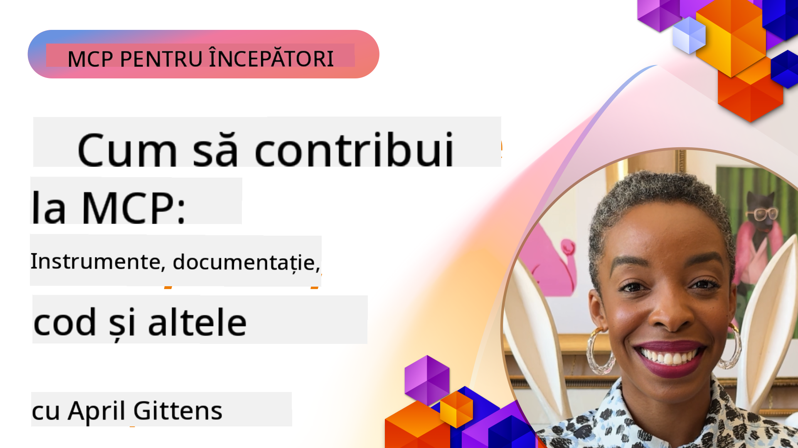

<!--
CO_OP_TRANSLATOR_METADATA:
{
  "original_hash": "fcf1e12b62102bf7d16b78deb2b163b7",
  "translation_date": "2025-08-19T16:43:18+00:00",
  "source_file": "06-CommunityContributions/README.md",
  "language_code": "ro"
}
-->
# Comunitate și Contribuții

[](https://youtu.be/v1pvCYAWpRE)

_(Click pe imaginea de mai sus pentru a viziona videoclipul acestei lecții)_

## Prezentare generală

Această lecție se concentrează pe modul de implicare în comunitatea MCP, contribuirea la ecosistemul MCP și respectarea celor mai bune practici pentru dezvoltarea colaborativă. Înțelegerea modului de participare la proiectele open-source MCP este esențială pentru cei care doresc să modeleze viitorul acestei tehnologii.

## Obiective de învățare

La finalul acestei lecții, vei putea:

- Înțelege structura comunității și ecosistemului MCP
- Participa eficient la forumurile și discuțiile comunității MCP
- Contribui la depozitele open-source MCP
- Crea și partaja instrumente și servere MCP personalizate
- Respecta cele mai bune practici pentru dezvoltarea și colaborarea MCP
- Descoperi resursele și cadrele comunității pentru dezvoltarea MCP

## Ecosistemul Comunității MCP

Ecosistemul MCP constă în diverse componente și participanți care lucrează împreună pentru a avansa protocolul.

### Componente cheie ale comunității

1. **Menținătorii Protocolului de Bază**: Organizația oficială [Model Context Protocol GitHub](https://github.com/modelcontextprotocol) menține specificațiile de bază MCP și implementările de referință.
2. **Dezvoltatori de Instrumente**: Persoane și echipe care creează instrumente și servere MCP.
3. **Furnizori de Integrare**: Companii care integrează MCP în produsele și serviciile lor.
4. **Utilizatori Finali**: Dezvoltatori și organizații care utilizează MCP în aplicațiile lor.
5. **Contribuitori**: Membrii comunității care contribuie cu cod, documentație sau alte resurse.

### Resurse ale comunității

#### Canale oficiale

- [Organizația MCP GitHub](https://github.com/modelcontextprotocol)
- [Documentația MCP](https://modelcontextprotocol.io/)
- [Specificația MCP](https://modelcontextprotocol.io/docs/specification)
- [Discuții pe GitHub](https://github.com/orgs/modelcontextprotocol/discussions)
- [Depozitul de Exemple și Servere MCP](https://github.com/modelcontextprotocol/servers)

#### Resurse conduse de comunitate

- [Clienți MCP](https://modelcontextprotocol.io/clients) - Listă de clienți care suportă integrările MCP.
- [Servere MCP ale comunității](https://github.com/modelcontextprotocol/servers?tab=readme-ov-file#-community-servers) - Listă în creștere de servere MCP dezvoltate de comunitate.
- [Awesome MCP Servers](https://github.com/wong2/awesome-mcp-servers) - Listă curată de servere MCP.
- [PulseMCP](https://www.pulsemcp.com/) - Hub comunitar și newsletter pentru descoperirea resurselor MCP.
- [Server Discord](https://discord.gg/jHEGxQu2a5) - Conectează-te cu dezvoltatorii MCP.
- Implementări SDK specifice limbajului.
- Postări pe blog și tutoriale.

## Contribuirea la MCP

### Tipuri de contribuții

Ecosistemul MCP acceptă diverse tipuri de contribuții:

1. **Contribuții de cod**:
   - Îmbunătățiri ale protocolului de bază
   - Remedieri de erori
   - Implementări de instrumente și servere
   - Biblioteci client/server în diferite limbaje

2. **Documentație**:
   - Îmbunătățirea documentației existente
   - Crearea de tutoriale și ghiduri
   - Traducerea documentației
   - Crearea de exemple și aplicații demonstrative

3. **Sprijin comunitar**:
   - Răspuns la întrebări pe forumuri și în discuții
   - Testarea și raportarea problemelor
   - Organizarea de evenimente comunitare
   - Mentorat pentru noii contribuitori

### Procesul de contribuție: Protocolul de bază

Pentru a contribui la protocolul de bază MCP sau la implementările oficiale, urmează aceste principii din [ghidul oficial de contribuție](https://github.com/modelcontextprotocol/modelcontextprotocol/blob/main/CONTRIBUTING.md):

1. **Simplitate și Minimalism**: Specificația MCP menține un standard ridicat pentru adăugarea de noi concepte. Este mai ușor să adaugi lucruri într-o specificație decât să le elimini.

2. **Abordare concretă**: Modificările specificației ar trebui să se bazeze pe provocări specifice de implementare, nu pe idei speculative.

3. **Etapele unei propuneri**:
   - Definire: Explorează spațiul problemei, validează că alți utilizatori MCP se confruntă cu o problemă similară.
   - Prototip: Construiește o soluție exemplu și demonstrează aplicarea sa practică.
   - Scriere: Pe baza prototipului, scrie o propunere de specificație.

### Configurarea mediului de dezvoltare

```bash
# Fork the repository
git clone https://github.com/YOUR-USERNAME/modelcontextprotocol.git
cd modelcontextprotocol

# Install dependencies
npm install

# For schema changes, validate and generate schema.json:
npm run check:schema:ts
npm run generate:schema

# For documentation changes
npm run check:docs
npm run format

# Preview documentation locally (optional):
npm run serve:docs
```

### Exemplu: Contribuirea unei remedieri de erori

```javascript
// Original code with bug in the typescript-sdk
export function validateResource(resource: unknown): resource is MCPResource {
  if (!resource || typeof resource !== 'object') {
    return false;
  }
  
  // Bug: Missing property validation
  // Current implementation:
  const hasName = 'name' in resource;
  const hasSchema = 'schema' in resource;
  
  return hasName && hasSchema;
}

// Fixed implementation in a contribution
export function validateResource(resource: unknown): resource is MCPResource {
  if (!resource || typeof resource !== 'object') {
    return false;
  }
  
  // Improved validation
  const hasName = 'name' in resource && typeof (resource as MCPResource).name === 'string';
  const hasSchema = 'schema' in resource && typeof (resource as MCPResource).schema === 'object';
  const hasDescription = !('description' in resource) || typeof (resource as MCPResource).description === 'string';
  
  return hasName && hasSchema && hasDescription;
}
```

### Exemplu: Contribuirea unui nou instrument la biblioteca standard

```python
# Example contribution: A CSV data processing tool for the MCP standard library

from mcp_tools import Tool, ToolRequest, ToolResponse, ToolExecutionException
import pandas as pd
import io
import json
from typing import Dict, Any, List, Optional

class CsvProcessingTool(Tool):
    """
    Tool for processing and analyzing CSV data.
    
    This tool allows models to extract information from CSV files,
    run basic analysis, and convert data between formats.
    """
    
    def get_name(self):
        return "csvProcessor"
        
    def get_description(self):
        return "Processes and analyzes CSV data"
    
    def get_schema(self):
        return {
            "type": "object",
            "properties": {
                "csvData": {
                    "type": "string", 
                    "description": "CSV data as a string"
                },
                "csvUrl": {
                    "type": "string",
                    "description": "URL to a CSV file (alternative to csvData)"
                },
                "operation": {
                    "type": "string",
                    "enum": ["summary", "filter", "transform", "convert"],
                    "description": "Operation to perform on the CSV data"
                },
                "filterColumn": {
                    "type": "string",
                    "description": "Column to filter by (for filter operation)"
                },
                "filterValue": {
                    "type": "string",
                    "description": "Value to filter for (for filter operation)"
                },
                "outputFormat": {
                    "type": "string",
                    "enum": ["json", "csv", "markdown"],
                    "default": "json",
                    "description": "Output format for the processed data"
                }
            },
            "oneOf": [
                {"required": ["csvData", "operation"]},
                {"required": ["csvUrl", "operation"]}
            ]
        }
    
    async def execute_async(self, request: ToolRequest) -> ToolResponse:
        try:
            # Extract parameters
            operation = request.parameters.get("operation")
            output_format = request.parameters.get("outputFormat", "json")
            
            # Get CSV data from either direct data or URL
            df = await self._get_dataframe(request)
            
            # Process based on requested operation
            result = {}
            
            if operation == "summary":
                result = self._generate_summary(df)
            elif operation == "filter":
                column = request.parameters.get("filterColumn")
                value = request.parameters.get("filterValue")
                if not column:
                    raise ToolExecutionException("filterColumn is required for filter operation")
                result = self._filter_data(df, column, value)
            elif operation == "transform":
                result = self._transform_data(df, request.parameters)
            elif operation == "convert":
                result = self._convert_format(df, output_format)
            else:
                raise ToolExecutionException(f"Unknown operation: {operation}")
            
            return ToolResponse(result=result)
        
        except Exception as e:
            raise ToolExecutionException(f"CSV processing failed: {str(e)}")
    
    async def _get_dataframe(self, request: ToolRequest) -> pd.DataFrame:
        """Gets a pandas DataFrame from either CSV data or URL"""
        if "csvData" in request.parameters:
            csv_data = request.parameters.get("csvData")
            return pd.read_csv(io.StringIO(csv_data))
        elif "csvUrl" in request.parameters:
            csv_url = request.parameters.get("csvUrl")
            return pd.read_csv(csv_url)
        else:
            raise ToolExecutionException("Either csvData or csvUrl must be provided")
    
    def _generate_summary(self, df: pd.DataFrame) -> Dict[str, Any]:
        """Generates a summary of the CSV data"""
        return {
            "columns": df.columns.tolist(),
            "rowCount": len(df),
            "columnCount": len(df.columns),
            "numericColumns": df.select_dtypes(include=['number']).columns.tolist(),
            "categoricalColumns": df.select_dtypes(include=['object']).columns.tolist(),
            "sampleRows": json.loads(df.head(5).to_json(orient="records")),
            "statistics": json.loads(df.describe().to_json())
        }
    
    def _filter_data(self, df: pd.DataFrame, column: str, value: str) -> Dict[str, Any]:
        """Filters the DataFrame by a column value"""
        if column not in df.columns:
            raise ToolExecutionException(f"Column '{column}' not found")
            
        filtered_df = df[df[column].astype(str).str.contains(value)]
        
        return {
            "originalRowCount": len(df),
            "filteredRowCount": len(filtered_df),
            "data": json.loads(filtered_df.to_json(orient="records"))
        }
    
    def _transform_data(self, df: pd.DataFrame, params: Dict[str, Any]) -> Dict[str, Any]:
        """Transforms the data based on parameters"""
        # Implementation would include various transformations
        return {
            "status": "success",
            "message": "Transformation applied"
        }
    
    def _convert_format(self, df: pd.DataFrame, format: str) -> Dict[str, Any]:
        """Converts the DataFrame to different formats"""
        if format == "json":
            return {
                "data": json.loads(df.to_json(orient="records")),
                "format": "json"
            }
        elif format == "csv":
            return {
                "data": df.to_csv(index=False),
                "format": "csv"
            }
        elif format == "markdown":
            return {
                "data": df.to_markdown(),
                "format": "markdown"
            }
        else:
            raise ToolExecutionException(f"Unsupported output format: {format}")
```

### Ghiduri de contribuție

Pentru a face o contribuție de succes la proiectele MCP:

1. **Începe cu lucruri mici**: Începe cu documentație, remedieri de erori sau îmbunătățiri minore.
2. **Respectă ghidul de stil**: Respectă stilul de cod și convențiile proiectului.
3. **Scrie teste**: Include teste unitare pentru contribuțiile tale de cod.
4. **Documentează munca ta**: Adaugă documentație clară pentru funcționalitățile sau modificările noi.
5. **Trimite PR-uri țintite**: Menține cererile de pull (PR) concentrate pe o singură problemă sau funcționalitate.
6. **Răspunde la feedback**: Fii receptiv la feedback-ul primit pentru contribuțiile tale.

### Flux de lucru exemplu pentru contribuții

```bash
# Clone the repository
git clone https://github.com/modelcontextprotocol/typescript-sdk.git
cd typescript-sdk

# Create a new branch for your contribution
git checkout -b feature/my-contribution

# Make your changes
# ...

# Run tests to ensure your changes don't break existing functionality
npm test

# Commit your changes with a descriptive message
git commit -am "Fix validation in resource handler"

# Push your branch to your fork
git push origin feature/my-contribution

# Create a pull request from your branch to the main repository
# Then engage with feedback and iterate on your PR as needed
```

## Crearea și partajarea serverelor MCP

Una dintre cele mai valoroase modalități de a contribui la ecosistemul MCP este prin crearea și partajarea serverelor MCP personalizate. Comunitatea a dezvoltat deja sute de servere pentru diverse servicii și cazuri de utilizare.

### Cadre de dezvoltare pentru servere MCP

Sunt disponibile mai multe cadre pentru a simplifica dezvoltarea serverelor MCP:

1. **SDK-uri oficiale**:
   - [SDK TypeScript](https://github.com/modelcontextprotocol/typescript-sdk)
   - [SDK Python](https://github.com/modelcontextprotocol/python-sdk)
   - [SDK C#](https://github.com/modelcontextprotocol/csharp-sdk)
   - [SDK Go](https://github.com/modelcontextprotocol/go-sdk)
   - [SDK Java](https://github.com/modelcontextprotocol/java-sdk)
   - [SDK Kotlin](https://github.com/modelcontextprotocol/kotlin-sdk)

2. **Cadre comunitare**:
   - [MCP-Framework](https://mcp-framework.com/) - Construiește servere MCP cu eleganță și rapiditate în TypeScript.
   - [MCP Declarative Java SDK](https://github.com/codeboyzhou/mcp-declarative-java-sdk) - Servere MCP bazate pe adnotări în Java.
   - [Quarkus MCP Server SDK](https://github.com/quarkiverse/quarkus-mcp-server) - Cadru Java pentru servere MCP.
   - [Template MCP Server Next.js](https://github.com/vercel-labs/mcp-for-next.js) - Proiect starter Next.js pentru servere MCP.

### Dezvoltarea instrumentelor partajabile

#### Exemplu .NET: Crearea unui pachet de instrumente partajabil

```csharp
// Create a new .NET library project
// dotnet new classlib -n McpFinanceTools

using Microsoft.Mcp.Tools;
using System.Threading.Tasks;
using System.Net.Http;
using System.Text.Json;

namespace McpFinanceTools
{
    // Stock quote tool
    public class StockQuoteTool : IMcpTool
    {
        private readonly HttpClient _httpClient;
        
        public StockQuoteTool(HttpClient httpClient = null)
        {
            _httpClient = httpClient ?? new HttpClient();
        }
        
        public string Name => "stockQuote";
        public string Description => "Gets current stock quotes for specified symbols";
        
        public object GetSchema()
        {
            return new {
                type = "object",
                properties = new {
                    symbol = new { 
                        type = "string",
                        description = "Stock symbol (e.g., MSFT, AAPL)" 
                    },
                    includeHistory = new { 
                        type = "boolean",
                        description = "Whether to include historical data",
                        default = false
                    }
                },
                required = new[] { "symbol" }
            };
        }
        
        public async Task<ToolResponse> ExecuteAsync(ToolRequest request)
        {
            // Extract parameters
            string symbol = request.Parameters.GetProperty("symbol").GetString();
            bool includeHistory = false;
            
            if (request.Parameters.TryGetProperty("includeHistory", out var historyProp))
            {
                includeHistory = historyProp.GetBoolean();
            }
            
            // Call external API (example)
            var quoteResult = await GetStockQuoteAsync(symbol);
            
            // Add historical data if requested
            if (includeHistory)
            {
                var historyData = await GetStockHistoryAsync(symbol);
                quoteResult.Add("history", historyData);
            }
            
            // Return formatted result
            return new ToolResponse {
                Result = JsonSerializer.SerializeToElement(quoteResult)
            };
        }
        
        private async Task<Dictionary<string, object>> GetStockQuoteAsync(string symbol)
        {
            // Implementation would call a real stock API
            // This is a simplified example
            return new Dictionary<string, object>
            {
                ["symbol"] = symbol,
                ["price"] = 123.45,
                ["change"] = 2.5,
                ["percentChange"] = 1.2,
                ["lastUpdated"] = DateTime.UtcNow
            };
        }
        
        private async Task<object> GetStockHistoryAsync(string symbol)
        {
            // Implementation would get historical data
            // Simplified example
            return new[]
            {
                new { date = DateTime.Now.AddDays(-7).Date, price = 120.25 },
                new { date = DateTime.Now.AddDays(-6).Date, price = 122.50 },
                new { date = DateTime.Now.AddDays(-5).Date, price = 121.75 }
                // More historical data...
            };
        }
    }
}

// Create package and publish to NuGet
// dotnet pack -c Release
// dotnet nuget push bin/Release/McpFinanceTools.1.0.0.nupkg -s https://api.nuget.org/v3/index.json -k YOUR_API_KEY
```

#### Exemplu Java: Crearea unui pachet Maven pentru instrumente

```java
// pom.xml configuration for a shareable MCP tool package
<!-- 
<project>
    <groupId>com.example</groupId>
    <artifactId>mcp-weather-tools</artifactId>
    <version>1.0.0</version>
    
    <dependencies>
        <dependency>
            <groupId>com.mcp</groupId>
            <artifactId>mcp-server</artifactId>
            <version>1.0.0</version>
        </dependency>
    </dependencies>
    
    <distributionManagement>
        <repository>
            <id>github</id>
            <name>GitHub Packages</name>
            <url>https://maven.pkg.github.com/username/mcp-weather-tools</url>
        </repository>
    </distributionManagement>
</project>
-->

package com.example.mcp.weather;

import com.mcp.tools.Tool;
import com.mcp.tools.ToolRequest;
import com.mcp.tools.ToolResponse;
import com.mcp.tools.ToolExecutionException;

import java.net.http.HttpClient;
import java.net.http.HttpRequest;
import java.net.http.HttpResponse;
import java.net.URI;
import java.util.HashMap;
import java.util.Map;

public class WeatherForecastTool implements Tool {
    private final HttpClient httpClient;
    private final String apiKey;
    
    public WeatherForecastTool(String apiKey) {
        this.httpClient = HttpClient.newHttpClient();
        this.apiKey = apiKey;
    }
    
    @Override
    public String getName() {
        return "weatherForecast";
    }
    
    @Override
    public String getDescription() {
        return "Gets weather forecast for a specified location";
    }
    
    @Override
    public Object getSchema() {
        Map<String, Object> schema = new HashMap<>();
        // Schema definition...
        return schema;
    }
    
    @Override
    public ToolResponse execute(ToolRequest request) {
        try {
            String location = request.getParameters().get("location").asText();
            int days = request.getParameters().has("days") ? 
                request.getParameters().get("days").asInt() : 3;
            
            // Call weather API
            Map<String, Object> forecast = getForecast(location, days);
            
            // Build response
            return new ToolResponse.Builder()
                .setResult(forecast)
                .build();
        } catch (Exception ex) {
            throw new ToolExecutionException("Weather forecast failed: " + ex.getMessage(), ex);
        }
    }
    
    private Map<String, Object> getForecast(String location, int days) {
        // Implementation would call weather API
        // Simplified example
        Map<String, Object> result = new HashMap<>();
        // Add forecast data...
        return result;
    }
}

// Build and publish using Maven
// mvn clean package
// mvn deploy
```

#### Exemplu Python: Publicarea unui pachet PyPI

```python
# Directory structure for a PyPI package:
# mcp_nlp_tools/
# ├── LICENSE
# ├── README.md
# ├── setup.py
# ├── mcp_nlp_tools/
# │   ├── __init__.py
# │   ├── sentiment_tool.py
# │   └── translation_tool.py

# Example setup.py
"""
from setuptools import setup, find_packages

setup(
    name="mcp_nlp_tools",
    version="0.1.0",
    packages=find_packages(),
    install_requires=[
        "mcp_server>=1.0.0",
        "transformers>=4.0.0",
        "torch>=1.8.0"
    ],
    author="Your Name",
    author_email="your.email@example.com",
    description="MCP tools for natural language processing tasks",
    long_description=open("README.md").read(),
    long_description_content_type="text/markdown",
    url="https://github.com/username/mcp_nlp_tools",
    classifiers=[
        "Programming Language :: Python :: 3",
        "License :: OSI Approved :: MIT License",
        "Operating System :: OS Independent",
    ],
    python_requires=">=3.8",
)
"""

# Example NLP tool implementation (sentiment_tool.py)
from mcp_tools import Tool, ToolRequest, ToolResponse, ToolExecutionException
from transformers import pipeline
import torch

class SentimentAnalysisTool(Tool):
    """MCP tool for sentiment analysis of text"""
    
    def __init__(self, model_name="distilbert-base-uncased-finetuned-sst-2-english"):
        # Load the sentiment analysis model
        self.sentiment_analyzer = pipeline("sentiment-analysis", model=model_name)
    
    def get_name(self):
        return "sentimentAnalysis"
        
    def get_description(self):
        return "Analyzes the sentiment of text, classifying it as positive or negative"
    
    def get_schema(self):
        return {
            "type": "object",
            "properties": {
                "text": {
                    "type": "string", 
                    "description": "The text to analyze for sentiment"
                },
                "includeScore": {
                    "type": "boolean",
                    "description": "Whether to include confidence scores",
                    "default": True
                }
            },
            "required": ["text"]
        }
    
    async def execute_async(self, request: ToolRequest) -> ToolResponse:
        try:
            # Extract parameters
            text = request.parameters.get("text")
            include_score = request.parameters.get("includeScore", True)
            
            # Analyze sentiment
            sentiment_result = self.sentiment_analyzer(text)[0]
            
            # Format result
            result = {
                "sentiment": sentiment_result["label"],
                "text": text
            }
            
            if include_score:
                result["score"] = sentiment_result["score"]
            
            # Return result
            return ToolResponse(result=result)
            
        except Exception as e:
            raise ToolExecutionException(f"Sentiment analysis failed: {str(e)}")

# To publish:
# python setup.py sdist bdist_wheel
# python -m twine upload dist/*
```

### Partajarea celor mai bune practici

Când partajezi instrumente MCP cu comunitatea:

1. **Documentație completă**:
   - Documentează scopul, utilizarea și exemplele.
   - Explică parametrii și valorile returnate.
   - Documentează orice dependențe externe.

2. **Gestionarea erorilor**:
   - Implementează gestionarea robustă a erorilor.
   - Oferă mesaje de eroare utile.
   - Gestionează cazurile limită cu grație.

3. **Considerații de performanță**:
   - Optimizează atât pentru viteză, cât și pentru utilizarea resurselor.
   - Implementează caching acolo unde este potrivit.
   - Ia în considerare scalabilitatea.

4. **Securitate**:
   - Utilizează chei API și autentificare securizate.
   - Validează și sanitizează intrările.
   - Implementează limitarea ratei pentru apelurile API externe.

5. **Testare**:
   - Include acoperire de testare cuprinzătoare.
   - Testează cu diferite tipuri de intrări și cazuri limită.
   - Documentează procedurile de testare.

## Colaborarea comunitară și cele mai bune practici

Colaborarea eficientă este cheia unui ecosistem MCP prosper.

### Canale de comunicare

- Probleme și discuții pe GitHub
- Microsoft Tech Community
- Canale Discord și Slack
- Stack Overflow (tag: `model-context-protocol` sau `mcp`)

### Recenzii de cod

Când revizuiești contribuțiile MCP:

1. **Claritate**: Codul este clar și bine documentat?
2. **Corectitudine**: Funcționează conform așteptărilor?
3. **Consistență**: Respectă convențiile proiectului?
4. **Completitudine**: Sunt incluse teste și documentație?
5. **Securitate**: Există preocupări de securitate?

### Compatibilitate versiunilor

Când dezvolți pentru MCP:

1. **Versionare protocol**: Respectă versiunea protocolului MCP pe care o suportă instrumentul tău.
2. **Compatibilitate client**: Ia în considerare compatibilitatea retroactivă.
3. **Compatibilitate server**: Respectă ghidurile de implementare ale serverului.
4. **Modificări majore**: Documentează clar orice modificări majore.

## Proiect comunitar exemplu: Registrul de instrumente MCP

O contribuție comunitară importantă ar putea fi dezvoltarea unui registru public pentru instrumentele MCP.

```python
# Example schema for a community tool registry API

from fastapi import FastAPI, HTTPException, Depends
from pydantic import BaseModel, Field, HttpUrl
from typing import List, Optional
import datetime
import uuid

# Models for the tool registry
class ToolSchema(BaseModel):
    """JSON Schema for a tool"""
    type: str
    properties: dict
    required: List[str] = []

class ToolRegistration(BaseModel):
    """Information for registering a tool"""
    name: str = Field(..., description="Unique name for the tool")
    description: str = Field(..., description="Description of what the tool does")
    version: str = Field(..., description="Semantic version of the tool")
    schema: ToolSchema = Field(..., description="JSON Schema for tool parameters")
    author: str = Field(..., description="Author of the tool")
    repository: Optional[HttpUrl] = Field(None, description="Repository URL")
    documentation: Optional[HttpUrl] = Field(None, description="Documentation URL")
    package: Optional[HttpUrl] = Field(None, description="Package URL")
    tags: List[str] = Field(default_factory=list, description="Tags for categorization")
    examples: List[dict] = Field(default_factory=list, description="Example usage")

class Tool(ToolRegistration):
    """Tool with registry metadata"""
    id: uuid.UUID = Field(default_factory=uuid.uuid4)
    created_at: datetime.datetime = Field(default_factory=datetime.datetime.now)
    updated_at: datetime.datetime = Field(default_factory=datetime.datetime.now)
    downloads: int = Field(default=0)
    rating: float = Field(default=0.0)
    ratings_count: int = Field(default=0)

# FastAPI application for the registry
app = FastAPI(title="MCP Tool Registry")

# In-memory database for this example
tools_db = {}

@app.post("/tools", response_model=Tool)
async def register_tool(tool: ToolRegistration):
    """Register a new tool in the registry"""
    if tool.name in tools_db:
        raise HTTPException(status_code=400, detail=f"Tool '{tool.name}' already exists")
    
    new_tool = Tool(**tool.dict())
    tools_db[tool.name] = new_tool
    return new_tool

@app.get("/tools", response_model=List[Tool])
async def list_tools(tag: Optional[str] = None):
    """List all registered tools, optionally filtered by tag"""
    if tag:
        return [tool for tool in tools_db.values() if tag in tool.tags]
    return list(tools_db.values())

@app.get("/tools/{tool_name}", response_model=Tool)
async def get_tool(tool_name: str):
    """Get information about a specific tool"""
    if tool_name not in tools_db:
        raise HTTPException(status_code=404, detail=f"Tool '{tool_name}' not found")
    return tools_db[tool_name]

@app.delete("/tools/{tool_name}")
async def delete_tool(tool_name: str):
    """Delete a tool from the registry"""
    if tool_name not in tools_db:
        raise HTTPException(status_code=404, detail=f"Tool '{tool_name}' not found")
    del tools_db[tool_name]
    return {"message": f"Tool '{tool_name}' deleted"}
```

## Concluzii cheie

- Comunitatea MCP este diversă și acceptă diverse tipuri de contribuții.
- Contribuirea la MCP poate varia de la îmbunătățiri ale protocolului de bază la instrumente personalizate.
- Respectarea ghidurilor de contribuție crește șansele ca PR-ul tău să fie acceptat.
- Crearea și partajarea instrumentelor MCP este o modalitate valoroasă de a îmbunătăți ecosistemul.
- Colaborarea comunitară este esențială pentru creșterea și îmbunătățirea MCP.

## Exercițiu

1. Identifică o zonă din ecosistemul MCP unde ai putea contribui pe baza abilităților și intereselor tale.
2. Forkează depozitul MCP și configurează un mediu de dezvoltare local.
3. Creează o mică îmbunătățire, remediere de erori sau instrument care ar beneficia comunitatea.
4. Documentează contribuția ta cu teste și documentație adecvate.
5. Trimite o cerere de pull (PR) către depozitul corespunzător.

## Resurse suplimentare

- [Proiecte comunitare MCP](https://github.com/topics/model-context-protocol)

---

Următorul: [Lecții din adoptarea timpurie](../07-LessonsfromEarlyAdoption/README.md)

**Declinarea responsabilității**:  
Acest document a fost tradus folosind serviciul de traducere AI [Co-op Translator](https://github.com/Azure/co-op-translator). Deși depunem eforturi pentru a asigura acuratețea, vă rugăm să rețineți că traducerile automate pot conține erori sau inexactități. Documentul original în limba sa nativă ar trebui considerat sursa autoritară. Pentru informații critice, se recomandă traducerea profesională realizată de un specialist uman. Nu ne asumăm răspunderea pentru eventualele neînțelegeri sau interpretări greșite care pot apărea din utilizarea acestei traduceri.