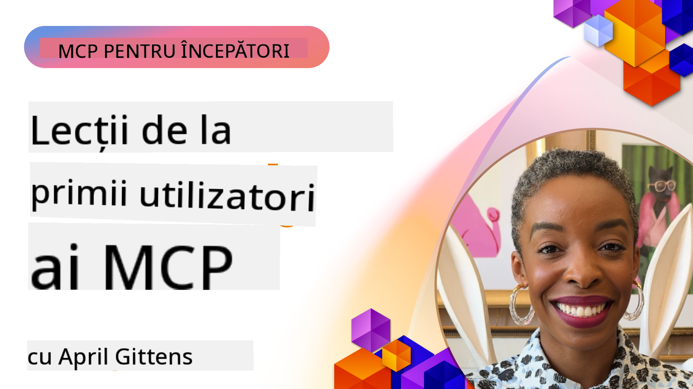

<!--
CO_OP_TRANSLATOR_METADATA:
{
  "original_hash": "41f16dac486d2086a53bc644a01cbe42",
  "translation_date": "2025-08-19T16:21:01+00:00",
  "source_file": "07-LessonsfromEarlyAdoption/README.md",
  "language_code": "ro"
}
-->
# 🌟 Lecții de la Primii Utilizatori

[](https://youtu.be/jds7dSmNptE)

_(Faceți clic pe imaginea de mai sus pentru a viziona videoclipul acestei lecții)_

## 🎯 Ce Acoperă Acest Modul

Acest modul explorează modul în care organizațiile și dezvoltatorii reali utilizează Model Context Protocol (MCP) pentru a rezolva provocări reale și a stimula inovația. Prin studii de caz detaliate și proiecte practice, veți descoperi cum MCP permite integrarea AI sigură și scalabilă, conectând modele lingvistice, instrumente și date de întreprindere.

### 📚 Vedeți MCP în Acțiune

Doriți să vedeți aceste principii aplicate în instrumente gata de producție? Consultați [**10 Servere MCP Microsoft Care Transformă Productivitatea Dezvoltatorilor**](microsoft-mcp-servers.md), care prezintă servere MCP reale de la Microsoft pe care le puteți utiliza astăzi.

## Prezentare Generală

Această lecție explorează modul în care primii utilizatori au folosit Model Context Protocol (MCP) pentru a rezolva provocări reale și a stimula inovația în diverse industrii. Prin studii de caz detaliate și proiecte practice, veți vedea cum MCP permite o integrare AI standardizată, sigură și scalabilă—conectând modele lingvistice mari, instrumente și date de întreprindere într-un cadru unificat. Veți dobândi experiență practică în proiectarea și construirea soluțiilor bazate pe MCP, veți învăța din modele de implementare dovedite și veți descoperi cele mai bune practici pentru implementarea MCP în medii de producție. Lecția evidențiază, de asemenea, tendințele emergente, direcțiile viitoare și resursele open-source pentru a vă ajuta să rămâneți în fruntea tehnologiei MCP și a ecosistemului său în evoluție.

## Obiective de Învățare

- Analizați implementările MCP din lumea reală în diverse industrii
- Proiectați și construiți aplicații complete bazate pe MCP
- Explorați tendințele emergente și direcțiile viitoare în tehnologia MCP
- Aplicați cele mai bune practici în scenarii reale de dezvoltare

## Implementări MCP din Lumea Reală

### Studiu de Caz 1: Automatizarea Suportului pentru Clienți în Întreprinderi

O corporație multinațională a implementat o soluție bazată pe MCP pentru a standardiza interacțiunile AI în sistemele lor de suport pentru clienți. Acest lucru le-a permis să:

- Creeze o interfață unificată pentru mai mulți furnizori de LLM
- Mențină o gestionare consecventă a prompturilor între departamente
- Implementeze controale robuste de securitate și conformitate
- Schimbe cu ușurință între diferite modele AI în funcție de nevoi specifice

**Implementare Tehnică:**

```python
# Python MCP server implementation for customer support
import logging
import asyncio
from modelcontextprotocol import create_server, ServerConfig
from modelcontextprotocol.server import MCPServer
from modelcontextprotocol.transports import create_http_transport
from modelcontextprotocol.resources import ResourceDefinition
from modelcontextprotocol.prompts import PromptDefinition
from modelcontextprotocol.tool import ToolDefinition

# Configure logging
logging.basicConfig(level=logging.INFO)

async def main():
    # Create server configuration
    config = ServerConfig(
        name="Enterprise Customer Support Server",
        version="1.0.0",
        description="MCP server for handling customer support inquiries"
    )
    
    # Initialize MCP server
    server = create_server(config)
    
    # Register knowledge base resources
    server.resources.register(
        ResourceDefinition(
            name="customer_kb",
            description="Customer knowledge base documentation"
        ),
        lambda params: get_customer_documentation(params)
    )
    
    # Register prompt templates
    server.prompts.register(
        PromptDefinition(
            name="support_template",
            description="Templates for customer support responses"
        ),
        lambda params: get_support_templates(params)
    )
    
    # Register support tools
    server.tools.register(
        ToolDefinition(
            name="ticketing",
            description="Create and update support tickets"
        ),
        handle_ticketing_operations
    )
    
    # Start server with HTTP transport
    transport = create_http_transport(port=8080)
    await server.run(transport)

if __name__ == "__main__":
    asyncio.run(main())
```

**Rezultate:** Reducere cu 30% a costurilor modelelor, îmbunătățire cu 45% a consistenței răspunsurilor și conformitate sporită la nivel global.

### Studiu de Caz 2: Asistent de Diagnosticare în Sănătate

Un furnizor de servicii medicale a dezvoltat o infrastructură MCP pentru a integra mai multe modele AI medicale specializate, asigurând în același timp protecția datelor sensibile ale pacienților:

- Comutare fără probleme între modele medicale generaliste și specializate
- Controale stricte de confidențialitate și trasee de audit
- Integrare cu sistemele existente de Evidență Electronică a Pacienților (EHR)
- Inginerie consecventă a prompturilor pentru terminologia medicală

**Implementare Tehnică:**

```csharp
// C# MCP host application implementation in healthcare application
using Microsoft.Extensions.DependencyInjection;
using ModelContextProtocol.SDK.Client;
using ModelContextProtocol.SDK.Security;
using ModelContextProtocol.SDK.Resources;

public class DiagnosticAssistant
{
    private readonly MCPHostClient _mcpClient;
    private readonly PatientContext _patientContext;
    
    public DiagnosticAssistant(PatientContext patientContext)
    {
        _patientContext = patientContext;
        
        // Configure MCP client with healthcare-specific settings
        var clientOptions = new ClientOptions
        {
            Name = "Healthcare Diagnostic Assistant",
            Version = "1.0.0",
            Security = new SecurityOptions
            {
                Encryption = EncryptionLevel.Medical,
                AuditEnabled = true
            }
        };
        
        _mcpClient = new MCPHostClientBuilder()
            .WithOptions(clientOptions)
            .WithTransport(new HttpTransport("https://healthcare-mcp.example.org"))
            .WithAuthentication(new HIPAACompliantAuthProvider())
            .Build();
    }
    
    public async Task<DiagnosticSuggestion> GetDiagnosticAssistance(
        string symptoms, string patientHistory)
    {
        // Create request with appropriate resources and tool access
        var resourceRequest = new ResourceRequest
        {
            Name = "patient_records",
            Parameters = new Dictionary<string, object>
            {
                ["patientId"] = _patientContext.PatientId,
                ["requestingProvider"] = _patientContext.ProviderId
            }
        };
        
        // Request diagnostic assistance using appropriate prompt
        var response = await _mcpClient.SendPromptRequestAsync(
            promptName: "diagnostic_assistance",
            parameters: new Dictionary<string, object>
            {
                ["symptoms"] = symptoms,
                patientHistory = patientHistory,
                relevantGuidelines = _patientContext.GetRelevantGuidelines()
            });
            
        return DiagnosticSuggestion.FromMCPResponse(response);
    }
}
```

**Rezultate:** Sugestii de diagnosticare îmbunătățite pentru medici, menținând în același timp conformitatea completă cu HIPAA și reducerea semnificativă a schimbărilor de context între sisteme.

### Studiu de Caz 3: Analiza Riscurilor în Servicii Financiare

O instituție financiară a implementat MCP pentru a standardiza procesele de analiză a riscurilor în diferite departamente:

- Crearea unei interfețe unificate pentru modelele de risc de credit, detectare a fraudei și investiții
- Implementarea controalelor stricte de acces și a versiunilor modelelor
- Asigurarea auditabilității tuturor recomandărilor AI
- Menținerea unui format de date consecvent între sisteme diverse

**Implementare Tehnică:**

```java
// Java MCP server for financial risk assessment
import org.mcp.server.*;
import org.mcp.security.*;

public class FinancialRiskMCPServer {
    public static void main(String[] args) {
        // Create MCP server with financial compliance features
        MCPServer server = new MCPServerBuilder()
            .withModelProviders(
                new ModelProvider("risk-assessment-primary", new AzureOpenAIProvider()),
                new ModelProvider("risk-assessment-audit", new LocalLlamaProvider())
            )
            .withPromptTemplateDirectory("./compliance/templates")
            .withAccessControls(new SOCCompliantAccessControl())
            .withDataEncryption(EncryptionStandard.FINANCIAL_GRADE)
            .withVersionControl(true)
            .withAuditLogging(new DatabaseAuditLogger())
            .build();
            
        server.addRequestValidator(new FinancialDataValidator());
        server.addResponseFilter(new PII_RedactionFilter());
        
        server.start(9000);
        
        System.out.println("Financial Risk MCP Server running on port 9000");
    }
}
```

**Rezultate:** Conformitate reglementară îmbunătățită, cicluri de implementare a modelelor mai rapide cu 40% și consistență sporită în evaluarea riscurilor între departamente.

### Studiu de Caz 4: Serverul MCP Playwright de la Microsoft pentru Automatizarea Browserului

Microsoft a dezvoltat [serverul MCP Playwright](https://github.com/microsoft/playwright-mcp) pentru a permite automatizarea browserului într-un mod sigur și standardizat prin Model Context Protocol. Acest server gata de producție permite agenților AI și LLM-urilor să interacționeze cu browserele web într-un mod controlat, auditat și extensibil—facilitând cazuri de utilizare precum testarea automată a web-ului, extragerea de date și fluxurile de lucru end-to-end.

> **🎯 Instrument Gata de Producție**
> 
> Acest studiu de caz prezintă un server MCP real pe care îl puteți utiliza astăzi! Aflați mai multe despre serverul MCP Playwright și alte 9 servere MCP Microsoft gata de producție în [**Ghidul Serverelor MCP Microsoft**](microsoft-mcp-servers.md#8--playwright-mcp-server).

**Caracteristici Cheie:**
- Expune capabilități de automatizare a browserului (navigare, completare de formulare, captură de ecran etc.) ca instrumente MCP
- Implementează controale stricte de acces și sandboxing pentru a preveni acțiunile neautorizate
- Furnizează jurnale de audit detaliate pentru toate interacțiunile cu browserul
- Suportă integrarea cu Azure OpenAI și alți furnizori LLM pentru automatizare condusă de agenți
- Alimentează capabilitățile de navigare web ale GitHub Copilot

**Implementare Tehnică:**

```typescript
// TypeScript: Registering Playwright browser automation tools in an MCP server
import { createServer, ToolDefinition } from 'modelcontextprotocol';
import { launch } from 'playwright';

const server = createServer({
  name: 'Playwright MCP Server',
  version: '1.0.0',
  description: 'MCP server for browser automation using Playwright'
});

// Register a tool for navigating to a URL and capturing a screenshot
server.tools.register(
  new ToolDefinition({
    name: 'navigate_and_screenshot',
    description: 'Navigate to a URL and capture a screenshot',
    parameters: {
      url: { type: 'string', description: 'The URL to visit' }
    }
  }),
  async ({ url }) => {
    const browser = await launch();
    const page = await browser.newPage();
    await page.goto(url);
    const screenshot = await page.screenshot();
    await browser.close();
    return { screenshot };
  }
);

// Start the MCP server
server.listen(8080);
```

**Rezultate:**

- Automatizare sigură și programatică a browserului pentru agenți AI și LLM-uri
- Reducerea efortului de testare manuală și îmbunătățirea acoperirii testelor pentru aplicațiile web
- Furnizarea unui cadru reutilizabil și extensibil pentru integrarea instrumentelor bazate pe browser în medii de întreprindere
- Alimentarea capabilităților de navigare web ale GitHub Copilot

**Referințe:**

- [Repository GitHub Server MCP Playwright](https://github.com/microsoft/playwright-mcp)
- [Soluții Microsoft AI și Automatizare](https://azure.microsoft.com/en-us/products/ai-services/)

### Studiu de Caz 5: Azure MCP – Protocol de Context Model la Nivel de Întreprindere ca Serviciu

Serverul Azure MCP ([https://aka.ms/azmcp](https://aka.ms/azmcp)) este implementarea gestionată de Microsoft a Model Context Protocol la nivel de întreprindere, concepută pentru a oferi capabilități scalabile, sigure și conforme de server MCP ca serviciu cloud. Azure MCP permite organizațiilor să implementeze rapid, să gestioneze și să integreze servere MCP cu serviciile Azure AI, datele și securitatea, reducând sarcina operațională și accelerând adoptarea AI.

> **🎯 Instrument Gata de Producție**
> 
> Acesta este un server MCP real pe care îl puteți utiliza astăzi! Aflați mai multe despre serverul MCP Azure AI Foundry în [**Ghidul Serverelor MCP Microsoft**](microsoft-mcp-servers.md).

- Găzduire complet gestionată a serverului MCP cu scalare, monitorizare și securitate integrate
- Integrare nativă cu Azure OpenAI, Azure AI Search și alte servicii Azure
- Autentificare și autorizare la nivel de întreprindere prin Microsoft Entra ID
- Suport pentru instrumente personalizate, șabloane de prompturi și conectori de resurse
- Conformitate cu cerințele de securitate și reglementare ale întreprinderii

**Implementare Tehnică:**

```yaml
# Example: Azure MCP server deployment configuration (YAML)
apiVersion: mcp.microsoft.com/v1
kind: McpServer
metadata:
  name: enterprise-mcp-server
spec:
  modelProviders:
    - name: azure-openai
      type: AzureOpenAI
      endpoint: https://<your-openai-resource>.openai.azure.com/
      apiKeySecret: <your-azure-keyvault-secret>
  tools:
    - name: document_search
      type: AzureAISearch
      endpoint: https://<your-search-resource>.search.windows.net/
      apiKeySecret: <your-azure-keyvault-secret>
  authentication:
    type: EntraID
    tenantId: <your-tenant-id>
  monitoring:
    enabled: true
    logAnalyticsWorkspace: <your-log-analytics-id>
```

**Rezultate:**  
- Reducerea timpului necesar pentru proiectele AI de întreprindere prin furnizarea unei platforme MCP gata de utilizare și conforme
- Simplificarea integrării LLM-urilor, instrumentelor și surselor de date de întreprindere
- Securitate, observabilitate și eficiență operațională îmbunătățite pentru sarcinile MCP
- Calitate îmbunătățită a codului cu cele mai bune practici Azure SDK și modele actuale de autentificare

**Referințe:**  
- [Documentația Azure MCP](https://aka.ms/azmcp)
- [Repository GitHub Server MCP Azure](https://github.com/Azure/azure-mcp)
- [Servicii AI Azure](https://azure.microsoft.com/en-us/products/ai-services/)
- [Centrul MCP Microsoft](https://mcp.azure.com)

### Studiu de Caz 6: NLWeb

MCP (Model Context Protocol) este un protocol emergent pentru Chatbot-uri și asistenți AI pentru a interacționa cu instrumente. Fiecare instanță NLWeb este, de asemenea, un server MCP, care suportă o metodă principală, ask, utilizată pentru a adresa o întrebare unui site web în limbaj natural. Răspunsul returnat utilizează schema.org, un vocabular larg utilizat pentru descrierea datelor web. În termeni simpli, MCP este pentru NLWeb ceea ce HTTP este pentru HTML. NLWeb combină protocoale, formate Schema.org și cod de exemplu pentru a ajuta site-urile să creeze rapid aceste puncte finale, beneficiind atât oamenii prin interfețe conversaționale, cât și mașinile prin interacțiuni naturale agent-la-agent.

Există două componente distincte ale NLWeb:
- Un protocol, foarte simplu la început, pentru a interfața cu un site în limbaj natural și un format, utilizând JSON și schema.org pentru răspunsul returnat. Consultați documentația API-ului REST pentru mai multe detalii.
- O implementare simplă a (1) care valorifică marcajele existente, pentru site-urile care pot fi abstractizate ca liste de elemente (produse, rețete, atracții, recenzii etc.). Împreună cu un set de widget-uri de interfață utilizator, site-urile pot oferi cu ușurință interfețe conversaționale pentru conținutul lor. Consultați documentația despre Viața unei interogări de chat pentru mai multe detalii despre cum funcționează acest lucru.

**Referințe:**  
- [Documentația Azure MCP](https://aka.ms/azmcp)  
- [NLWeb](https://github.com/microsoft/NlWeb)

### Studiu de Caz 7: Serverul MCP Azure AI Foundry – Integrarea Agenților AI în Întreprinderi

Serverele MCP Azure AI Foundry demonstrează cum poate fi utilizat MCP pentru a orchestra și gestiona agenți AI și fluxuri de lucru în medii de întreprindere. Prin integrarea MCP cu Azure AI Foundry, organizațiile pot standardiza interacțiunile agenților, valorifica gestionarea fluxurilor de lucru din Foundry și asigura implementări sigure și scalabile.

> **🎯 Instrument Gata de Producție**
> 
> Acesta este un server MCP real pe care îl puteți utiliza astăzi! Aflați mai multe despre serverul MCP Azure AI Foundry în [**Ghidul Serverelor MCP Microsoft**](microsoft-mcp-servers.md#9--azure-ai-foundry-mcp-server).

**Caracteristici Cheie:**
- Acces cuprinzător la ecosistemul AI al Azure, inclusiv cataloage de modele și gestionarea implementărilor
- Indexare a cunoștințelor cu Azure AI Search pentru aplicații RAG
- Instrumente de evaluare a performanței și calității modelelor AI
- Integrare cu Catalogul și Laboratoarele Azure AI Foundry pentru modele de cercetare de ultimă generație
- Capacități de gestionare și evaluare a agenților pentru scenarii de producție

**Rezultate:**
- Prototipare rapidă și monitorizare robustă a fluxurilor de lucru ale agenților AI
- Integrare fără probleme cu serviciile AI Azure pentru scenarii avansate
- Interfață unificată pentru construirea, implementarea și monitorizarea fluxurilor de lucru ale agenților
- Securitate, conformitate și eficiență operațională îmbunătățite pentru întreprinderi
- Accelerarea adoptării AI, menținând în același timp controlul asupra proceselor complexe conduse de agenți

**Referințe:**
- [Repository GitHub Server MCP Azure AI Foundry](https://github.com/azure-ai-foundry/mcp-foundry)
- [Integrarea Agenților AI Azure cu MCP (Blogul Microsoft Foundry)](https://devblogs.microsoft.com/foundry/integrating-azure-ai-agents-mcp/)

### Studiu de Caz 8: Foundry MCP Playground – Experimentare și Prototipare

Foundry MCP Playground oferă un mediu gata de utilizare pentru experimentarea cu servere MCP și integrările Azure AI Foundry. Dezvoltatorii pot prototipa rapid, testa și evalua modele AI și fluxuri de lucru ale agenților utilizând resurse din Catalogul și Laboratoarele Azure AI Foundry. Playground-ul simplifică configurarea, oferă proiecte de exemplu și sprijină dezvoltarea colaborativă, facilitând explorarea celor mai bune practici și a scenariilor noi cu un efort minim. Este deosebit de util pentru echipele care doresc să valideze idei, să împărtășească experimente și să accelereze învățarea fără a avea nevoie de infrastructuri complexe. Prin reducerea barierei de intrare, playground-ul ajută la stimularea inovației și a contribuțiilor comunității în ecosistemul MCP și Azure AI Foundry.

**Referințe:**

- [Repository GitHub Foundry MCP Playground](https://github.com/azure-ai-foundry/foundry-mcp-playground)

### Studiu de Caz 9: Serverul MCP Microsoft Learn Docs – Acces la Documentație Alimentat de AI

Serverul MCP Microsoft Learn Docs este un serviciu găzduit în cloud care oferă asistenților AI acces în timp real la documentația oficială Microsoft prin Model Context Protocol. Acest server gata de producție se conectează la ecosistemul cuprinzător Microsoft Learn și permite căutări semantice în toate sursele oficiale Microsoft.
> **🎯 Instrument Pregătit pentru Producție**
> 
> Acesta este un server MCP real pe care îl poți folosi chiar astăzi! Află mai multe despre Serverul MCP din Microsoft Learn Docs în [**Ghidul Serverelor MCP Microsoft**](microsoft-mcp-servers.md#1--microsoft-learn-docs-mcp-server).
**Caracteristici cheie:**
- Acces în timp real la documentația oficială Microsoft, documentația Azure și Microsoft 365
- Capacități avansate de căutare semantică care înțeleg contextul și intenția
- Informații mereu actualizate pe măsură ce conținutul Microsoft Learn este publicat
- Acoperire cuprinzătoare în sursele Microsoft Learn, documentația Azure și Microsoft 365
- Returnează până la 10 fragmente de conținut de înaltă calitate cu titluri de articole și URL-uri

**De ce este esențial:**
- Rezolvă problema „cunoștințelor AI depășite” pentru tehnologiile Microsoft
- Asigură accesul asistenților AI la cele mai recente funcționalități .NET, C#, Azure și Microsoft 365
- Furnizează informații autorizate, de primă mână, pentru generarea precisă de cod
- Esențial pentru dezvoltatorii care lucrează cu tehnologii Microsoft în continuă evoluție

**Rezultate:**
- Precizie îmbunătățită dramatic a codului generat de AI pentru tehnologiile Microsoft
- Reducerea timpului petrecut căutând documentație actualizată și bune practici
- Productivitate sporită a dezvoltatorilor prin recuperarea documentației conștiente de context
- Integrare fără întreruperi în fluxurile de lucru de dezvoltare, fără a părăsi IDE-ul

**Referințe:**
- [Microsoft Learn Docs MCP Server GitHub Repository](https://github.com/MicrosoftDocs/mcp)
- [Microsoft Learn Documentation](https://learn.microsoft.com/)

## Proiecte practice

### Proiect 1: Construirea unui server MCP multi-furnizor

**Obiectiv:** Crearea unui server MCP care poate direcționa cererile către mai mulți furnizori de modele AI pe baza unor criterii specifice.

**Cerințe:**

- Suport pentru cel puțin trei furnizori diferiți de modele (de exemplu, OpenAI, Anthropic, modele locale)
- Implementarea unui mecanism de rutare bazat pe metadatele cererii
- Crearea unui sistem de configurare pentru gestionarea acreditivelor furnizorilor
- Adăugarea unui sistem de cache pentru optimizarea performanței și costurilor
- Construirea unui tablou de bord simplu pentru monitorizarea utilizării

**Pași de implementare:**

1. Configurarea infrastructurii de bază a serverului MCP
2. Implementarea adaptoarelor pentru fiecare serviciu de model AI
3. Crearea logicii de rutare bazate pe atributele cererii
4. Adăugarea mecanismelor de cache pentru cererile frecvente
5. Dezvoltarea tabloului de bord pentru monitorizare
6. Testarea cu diverse tipare de cereri

**Tehnologii:** Alegeți dintre Python (.NET/Java/Python în funcție de preferință), Redis pentru cache și un framework web simplu pentru tablou de bord.

### Proiect 2: Sistem de gestionare a șabloanelor de prompturi la nivel de organizație

**Obiectiv:** Dezvoltarea unui sistem bazat pe MCP pentru gestionarea, versionarea și implementarea șabloanelor de prompturi într-o organizație.

**Cerințe:**

- Crearea unui depozit centralizat pentru șabloanele de prompturi
- Implementarea fluxurilor de lucru pentru versionare și aprobare
- Construirea capacităților de testare a șabloanelor cu intrări de probă
- Dezvoltarea controalelor de acces bazate pe roluri
- Crearea unei API pentru recuperarea și implementarea șabloanelor

**Pași de implementare:**

1. Proiectarea schemei bazei de date pentru stocarea șabloanelor
2. Crearea API-ului de bază pentru operațiuni CRUD pe șabloane
3. Implementarea sistemului de versionare
4. Construirea fluxului de lucru pentru aprobare
5. Dezvoltarea cadrului de testare
6. Crearea unei interfețe web simple pentru gestionare
7. Integrarea cu un server MCP

**Tehnologii:** Alegerea unui framework backend, bază de date SQL sau NoSQL și un framework frontend pentru interfața de gestionare.

### Proiect 3: Platformă de generare de conținut bazată pe MCP

**Obiectiv:** Construirea unei platforme de generare de conținut care utilizează MCP pentru a oferi rezultate consistente pentru diferite tipuri de conținut.

**Cerințe:**

- Suport pentru mai multe formate de conținut (postări pe blog, social media, texte de marketing)
- Implementarea generării bazate pe șabloane cu opțiuni de personalizare
- Crearea unui sistem de revizuire și feedback pentru conținut
- Urmărirea metricilor de performanță ale conținutului
- Suport pentru versionarea și iterarea conținutului

**Pași de implementare:**

1. Configurarea infrastructurii client MCP
2. Crearea șabloanelor pentru diferite tipuri de conținut
3. Construirea fluxului de generare a conținutului
4. Implementarea sistemului de revizuire
5. Dezvoltarea sistemului de urmărire a metricilor
6. Crearea unei interfețe pentru gestionarea șabloanelor și generarea de conținut

**Tehnologii:** Limbajul de programare preferat, framework web și sistem de baze de date.

## Direcții viitoare pentru tehnologia MCP

### Tendințe emergente

1. **MCP Multi-Modal**
   - Extinderea MCP pentru a standardiza interacțiunile cu modele de imagine, audio și video
   - Dezvoltarea capacităților de raționament între moduri
   - Formate standardizate de prompturi pentru diferite modalități

2. **Infrastructură MCP Federată**
   - Rețele MCP distribuite care pot partaja resurse între organizații
   - Protocoale standardizate pentru partajarea securizată a modelelor
   - Tehnici de calcul care păstrează confidențialitatea

3. **Piețe MCP**
   - Ecosisteme pentru partajarea și monetizarea șabloanelor și pluginurilor MCP
   - Procese de asigurare a calității și certificare
   - Integrare cu piețele de modele

4. **MCP pentru Edge Computing**
   - Adaptarea standardelor MCP pentru dispozitive edge cu resurse limitate
   - Protocoale optimizate pentru medii cu lățime de bandă redusă
   - Implementări MCP specializate pentru ecosistemele IoT

5. **Cadre de reglementare**
   - Dezvoltarea extensiilor MCP pentru conformitate cu reglementările
   - Urmăriri standardizate și interfețe de explicabilitate
   - Integrare cu cadrele emergente de guvernanță AI

### Soluții MCP de la Microsoft

Microsoft și Azure au dezvoltat mai multe depozite open-source pentru a ajuta dezvoltatorii să implementeze MCP în diverse scenarii:

#### Organizația Microsoft

1. [playwright-mcp](https://github.com/microsoft/playwright-mcp) - Un server MCP Playwright pentru automatizarea și testarea browserului
2. [files-mcp-server](https://github.com/microsoft/files-mcp-server) - O implementare a serverului MCP OneDrive pentru testare locală și contribuții comunitare
3. [NLWeb](https://github.com/microsoft/NlWeb) - NLWeb este o colecție de protocoale deschise și instrumente open-source asociate. Se concentrează pe stabilirea unui strat fundamental pentru Web-ul AI

#### Organizația Azure-Samples

1. [mcp](https://github.com/Azure-Samples/mcp) - Linkuri către exemple, instrumente și resurse pentru construirea și integrarea serverelor MCP pe Azure folosind mai multe limbaje
2. [mcp-auth-servers](https://github.com/Azure-Samples/mcp-auth-servers) - Servere MCP de referință care demonstrează autentificarea cu specificația actuală a Model Context Protocol
3. [remote-mcp-functions](https://github.com/Azure-Samples/remote-mcp-functions) - Pagină de pornire pentru implementările serverului MCP Remote în Azure Functions, cu linkuri către depozite specifice limbajului
4. [remote-mcp-functions-python](https://github.com/Azure-Samples/remote-mcp-functions-python) - Șablon de pornire rapidă pentru construirea și implementarea serverelor MCP personalizate folosind Azure Functions cu Python
5. [remote-mcp-functions-dotnet](https://github.com/Azure-Samples/remote-mcp-functions-dotnet) - Șablon de pornire rapidă pentru construirea și implementarea serverelor MCP personalizate folosind Azure Functions cu .NET/C#
6. [remote-mcp-functions-typescript](https://github.com/Azure-Samples/remote-mcp-functions-typescript) - Șablon de pornire rapidă pentru construirea și implementarea serverelor MCP personalizate folosind Azure Functions cu TypeScript
7. [remote-mcp-apim-functions-python](https://github.com/Azure-Samples/remote-mcp-apim-functions-python) - Azure API Management ca Gateway AI pentru serverele MCP Remote folosind Python
8. [AI-Gateway](https://github.com/Azure-Samples/AI-Gateway) - Experimente APIM ❤️ AI, inclusiv capabilități MCP, integrare cu Azure OpenAI și AI Foundry

Aceste depozite oferă diverse implementări, șabloane și resurse pentru lucrul cu Model Context Protocol în diferite limbaje de programare și servicii Azure. Ele acoperă o gamă largă de cazuri de utilizare, de la implementări de bază ale serverului până la autentificare, implementare în cloud și scenarii de integrare la nivel de întreprindere.

#### Directorul de resurse MCP

Directorul [MCP Resources](https://github.com/microsoft/mcp/tree/main/Resources) din depozitul oficial Microsoft MCP oferă o colecție curată de resurse de exemplu, șabloane de prompturi și definiții de instrumente pentru utilizarea cu serverele Model Context Protocol. Acest director este conceput pentru a ajuta dezvoltatorii să înceapă rapid cu MCP, oferind blocuri de construcție reutilizabile și exemple de bune practici pentru:

- **Șabloane de prompturi:** Șabloane de prompturi gata de utilizare pentru sarcini și scenarii AI comune, care pot fi adaptate pentru propriile implementări MCP.
- **Definiții de instrumente:** Exemple de scheme și metadate ale instrumentelor pentru a standardiza integrarea și invocarea instrumentelor pe diferite servere MCP.
- **Exemple de resurse:** Exemple de definiții de resurse pentru conectarea la surse de date, API-uri și servicii externe în cadrul MCP.
- **Implementări de referință:** Exemple practice care demonstrează cum să structurați și să organizați resursele, prompturile și instrumentele în proiecte MCP reale.

Aceste resurse accelerează dezvoltarea, promovează standardizarea și ajută la asigurarea celor mai bune practici atunci când se construiesc și implementează soluții bazate pe MCP.

#### Directorul de resurse MCP

- [MCP Resources (Sample Prompts, Tools, and Resource Definitions)](https://github.com/microsoft/mcp/tree/main/Resources)

### Oportunități de cercetare

- Tehnici eficiente de optimizare a prompturilor în cadrul MCP
- Modele de securitate pentru implementări MCP multi-chiriaș
- Benchmarking de performanță între diferite implementări MCP
- Metode de verificare formală pentru serverele MCP

## Concluzie

Model Context Protocol (MCP) modelează rapid viitorul integrării AI standardizate, sigure și interoperabile în diverse industrii. Prin studiile de caz și proiectele practice din această lecție, ați văzut cum adoptatorii timpurii—incluzând Microsoft și Azure—utilizează MCP pentru a rezolva provocări reale, a accelera adoptarea AI și a asigura conformitatea, securitatea și scalabilitatea. Abordarea modulară a MCP permite organizațiilor să conecteze modele lingvistice mari, instrumente și date de întreprindere într-un cadru unificat și audibil. Pe măsură ce MCP continuă să evolueze, implicarea activă în comunitate, explorarea resurselor open-source și aplicarea celor mai bune practici vor fi esențiale pentru construirea de soluții AI robuste și pregătite pentru viitor.

## Resurse suplimentare

- [MCP Foundry GitHub Repository](https://github.com/azure-ai-foundry/mcp-foundry)
- [Foundry MCP Playground](https://github.com/azure-ai-foundry/foundry-mcp-playground)
- [Integrating Azure AI Agents with MCP (Microsoft Foundry Blog)](https://devblogs.microsoft.com/foundry/integrating-azure-ai-agents-mcp/)
- [MCP GitHub Repository (Microsoft)](https://github.com/microsoft/mcp)
- [MCP Resources Directory (Sample Prompts, Tools, and Resource Definitions)](https://github.com/microsoft/mcp/tree/main/Resources)
- [MCP Community & Documentation](https://modelcontextprotocol.io/introduction)
- [Azure MCP Documentation](https://aka.ms/azmcp)
- [Playwright MCP Server GitHub Repository](https://github.com/microsoft/playwright-mcp)
- [Files MCP Server (OneDrive)](https://github.com/microsoft/files-mcp-server)
- [Azure-Samples MCP](https://github.com/Azure-Samples/mcp)
- [MCP Auth Servers (Azure-Samples)](https://github.com/Azure-Samples/mcp-auth-servers)
- [Remote MCP Functions (Azure-Samples)](https://github.com/Azure-Samples/remote-mcp-functions)
- [Remote MCP Functions Python (Azure-Samples)](https://github.com/Azure-Samples/remote-mcp-functions-python)
- [Remote MCP Functions .NET (Azure-Samples)](https://github.com/Azure-Samples/remote-mcp-functions-dotnet)
- [Remote MCP Functions TypeScript (Azure-Samples)](https://github.com/Azure-Samples/remote-mcp-functions-typescript)
- [Remote MCP APIM Functions Python (Azure-Samples)](https://github.com/Azure-Samples/remote-mcp-apim-functions-python)
- [AI-Gateway (Azure-Samples)](https://github.com/Azure-Samples/AI-Gateway)
- [Microsoft AI and Automation Solutions](https://azure.microsoft.com/en-us/products/ai-services/)

## Exerciții

1. Analizați unul dintre studiile de caz și propuneți o abordare alternativă de implementare.
2. Alegeți una dintre ideile de proiect și creați o specificație tehnică detaliată.
3. Cercetați o industrie care nu este acoperită în studiile de caz și conturați cum MCP ar putea aborda provocările sale specifice.
4. Explorați una dintre direcțiile viitoare și creați un concept pentru o nouă extensie MCP care să o sprijine.

Următor: [Microsoft MCP Server](../07-LessonsfromEarlyAdoption/microsoft-mcp-servers.md)

**Declinarea responsabilității**:  
Acest document a fost tradus folosind serviciul de traducere AI [Co-op Translator](https://github.com/Azure/co-op-translator). Deși depunem eforturi pentru acuratețe, vă rugăm să aveți în vedere că traducerile automate pot conține erori sau inexactități. Documentul original în limba sa nativă ar trebui considerat sursa autoritară. Pentru informații critice, se recomandă traducerea profesională realizată de un specialist uman. Nu ne asumăm răspunderea pentru eventualele neînțelegeri sau interpretări greșite care pot apărea din utilizarea acestei traduceri.