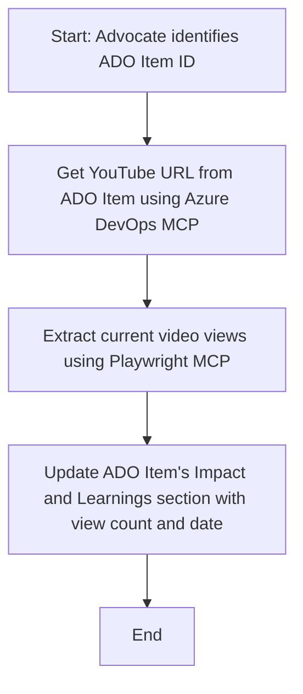

<!--
CO_OP_TRANSLATOR_METADATA:
{
  "original_hash": "14a2dfbea55ef735660a06bd6bdfe5f3",
  "translation_date": "2025-07-14T06:15:26+00:00",
  "source_file": "09-CaseStudy/UpdateADOItemsFromYT.md",
  "language_code": "ro"
}
-->
# Studiu de Caz: Actualizarea Elementelor Azure DevOps cu Date de pe YouTube folosind MCP

> **Disclaimer:** Există instrumente și rapoarte online care pot automatiza procesul de actualizare a elementelor Azure DevOps cu date provenite de pe platforme precum YouTube. Scenariul următor este oferit doar ca un exemplu pentru a ilustra modul în care pot fi folosite instrumentele MCP pentru sarcini de automatizare și integrare.

## Prezentare Generală

Acest studiu de caz demonstrează un exemplu despre cum Model Context Protocol (MCP) și instrumentele sale pot fi utilizate pentru a automatiza procesul de actualizare a elementelor de lucru Azure DevOps (ADO) cu informații preluate de pe platforme online, cum ar fi YouTube. Scenariul descris este doar o ilustrare a capacităților mai largi ale acestor instrumente, care pot fi adaptate pentru multe alte nevoi similare de automatizare.

În acest exemplu, un Advocate urmărește sesiunile online folosind elemente ADO, fiecare element conținând un URL către un videoclip YouTube. Prin utilizarea instrumentelor MCP, Advocate-ul poate menține elementele ADO actualizate cu cele mai recente metrici ale videoclipului, cum ar fi numărul de vizualizări, într-un mod repetabil și automatizat. Această abordare poate fi generalizată și pentru alte cazuri în care informații din surse online trebuie integrate în ADO sau alte sisteme.

## Scenariu

Un Advocate este responsabil pentru monitorizarea impactului sesiunilor online și a implicării comunității. Fiecare sesiune este înregistrată ca un element de lucru ADO în proiectul 'DevRel', iar elementul conține un câmp pentru URL-ul videoclipului YouTube. Pentru a raporta corect acoperirea sesiunii, Advocate-ul trebuie să actualizeze elementul ADO cu numărul curent de vizualizări ale videoclipului și data la care aceste informații au fost preluate.

## Instrumente Folosite

- [Azure DevOps MCP](https://github.com/microsoft/azure-devops-mcp): Permite accesul programatic și actualizările elementelor de lucru ADO prin MCP.
- [Playwright MCP](https://github.com/microsoft/playwright-mcp): Automatizează acțiunile în browser pentru a extrage date live de pe pagini web, cum ar fi statisticile videoclipurilor YouTube.

## Flux de Lucru Pas cu Pas

1. **Identificarea Elementului ADO**: Se pornește de la ID-ul elementului de lucru ADO (ex. 1234) din proiectul 'DevRel'.
2. **Preluarea URL-ului YouTube**: Se folosește instrumentul Azure DevOps MCP pentru a obține URL-ul YouTube din elementul de lucru.
3. **Extrage Vizualizările Videoclipului**: Se folosește Playwright MCP pentru a naviga la URL-ul YouTube și a extrage numărul curent de vizualizări.
4. **Actualizează Elementul ADO**: Se scrie numărul actualizat de vizualizări și data preluării în secțiunea 'Impact and Learnings' a elementului de lucru ADO, folosind Azure DevOps MCP.

## Exemplu de Prompt

```bash
- Work with the ADO Item ID: 1234
- The project is '2025-Awesome'
- Get the YouTube URL for the ADO item
- Use Playwright to get the current views from the YouTube video
- Update the ADO item with the current video views and the updated date of the information
```

## Diagramă Mermaid



## Implementare Tehnică

- **Orchestrare MCP**: Fluxul de lucru este coordonat de un server MCP, care gestionează utilizarea ambelor instrumente Azure DevOps MCP și Playwright MCP.
- **Automatizare**: Procesul poate fi declanșat manual sau programat să ruleze la intervale regulate pentru a menține elementele ADO actualizate.
- **Extensibilitate**: Același model poate fi extins pentru a actualiza elementele ADO cu alte metrici online (ex. like-uri, comentarii) sau de pe alte platforme.

## Rezultate și Impact

- **Eficiență**: Reduce efortul manual al Advocate-ilor prin automatizarea preluării și actualizării metricilor videoclipurilor.
- **Acuratețe**: Asigură că elementele ADO reflectă cele mai recente date disponibile din sursele online.
- **Repetabilitate**: Oferă un flux de lucru reutilizabil pentru scenarii similare care implică alte surse de date sau metrici.

## Referințe

- [Azure DevOps MCP](https://github.com/microsoft/azure-devops-mcp)
- [Playwright MCP](https://github.com/microsoft/playwright-mcp)
- [Model Context Protocol (MCP)](https://modelcontextprotocol.io/)

**Declinare de responsabilitate**:  
Acest document a fost tradus folosind serviciul de traducere AI [Co-op Translator](https://github.com/Azure/co-op-translator). Deși ne străduim pentru acuratețe, vă rugăm să rețineți că traducerile automate pot conține erori sau inexactități. Documentul original în limba sa nativă trebuie considerat sursa autorizată. Pentru informații critice, se recomandă traducerea profesională realizată de un specialist uman. Nu ne asumăm răspunderea pentru eventualele neînțelegeri sau interpretări greșite rezultate din utilizarea acestei traduceri.